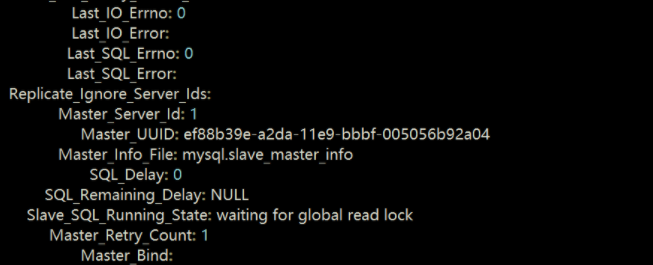
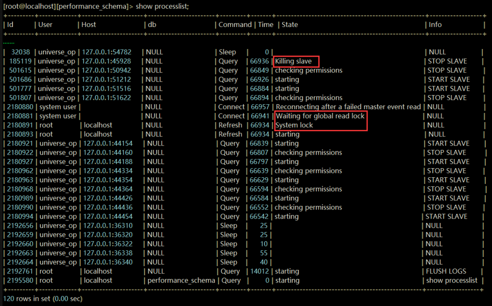
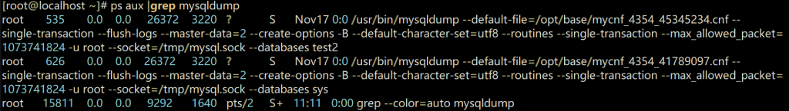
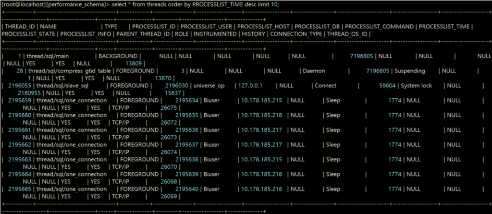
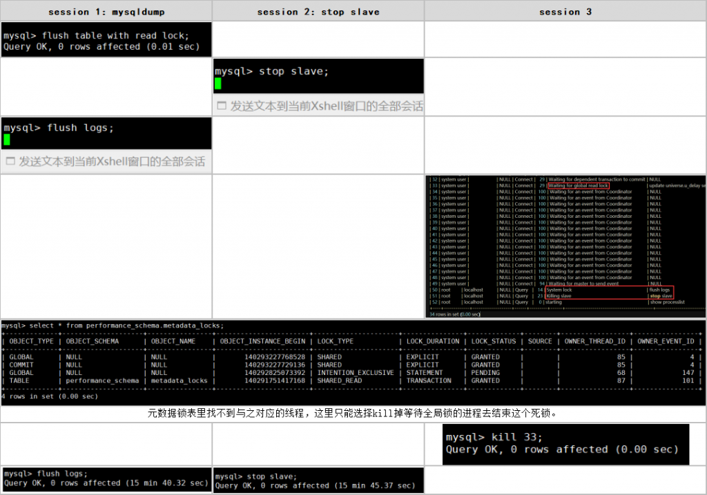
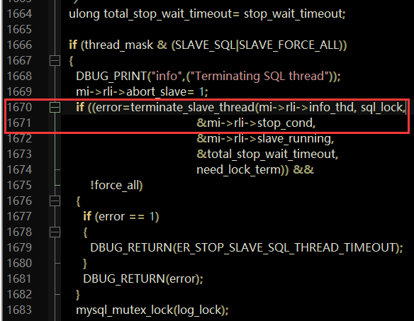
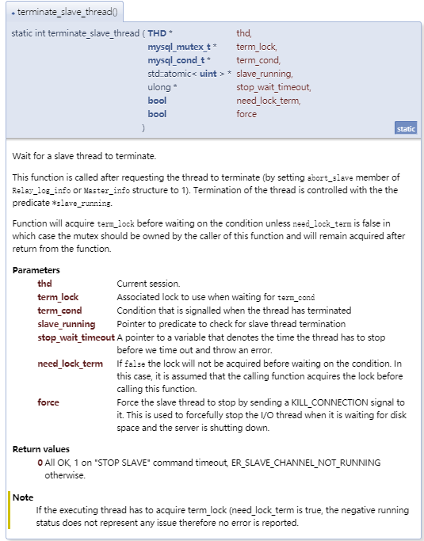
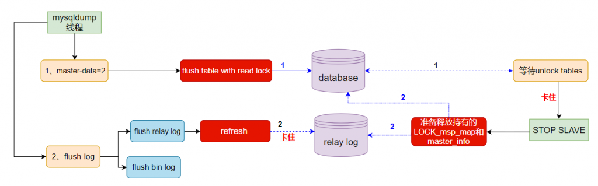

# 故障分析 | 全局读锁一直没有释放，发生了什么？

**原文链接**: https://opensource.actionsky.com/20210111-mysql/
**分类**: MySQL 新特性
**发布时间**: 2021-01-11T01:09:19-08:00

---

作者：刘开洋爱可生交付服务部团队北京 DBA，主要负责处理 MySQL 的 troubleshooting 和我司自研数据库自动化管理平台 DMP 的日常运维问题，对数据库及周边技术有浓厚的学习兴趣，喜欢看书，追求技术。本文来源：原创投稿* 爱可生开源社区出品，原创内容未经授权不得随意使用，转载请联系小编并注明来源。
## 问题：
在一个客户的线上监控告警中，提示主从延迟不断升高，我们登上数据库进行查看一下，发现 MySQL 从库复制状态提示 SQL 线程在 waiting for global read lock。
											
在数据库的进程列表中发现了存在的等待全局读锁和 kill slave 的进程；高可用在不断重启复制，原因是由于 NAT 网络中域名反解析出错导致高可用软件对复制的误判。
											
这里就能看出两个问题，第一是有个下发全局读锁的对象，一般在从库上就是备份工具了，第二就是 slave 正在被 kill，而且时间相当长，因此这里可能存在一种特殊的死锁。
查看 mysql 进程时的巧合下，发现 mysqldump 进程已存在 10 多个小时，对比等 FTWRL 的进程的时间，就坐实了下发全局读锁的对象是 mysqldump：
											
线上没有开启 performance_schema 的 instruments 和 consumers（PS：这个对于锁监控很重要，一定记得打开）。如果开启了 performance_schema，可以通过 metadata_locks 查到相关锁记录，这个我们在后面的复现中看一下。
											
上述情况分析得出存在一个特殊的死锁，形成 MySQL Server 层和存储引擎层的死锁闭环，而且不能完全追踪到所有锁记录。
## 解决：
这样三个锁组合成的死锁在其他客户端执行 UNLOCKS TABLE 是解不开的，只需要 kill 掉全局读锁或者等待全局锁的锁一个即可，因为没有找到全局锁对应的线程，这里将等全局锁的线程 kill 掉，数据库就恢复了，再看残留的 mysqldump 进程消失了：
											
两个锁就此解开了
											
故障恢复，延迟追平。
## Review：为什么 stop slave 和 FTWRL 会发生死锁？
在 mysql 5.7.26 中执行 mysqldump 加参数 master_data、single_transaction 和 flush_logs 得出的 general log 中发现
`mysqldump执行的general log
root@127.0.0.1 on  using TCP/IP
/*!40100 SET @@SQL_MODE='' */
/*!40103 SET TIME_ZONE='+00:00' */
FLUSH /*!40101 LOCAL */ TABLES
FLUSH TABLES WITH READ LOCK                                       # 加全局读锁
Refresh                                                           # 刷新日志
  
SET SESSION TRANSACTION ISOLATION LEVEL REPEATABLE READ           # 设置设置会话级别RR
START TRANSACTION /*!40100 WITH CONSISTENT SNAPSHOT */          
SHOW MASTER STATUS                                                # 获取master的状态
UNLOCK TABLES                                                     # 解锁表
···
Quit`## 
## 场景复现：
											
（图片建议点开放大看）
`[root@localhost ~]# gdb -ex "set pagination 0" -ex "thread apply all bt" --batch -p 13192   # 打印对应MySQL进程堆栈——找到stop slave卡住的线程后处理输出
······
Thread 23 (Thread 0x7f98f027e700 (LWP 19446)):
#0  pthread_cond_timedwait@@GLIBC_2.3.2 ()
#1  native_cond_timedwait
#2  my_cond_timedwait
#3  inline_mysql_cond_timedwait
#4  terminate_slave_thread (thd=0x7f98740008c0, term_lock=0x7f9884022908, term_cond=0x7f9884022a08, slave_running=0x7f9884022ac4, stop_wait_timeout=0x7f98f027c448, need_lock_term=false) at /export/home/pb2/build/sb_0-33648028-1555164244.06/mysql-5.7.26/sql/rpl_slave.cc:1861
#5  terminate_slave_threads (mi=0x7f988401c500, thread_mask=3, stop_wait_timeout=<optimized out>, need_lock_term=false) at /export/home/pb2/build/sb_0-33648028-1555164244.06/mysql-5.7.26/sql/rpl_slave.cc:1671
#6  stop_slave (thd=0x7f987c00f650, mi=0x7f988401c500, net_report=true, for_one_channel=false, push_temp_tables_warning=0x7f98f027c52f) at /export/home/pb2/build/sb_0-33648028-1555164244.06/mysql-5.7.26/sql/rpl_slave.cc:10261
#7  stop_slave (thd=0x7f987c00f650) at /export/home/pb2/build/sb_0-33648028-1555164244.06/mysql-5.7.26/sql/rpl_slave.cc:615
#8  stop_slave_cmd
#9  mysql_execute_command
#10 mysql_parse
#11 dispatch_command
#12 do_command
#13 handle_connection
#14 pfs_spawn_thread
#15 start_thread ()
#16n clone ()
  
# 可以看到# 5 stop_wait_timeout，获取更多相关信息
(gdb) thread 34
[Switching to thread 34 (Thread 0x7f58d661f700 (LWP 13240))]
#0  0x00007f592d8e0d42 in pthread_cond_timedwait@@GLIBC_2.3.2 () from /lib64/libpthread.so.0
(gdb) f 5
#5  0x0000000000f0ed57 in terminate_slave_threads (mi=0x7f587801f050, thread_mask=3, stop_wait_timeout=<optimized out>, need_lock_term=false)
    at /export/home/pb2/build/sb_0-32013917-1545390211.74/mysql-5.7.26/sql/rpl_slave.cc:1671
warning: Source file is more recent than executable.
1671        if ((error=terminate_slave_thread(mi->rli->info_thd, sql_lock,
(gdb) print mi->rli->info_thd
$1 = (THD *) 0x7f58700008c0
 
  
Thread 21 (Thread 0x7f58c05a6700 (LWP 14238)):
#9  apply_event_and_update_pos (ptr_ev=0x7f58c05a56c8, thd=0x7f58700008c0, rli=0x7f5878024b30)
#10 exec_relay_log_event (thd=0x7f58700008c0, rli=0x7f5878024b30)
  
# 通过gdb输出看到stop slave持有mi->rli->info_thd,在等待当前会话地址为0x7f58700008c0，定位到线程21的apply_event_and_update_pos 和exec_relay_log_event函数执行
apply_event_and_update_pos：应用给定事件并提高relay log的位置。
exec_relay_log_event：这是从SQL线程调用于执行relay log中下一个事件的顶级功能。
mi=master info, rli=relay log info`
											
											
**terminate_slave_thread 函数**：等 SQL thread 终止的函数。该函数在请求线程终止后被调用（通过将 Relay_log_info 或 Master_info 配置中的 abort_slave 设置为 1），线程的终止由 *slave_running 控制。函数将在等待条件之前获取 term_lock，need_lock_term 为 false 的情况下，mutex 应该属于这个函数的调用者，在函数返回之后一直保持获取 mutex 的状态。
											
mysqldump 备份期间出现的操作是：
- master-data=2 会结合 single-transaction 给数据库加一个全局读锁。
- flush-logs 是要对 relay log 进行 refresh。
STOP SLAVE 在备份期间做的操作是：
- STOP SLAVE 会等待 IO 线程结束，然后释放 LOCK_msp_map 和占有的 master_info
流程：
- mysqldump 备份进行 FTWRL 之后恰巧遇到 HA 执行 STOP SLAVE，SQL Thread 在 STOP 之前持有 mi->stop_cond 锁，commit 的时候等待 MDL_COMMIT，FTWRL 之后执行的 flush logs 时 reflresh 下发了一个系统锁，它是在等待 mi->stop_cond 的释放，因为 FTWRL 和 FLUSH LOGS 是一个程序发出的，所有从逻辑上讲 mysqldump 自己是在等待自己释放资源，便陷入了无限等待中，形成了我们看到的死锁。
关于 LOCK_msp_map 锁有兴趣的同学可以自行谷歌搜索
> 参考：
https://bugs.mysql.com/bug.php?id=70307
https://bugs.mysql.com/file.php?id=20542&bug_id=70307
https://www.percona.com/blog/2012/03/23/how-flush-tables-with-read-lock-works-with-innodb-tables/
[**文章推荐：**
](https://opensource.actionsky.com/20210104-mysql/)
[故障分析 | 从库并行回放死锁问题分析](https://opensource.actionsky.com/20210104-mysql/)
[故障分析 |  正确使用 auth_socket 验证插件](https://opensource.actionsky.com/20201123-mysql/)
[故障分析 | 崩溃恢复巨慢原因分析](https://opensource.actionsky.com/20210108-mysql/)