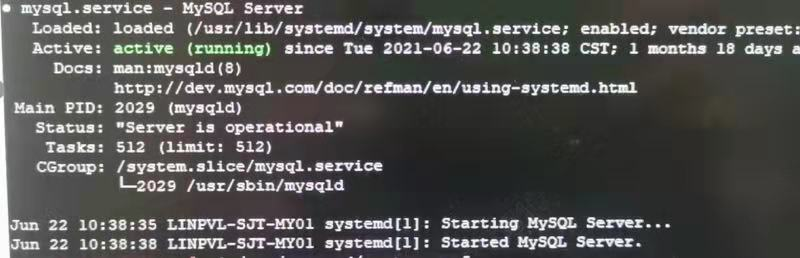

# 故障分析 | 填坑 TaskMax

**原文链接**: https://opensource.actionsky.com/20210823-taskmax/
**分类**: 技术干货
**发布时间**: 2021-08-22T23:47:18-08:00

---

作者：周启超
爱可生北分团队 DBA，主要负责项目前期建设及后期疑难问题支持。做事认真，对事负责。
本文来源：原创投稿
*爱可生开源社区出品，原创内容未经授权不得随意使用，转载请联系小编并注明来源。
先介绍下背景，应用连接数据数执行任务,报 error 1135: Can&#8217;t create a new thread (errno 11) 错误日志信息如下：
`2021-08-11T12:25:40.606774+08:00 0 [ERROR] [MY-000000] [connection_h] Error log throttle:         36 'Can't create thread to handle new connection' 
error(s) suppressed
2021-08-11T12:25:40.606886+08:00 0 [ERROR] [MY-010249] [Server] Can't create thread to handle new connection(errno= 11)
`
环境版本为 SLES12SP5 ，MySQL 版本为8.0.18。
看到“Can&#8217;t create thread to handle new connection”的描述我们首先会想到操作系统对应用户的 ulimit 是否正确。和用户确认了下 ulimit 的确是正常配置的。如果幸运的话，我们可以在网上查到一些 TaskMax 设置导致 MySQL 连接异常的文章。
这次这个环境问题的确和 TaskMax 有关，观察如下截图可以看到 Tasks 达到了 limit 限制。

找到问题所在进行修复。网上有资料说 TaskMax 有两种方式进行修复，一种系统级别和一种进程级别，“系统级别不用进行 MySQL 服务重启，进程级别修改需要进行 MySQL 服务重启”。由于是生产环境，而且是专用服务器，想选择对现有服务影响最小的原则，选择了系统级别调整。
`# systemctl show --property=DefaultTasksMax
DefaultTasksMax=512
# vi /etc/systemd/system.conf
#DefaultTasksMax=512
DefaultTasksMax=5120
# systemctl daemon-reexec
# systemctl show --property=DefaultTasksMax
DefaultTasksMax=5120
# systemctl status mysql
[0m mysql.service - MySQL Server
Loaded: loaded (/usr/lib/systemd/system/mysql.service; enabled; vendor preset: disabled)
Active: active (running) since Wed 2021-08-11 12:09:49 CST; 23min ago
Docs: man:mysqld(8)
http://dev.mysql.com/doc/refman/en/using-systemd.html
Main PID: 2585 (mysqld)
Status: "Server is operational"
Tasks: 62 (limit: 5120)
CGroup: /system.slice/mysql.service
85 /usr/sbin/mysqld
Aug 11 12:09:48 linux systemd[1]: Starting MySQL Server...
Aug 11 12:09:49 linux systemd[1]: Started MySQL Server.
`
看 systemctl status mysql 输出 Tasks 一项 limit 的确更新成最新的值了。看到状态值更新了，但也不要掉以轻心。
测试环境 sysbench 模拟一下并发，发现问题依然在：
`FATAL: unable to connect to MySQL server on host '10.186.63.149', port 3306, aborting...
FATAL: error 1135: Can't create a new thread (errno 11); if you are not out of available memory, you can consult the manual for a possible OS-dependent bug
FATAL: `thread_init' function failed: /usr/share/sysbench/oltp_common.lua:349: connection creation failed
`
重启 MySQL 服务后，状态正常：
`[ 3s ] thds: 600 tps: 563.43 qps: 9803.74 (r/w/o: 8587.12/0.00/1216.62) lat (ms,95%): 1427.08 err/s: 0.00 reconn/s: 0.00
[ 9s ] thds: 600 tps: 3031.18 qps: 48139.37 (r/w/o: 42087.54/0.00/6051.82) lat (ms,95%): 831.46 err/s: 0.00 reconn/s: 0.00
[ 12s ] thds: 600 tps: 1593.91 qps: 25684.59 (r/w/o: 22491.10/0.00/3193.49) lat (ms,95%): 694.45 err/s: 0.00 reconn/s: 0.00
`
MySQL status 里 Task 状态可以突破原来512的限制：
`# systemctl status mysql
[0m mysql.service - MySQL Server
Loaded: loaded (/usr/lib/systemd/system/mysql.service; enabled; vendor preset: disabled)
Active: active (running) since Wed 2021-08-11 12:35:12 CST; 3min 30s ago
Docs: man:mysqld(8)
http://dev.mysql.com/doc/refman/en/using-systemd.html
Process: 5839 ExecStartPre=/usr/bin/mysqld_pre_systemd (code=exited, status=0/SUCCESS)
Main PID: 5861 (mysqld)
Status: "Server is operational"
Tasks: 649 (limit: 5120)
CGroup: /system.slice/mysql.service
61 /usr/sbin/mysqld
Aug 11 12:35:09 linux systemd[1]: Starting MySQL Server...
Aug 11 12:35:12 linux systemd[1]: Started MySQL Server.
`
进程级别调整方式验证：
`# cd /etc/systemd/system/
# mkdir mysql.service.d
# cd mysql.service.d/
#  vi override.conf
[Service]
TasksMax=10000
# systemctl daemon-reload
# systemctl status mysql
[0m mysql.service - MySQL Server
Loaded: loaded (/usr/lib/systemd/system/mysql.service; enabled; vendor preset: disabled)
Drop-In: /etc/systemd/system/mysql.service.d
erride.conf
Active: active (running) since Wed 2021-08-11 12:44:27 CST; 1min 51s ago
Docs: man:mysqld(8)
http://dev.mysql.com/doc/refman/en/using-systemd.html
Main PID: 8229 (mysqld)
Status: "Server is operational"
Tasks: 108 (limit: 10000)
CGroup: /system.slice/mysql.service
29 /usr/sbin/mysqld
Aug 11 12:44:25 linux systemd[1]: Starting MySQL Server...
Aug 11 12:44:27 linux systemd[1]: Started MySQL Server.
`
重启 MySQL 服务生效（Tasks 中 limit 限制未生效，现象同系统级别调整）：
`# systemctl stop mysql
# systemctl start mysql
# systemctl status mysql
[0m mysql.service - MySQL Server
Loaded: loaded (/usr/lib/systemd/system/mysql.service; enabled; vendor preset: disabled)
Drop-In: /etc/systemd/system/mysql.service.d
erride.conf
Active: active (running) since Wed 2021-08-11 12:49:56 CST; 13s ago
Docs: man:mysqld(8)
http://dev.mysql.com/doc/refman/en/using-systemd.html
Process: 11971 ExecStartPre=/usr/bin/mysqld_pre_systemd (code=exited, status=0/SUCCESS)
Main PID: 11993 (mysqld)
Status: "Server is operational"
Tasks: 50 (limit: 10000)
CGroup: /system.slice/mysql.service
993 /usr/sbin/mysqld
Aug 11 12:49:54 linux systemd[1]: Starting MySQL Server...
Aug 11 12:49:56 linux systemd[1]: Started MySQL Server.
`
确认系统级别参数没有更改：
`# systemctl show --property=DefaultTasksMax
DefaultTasksMax=512
`
跑600并发 sysbench ，验证结果：
`[ 3s ] thds: 600 tps: 185.49 qps: 3283.97 (r/w/o: 2868.95/0.00/415.02) lat (ms,95%): 1589.90 err/s: 0.00 reconn/s: 0.00
[ 15s ] thds: 600 tps: 9545.12 qps: 152777.72 (r/w/o: 133709.19/0.00/19068.53) lat (ms,95%): 1327.91 err/s: 0.00 reconn/s: 0.00
[ 18s ] thds: 600 tps: 1495.99 qps: 24004.40 (r/w/o: 21029.73/0.00/2974.66) lat (ms,95%): 694.45 err/s: 0.00 reconn/s: 0.00
`
突破原来了原来 Task 的512限制：
`# systemctl status mysql
[0m mysql.service - MySQL Server
Loaded: loaded (/usr/lib/systemd/system/mysql.service; enabled; vendor preset: disabled)
Drop-In: /etc/systemd/system/mysql.service.d
erride.conf
Active: active (running) since Wed 2021-08-11 12:49:56 CST; 1min 8s ago
Docs: man:mysqld(8)
http://dev.mysql.com/doc/refman/en/using-systemd.html
Process: 11971 ExecStartPre=/usr/bin/mysqld_pre_systemd (code=exited, status=0/SUCCESS)
Main PID: 11993 (mysqld)
Status: "Server is operational"
Tasks: 649 (limit: 10000)
CGroup: /system.slice/mysql.service
993 /usr/sbin/mysqld
Aug 11 12:49:54 linux systemd[1]: Starting MySQL Server...
Aug 11 12:49:56 linux systemd[1]: Started MySQL Server.
`
验证结论：系统级别和进程级别设置方式2选1即可，但是都需要重启 MySQL 服务生效。