# 故障分析 | 手动 rm 掉 binlog 导致主从报错

**原文链接**: https://opensource.actionsky.com/20220510-binlog/
**分类**: 技术干货
**发布时间**: 2022-05-09T23:18:51-08:00

---

作者：陈伟
爱可生数据库工程师，负责MySQL日常维护及故障处理。
本文来源：原创投稿
*爱可生开源社区出品，原创内容未经授权不得随意使用，转载请联系小编并注明来源。
## 1.故障描述
前一段时间客户反馈复制报错 1236 ，根据报错提示该报错为从库读取到了主库不存在的 binlog 日志，导致复制中断，报错截图如下，需要帮忙分析为什么会报错 Could not open log file 原因。

## 2.故障分析
说明：考虑客户信息敏感性，以下分析过程均在测试环境模拟，数据库版本 5.7.31 ，GTID 启用。
#### 2.1.先登录从库查看报错信息
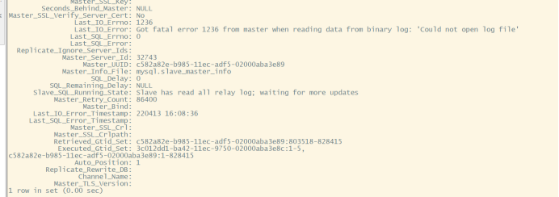
发现从库的 io 线程断了，并报错：Got fatal error 1236 from master when reading data from binary log: &#8216;Could not open log file&#8217; ，从字面意思不难理解，无法从主库获取到 binlog 日志，GTID 停止在 828415 ，检查从库 error 日志报错如下：
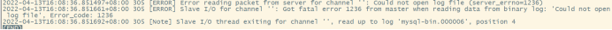
根据从库报错信息，下一步我们去主库查看主库的 binlog 信息和 error 日志，看主库 binlog 是否有丢失的情况。
#### 2.2.查看主库 binlog 信息，以及 error 日志
登录主库检查 binlog 日志列表以及 index 索引文件，发现主库的 binlog 是连续的没有问题，但在查看 mysql-bin.index 文件的时候发现有记录两个 mysql-bin.000006 ，但是实际只有一个 mysql-bin.000006 文件，先记着这个奇怪的现象。

再去看一眼主库的 error 日志，内容如下，和从库 error 日志都指向同一个 binlog 。

到这我们可以确认问题出在 mysql-bin.000006 这个 binlog 日志上，但是从上面的图中可以发现主库的 binlog 日志是有 mysql-bin.000006 这个日志的，所以我们现在解析一下指向的 mysql-bin.000006 日志以及前一个日志 mysql-bin.000005 。
通过解析 mysql-bin.000005 可以看到最后一个事务 gtid 为：&#8217;c582a82e-b985-11ec-adf5-02000aba3e89:828415&#8217;为上面从库停止 gtid 的位置。
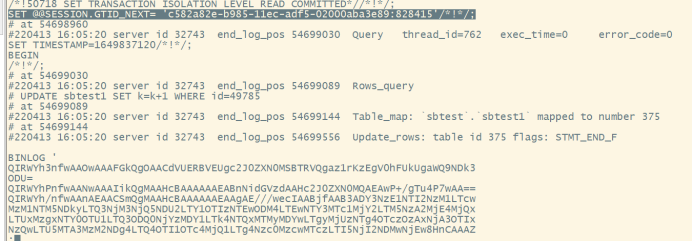
继续解析 mysql-bin.000006 查看其第一个事务的 gtid 为：&#8217;c582a82e-b985-11ec-adf5-02000aba3e89:855706&#8242; 。
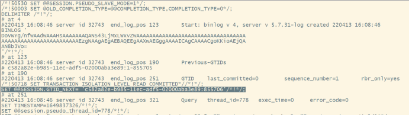
mysql-bin.000006 第一个 GTID 事务为 855706 ，与 binlog.000005 文件相差了两万多个的 GTID 事务，与上一个 binlog.000005 并不连续，说明的确存在了事务丢失，现在的问题就是为什么 mysql-bin.index 文件会记录着有两个相同 mysql-bin.000006 ，以及客户的故障场景是如何触发的。
## 3.故障复现
#### 3.1.复现 index 索引文件记录相同 binlog 文件名
首先根据故障分析的结果，我们先复现出 binlog 索引文件中 binlog 文件名重复场景。
第一步登录主库所在的机器，在复制状态正常下，把主库正在用的 binlog 日志 rm 手动删除。

第二步进入主库执行 flush logs 刷新日志，这时 binlog 会重新生成刚刚删除的 binlog 文件，此时观察主库的 binlog 日志是连续的，index 索引文件里面出现了两个刚刚 rm 手动删除的 binlog 日志信息，即 index 文件记录着有两个相同文件，与客户场景一致。

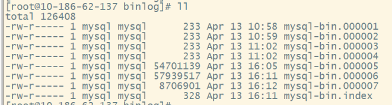
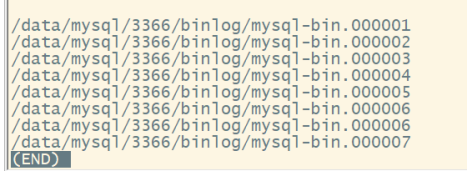
所以 binlog 索引文件里有两个 binlog.000006 ，通过上面测试可以发现，是因为当正在用的 binlog 文件被手动rm掉时，binlog 文件计数器是不会受到影响，当在 binlog 文件刷新后（重启、flush log 、binlog 文件写满等），binlog 文件计数器会根据当前最大 binlog 文件+1。正如上面场景第一个 binlog.000006 文件是正常记录 binlog.index 中，此时再将 binlog.000006 文件 rm 掉后，最大的为 binlog 日志为 000005 ，这时主库 flush logs ，还会按顺序在最大 binlog.00000 5生成第二个 binlog.000006 ，binlog.index 中也出现两个 binlog.000006 。但主库实际已经丢失一个 binlog.000006 ，现有的 binlog.000006 和上一个 binlog.000005 的 gtid 也不连续，只是文件名仍连续。
#### 3.2.复现客户场景 Got fatal error 1236 from master when reading data from binary log: &#8216;Could not open log file&#8217;
在 3.1 的测试过程中发现客户的故障并不是一定会出现，还有其他现象，我们先来复现出客户场景。
首先需要主从有一定的延迟，如下从库获取到主库 binlog.000006 。
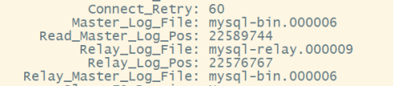
此时将主库正在用的 binlog.000007 手动 rm 掉，这时虽然 binlog.000007 已经被删除，但仍在后台被主库占用，新的 binlog.000007 这时也还没有刷新生成，但 index 里面是有记录 binlog.000007 的。

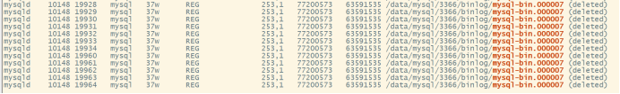
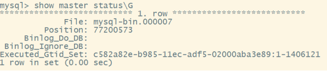
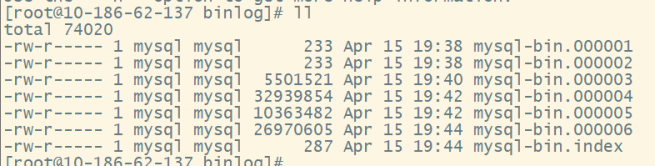
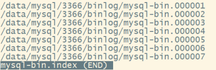
这时当从库读取完 binlog.000006 并继续获取 binlog 索引文件里记录的 binlog.000007 时，由于此文件已经被删除且主库没有生成新的 binlog.000007 ，从而复制报错。
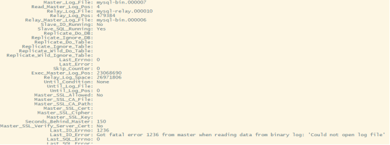
主从复制故障后，主库这时其实还在使用着已经删除的 binlog 文件，直到触发flush logs ，这时mysql-bin.index就会出现3.1场景。至此客户复制故障场景已完全复现出来。
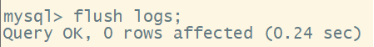
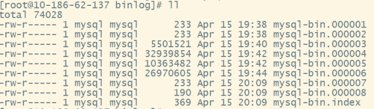
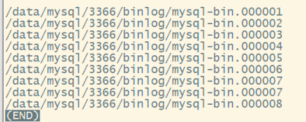
## 3.3其他场景
在复现的过程中发现还会出现其他不同的场景，由于篇幅较长便简单描述不再详细展开，有兴趣的同学可以自己进行测试。
**场景一：**
主从不报错，从库丢 gtid ，这种场景和上面客户复制故障的场景一样都需要有一定的主从延迟，不同点在于当从库已经读取完binlog.xxx并继续获取binlog索引文件里记录的被rm删除掉binlog.yyy文件时，这时主库已经触发flush logs生成了新的binlog.yyy，此时从库io线程读取到了新的binlog.yyy。这种情况下，从库gtid是不连续的，主从不一致。
**场景二：**
在主从没有延迟或者延迟较低的情况下，从库已经读取到主库正在用的binlog.yyy。这时将主库正在用的binlog.yyy删除，由于被删除的binlog.yyy仍在后台被占用着，所以在从库可以看到复制状态还是正常的。直到主库binlog文件在重新刷新（flush log、binlog文件写满等）生成新的binlog.yyy后，从库的gtid这时就不在更新，从库很快报错1236。
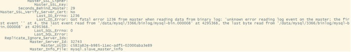
为什么在生成新的binlog.yyy后就报错1236是因为主库binlog日志在重新flush生成新的binlog.yyy后，新的binlog.yyy事件是从4开始的，而此时从库已经应用到旧binlog.yyy事件的位置远超4，所以导致从库无法从新的binlog.yyy读取binlog日志从而报错。
## 4.建议
通过上面的测试可以发现人为rm掉正在用的binlog基本都会导致主从报错或主从不一致，而一旦出现这种情况除了重做从库外一般是没有其他比较好的方法，这样是不利于数据库维护，所以建议：
- 
避免对binlog文件做压缩删除等直接操作，可以通过调整参数修改binlog清理策略.
- 
需要手工删除binlog时，可以进入MySQL通过purge命令去删除。