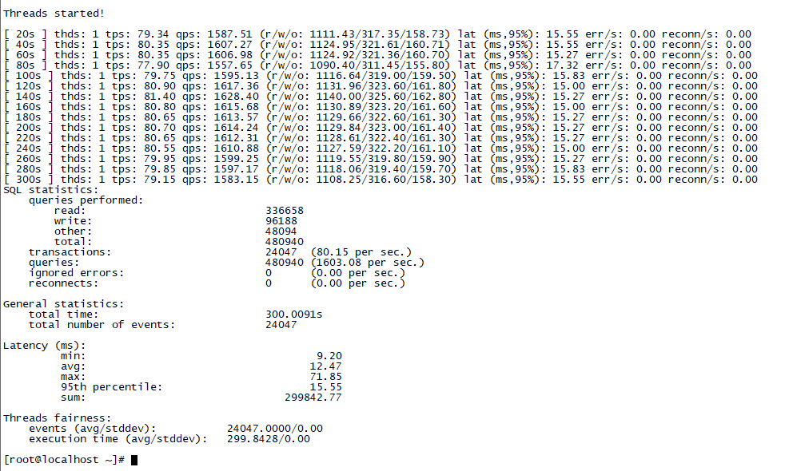
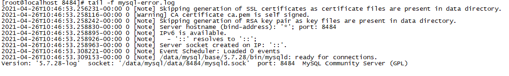
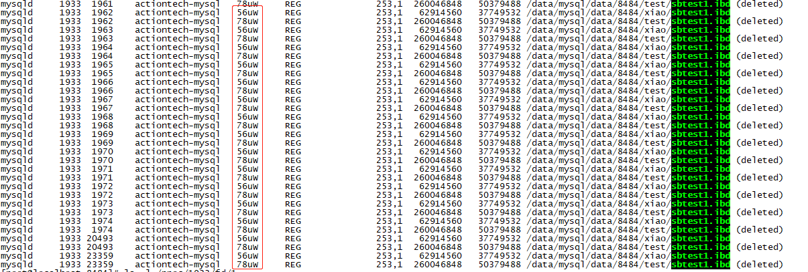
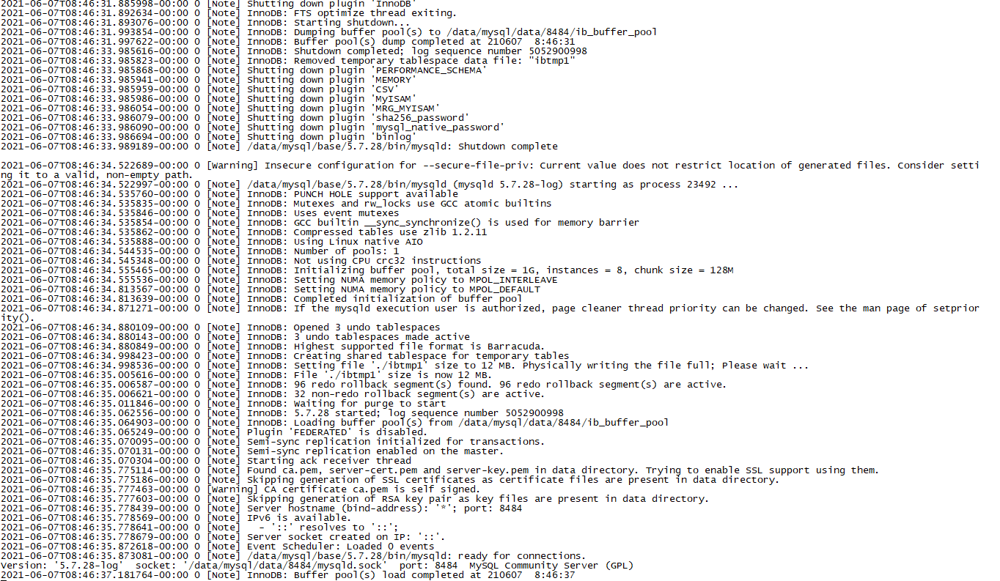
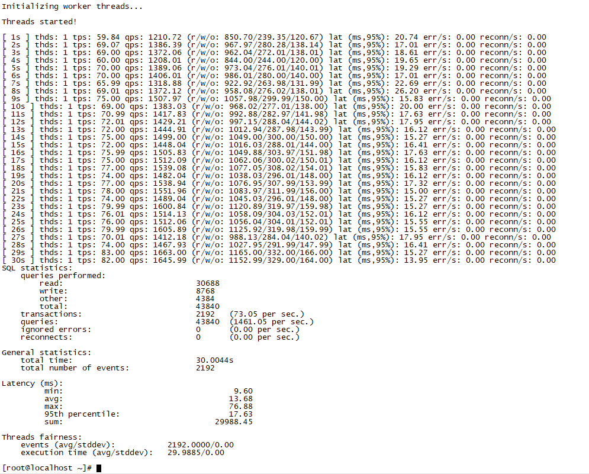

# 故障分析 | 数据库表空间被 rm 后，怎么处理

**原文链接**: https://opensource.actionsky.com/20210714-rm/
**分类**: 技术干货
**发布时间**: 2021-07-13T23:10:38-08:00

---

作者：肖亚洲
爱可生 DBA 团队成员，负责项目中数据库故障与平台问题解决，对数据库高可用与分布式技术情有独钟。
本文来源：原创投稿
*爱可生开源社区出品，原创内容未经授权不得随意使用，转载请联系小编并注明来源。
## 背景介绍
客户生产环境由于运维人员误操作，将 MySQL 数据库中，某个业务表 ibd 文件给 rm 掉了。由于历史原因该环境没有可用从库。针对这种情况，我们怎么处理呢？
## 情景复现
在单实例中，将表 sbtest1 的数据文件 rm 删掉后，观测数据库的运行状态【文件恢复前不要重启 mysql 】。
## 前提条件
准备数据库与测试表数据
- 
创建一个 MySQL-5.7.28 的单实例数据库，并用 sysbench 准备1张100w的测试表。
`[root@localhost ~]# sysbench --mysql-host=10.186.65.84 --mysql-port=8484 --mysql-user=xiao --mysql-password=xiao --mysql-db=test --db-driver=mysql   --mysql_storage_engine=innodb --db-ps-mode=disable  --test=/usr/local/sysbench1.0/share/sysbench/oltp_insert.lua --table_size=1000000 --threads=1 --tables=1 --db-ps-mode=disable --percentile=95 --report-interval=1 --time=1 prepare
WARNING: the --test option is deprecated. You can pass a script name or path on the command line without any options.
sysbench 1.0.17 (using bundled LuaJIT 2.1.0-beta2)
Creating table 'sbtest1'...
Inserting 1000000 records into 'sbtest1'
Creating a secondary index on 'sbtest1'...
[root@localhost ~]#
`
- 
查看数据库中数据：
`[root@localhost ~]# mysql -uroot -p -S /data/mysql/data/8484/mysqld.sock
Enter password: 
Welcome to the MySQL monitor.  Commands end with ; or \g.
Your MySQL connection id is 6
Server version: 5.7.28-log MySQL Community Server (GPL)
Copyright (c) 2000, 2019, Oracle and/or its affiliates. All rights reserved.
Oracle is a registered trademark of Oracle Corporation and/or its
affiliates. Other names may be trademarks of their respective owners.
Type 'help;' or '\h' for help. Type '\c' to clear the current input statement.
mysql> use test;
Reading table information for completion of table and column names
You can turn off this feature to get a quicker startup with -A
Database changed
mysql> select count(*) from sbtest1;
+----------+
| count(*) |
+----------+
|  1000000 |
+----------+
1 row in set (0.21 sec)
`
- 
查看sbtest1表的ibd文件：
`[root@localhost test]# ll -h /data/mysql/data/8484/test/
total 241M
-rw-r----- 1 actiontech-mysql actiontech-mysql  60   Jun  7 07:55 db.opt
-rw-r----- 1 actiontech-mysql actiontech-mysql  8.5K  Jun  7 07:57 sbtest1.frm
-rw-r----- 1 actiontech-mysql actiontech-mysql  240M Jun  7 07:57 sbtest1.ibd
`
## 开展测试
通过 sysbench 对数据库开展读写测试，持续5分钟，期间对 sbtest1.ibd 文件进行 rm 操作，观测数据库运行状态：
**sysbench 下压力**
`[root@localhost ~]# sysbench --mysql-host=10.186.65.84 --mysql-port=8484 --mysql-user=xiao --mysql-password=xiao --mysql-db=test --db-driver=mysql   --mysql_storage_engine=innodb --db-ps-mode=disable  --test=/usr/local/sysbench1.0/share/sysbench/oltp_read_write.lua --table_size=1000000 --threads=1 --tables=1 --db-ps-mode=disable --percentile=95 --report-interval=20 --time=300 run
WARNING: the --test option is deprecated. You can pass a script name or path on the command line without any options.
sysbench 1.0.17 (using bundled LuaJIT 2.1.0-beta2)
Running the test with following options:
Number of threads: 1
Report intermediate results every 20 second(s)
Initializing random number generator from current time
Initializing worker threads...
Threads started!
[ 20s ] thds: 1 tps: 79.34 qps: 1587.51 (r/w/o: 1111.43/317.35/158.73) lat (ms,95%): 15.55 err/s: 0.00 reconn/s: 0.00
[ 40s ] thds: 1 tps: 80.35 qps: 1607.27 (r/w/o: 1124.95/321.61/160.71) lat (ms,95%): 15.55 err/s: 0.00 reconn/s: 0.00
[ 60s ] thds: 1 tps: 80.35 qps: 1606.98 (r/w/o: 1124.92/321.36/160.70) lat (ms,95%): 15.27 err/s: 0.00 reconn/s: 0.00
[ 80s ] thds: 1 tps: 77.90 qps: 1557.65 (r/w/o: 1090.40/311.45/155.80) lat (ms,95%): 17.32 err/s: 0.00 reconn/s: 0.00
[ 100s ] thds: 1 tps: 79.75 qps: 1595.13 (r/w/o: 1116.64/319.00/159.50) lat (ms,95%): 15.83 err/s: 0.00 reconn/s: 0.00
[ 120s ] thds: 1 tps: 80.90 qps: 1617.36 (r/w/o: 1131.96/323.60/161.80) lat (ms,95%): 15.00 err/s: 0.00 reconn/s: 0.00
[ 140s ] thds: 1 tps: 81.40 qps: 1628.40 (r/w/o: 1140.00/325.60/162.80) lat (ms,95%): 15.27 err/s: 0.00 reconn/s: 0.00
[ 160s ] thds: 1 tps: 80.80 qps: 1615.68 (r/w/o: 1130.89/323.20/161.60) lat (ms,95%): 15.00 err/s: 0.00 reconn/s: 0.00
`
**删除 ibd 文件**
`[root@localhost test]# ll -h /data/mysql/data/8484/test/
total 241M
-rw-r----- 1 actiontech-mysql actiontech-mysql   60 Jun  7 07:55 db.opt
-rw-r----- 1 actiontech-mysql actiontech-mysql 8.5K Jun  7 07:57 sbtest1.frm
-rw-r----- 1 actiontech-mysql actiontech-mysql 240M Jun  7 07:57 sbtest1.ibd
[root@localhost test]# 
[root@localhost test]# 
[root@localhost test]# 
[root@localhost test]# rm -r sbtest1.ibd 
rm: remove regular file ‘sbtest1.ibd’? y
[root@localhost test]# ll -h /data/mysql/data/8484/test/
total 16K
-rw-r----- 1 actiontech-mysql actiontech-mysql   60 Jun  7 07:55 db.opt
-rw-r----- 1 actiontech-mysql actiontech-mysql 8.5K Jun  7 07:57 sbtest1.frm
[root@localhost test]#
`
## 查看 mysql-error.log 与 sysbench 压测结果
**查看 sysbench 结果：**

**查看 mysql-error.log ：**

可以看到当 sbtest1.ibd 文件被 rm 掉后，针对该表的增删改查操作还是能够正常进行，且 mysql-error.log 中没有任何报错。
接下来测试，将删除文件从/proc/&#8217;pidof mysqld&#8217;/fd中复制文件到原来位置，查看 MySQL 能正常重启。
## 文件恢复
**通过 lsof 查看 sbtest1.ibd 文件状态**
`[root@localhost 8484]# lsof |grep sbtest1.ibd
`

其中红框处是 FD ：文件描述符，应用程序通过文件描述符识别该文件。
`[root@localhost 8484]# ls -l /proc/1933/fd/78
lrwx------ 1 actiontech-mysql actiontech-mysql 64 Jun  7 08:22 /proc/1933/fd/78 -> /data/mysql/data/8484/test/sbtest1.ibd (deleted)
`
**执行cp命令，将文件拷贝到原数据目录下**
在进行cp之前，要确保该表数据变更已经落盘，且没有新的操作。
`[root@localhost 8484]# cp /proc/1933/fd/78 /data/mysql/data/8484/test/sbtest1.ibd
`
**修改文件属性**
`[root@localhost test]# chown actiontech-mysql:actiontech-mysql sbtest1.ibd
[root@localhost test]# ll -h
total 497M
-rw-r----- 1 actiontech-mysql actiontech-mysql   60 Jun  7 07:55 db.opt
-rw-r----- 1 actiontech-mysql actiontech-mysql 8.5K Jun  7 07:57 sbtest1.frm
-rw-r----- 1 actiontech-mysql actiontech-mysql 248M Jun  7 08:35 sbtest1.ibd
`
**重启mysql**
`[root@localhost test]# systemctl restart mysqld_8484.service
[root@localhost test]#
`
**查看 mysql-error.log:**

**通过 sysbench 验证文件是否可用**
`[root@localhost ~]# sysbench --mysql-host=10.186.65.84 --mysql-port=8484 --mysql-user=xiao --mysql-password=xiao --mysql-db=test --db-driver=mysql   --mysql_storage_engine=innodb --db-ps-mode=disable  --test=/usr/local/sysbench1.0/share/sysbench/oltp_read_write.lua --table_size=1000000 --threads=1 --tables=1 --db-ps-mode=disable --percentile=95 --report-interval=1 --time=30 run
`

可以看到将 ibd 文件恢复后，能够正常读写。
## 哪些操作能让我们知道表ibd文件不存在了呢？
**1、给表新增/删除字段&#8212;能发现**
`mysql> alter table sbtest1 add column name varchar(15);
ERROR 1030 (HY000): Got error 44 from storage engine
`
此时对表进行 select 操作，依然能够查看结果：
`mysql> select count(*) from sbtest1;
+-------------+
| count(*) |
+-------------+
| 1000000 |
+-------------+
1 row in set (0.20 sec)
`
查看 mysql-error.log 信息：
`[ERROR] InnoDB: Cannot rename './test/sbtest1.ibd' to './test/#sql-ib134-2944391225.ibd' for space ID 118 because the source file does not exist
mysql> alter table sbtest1 drop column pad;
ERROR 1030 (HY000): Got error 44 from storage engine
`
此时对表进行 select 操作，依然能够查看结果：
`mysql> select count(*) from sbtest1;
+----------+
| count(*) |
+----------+
|  1000000 |
+----------+
1 row in set (0.19 sec)
`
查看 mysql-error.log 信息：
`[ERROR] InnoDB: Cannot rename './test/sbtest1.ibd' to './test/#sql-ib135-2944391227.ibd' for space ID 118 because the source file does not exist.
`
**2、给表新增/删除索引&#8212;不能发现**
`mysql> alter table sbtest1 add index idx_pad(pad);
Query OK, 0 rows affected (6.13 sec)
Records: 0  Duplicates: 0  Warnings: 0
mysql> show create table sbtest1\G
*************************** 1. row ***************************
Table: sbtest1
Create Table: CREATE TABLE `sbtest1` (
`id` int(11) NOT NULL AUTO_INCREMENT,
`k` int(11) NOT NULL DEFAULT '0',
`c` char(120) COLLATE utf8mb4_bin NOT NULL DEFAULT '',
`pad` char(60) COLLATE utf8mb4_bin NOT NULL DEFAULT '',
PRIMARY KEY (`id`),
KEY `k_1` (`k`),
KEY `idx_pad` (`pad`)
) ENGINE=InnoDB AUTO_INCREMENT=1000001 DEFAULT CHARSET=utf8mb4 COLLATE=utf8mb4_bin 
1 row in set (0.00 sec)
mysql> alter table sbtest1 drop index idx_pad;
Query OK, 0 rows affected (0.03 sec)
Records: 0  Duplicates: 0  Warnings: 0
mysql> show create table sbtest1\G
*************************** 1. row ***************************
Table: sbtest1
Create Table: CREATE TABLE `sbtest1` (
`id` int(11) NOT NULL AUTO_INCREMENT,
`k` int(11) NOT NULL DEFAULT '0',
`c` char(120) COLLATE utf8mb4_bin NOT NULL DEFAULT '',
`pad` char(60) COLLATE utf8mb4_bin NOT NULL DEFAULT '',
PRIMARY KEY (`id`),
KEY `k_1` (`k`)
) ENGINE=InnoDB AUTO_INCREMENT=1000001 DEFAULT CHARSET=utf8mb4 COLLATE=utf8mb4_bin
1 row in set (0.00 sec)
`
**3、对表进行 OPTIMIZE 操作&#8212;能发现**
`mysql> OPTIMIZE table sbtest1;
+-----------------+------------+---------------+--------------------------------------------------------------------------------------+
| Table      | Op     | Msg_type | Msg_text                                             |
+-----------------+-------------+---------------+--------------------------------------------------------------------------------------+
| test.sbtest1 | optimize | note     | Table does not support optimize, doing recreate + analyze instead |
| test.sbtest1 | optimize | error     | Got error 44 from storage engine                           |
| test.sbtest1 | optimize | status    | Operation failed                                         |
+-----------------+-------------+----------+---------------------------------------------------------------------------------------------+
3 rows in set, 1 warning (12.30 sec)
`
查看 mysql-error.log ：
`[ERROR] InnoDB: Cannot rename './test/sbtest1.ibd' to './test/#sql-ib136-2944391229.ibd' for space ID 118 because the source file does not exist.
`
**4、对表进行 ALTER TABLE tbl_name ENGINE=INNODB 操作&#8212;能发现**
`mysql> ALTER TABLE sbtest1 ENGINE=INNODB;
ERROR 1030 (HY000): Got error 44 from storage engine
`
查看 mysql-error.log ：
`[ERROR] InnoDB: Cannot rename './test/sbtest1.ibd' to './test/#sql-ib137-2944391231.ibd' for space ID 118 because the source file does not exist.
`
**5、对表字段属性进行变更操作&#8212;能发现**
`mysql> alter table sbtest1 modify column pad char(70);
ERROR 1025 (HY000): Error on rename of './test/sbtest1' to './test/#sql2-5bc4-7' (errno: 197 - Tablespace cannot be accessed)
`
查看 mysql-error.log ：
`[ERROR] InnoDB: Cannot rename './test/sbtest1.ibd' to './test/#sql2-5bc4-7.ibd' for space ID 118 because the source file does not exist.
`