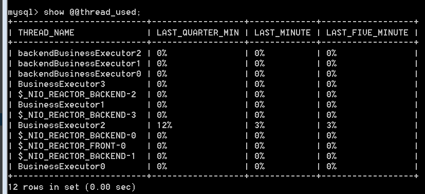
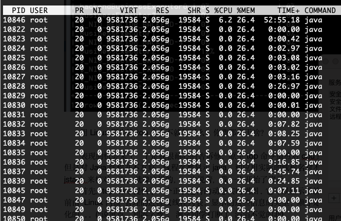
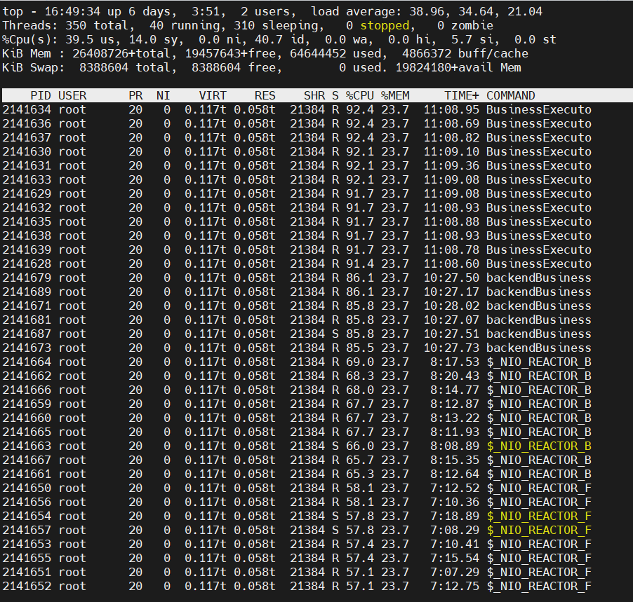
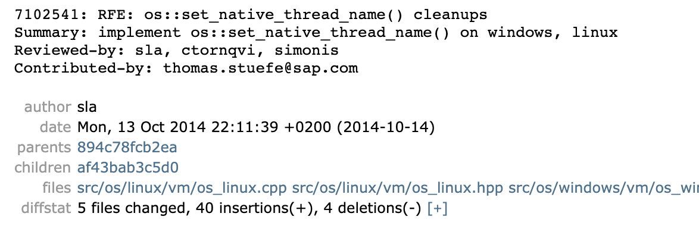
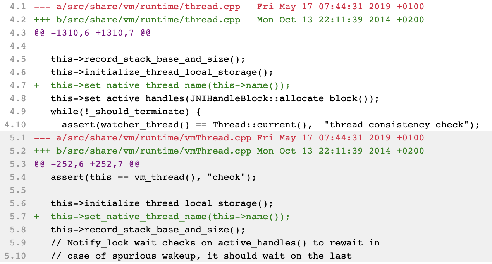
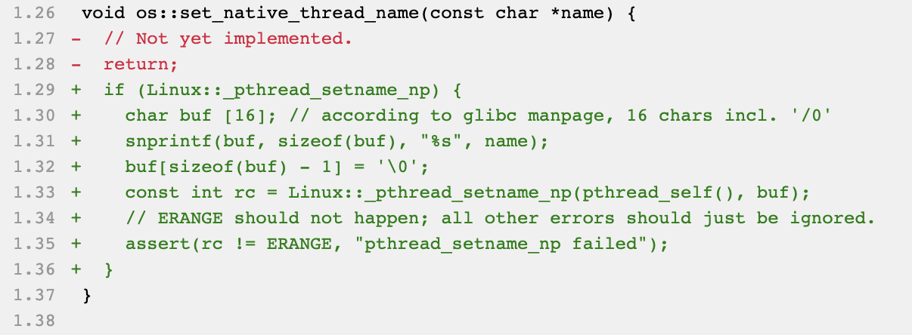
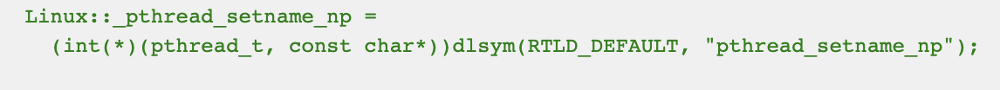

# 故障分析 | 让top命令直接显示Java线程名？&#8211; 解析OpenJDK的一个bug修复

**原文链接**: https://opensource.actionsky.com/20210923-java/
**分类**: 技术干货
**发布时间**: 2021-09-23T00:36:12-08:00

---

作者：阎虎青
DBLE 开源项目负责人，负责分布式数据库中间件研发工作；持续专注于数据库方面的技术，始终在一线从事开发；对数据复制、读写分离、分库分表有深入的理解和实践。
本文来源：原创投稿
*爱可生开源社区出品，原创内容未经授权不得随意使用，转载请联系小编并注明来源。
话说有一天，dble 团队的测试小伙伴要做性能方面的调优，需要了解调优 dble 的原理与方法，于是我就丢给他一份文档让他好好学习一下：
https://actiontech.github.io/dble-docs-cn/2.Function/2.18_performance_observation.html。
测试同学充满鄙夷的看完了文档，然后问我，图中这个命令的目的是做什么的？

用 Linux 原生的 top 命令不就行了么？你费那事干啥？
表现的机会来了，于是我很耐心的告诉他，原生 top 命令虽然对 cpu 统计的更加准确，但是对 Java 线程并不友好，线程名都显示 java ，和应用实际的线程名对不起来，需要通过 jstack 来核对一下，就像这样的，一边说着，我一边开始了演示。
首先，top 命令提供了一个正在运行的动态实时视图。它可以显示系统摘要信息以及当前由 Linux 内核 管理的进程或线程列表。显示的这些信息的类型、顺序是可配置并且持久化。。。(“说重点，别凑字数”，测试同学打断了滔滔不觉的我)。
好的，说重点，默认 top 显示的是单个进程中所有线程的指标的总和，我们可以通过参数 -H 来指定显示线程的信息，另外参数 -p 还可以指定具体的进程 id 。
执行看看 ：
`top -H -p `pidof java`
`
结果大概是这样的：

这个结果有什么用呢？还得通过 jstack 命令来打印一份堆栈（当然，如果线上环境可能要承担一定的风险）
`jstack -l `pidof java` > /tmp/dble_jstack.log
`
有了这两个结果，我们就可以看某个线程号在应用中具体对应哪个线程。
具体怎么做呢?比如我们拿着10849这样一个线程号，把它转为16进制的数字
`printf "%x\n" 10849
2a61
`
然后，再在 jstack 的结果中查找线程的名字。
`cat  /tmp/dble_jstack.log | grep "nid=0x2a61"
"BusinessExecutor0" #23 daemon prio=5 os_prio=0 tid=0x00007f95dc620800 nid=0x2a61 waiting on condition [0x00007f96281f6000]
`
当然，如果只需要线程名字，这就足够了，两行命令也可以拼接在一起。如果还需要更多的上下文信息，可以查看 grep 手册找响应的参数比如-A还有-B，甚至可以打开文件查找。
我还告诉他，实际运维工作中，如果发现 java 进程的 CPU 飙高了，怎么排查呢？也是同样的方法，先通过 top 命令找到 CPU 高的线程，然后通过 jstack 知道这个线程在做什么，尝试解决 CPU 高的问题, 并且据我经验，绝大部分是因为 gc 问题，另外还遇到过 nio 的 epoll bug 。
测试同学静静地听我说完后半程的介绍以及演示，在他自己的 Ubuntu 终端上敲了同样的一行命令：
`top -H -p `pidof java`
`
然后指着结果问我：这不是有线程名么？

这。。。大写的尴尬加打脸现场，满头问号我只好乖乖认怂，并去研究下到底是为什么 top 命令在他的机器上比我的机器上听话。
经过几个昼夜不眠不休的调查（并没有），我终于查出了是否显示线程名的原因。原来早在遥远的2011年就有人提出了疑问（参见 JDK-7102541 ），并且在 JDK-8179011 给出了更加简单的描述。修复也早在2019年就有人做了，并且 openjdk 把它 backport 到 8u222 版本上，也就是说从那之后的 openjdk 版本就已经修复了这个问题，然而到我这篇文章书写的时候，oracle jdk 的 8u301 仍然没有修复这个问题。所以读者们知道该怎么选择 jdk 了吧。
既然 bug 已经修了，就忍不住就想看看具体是怎么实现的。这里我们主要关心一下 Linux 平台的实现。这里还有个有意思的事情，我们其实可以看见这是一位来自 SAP 的大牛在2014年就已经实现的功能。

我们来具体看代码，首先在线程实现的层面将线程的名字 set 进去：

然后是对 set_native_thread_name 方法的具体实现，在 Linux 平台下代码如下：

可以看到，这里截取了线程名的前15个字符，然后调用了 Linux::_pthread_setname_np 方法。在看下这个方法做了什么：

可以看出，这里其实是通过 dlsym 调用操作系统的 pthread_setname_np 方法。
至此，调查结束。我们总结以下几点内容：
- 
如果使用 Oracle jdk8 或者更早的 jdk ，那么还得通过 jstack 或者其他方法来对应线程号和逻辑线程名称。
- 
如果使用 openjdk8 ，建议升级到222之后，这样可以通过top命令直接看到线程的名称，加快诊断。
- 
建议应用在设置线程名时，尽量在15个字符内表达出唯一的含义，便于观察和分析，当然，这一点 dble 做得不好，会在之后进行调整和修改
- 
当然，社区还有一些其他工具，比如阿里的 Arthas 应该也能实现线程 id 和名字对应的功能，不过引入第三方总是件麻烦的事情，还是原生的更香。
参考文档：
http://hg.openjdk.java.net/jdk8u/jdk8u-dev/hotspot/rev/bf1c9a3312a4
https://bugs.openjdk.java.net/browse/JDK-8224140
https://bugs.openjdk.java.net/browse/JDK-7102541
https://bugs.openjdk.java.net/browse/JDK-8179011
https://man7.org/linux/man-pages/man3/pthread_setname_np.3.html
https://man7.org/linux/man-pages/man3/dlsym.3.html