# 故障分析 | 记一次 MySQL 主从双写导致的数据丢失问题

**原文链接**: https://opensource.actionsky.com/20200811-mysql/
**分类**: MySQL 新特性
**发布时间**: 2020-08-11T01:35:23-08:00

---

作者：戴骏贤
网易游戏 技术部资深数据库系统工程师。
本文来源：原创投稿
*爱可生开源社区出品，原创内容未经授权不得随意使用，转载请联系小编并注明来源。
**一、问题起源**
不久前用户反馈部门的 MySQL 数据库发生了数据更新丢失。为了解决这个问题，当时对用户使用的场景进行了分析。发现可能是因为用户在两台互为主从的机器上都进行了写入导致的数据丢失。
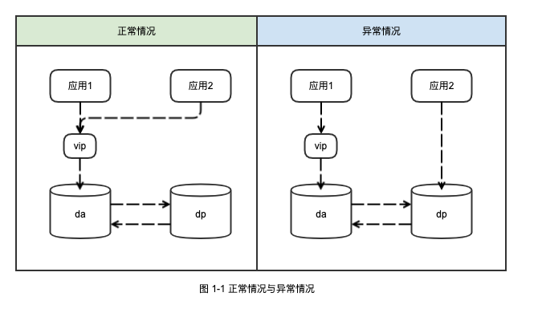											
如图所示，是正常和异常情况下应用写入数据库的示例。随后在更加深入调查问题的过程中，DBA 发现了故障引起数据丢失的原因：
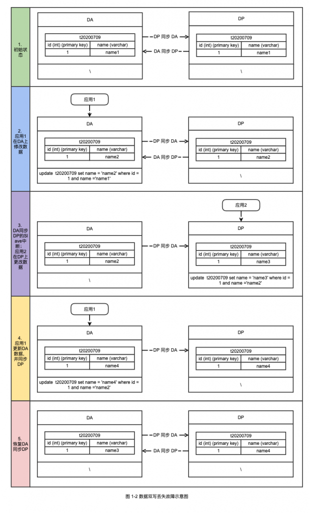											
如图 1-2 所示为故障具体过程的还原。从图中可以看出在第 3 步 DP 上的写入操作，在恢复 DA 到 DP 的同步之后，覆盖了第 4 步 DA 上的写入。因此导致了最终两台机器数据不一致，并且有一部分数据更新丢失。
在这里相信读者都会有一个疑问， 在第 4 步之后数据变成了(id : 1 ,name : name4)，那么第 3 步操作的时候写入的语句是 **update t20200709 set name = &#8216;name3&#8242; where id =1 and name=&#8217;name2&#8217;**，在第 5 步恢复同步的时候这条语句在 DA 上重放应该不会被成功执行，毕竟 Where 条件都不匹配了。而且在 DP 产生的 Binlog 中，确实也记录了 SQL 语句的 Where 条件，无论从哪个角度上来看第 3 步的 SQL 语句都不应该被重放成功。
`### UPDATE `test`.`t20200709`
### WHERE
###   @1=1 /* INT meta=0 nullable=0 is_null=0 */
###   @2='name2' /* VARSTRING(255) meta=255 nullable=1 is_null=0 */
### SET
###   @1=1 /* INT meta=0 nullable=0 is_null=0 */
###   @2='name3' /* VARSTRING(255) meta=255 nullable=1 is_null=0 */
# at 684315240`那么这个问题难道是 MySQL 自身的 Bug，抑或是 MySQL 在某些特殊参数或者条件下的正常表现？对于这个问题，本文将可能的给出这个问题的详细解释和分析。
**二、Row 格式下 RelayLog 的重放**
**2.1 BEFOR IMAGE && AFTER IMAGE && binlog_row_image 参数**
在最后解释本文最初提出的问题前，需要先来看下 RelayLog 是怎么被重放的。一般情况下，当有 DML 语句变更数据库中的数据的时候，Binlog 会记录下事件描述信息、BEFORE IMAGE 和 AFTER IMAGE 等信息。在这里有一个概念 BEFORE IMAGE 和 AFTER IMAGE 需要先介绍下：
1. BEFORE IMAGE : 前镜像，既数据修改前的样子。
2. AFTER IMAGE : 后镜像，既数据修改后的样子。
为了方便理解，这里贴一个 Binlog 的例子。假设当前有表 t20200709，然后表中数据如下：
`mysql> select * from t20200709 ;
+----+-------+
| id | name  |
+----+-------+
|  1 | name4 |
+----+-------+
1 rows in set (0.00 sec)`
之后执行 SQL 语句 **update t20200709 set name =1 where id = 1;**
`mysql> update t20200709 set name =1 where id = 1;
Query OK, 1 row affected (0.00 sec)
Rows matched: 1  Changed: 1  Warnings: 0`
然后来看下 Binlog 中的记录：
`#200715 17:28:28 server id 15218  end_log_pos 400 CRC32 0xe4dedec0     Update_rows: table id 4034114356 flags: STMT_END_F
### UPDATE `test`.`t20200709`
### WHERE
###   @1=1 /* INT meta=0 nullable=0 is_null=0 */
###   @2='name4' /* VARSTRING(255) meta=255 nullable=1 is_null=0 */
### SET
###   @1=1 /* INT meta=0 nullable=0 is_null=0 */
###   @2='1' /* VARSTRING(255) meta=255 nullable=1 is_null=0 */
# at 400`
可以见得，在修改之前 name 字段的值是 **name4**，在 Binlog 中用 Where 条件 **@2=&#8217;name4&#8242;** 来指明，而修改后的 name 的值是 &#8216;1&#8217;，在 Binlog 中就是 **@2=&#8217;1&#8242;** 来指明。因此 BEFORE IMAGE 就是 Binlog 中 WHERE 到 SET 的部分。而 AFTER IMAGE 就是 SET 之后的部分。
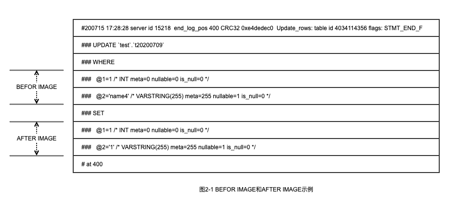											
那么 DELETE，UPDATE 和 INSERT 语句被记录在 Binlog 中的时候，是否都有 BEFORE IMAGE 和 AFTER IMAGE？其实不是所有的 DML 事件类型都拥有两个 IMAGE 的，参见图 2-2 可知只有 UPDATE 语句，会同时拥有 BEFORE IMAGE 和 AFTER IMAGE。
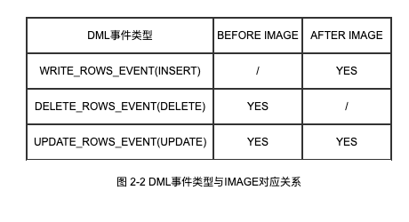											
BEFOR IMAGE 和 AFTER IMAGE 默认会记录所有的列的变更，因此会导致 Binlog 的内容变得很大。那么有没有参数可以控制 IMAGE（对于 BEFOR IMAGE 和 AFTER IMAGE 以下合并简称为 IMAGE）的行为？MySQL 5.7 之后引入了一个新的参数 **binlog_row_image** 。
> 参数说明：
binlog_row_image:https://dev.mysql.com/doc/refman/5.7/en/replication-options-binary-log.html#sysvar_binlog_row_image
用于控制 IMAGE 的行为。**binlog_row_image** 参数的值有三个：1. **full**：Log all columns in both the before image and the after image. 既所有的列的值的变更，都会在 IMAGE 中记录。系统默认是 full。2. **minimal**：Log only those columns in the before image that are required to identify the row to be changed; log only those columns in the after image where a value was specified by the SQL statement, or generated by auto-increment. BEFOR IMAGE 只记录哪些能够唯一标识数据的列，比如主键，唯一键等。AFTER IMAGE 只记录了变更的列。可以看出，minimal 会有效的减少 Binlog 的大小。3. **noblob**：Log all columns (same as full), except for **BLOB** and **TEXT** columns that are not required to identify rows, or that have not changed. 对于其他列的行为都和 full 参数一样。但是对于 BLOB 和 TEXT，在不是可以标识数据行或者有变更的情况下不做记录。> 参数说明：BLOB:https://dev.mysql.com/doc/refman/5.7/en/blob.html
TEXT:https://dev.mysql.com/doc/refman/5.7/en/blob.html
可以看出 binlog_row_image 可以有效控制Binlog的大小，但是如果要保证数据的一致性，最好的值就是设置为 full。
**2.2  slave_rows_search_algorithms 参数**
前文提到了 IMAGE 与 binlog_row_image 相关的内容。本节开始将主要介绍 Relay Log 的重放的时候，对于被重放的记录的查找逻辑。对于 DELETE 和 UPDATE 操作，需要先对数据库中的记录进行检索以确定需要执行 Binlog 重放的数据。如果从库的表上没有主键或唯一键时，则需要根据每一个行记录 BEFOR IMAGE 在所有数据中进行一次全表扫描。在大多数情况下这种开销非常巨大，会导致从库和主库的巨大延迟。从 MySQL 5.6 开始提供了参数 **slave_rows_search_algorithms**> 参数说明：slave_rows_search_algorithms:https://dev.mysql.com/doc/refman/5.7/en/replication-options-replica.html#sysvar_slave_rows_search_algorithms
用于控制在 Relay Log 执行重放的时候对于记录的检索行为。其基本的思路是收集每条记录的 BEFOR IMAGE 信息，然后根据 BEFOR IMAGE 的信息在被重放的表中检索对应的记录。根据 MySQL 的文档，检索数据的方式有如下的几种：
1. INDEX_SCAN2. TABLE_SCAN3. HASH_SCAN如上三个方式可以两两组合并赋值给 **slave_rows_search_algorithms** 参数。MySQL 文档也给出了如下的说明：
											
- The default value is **INDEX_SCAN,TABLE_SCAN**, which means that all searches that can use indexes do use them, and searches without any indexes use table scans.
- To use hashing for any searches that do not use a primary or unique key, set **INDEX_SCAN,HASH_SCAN**. Specifying **INDEX_SCAN,HASH_SCAN** has the same effect as specifying **INDEX_SCAN,TABLE_SCAN,HASH_SCAN**, which is allowed.
- Do not use the combination **TABLE_SCAN,HASH_SCAN**. This setting forces hashing for all searches. It has no advantage over **INDEX_SCAN,HASH_SCAN**, and it can lead to “record not found” errors or duplicate key errors in the case of a single event containing multiple updates to the same row, or updates that are order-dependent.
1. **INDEX_SCAN,TABLE_SCAN**: 可以看出在默认的情况下，既 **INDEX_SCAN,TABLE_SCAN** 如果有主键或者唯一键，则通过主键或者唯一键来查询数据并重放 AFTER IMAGE。如果没有主键或者唯一键，则通过二级索引完成这个工作。如果什么都没有，则使用全表扫描的方式。
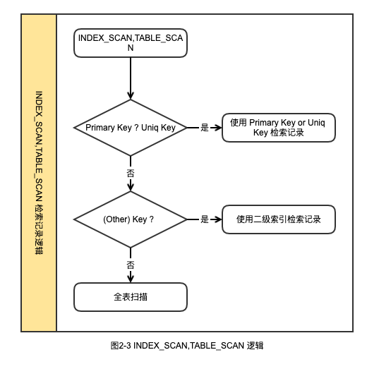											
2. INDEX_SCAN,HASH_SCAN : 在表有主键或者唯一键的情况下， INDEX_SCAN,HASH_SCAN 配置也是使用的主键或者唯一键去定位数据。在表有二级索引或者完全没有索引的情况下会使用 HASH_SCAN 的方法。 
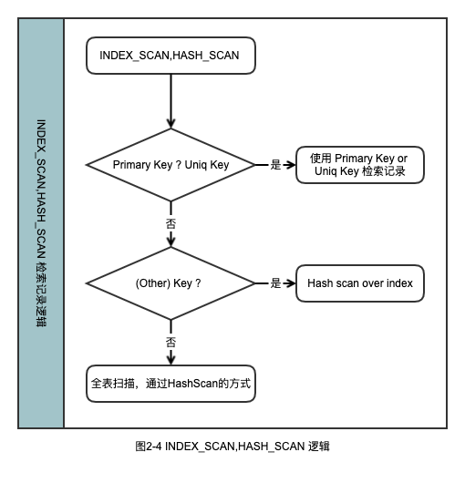											
可以见得 Slave 检索需要重放的数据的时候，三个检索方式的优先级是 Index Scan > Hash Scan > Table Scan
相信读者在这里会有 2 个疑问：
1. Hash Scan 的原理是什么？它和 Table Scan 以及 Index Scan 有什么区别？文档中还提到了 Hash scan over index  这个和 Index 有什么关系？
2. 前文提到在表没有主键或者唯一键的时候，会通过二级索引来定位数据。假设表中有 N 个二级索引(包括单列索引和联合索引)，哪个二级索引会被选中？
**2.3 Hash Scan && Table Scan && Index Scan 实现**
分析 MySQL 源码可知最后决定使用哪个检索方式是在函数 Rows_log_event::decide_row_lookup_algorithm_and_key  里面实现的。
`9745 void
9746 Rows_log_event::decide_row_lookup_algorithm_and_key()
9747 {
9748
... ...
9781   /* PK or UK => use LOOKUP_INDEX_SCAN */
9782   this->m_key_index= search_key_in_table(table, cols, (PRI_KEY_FLAG | UNIQUE_KEY_FLAG));
9783   if (this->m_key_index != MAX_KEY)
9784   {
9785     DBUG_PRINT("info", ("decide_row_lookup_algorithm_and_key: decided - INDEX_SCAN"));
9786     this->m_rows_lookup_algorithm= ROW_LOOKUP_INDEX_SCAN;
9787     goto end;
9788   }
... ...
9790 TABLE_OR_INDEX_HASH_SCAN:
... ...
9808 TABLE_OR_INDEX_FULL_SCAN:
... ...
9827 end:
... ...`
在 9782 行会先检索表中是否有主键和唯一键。之后在 TABLE_OR_INDEX_HASH_SCAN 和 TABLE_OR_INDEX_FULL_SCAN 决定最后使用哪种检索方式。在 do_apply_event 函数中，会根据 decide_row_lookup_algorithm_and_key 的结果去调用函数：
`11286     switch (m_rows_lookup_algorithm)
11287     {
11288       case ROW_LOOKUP_HASH_SCAN:
11289         do_apply_row_ptr= &Rows_log_event::do_hash_scan_and_update;
11290         break;
11291
11292       case ROW_LOOKUP_INDEX_SCAN:
11293         do_apply_row_ptr= &Rows_log_event::do_index_scan_and_update;
11294         break;
11295
11296       case ROW_LOOKUP_TABLE_SCAN:
11297         do_apply_row_ptr= &Rows_log_event::do_table_scan_and_update;
11298         break;
11299
11300       case ROW_LOOKUP_NOT_NEEDED:
11301         DBUG_ASSERT(get_general_type_code() == binary_log::WRITE_ROWS_EVENT);
11302
11303         /* No need to scan for rows, just apply it */
11304         do_apply_row_ptr= &Rows_log_event::do_apply_row;
11305         break;
11306
11307       default:
11308         DBUG_ASSERT(0);
11309         error= 1;
11310         goto AFTER_MAIN_EXEC_ROW_LOOP;
11311         break;
11312     }`
可以见得：
1. do_hash_scan_and_update: 对应 hash_scan 方式。
2. do_index_scan_and_update: 对应 index_scan 方式。
3. do_table_scan_and_update:对应 table_scan 方式。
接下来分别介绍下这三个函数所完成的内容。
2.3.1 do_hash_scan_and_updatedo_hash_scan_and_update 函数主要实现了 Hash Scan 检索数据的功能。在实现方式上又可以分为 H &#8211;> Hash Scan 和 Hi &#8211;> Hash over Index 两种方式。首先来看下 Hash Scan 的实现方法，图 2-5 给出 Hash Scan 的实现逻辑。
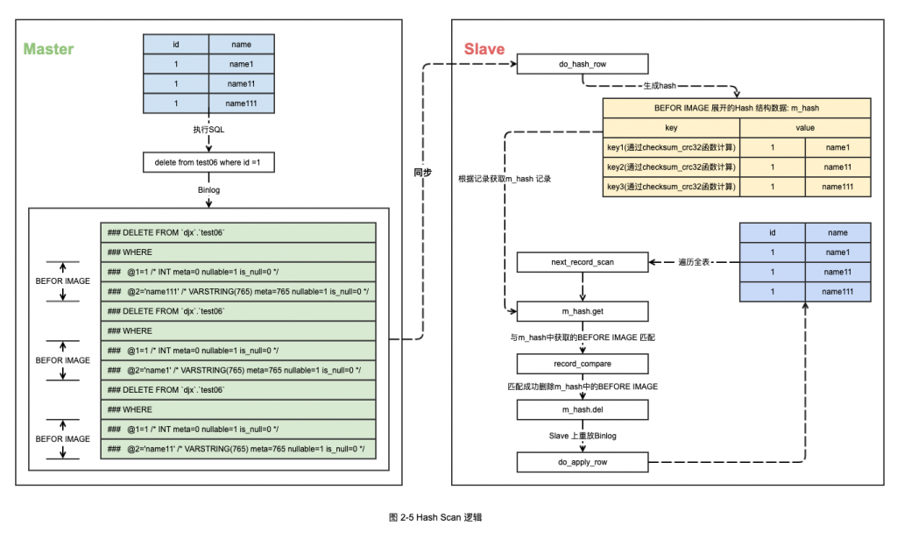											
可以见得 Binlog 中的 BI 在 Slave 上会被处理到一个 Hash 表中。因为没有合适的索引可以使用，所以使用全表扫描的方式每获取一条记录就根据记录的值计算一个 hash 值，然后在 BI 的 Hash 表中匹配。如果匹配到了 BI，则重放并删除 Hash 表中的记录。
如果 test06 表中 id 列上有索引，那么在 Slave 重放的使用会使用 Hi &#8211;> Hash over index 的方式。如图 2-6 所示给出了   Hash over Index 方式（以下均简称 Hi）的实现逻辑。
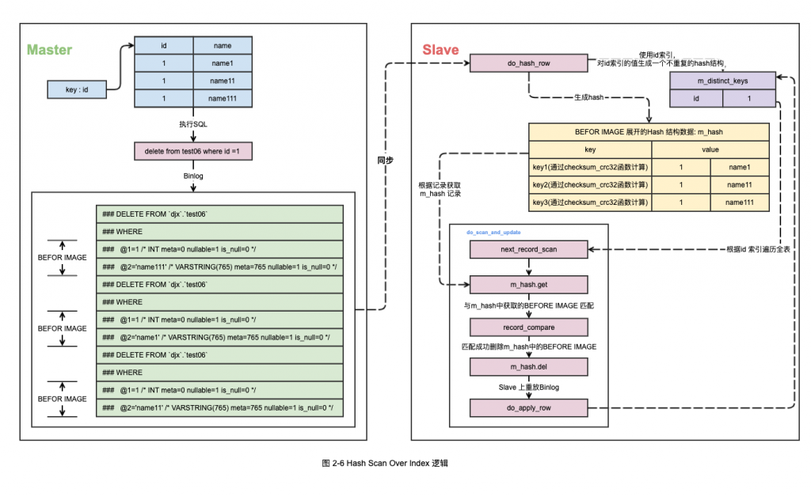											
可以见得如果通过 Hi 方式进行重放，则会对使用的二级索引生成一个 m_distinct_keys 结构，这个结构存放着这个 BI 中这个索引所有的去重值。然后对于 Slave 上的 test06 表通过 m_distinct_keys 中的每一个值在二级索引上进行遍历，遍历获取的记录与 m_hash 中的结果对比并执行重放逻辑。
ps : 对于 Hash Scan 方式还要一个比较迷惑的特性，读者可以参考下这篇文章[[技术分享 | HASH_SCAN BUG 之迷惑行为大赏]](https://opensource.actionsky.com/20190531-hash_scan-bug/)
2.3.2 do_index_scan_and_update
Index Scan 方式会通过索引检索 Slave 上需要重放的数据。通过索引检索数据的方式又可以分为：
1. 通过主键/唯一键索引检索数据。
2. 通过二级索引检索数据。
在通过主键或者唯一键索引检索数据的时候会调用 do_index_scan_and_update 函数，在函数逻辑中直接通过主键/唯一键索引返回了记录然后重放 Binlog。
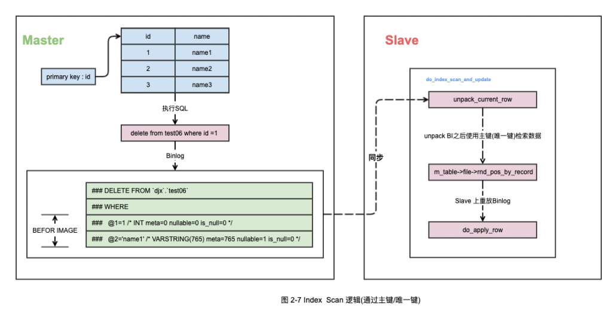											
而在通过二级索引检索数据的时候，会对二级索引返回的数据与 BI 中每一条记录做比较，如果一致就会重放 Binlog。
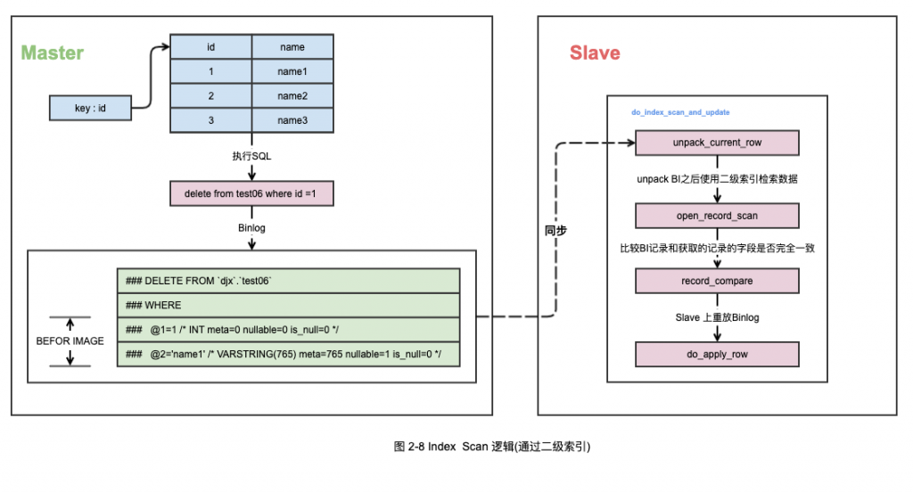											
至此可以发现 Index Scan 下对于主键/唯一键和二级索引的实现逻辑有一些不同。对于主键/唯一键，对于索引到的记录并不会和 BI 中的每一个列做比较，而二级索引获取到的数据会与 BI 中每一个列做比较，如果不一致而不会重放并报错。
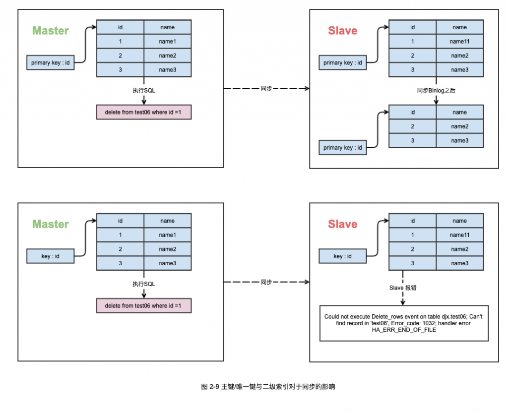											
2.3.3 do_table_scan_and_update
Table Scan 的实现相对简单，如果没有任何的索引可以使用，只能通过全表扫描的方式获取每一行数据并和BI中的每一行做比较。因此如果 Slave 上的数据和 Master 上的数据不一致，也会如图 2-9 中所示一样报错。关于 Table Scan 更加具体的实现方式，读者可以参考 MySQL 源码 sql/log_event.cc 文件中的 do_table_scan_and_update 函数，在这里就不过多的展开。
2.3.4 小结至此可以回答本文之前提出的这个问题了：
> Hash scan 方法的原理是什么？它和 Table scan 以及 Index scan 有什么区别？文档中还提到了 Hash scan over index 这个和 Index 又有什么关系？
可以见得，Hash Scan 的原理是将 BI 每一行的内容都放入一个 Hash 表中。如果可以使用二级索引（既 Hash scan over index 这个方式），则额外的对 BI 中二级索引的值生成一个 Hash 结构，并且将 BI 中二级索引列的去重值放入这个 Hash 结构中。之后不管是通过全表扫描还是索引的方式获取数据，都会通过 Hash 结构去定位 BI 中的数据。对于 Table Scan  和 Index Scan 在获取表中的每一行之后，都需要去和 BI 中的记录做一次查找和比较（有主键或者唯一键的时候不做比较），而 BI 的每一行并没有生成类似于 Hash 的结构，因此从算法的时间复杂度效率上来说是属于 O(n^2) 的。而 Hash Scan 在获取一条记录之后也需要根据 BI 生成的 Hash 结构中查找记录，但是对于 Hash 结构的查找来说效率是 O(1)，因此可以忽略不计。由此可以看出，在没有主键的情况下 Hi 和 Ht 方式的效率是会比 Table Scan 和 Index Scan 来的高一些。
同时到这里，也可以回答本文开头的问题，为什么当前表中的记录有一列值已经和 BI 中的记录不一致了，Binlog 中的操作还会重放。原因就是因为在默认的 INDEX_SCAN,TABLE_SCAN 方式下，对于有主键/唯一键的表不会去比较 BI 中的记录是否和检索到的数据一致。
**2.4 Hash Scan Over Index && Index Scan 中二级索引的选择**
前文提到了在有二级索引的情况下，Hash Scan 和 Index Scan 都会选择二级索引进行扫描。如果表中存在多个二级索引，MySQL 会选择哪个？通过源码分析，最后惊讶的发现，在 binlog_row_image 参数是 Full 的情况下，如果表中存在多个二级索引，MySQL 会默认选择使用第一个索引进行重放。在 decide_row_lookup_algorithm_and_key 函数中，除了决定了使用哪种方式检索数据以外（例如使用 Hash Scan 还是 Table Scan），也决定了后续使用哪个索引。
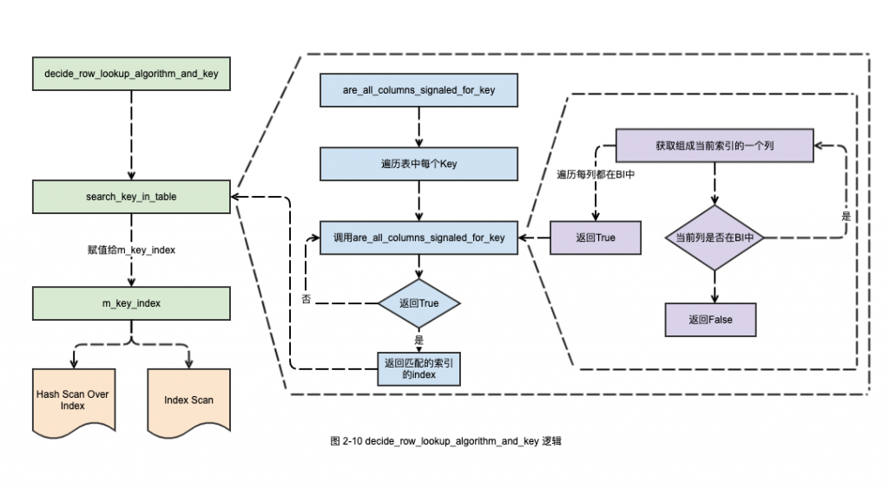											
如图 2-10 给出了选择二级索引的时候的逻辑。可以发现如果在遍历的过程中，找到了第一个所有的列都在 BI 中 key，则会使用这个 key。给出一个例子，test06 的表结构和表中数据如下：
`*************************** 1. row ***************************
Table: test06
Create Table: CREATE TABLE `test06` (
`id` int(11) NOT NULL,
`name` varchar(255) DEFAULT NULL,
`c1` int(11) DEFAULT NULL,
KEY `k1` (`id`),
KEY `k2` (`id`,`name`),
KEY `k3` (`c1`,`name`)
) ENGINE=InnoDB DEFAULT CHARSET=utf8
1 row in set (0.13 sec)
mysql> select * from test06 ;
+------+-------+------+
| id   | name  | c1   |
+------+-------+------+
| 2582 | name3 |    1 |
| 2582 | name4 |    1 |
|    1 | name1 |    0 |
|    1 | name2 |    0 |
|    1 | name3 |    0 |
+------+-------+------+
5 rows in set (0.00 sec)`
在 Master 上执行 SQL，同时 Master 上的执行计划如下：
`delete from test06 where id = 1 and name ='name3' and c1=0;
mysql> explain delete from test06 where id = 1 and name ='name3' and c1=0;
+----+-------------+--------+------------+-------+---------------+------+---------+-------------+------+----------+-------------+
| id | select_type | table  | partitions | type  | possible_keys | key  | key_len | ref         | rows | filtered | Extra       |
+----+-------------+--------+------------+-------+---------------+------+---------+-------------+------+----------+-------------+
|  1 | DELETE      | test06 | NULL       | range | k1,k2,k3      | k2   | 772     | const,const |    1 |   100.00 | Using where |
+----+-------------+--------+------------+-------+---------------+------+---------+-------------+------+----------+-------------+
1 row in set (0.00 sec)`
可以见得，在 Master 上优化器选择了 k2 这个联合索引。通过 GDB 跟踪 Slave 的进程，在 log_event.cc 第 9733 行打断点：
` 9714   if (key_type & MULTIPLE_KEY_FLAG && table->s->keys)
9715   {
9716     DBUG_PRINT("debug", ("Searching for K."));
9717     for (key=0,keyinfo= table->key_info ;
9718          (key < table->s->keys) && (res == MAX_KEY);
9719          key++,keyinfo++)
9720     {
9721       /*
9722         - Skip innactive keys
9723         - Skip unique keys without nullable parts
9724         - Skip indices that do not support ha_index_next() e.g. full-text
9725         - Skip primary keys
9726       */
9727       if (!(table->s->keys_in_use.is_set(key)) ||
9728           ((keyinfo->flags & (HA_NOSAME | HA_NULL_PART_KEY)) == HA_NOSAME) ||
9729           !(table->file->index_flags(key, 0, true) & HA_READ_NEXT) ||
9730           (key == table->s->primary_key))
9731         continue;
9732
9733       res= are_all_columns_signaled_for_key(keyinfo, bi_cols) ?
9734            key : MAX_KEY;
9735
9736       if (res < MAX_KEY)
9737         DBUG_RETURN(res);
9738     }
9739     DBUG_PRINT("debug", ("Not all columns signaled for K."));
9740   }`
可以观察到这时候 m_key_index 的值是 0，并且观察 keyinfo 变量的值为：
`(gdb) print *keyinfo
$4 = {key_length = 4, flags = 0, actual_flags = 0, user_defined_key_parts = 1, actual_key_parts = 1, unused_key_parts = 0, usable_key_parts = 1, block_size = 0, algorithm = HA_KEY_ALG_UNDEF, {
parser = 0x0, parser_name = 0x0}, key_part = 0x7f2f4c015a00, name = 0x7f2f4c012bb1 "k1", rec_per_key = 0x7f2f4c012bc0, m_in_memory_estimate = -1, rec_per_key_float = 0x7f2f4c012bf8, handler = {
bdb_return_if_eq = 0}, table = 0x7f2f4c92d1a0, comment = {str = 0x0, length = 0}}`
接下来，删除 k1 这个索引，再来观察下 m_key_index 和 keyinfo 的值。
`(gdb) print *keyinfo
$7 = {key_length = 772, flags = 64, actual_flags = 64, user_defined_key_parts = 2, actual_key_parts = 2, unused_key_parts = 0, usable_key_parts = 2, block_size = 0, algorithm = HA_KEY_ALG_UNDEF, {
parser = 0x0, parser_name = 0x0}, key_part = 0x7f2f4c92b680, name = 0x7f2f4c92e7d1 "k2", rec_per_key = 0x7f2f4c92e7d8, m_in_memory_estimate = -1, rec_per_key_float = 0x7f2f4c92e808, handler = {
bdb_return_if_eq = 0}, table = 0x7f2f4ca9fd90, comment = {str = 0x0, length = 0}}`
可以发现删除了 k1 之后，Slave 上就选择 k2 这个索引，和 Master上的执行计划选择的索引一致了。通过前面的源码分析和调试跟踪可以发现，MySQL 在 Slave 重放数据的时候（没有主键和唯一键的情况），选择的索引是第一个所有的列都在 BI 中存在的索引。因此可能存在 Slave 上选择的索引不是最优的导致 Slave 和 Master 有巨大延迟。
**三、总结**
至此前文提出的几个问题都基本清楚了，可以总结出如下的几点内容：
1. 在有主键或者唯一键的情况下，Slave 重放 Binlog 并不会去比较检索到的记录的每一列是否和BI相同，因此如果 Slave 和 Master 存在数据不一致，会直接覆盖 Slave 的数据而不会报错。
2. 在没有主键或者唯一键的情况下，Hash Scan / Hash Scan Over Index 的执行效率 在理论上分析高于 Table Scan 和Index Scan 。
3. 在没有主键或者唯一键的情况下，Slave 选择的二级索引是第一个所有的列都在 BI 中存在的索引，不一定是 Master 执行计划所选择的索引。
最后本文所有分析的源码都是基于 mysql-5.7.28 版本。限于作者的水平有限，如果文章中有错误之处，望大家不吝指正。
**四、参考文献**
[1]. MySQL 无主键延迟优化（slave_rows_search_algorithms).
https://www.centos.bz/2018/01/mysql无主键延迟优化（slave_rows_search_algorithms）
[2]. MySQL 5.7 贴心参数之 binlog_row_image.
https://www.cnblogs.com/gomysql/p/6155160.html
[[3]. 技术分享 | delete大表slave回放巨慢的问题分析.](https://opensource.actionsky.com/20190625-delete-slave/)
[https://opensource.actionsky.com/20190625-delete-slave/](https://opensource.actionsky.com/20190625-delete-slave/)
[4]. Causes and Workarounds for Slave Performance Too Slow with Row-Based Events.
https://www.percona.com/blog/2018/05/03/slave-performance-too-slow-with-row-based-events-causes-and-workarounds/
[[5]. 技术分享 | 从库数据的查找和参数 slave_rows_search_algorithms.](https://opensource.actionsky.com/20190911-mysql/)
[https://opensource.actionsky.com/20190911-mysql/](https://opensource.actionsky.com/20190911-mysql/)
[[6]. 技术分享 | HASH_SCAN BUG 之迷惑行为大赏.](https://opensource.actionsky.com/20190531-hash_scan-bug/)
[https://opensource.actionsky.com/20190531-hash_scan-bug/](https://opensource.actionsky.com/20190531-hash_scan-bug/)