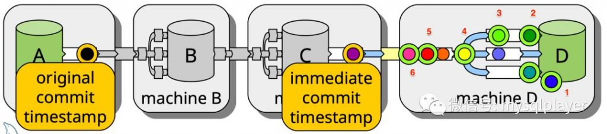

# 新特性解读 | MySQL 8 复制延迟观测新方式，更全面更精准

**原文链接**: https://opensource.actionsky.com/20200304-mysql/
**分类**: MySQL 新特性
**发布时间**: 2020-03-04T01:43:01-08:00

---

以下文章来源于玩转MySQL ，作者洪斌
一直以来 MySQL 复制延迟观测是不完善的，既无法观测到真实的主从延迟，也无法支持复杂的复制拓扑环境，常用的 second_behind_master 指标更多是判断是否存在回放延迟，以及趋势变化。你无法直观的观测到事务精确的延迟情况，因为 slave 无法获知事务在 master 上的提交时间。
社区贡献的基于心跳表延迟检测方法，其流程是 master 上创建一张心跳表，心跳进程每秒更新表上的时间戳字段，slave 同步后计算时间差。这应该是在不改动 MySQL 代码的最好方案了，虽然也会有些不足。
- 心跳进程单点风险，心跳进程不可用则延迟检测失效。
- 并不能反应真实的业务事务同步或回放延迟，体现的是主从复制链路全局的连通性和延迟。
- 观测粒度只能达到秒级，精度不够。
- 污染 binlog，大量心跳事件占据 binlog，更多空间占用，干扰排查和日志恢复。
**MySQL 8 复制延迟观测的改进**
WL#7319 和 WL#7374 共同完善了复制延迟观测，WL#7319 Infrastructure for GTID based delayed replication and replication lag monitoring 在binlog 的 gtid_log_event （启用 GTID）和 anonymous_gtid_log_event（未启用 GTID）新增事务提交时间戳。将事务原始提交时间写在 binlog 中，提交时间在复制链路上传递，使得 slave 可以计算事务延迟。
- original_commit_timestamp 事务在 master 提交 binlog 的时间戳（微秒），该时间戳每个节点都是一样的。
- immediate_commit_timestamp 事务在 slave（包括中继节点）提交 binlog 的时间戳（微秒），该时间戳在 relay log 中与 original_commit_timestamp 一样，在 slave 的 binlog 是完成回放的时间戳。
WL#7374 Performance schema tables to monitor replication lags and queue 为 performance_schema 复制相关表新增观测点。
- replication_connection_status 记录事件接收线程（IO Thread）工作状态
- replication_applier_status_by_coordinator 记录启用并行回放的协调线程工作状态
- replication_applier_status_by_worker 记录事件回放线程（SQL Thread）工作状态
**replication_connection_status**
LAST_QUEUED_TRANSACTION_ORIGINAL_COMMIT_TIMESTAMP 已写入 relay log 事务 ORIGINAL_COMMIT_TIMESTAMP 时间戳LAST_QUEUED_TRANSACTION_IMMEDIATE_COMMIT_TIMESTAMP 已写入 relay log 事务 IMMEDIATE_COMMIT_TIMESTAMP 时间戳LAST_QUEUED_TRANSACTION_START_QUEUE_TIMESTAMP 已写入 relay log 的事务开始时间戳LAST_QUEUED_TRANSACTION_END_QUEUE_TIMESTAMP 已写入 relay log 的事务结束时间戳QUEUEING_TRANSACTION_ORIGINAL_COMMIT_TIMESTAMP 正在写 relay log 的事务 ORIGINAL_COMMIT_TIMESTAMP 时间戳QUEUEING_TRANSACTION_IMMEDIATE_COMMIT_TIMESTAMP 正在写 relay log 的事务 IMMEDIATE_COMMIT_TIMESTAMP 时间戳QUEUEING_TRANSACTION_START_QUEUE_TIMESTAMP 正在写 relay log 的事务首个事件的时间戳
**replication_applier_status_by_coordinator**
LAST_PROCESSED_TRANSACTION_ORIGINAL_COMMIT_TIMESTAMP 已调度事务的 ORIGINAL_COMMIT_TIMESTAMP 时间戳
LAST_PROCESSED_TRANSACTION_IMMEDIATE_COMMIT_TIMESTAMP 已调度事务的 IMMEDIATE_COMMIT_TIMESTAMP 时间戳LAST_PROCESSED_TRANSACTION_START_BUFFER_TIMESTAMP 已调度事务到 worker 线程 buffer 的开始时间戳LAST_PROCESSED_TRANSACTION_END_BUFFER_TIMESTAMP 已调度事务到 worker 线程 buffer 的结束时间戳PROCESSING_TRANSACTION_ORIGINAL_COMMIT_TIMESTAMP 正在调度事务的 ORIGINAL_COMMIT_TIMESTAMP 时间戳PROCESSING_TRANSACTION_IMMEDIATE_COMMIT_TIMESTAMP 正在调度事务的 IMMEDIATE_COMMIT_TIMESTAMP 时间戳PROCESSING_TRANSACTION_START_BUFFER_TIMESTAMP 正在调度事务写入 worker 线程 buffer 的开始时间戳
**replication_applier_status_by_worker**
LAST_APPLIED_TRANSACTION_ORIGINAL_COMMIT_TIMESTAMP 已回放事务的 ORIGINAL_COMMIT_TIMESTAMP 时间戳
LAST_APPLIED_TRANSACTION_IMMEDIATE_COMMIT_TIMESTAMP 已回放事务的 IMMEDIATE_COMMIT_TIMESTAMP 时间戳LAST_APPLIED_TRANSACTION_START_APPLY_TIMESTAMP 已回放事务的开始时间戳LAST_APPLIED_TRANSACTION_END_APPLY_TIMESTAMP 已回放事务的结束时间戳APPLYING_TRANSACTION_ORIGINAL_COMMIT_TIMESTAMP 正在回放事务的 ORIGINAL_COMMIT_TIMESTAMP 时间戳APPLYING_TRANSACTION_IMMEDIATE_COMMIT_TIMESTAMP 正在回放事务的 IMMEDIATE_COMMIT_TIMESTAMP 时间戳APPLYING_TRANSACTION_START_APPLY_TIMESTAMP 正在回放事务的开始时间戳
如何观测事务复制过程中在不同位置的延迟，A 是 Master 节点，C 是中继 Slave 节点，D 是 Slave 节点。
											
**位置 1：事务从主节点 A 到从节点 D 回放完的延迟，最常用的查看事务完整的同步延迟**
- `SELECT LAST_APPLIED_TRANSACTION_END_APPLY_TIMESTAMP - LAST_APPLIED_TRANSACTION_ORIGINAL_COMMIT_TIMESTAMP`
- `FROM performance_schema.replication_applier_status_by_worker`
事务从中继节点 C 到从节点 D 回放完的延迟，与上面类似，若没有中继节点效果和上面一样，也是事务完整的同步延迟- `SELECT LAST_APPLIED_TRANSACTION_END_APPLY_TIMESTAMP - LAST_APPLIED_TRANSACTION_IMMEDIATE_COMMIT_TIMESTAMP`
- `FROM performance_schema.replication_applier_status_by_worker`
**位置 2：当前已调度完的事务到开始回放的延迟**
- `SELECT APPLYING_TRANSACTION_START_APPLY_TIMESTAMP - APPLYING_TRANSACTION_IMMEDIATE_COMMIT_TIMESTAMP`
- `FROM performance_schema.replication_applier_status_by_worker`
**位置3：已调度完的事务等待回放的延迟，MTS 开启**
- `SELECT LAST_PROCESSED_TRANSACTION_END_BUFFER_TIMESTAMP - LAST_PROCESSED_TRANSACTION_IMMEDIATE_COMMIT_TIMESTAMP`
- `FROM performance_schema.replication_applier_status_by_coordinator`
**位置 4：当前已同步到中继日志的事务，等待开始调度的延迟，MTS 开启**
- `SELECT PROCESSING_TRANSACTION_START_BUFFER_TIMESTAMP - PROCESSING_TRANSACTION_IMMEDIATE_COMMIT_TIMESTAMP`
- `FROM performance_schema.replication_applier_status_by_coordinator`
**位置 5：事务同步到从机中继日志的延迟**- `SELECT LAST_QUEUED_TRANSACTION_END_QUEUE_TIMESTAMP - LAST_QUEUED_TRANSACTION_IMMEDIATE_COMMIT_TIMESTAMP`
- `FROM performance_schema.replication_connection_status`
**位置 6：当前同步事务的网络传输延迟**- `SELECT QUEUEING_TRANSACTION_START_QUEUE_TIMESTAMP - QUEUEING_TRANSACTION_IMMEDIATE_COMMIT_TIMESTAMP`
- `FROM performance_schema.replication_connection_status`
MySQL 8 从根源上解决了过往版本缺少事务提交时间且无法传递的问题，PS 视图暴露更多观测点简化了观测方式，帮助工程师更精准的诊断复制延迟问题。