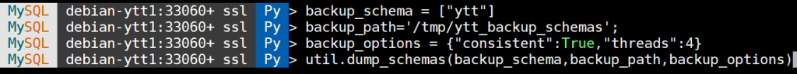

# 新特性解读 | MySQL 8.0 增强逻辑备份恢复工具介绍

**原文链接**: https://opensource.actionsky.com/20201021-mysql/
**分类**: MySQL 新特性
**发布时间**: 2020-10-21T00:38:24-08:00

---

作者：杨涛涛
资深数据库专家，专研 MySQL 十余年。擅长 MySQL、PostgreSQL、MongoDB 等开源数据库相关的备份恢复、SQL 调优、监控运维、高可用架构设计等。目前任职于爱可生，为各大运营商及银行金融企业提供 MySQL 相关技术支持、MySQL 相关课程培训等工作。
本文来源：原创投稿
*爱可生开源社区出品，原创内容未经授权不得随意使用，转载请联系小编并注明来源。
这篇我们来简单介绍下 MySQL 8.0.21 附带的增强版逻辑备份工具。
在介绍这个工具之前，先来回顾下 MySQL 的逻辑备份工具历史。
1. **mysqldump：** 最早，也是最成熟的逻辑备份工具，是 MySQL 原生的用来备份整个数据库实例、单个数据库、单张表的逻辑备份工具， 上手简单，学习成本几乎为 0。备份简单，恢复也简单。
比如导出单个数据库 ytt: mysqldump ytt > /tmp/ytt.sql；
恢复也非常简单：mysql < /tmp/ytt.sql
缺点是备份速度慢。在整个备份过程中，是单线程运行；备份出来的数据集要恢复的话同样也是单线程运行，恢复速度也慢。除非对同一时刻的所有表单独备份出来，自己写额外脚本进行多线程恢复。
2. **mysqlpump**：MySQL 5.7 GA 后推出的 mysqldump工具的增强版。可以对同一个数据集多个线程并发备份，备份速度很快。
其他缺点和 mysqldump 一样。
3. **MySQL Shell UTIL** 对象附带的备份工具：随 MySQL 8.0.21 最新版本捆绑发布，自带多线程备份以及多线程恢复功能， 可以直接替代 mysqldump/mysqlpump。
- **dump_instance/dumpInstance 用来多线程备份 MySQL 整个单机实例**
- **dump_schemas/dumpSchemas 用来多线程备份 MySQL 单个数据库**
- **load_dump/loadDump 用来多线程恢复之前两个工具导出的数据集文件**
**MySQL Shell UTIL 备份恢复工具具备如下特性：**1. 压缩导出（默认压缩算法 zstd）
2. 数据集分块导出，每块 32M
3. 默认导出存储过程、存储函数、触发器、事件、用户、视图
4. 默认 4 个线程导出
5. 默认进度展示
6. 默认字符集 utf8mb4
7. 默认开启一致性导出
8. 默认表，视图等定义导出为 SQL 语句
9. 默认数据导出为 TSV 格式数据
接下来，我们来简单演示下 MySQL SHELL UTIL 备份恢复工具，以下我基于 PYTHON 语法：
1. **dump_instance 示例**
具体参数：（4 个线程同时备份数据库 ytt）
- 
- 
- 
- 
- 
`# 备份路径``backup_path='/tmp/ytt_backup_instance';``
``# 备份选项，定义一致性，不包含哪些数据库，线程数等等。``backup_options = {"consistent":True,"threads":4,"excludeSchemas":["world","ytt_new","score","query_rewrite"]}`
											
以下为备份结果信息汇总，其中包含备份时间，备份数据集原始大小，压缩后大小，压缩率以及压缩速度等信息。- 
- 
- 
- 
- 
- 
- 
- 
- 
- 
```
Duration: 00:00:35s`Schemas dumped: 1``Tables dumped: 8``Uncompressed data size: 584.89 MB``Compressed data size: 12.02 MB``Compression ratio: 48.7``Rows written: 28000016``Bytes written: 12.02 MB``Average uncompressed throughput: 16.49 MB/s``Average compressed throughput: 338.96 KB/s
```
再来查看备份路径下的文件，
											
.json 后缀的为元数据文件，比如备份开始时间，备份结束时间，备份的用户，每张表的数据字典等信息。
剩下的即为备份的数据集，默认 ZSTD 压缩。
2. **dump_schemas**
dump_instance 主要用来备份整个 MySQL 实例，如果只想备份单个数据库，用 dump_schemas 更加简单。
dump_schemas 参数除了要指定具体的数据库名，其余的参数和 dump_instance 一样
- 
- 
- 
- 
- 
- 
- 
- 
# 备份指定的数据库``backup_schema = ["ytt"]``
``# 备份路径``backup_path='/tmp/ytt_backup_schemas';``
``# 备份选项``backup_options = {"consistent":True,"threads":4}
`
											
以下为 dump_schemas 备份的结果和 dump_instance 一样。
- 
- 
- 
- 
- 
- 
- 
- 
- 
- 
`Duration: 00:00:32s``Schemas dumped: 1``Tables dumped: 8``Uncompressed data size: 584.89 MB``Compressed data size: 12.02 MB``Compression ratio: 48.7``Rows written: 28000016``Bytes written: 12.02 MB``Average uncompressed throughput: 18.15 MB/s``Average compressed throughput: 373.01 KB/s`
3.  **load_dump**
备份好了后，用 load_dump 恢复下数据库 ytt 的备份集，
- 
- 
- 
- 
- 
- 
- 
- 
- 
- 
- 
- 
- 
`# 删除原数据库``mysql> drop database ytt;``Query OK, 8 rows affected (0.27 sec)``
``# 创建指定数据库ytt.``mysql> create database ytt;``Query OK, 1 row affected (0.01 sec)``
``# 用于恢复的备份集目录``restore_url = '/tmp/ytt_backup_schemas'``
``# 恢复选项：是否对恢复的表做样例数据收集，是否延迟建立索引，恢复指定的数据库等。``restore_options={"analyzeTables":"on","deferTableIndexes":"all","includeSchemas":["ytt"]}`
											
恢复过程如下：
											
这里要说明下，load_dump 恢复数据的线程数量取决于之前备份集的线程数量。
恢复信息，由于笔记本虚拟机性能太差，数据仅供参考。
- 
- 
- 
- 
`Executing common postamble SQL``
``40 chunks (28.00M rows, 584.89 MB) for 6 tables in 1 schemas were loaded in 3 min 30 sec (avg throughput 2.79 MB/s)``0 warnings were reported during the load.`
**总结：**
本篇介绍了 MySQL 8.0.21 发布的高性能逻辑备份恢复工具，可以完美替换性能低下的传统备份工具 mysqldump 或者 mysqlpump。
相关推荐：
[新特性解读 | 数组范围遍历功能](https://opensource.actionsky.com/20200930-mysql/)
[新特性解读 | MySQL 8.0 语句摘要功能介绍](https://opensource.actionsky.com/20200915-mysql/)
[新特性解读 | GROUPING() 函数用法解析](https://opensource.actionsky.com/20200810-mysql/)