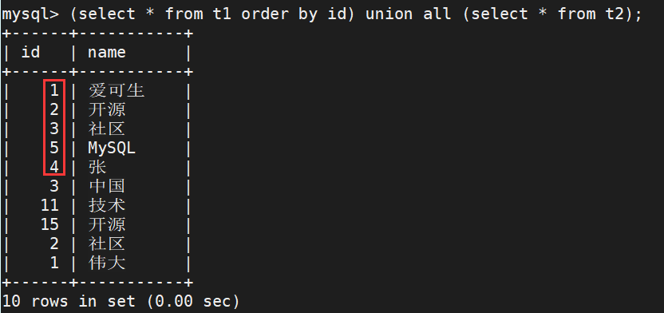
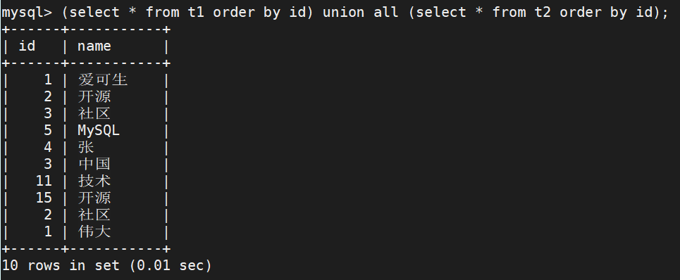
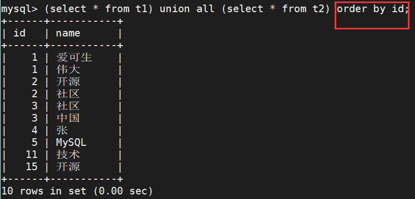

# 新特性解读 | MySQL 8.0 对 UNION 的改进

**原文链接**: https://opensource.actionsky.com/20220303-mysql8-0/
**分类**: MySQL 新特性
**发布时间**: 2022-03-02T22:03:30-08:00

---

作者：张伟
爱可生北京分公司 DBA 团队成员，负责 MySQL 日常问题处理和 DMP 产品维护。喜爱技术和开源数据库，喜爱运动、读书、电影，花草树木。
本文来源：原创投稿
*爱可生开源社区出品，原创内容未经授权不得随意使用，转载请联系小编并注明来源。
## 一、UNION 的作用：
UNION 可以将多个 SELECT 查询语句的结果合并成一个结果集，在MySQL 8.0 中又增添了一些新的功能，我们一起来看下。
## 二、UNION 操作符的花样展示：
#### 1、温故
- 
Union 必须由两条或以上的 SELECT 语句组成，才能使用 Union 连接。
- 
Union 中每个查询必须包含相同数量的列或者聚合函数，列名或者别名需要一致。
- 
列数据类型必须兼容，即可以进行隐式类型转换，但可能会出现 SQL 性能问题，建议数据类型相同。
举例如下：
`create table t1 (id int, name varchar(20));
insert into t1 values(1,"爱可生"),(2,"开源"),(3,"社区"),(5,"MySQL"),(4,"张");
create table t2 (id int, name varchar(20));
insert into t2 values(3,"中国"),(11,"技术"),(15,"开源"),(2,"社区"),(1,"伟大");
mysql> select id from t1;
+------+
| id   |
+------+
|    1 |
|    2 |
|    3 |
|    5 |
|    4 |
+------+
5 rows in set (0.00 sec)
mysql> select id from t2;
+------+
| id   |
+------+
|    3 |
|   11 |
|   15 |
|    2 |
|    1 |
+------+
5 rows in set (0.00 sec)
// DISTINCT: 删除结果集中重复的数据。
mysql> select id from t1 union distinct select id from t2;
+------+
| id   |
+------+
|    1 |
|    2 |
|    3 |
|    5 |
|    4 |
|   11 |
|   15 |
+------+
7 rows in set (0.00 sec)
// 默认情况下 UNION 操作符已经删除了重复数据，所以 DISTINCT 修饰符对结果没啥影响。
mysql> select id from t1 union select id from t2;
+------+
| id   |
+------+
|    1 |
|    2 |
|    3 |
|    5 |
|    4 |
|   11 |
|   15 |
+------+
7 rows in set (0.00 sec)
// ALL: 返回包括重复数据在内的所有结果集。
mysql> select id from t1 union all select id from t2;
+------+
| id   |
+------+
|    1 |
|    2 |
|    3 |
|    5 |
|    4 |
|    3 |
|   11 |
|   15 |
|    2 |
|    1 |
+------+
10 rows in set (0.00 sec)
`
使用 Union 组合查询时，只能使用一条 order by 子句对结果集进行排序，而且必须出现在最后一条出现的 SELECT 语句之后。因为 Union 不允许对于部分结果集进行排序，只能针对最终检索出来的结果集进行排序。
注意：由于在多表组合查询时候，可能表字段并不相同。所以在对于结果集排序的时候需要使用检索出来的共同字段。检索的字段 id 必须存在于结果集中。
举例如下：

#### 2、知新
- 
从 MySQL 8.0.19 版本开始，不仅在 SELECT 语句中，也可以在 TABLE 或 VALUES 语句中使用 UNION，只要可以使用等效的 SELECT 语句。
- 
可以在 TABLE 中使用ORDER BY和LIMIT，但不支持WHERE子句。
- 
ORDER BY 不能使用包含 表名.列名 的引用。相反，在第一个 SELECT 语句中提供列别名，并在 ORDER BY 中引用别名。
- 
如果要排序的列具有别名，ORDER BY 子句必须引用别名，而不是列名。
举例如下：
`// 新增 table 语句的使用，由于取的是全表，对于单一字段的去重就不便使用了
mysql> table t1 union select * from t2;
+------+-----------+
| id   | name      |
+------+-----------+
|    1 | 爱可生    |
|    2 | 开源      |
|    3 | 社区      |
|    5 | MySQL     |
|    4 | 张        |
|    3 | 中国      |
|   11 | 技术      |
|   15 | 开源      |
|    2 | 社区      |
|    1 | 伟大      |
+------+-----------+
10 rows in set (0.01 sec)
// 新增 values 语句的使用，但会导致字段名失效
mysql> values row(15,'开源') union select * from t2;
+----------+----------+
| column_0 | column_1 |
+----------+----------+
|       15 | 开源     |
|        3 | 中国     |
|       11 | 技术     |
|        2 | 社区     |
|        1 | 伟大     |
+----------+----------+
5 rows in set (0.01 sec)
// 使用table 语句和values 语句的结合
mysql> values row(15,'开源'),row(13,'北京') union table t2;
+----------+----------+
| column_0 | column_1 |
+----------+----------+
|       15 | 开源     |
|       13 | 北京     |
|        3 | 中国     |
|       11 | 技术     |
|        2 | 社区     |
|        1 | 伟大     |
+----------+----------+
6 rows in set (0.01 sec)
// 如果定义字段名可以使用以下方法
mysql > select * from (values row(15,'开源'),row(13,'北京')) AS t(c1,c2) union table t2;
+------+--------+
| c1   | c2     |
+------+--------+
|   15 | 开源   |
|   13 | 北京   |
|    3 | 中国   |
|   11 | 技术   |
|    2 | 社区   |
|    1 | 伟大   |
+------+--------+
6 rows in set (0.02 sec)
`
## 三、对比 MySQL 8.0 和 5.7 对 union 的处理
在 MySQL 8.0 中，对 SELECT 和 UNION 的解析器规则被重构进而变得更加一致，且减少了重复。
与 MySQL 5.7 相比，某些语句可能需要重写:
- 
对比标准 SQL ， NATURAL JOIN 允许一个可选的 INNER 关键字(NATURAL INNER JOIN)。
- 
对比标准 SQL ，可以使用不带括号的 Right-deep JOIN（例如，…JOIN…JOIN…ON…ON）。
- 
与其他 INNER JOIN 类似，STRAIGHT_JOIN 现在允许 USING 子句。
- 
解析器接受查询表达式周围的括号。例如：（SELECT &#8230; UNION SELECT…）。
- 
以前只允许在子查询中使用 union 的左嵌套，现在允许顶层语句中使用。如：(SELECT 1 UNION SELECT 1) UNION SELECT 1 ；
- 
包含锁定子句的 SELECT 语句必须使用括号。例如：SELECT 1 FOR UPDATE UNION SELECT 1 FOR UPDATE; 变更为 (SELECT 1 FOR UPDATE) UNION (SELECT 1 FOR UPDATE)；
## 四、参考文档：
https://dev.mysql.com/doc/refman/8.0/en/union.html