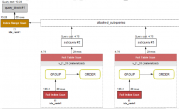
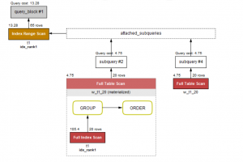

# 新特性解读 | MySQL 8.0 通用表达式

**原文链接**: https://opensource.actionsky.com/20190506-mysql8/
**分类**: MySQL 新特性
**发布时间**: 2019-05-06T01:05:24-08:00

---

通用表达式在各个商业数据库中比如ORACLE，SQL SERVER等早就实现了，MySQL到了8.0 才支持这个特性。 这里有两个方面来举例说明WITH的好处。
第一，易用性。
第二，效率。
## 举例一 WITH表达式的易用性。
我们第一个例子， 对比视图的检索和WITH的检索。我们知道视图在MySQL里面的效率一直较差，虽说MySQL 5.7对视图做了相关固化的优化，不过依然不尽人意。考虑下，如果多次在同一条SQL中访问视图，那么则会多次固化视图，势必增加相应的资源消耗。
MySQL里之前对这种消耗的减少只有一种，就是动态处理，不过一直语法较为恶心，使用不是很广。
MySQL8.0后，又有了一种减少消耗的方式，就是WITH表达式。 我们假设以下表结构：
`| CREATE TABLE `t1` (
`id` int(11) NOT NULL AUTO_INCREMENT,
`rank1` int(11) DEFAULT NULL,
`rank2` int(11) DEFAULT NULL,
`log_time` datetime DEFAULT NULL,
`prefix_uid` varchar(100) DEFAULT NULL,
`desc1` text,
PRIMARY KEY (`id`),
KEY `idx_rank1` (`rank1`),
KEY `idx_rank2` (`rank2`),
KEY `idx_log_time` (`log_time`)
) ENGINE=InnoDB AUTO_INCREMENT=2037 DEFAULT CHARSET=utf8mb4 COLLATE=utf8mb4_0900_ai_ci
`
有1000行测试记录。
`mysql> select count(*) from t1;
+----------+
| count(*) |
+----------+
|     1024 |
+----------+
1 row in set (0.00 sec)
`
这里我们建立一个普通的视图
`CREATE ALGORITHM=merge SQL SECURITY DEFINER VIEW `v_t1_20` AS 
select count(0) AS `cnt`,`t1`.`rank1` AS `rank1` 
from `t1` 
group by `t1`.`rank1` 
order by `t1`.`rank1` 
limit 20;
`
- 检索语句A：
对视图里的最大和最小值字段rank1进行过滤检索出符合条件的记录行数。
```
mysql> use ytt;
mysql> SELECT 
COUNT(*)
FROM
t1
WHERE
rank1 = (SELECT 
MAX(rank1)
FROM
v_t1_20)
OR rank1 = (SELECT 
MIN(rank1)
FROM
v_t1_20);
+----------+
| count(*) |
+----------+
|       65 |
+----------+
1 row in set (0.00 sec)
```
我们用WITH表达式来重写一遍这个查询，
&#8211; 查询语句B：
`mysql> use ytt;
mysql> with w_t1_20(cnt,rank1) as (
SELECT 
COUNT(*), rank1
FROM
t1
GROUP BY rank1
ORDER BY rank1
LIMIT 20
) SELECT 
COUNT(*)
FROM
t1
WHERE
rank1 = (SELECT 
MAX(rank1)
FROM
w_t1_20)
OR rank1 = (SELECT 
MIN(rank1)
FROM
w_t1_20);
+----------+
| count(*) |
+----------+
|       65 |
+----------+
1 row in set (0.00 sec)
`
我的函数很少，仅作功能性演示， 索引表面上看执行时间差不多， 我们来对比下两条实现语句的查询计划。
- A的计划：

- 
B的计划：

从以上图我们可以看出，B比A少了一次对视图的固化，也就是说，不管我访问WITH多少次，仅仅固化一次。 有兴趣的可以加大数据量，加大并发测试下性能。
## 举例二 WITH表达式的功能性
我们第二个例子，简单说功能性。
比如之前MySQL一直存在的一个问题，就是临时表不能打开多次。
我们以前只有一种解决办法就是把临时表固化到磁盘，像访问普通表那样访问临时表。
现在我们可以用MySQL8.0自带的WITH表达式来做这样的业务。
比如以下临时表：
`create temporary table ytt_tmp1 as 
SELECT 
COUNT(*) cnt, rank1
FROM
t1
GROUP BY rank1
ORDER BY rank1
LIMIT 20
`
我们还是用之前的查询，这里会提示错误。
`mysql> select count(*) from t1  where rank1 = (select max(rank1) from ytt_tmp1) or rank1 = (select min(rank1) from ytt_tmp1)
-> ;
ERROR 1137 (HY000): Can't reopen table: 'ytt_tmp1'
`
现在我们可以用WITH来改变这种思路。
`mysql> use ytt;
mysql> with w_t1_20(cnt,rank1) as (
SELECT 
COUNT(*), rank1
FROM
t1
GROUP BY rank1
ORDER BY rank1
LIMIT 20
) SELECT 
COUNT(*)
FROM
t1
WHERE
rank1 = (SELECT 
MAX(rank1)
FROM
w_t1_20)
OR rank1 = (SELECT 
MIN(rank1)
FROM
w_t1_20);
+----------+
| count(*) |
+----------+
|       65 |
+----------+
1 row in set (0.00 sec)
`
当然WITH的用法还有很多，感兴趣的可以去看看手册上的更深入的内容。
**开源分布式中间件DBLE**
社区官网：https://opensource.actionsky.com/
GitHub主页：https://github.com/actiontech/dble
技术交流群：669663113
**开源数据传输中间件DTLE**
社区官网：https://opensource.actionsky.com/
GitHub主页：https://github.com/actiontech/dtle
技术交流群：852990221
