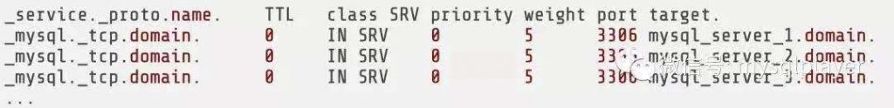
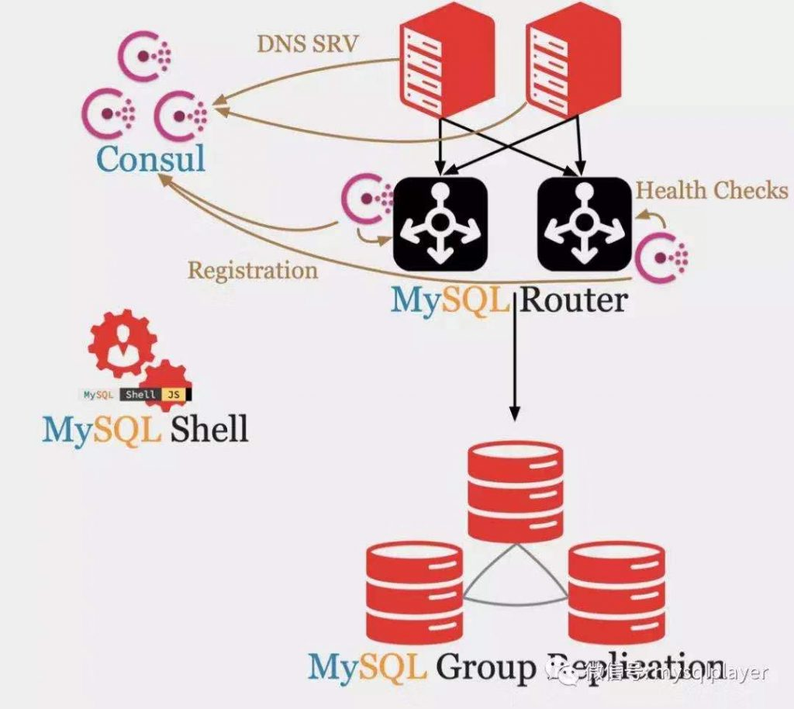
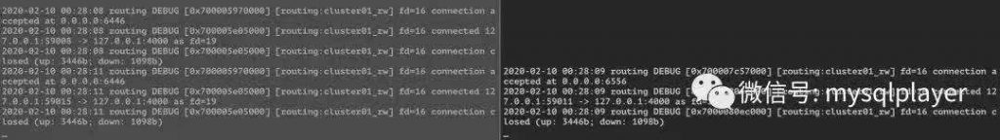

# 新特性解读 | MySQL 8.0.19 支持 DNS SRV

**原文链接**: https://opensource.actionsky.com/%e6%96%b0%e7%89%b9%e6%80%a7%e8%a7%a3%e8%af%bb-mysql-8-0-19-%e6%94%af%e6%8c%81-dns-srv/
**分类**: MySQL 新特性
**发布时间**: 2020-02-12T01:41:55-08:00

---

MySQL Router 是 InnoDB Cluster 架构的访问入口，在架构部署上，官方给出的建议是 router 与应用端绑定部署，避免 router 单点问题。
之前还有客户咨询，能否 router 不与应用端绑定部署，不便于部署，在此之前都需要在 router 前面加 VIP 或者一层负载均衡。
我还在想这事儿就应该由 MySQL Connector 来实现访问链路的 Failover 和 Loadbalance， **现在有了 DNS SRV 的支持，router 不必和应用端绑定部署，也可以省了 VIP 和负载均衡，MySQL InnoDB Cluster 方案更加完善，配合 consul 等服务发现组件，更容易适配 service mesh 架构。**
DNS SRV 是 DNS 记录的一种，用来指定服务地址。SRV 记录不仅有服务目标地址，还有服务的端口，并且可以设置每个服务地址的优先级和权重。
											
MySQL Connector 8.0.19 覆盖多种语言支持 DNS SRV，包括经典协议和 X 协议。遵循 RFC 2782 实现，支持 Priority 和 Weight 客户端必须连接优先级值最低的可达地址，若优先级相同，权重值越大的访问概率越高。- Connector/NET
- Connector/ODBC
- Connector/J
- Connector/Node.js
- Connector/Python
- Connector/C++
**我们来演示下应用是如何使用 DNS SRV 的，这里使用 consul 做服务发现。**
											
1. consul agent 与 MySQL Router 部署在相同节点，检查服务活性，并向 consul server 注册服务信息。2. 应用端的 Connector 配置了服务地址，访问 DB 时先向 consul server 发起 DNS SRV 服务请求。3. consul server 回复应用端 MySQL Router 的服务地址和端口，应用端再去访问 MySQL Router。
**我在本机做了测试。**
1. 首先使用 mysql shell 创建一组 InnoDB Cluster 集群- `for i in `seq 4000 4002`; do`
- `    echo "Deploy mysql  sandbox $i"`
- `    mysqlsh -- dba deploy-sandbox-instance $i --password=root`
- `done`
- 
- `echo "Create innodb cluster..."`
- `mysqlsh root@localhost:4000 -- dba create-cluster cluster01`
- `mysqlsh root@localhost:4000 -- cluster add-instance --recoveryMethod=clone --password=root root@localhost:4001`
- `mysqlsh root@localhost:4000 -- cluster add-instance --recoveryMethod=clone --password=root root@localhost:4002`
2. 部署两个 mysql router 作为访问代理- `for i in 6446 6556; do`
- `    echo "Bootstrap router $i"`
- `    mysqlrouter --bootstrap root@localhost:4000 --conf-use-gr-notifications -d router_$i --conf-base-port $i --name router_$i`
- `    sed -i 's/level = INFO/level = DEBUG/g router_$i/mysqlrouter.conf`
- `    sh router_$i/stop.sh`
- `    sh router_$i/start.sh`
- `done`
3. 安装 consul 用作服务注册和 DNS 解析，在测试环境我们使用开发模式，只部署一个 consul 节点，若用在生产环境需要部署多个 agent 和 server- `echo "Install consul..."`
- `brew install consul`
- `consul agent -dev &`
4. 在 consul 中注册两个 router 代理服务- `echo "Services register..."`
- `consul services register -name router -id router1 -port 6446 -tag rw`
- `consul services register -name router -id router2 -port 6556 -tag rw`
5. 测试下 DNS SRV 是否能正常解析，SRV 记录的应答返回服务端口和服务地址，服务地址有对应的 A 记录，是 127.0.0.1 地址。- `echo "Test dns srv..."`
- `dig router.service.consul SRV -p 8600`
- `;; QUESTION SECTION:`
- `;router.service.consul.        IN    SRV`
- 
- `;; ANSWER SECTION:`
- `router.service.consul.    0    IN    SRV    1 1 6556 MBP.node.dc1.consul.`
- `router.service.consul.    0    IN    SRV    1 1 6446 MBP.node.dc1.consul.`
- 
- `;; ADDITIONAL SECTION:`
- `MBP.node.dc1.consul.    0    IN    A    127.0.0.1`
- `MBP.node.dc1.consul.    0    IN    TXT    "consul-network-segment="`
- `MBP.node.dc1.consul.    0    IN    A    127.0.0.1`
- `MBP.node.dc1.consul.    0    IN    TXT    "consul-network-segment="`
6. consul 的 DNS 服务端口是 8600，需要在本机设置 DNS 转发，将应用对 consul 服务的 DNS 请求转发到 consul 的端口，这里我使用 dnsmasq 做本地转发，对于生产环境可使用 BIND 服务。- `echo "Install dnsmasq..."`
- `brew install dnsmasq`
- `echo 'server=/consul/127.0.0.1#8600' > /usr/local/etc/dnsmasq.d/consul`
- `sudo brew services restart dnsmasq`
7. DNS 转发设置完成后，不指定 DNS 端口，测试转发是否依然正常解析 SRV 记录。- `echo "Test dns forwarding..."`
- `dig router.service.consul SRV`
8. 安装 python connector- `pip install mysql-connector-python`
9. 在设置 connector 连接参数是注意 host 填写在 consul 注册的服务地址，并加上 dns_srv 参数，不需要指定端口。- `import mysql.connector`
- `cnx = mysql.connector.connect(user='root', password='root', database='mysql_innodb_cluster_metadata', host='router.service.consul', dns_srv=True)`
- `cursor = cnx.cursor()`
- `query = ("select instance_id from v2_this_instance")`
- `cursor.execute(query)`
- `for (instance_id) in cursor:`
- `    print("instance id: {}".format(instance_id))`
- `cursor.close()`
- `cnx.close()`
从 MySQL Router 日志中可以看到请求以负载均衡方式发送到两边。
