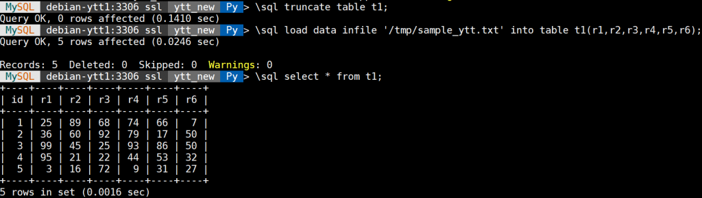
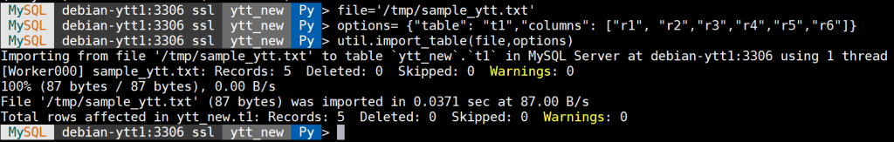
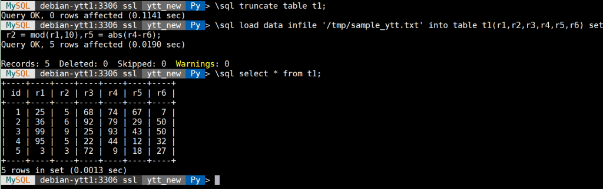
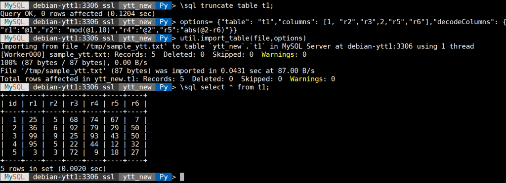
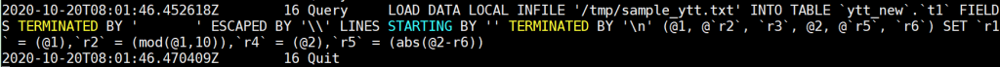

# 新特性解读 | MySQL 8.0.22 任意格式数据导入

**原文链接**: https://opensource.actionsky.com/20201110-mysql/
**分类**: MySQL 新特性
**发布时间**: 2020-11-10T00:49:46-08:00

---

作者：杨涛涛
资深数据库专家，专研 MySQL 十余年。擅长 MySQL、PostgreSQL、MongoDB 等开源数据库相关的备份恢复、SQL 调优、监控运维、高可用架构设计等。目前任职于爱可生，为各大运营商及银行金融企业提供 MySQL 相关技术支持、MySQL 相关课程培训等工作。
本文来源：原创投稿
*爱可生开源社区出品，原创内容未经授权不得随意使用，转载请联系小编并注明来源。
MySQL 8.0.22 在今年的 10 月 19 日发布，给我们带来很多非常实用的特性。特别是对 MySQL Shell 8.0.22 来说，UTIL 组件功能更多，更加丰富，使用更加简单。
比如今天我们来介绍 import_table(importTable) 的延申功能：可定制化行输入。
import_table(importTable) 我们之前有介绍过，是一款并行导入各种格式文本的工具，封装了 MySQL 语句 **load data local infile**。
比如说要导入一个以 TAB 为分隔符的文本数据文件：**/tmp/sample_ytt.txt** 到表：**ytt_new.t1**，可以执行下面语句：
											
上面结果是 **load data infile** 语句的导入结果。如果改用 import_table 方法来做同样的事情，基于 Python 语法，使用方法如下：
											
那接下来看另外一个需求：在导入文本文件时对每行做预处理（例如在导入数据之前更改列 r2 的值为 mod(r1,10)，列 r5 的值为 abs(r4-46) ），这样可以减少导入后再次处理的时间开销。
这个需求用 **load data infile** 语句非常容易实现：**（导入时更改列 r2 和 r5 的数据，类似 UPDATE 语法）**
											
那如果要用 util.import_table(importTable) 来实现上面的需求，在 MySQL 8.0.22 之前是没办法的。
随着 MySQL 8.0.22 的发布，MySQL 对 import_table 方法做了些扩充功能，其中增加了一个选项 “decodeColumns” 可以实现字段的预先输入定制化功能，并且还可以更加丰富。
接下来用 import_table 来实现上面的需求，定制化字段 r2 和 r5：
											
以上 Options 选项，见下图：
											
我来具体解释下上图的含义：蓝色字体 columns 对应的数组分别指定数据文件中的每行字段，也就是默认的 TAB 分隔符所分割的每列值，1 和 2 代表占位符，1 代表数据文件中每行的第一个列，2 代表数据文件中每行的第四列，decodeColumns 字典分别对需要预先输入的字段做处理。比如 r1 字段保留为变量 @1，r2 字段对应 mod(r1,10) 等。
如果还是不太理解变换规则，可以临时打开 general log， 上面 import_table（importTable）对应的 MySQL 日志为：
											
以上日志写的很清楚，内部转换为最基本的 **load data infile** 语法。
那这里我简单解读了下 MySQL 8.0.22 对 MySQL Shell 的一项定制化输入文本文件的新特性，更多的新特性可以继续关注。
相关推荐：
[新特性解读 | MySQL 8.0 增强逻辑备份恢复工具介绍](https://opensource.actionsky.com/20201021-mysql/)
[新特性解读 | MySQL 8.0 语句摘要功能介绍](https://opensource.actionsky.com/20200915-mysql/)
[新特性解读 | GROUPING() 函数用法解析](https://opensource.actionsky.com/20200810-mysql/)