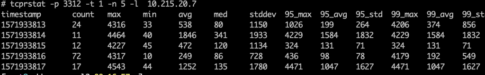
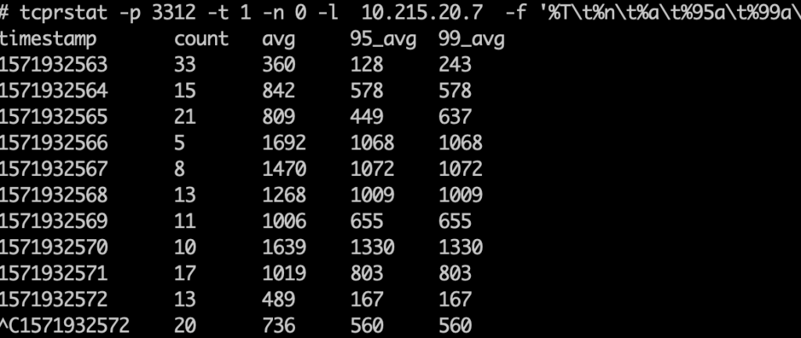
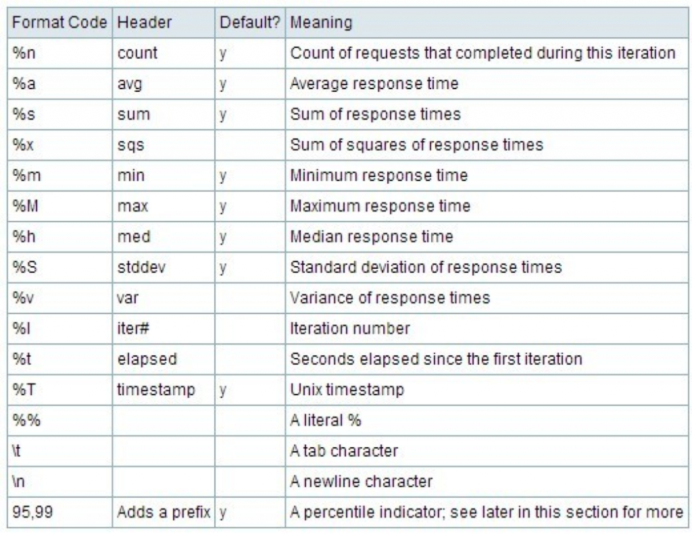
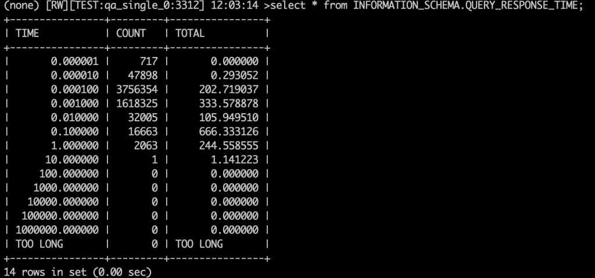
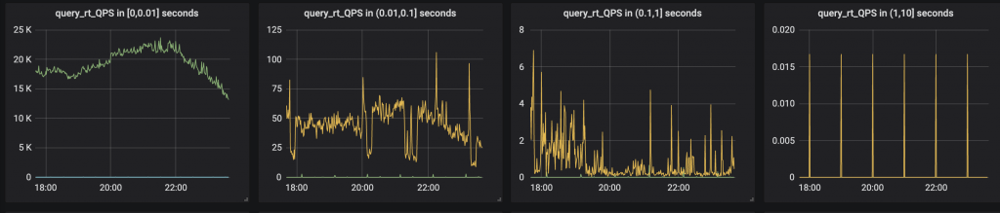
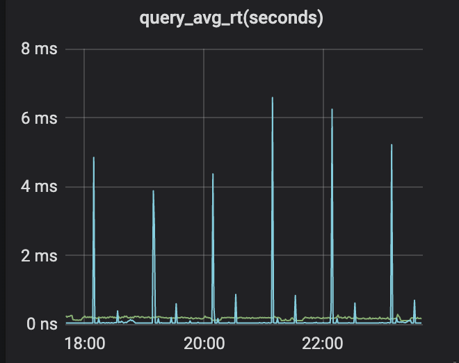

# 社区投稿 | 如何正确理解 RT 并监控 MySQL 的响应时间

**原文链接**: https://opensource.actionsky.com/20191030-mysql/
**分类**: MySQL 新特性
**发布时间**: 2019-10-30T00:34:10-08:00

---

**作者简介**
杨奇龙，网名“北在南方”，7年DBA老兵，目前任职于杭州有赞科技DBA，主要负责数据库架构设计和运维平台开发工作，擅长数据库性能调优、故障诊断。
**一、前言**
响应时间（response time 简称 RT）是从系统接收请求开始到返回响应之间的时间跨度，是一项极其重要的性能指标。它可以从侧面反映系统的整体吞吐量，也是业务请求（比如 sql 请求）的性能好坏的判断依据。
举个例子 A 要从杭州坐飞机到北京机场，经历如下：- `从公司到萧山机场 40min`
- `机场安检，候机，登机 40min`
- `飞机飞行  耗时 100min`
- `飞机落地，打的到望京  耗时40min`
- `RT= 40 + 40 + 100 + 40 =220min`
其中真正的 &#8216;执行&#8217; 时间就飞机飞行的时间（100min+40+40），其他安检、候机、堵车的都是等待时间。> RT = 等待时间 + 执行时间
假如到机场的过程中发生堵车，或者空中管制导致候机时间延长，整体的 RT 也会变长，但是飞机飞行时间是相对一定的。
从技术的角度来看 SQL 的请求路径：> app <&#8212;->（网络建立连接，data 传输）<&#8212;-> proxy <&#8212;->（网络建立连接，data 传输）<&#8212;-> mysql（执行）
因为网络问题丢包，重传等导致数据传输时间增加，进而导致总体的 RT 时间增加 ，还有常见的案例 app 服务器 cpu 飙高导致程序执行的速度变慢，JAVA 程序 GC 等因素也会导致 RT 升高。所以说 SQL 慢，其实 RT 就会高。但是反过来 **RT 高，不一定是 SQL 慢的原因**。如果是开发同学遇到监控尤其是 trace 系统发现某个接口慢了，并不一定是 SQL 慢。
> 重点：**不要把 trace 系统中的监控 rt 直接当做 db 的执行时间**
参考案例：strace 案例
**二、如何监控**
前面说了 RT 的定义以及它所代表意义。接下来我们看看如何监控数据库的 RT ，现有的方式主要有两种。
**2.1 tcprstat**
**tcprstat **是 Percona 基于 libpcap 研发的工具，是通过测量 TCP 的 request 和 response 所需的时间间隔，适用于一问一答式协议类型的处理。通常用来监测 MySQL 响应时间，或者说是请求在服务器端的处理时间，其输出结果包括了响应时间相关的统计值，用来诊断服务器端性能状况。
举个例子：
											
其输出结果包括了时间戳，以及响应时间的最大值、均值、方差等信息，输出信息可以通过 -f 参数进行定制，其中响应时间的单位为微妙。其中对我们比较重要的是：> count：此间隔内处理完成的请求数量。
avg：此间隔内所有完成的请求，响应的平均时间。
`95_avg`：此间隔内，95% 的请求量的平均响应时间，单位微妙，该值较能体现 MySQL Server 的查询平均响应时间。
如果我们只需要输出 count, 平均时间， `95_avg`, `99_avg` 则可以用如下命令。tcprstat -p 3312 -t 1 -n 0 -l ip_address -f &#8216;%T\t%n\t%a\t%95a\t%99a\n&#8217;
											
关于 -f 的参数解释如下，读者朋友可以根据需要来调整输出
											
如果执行 tcprstat 遇到如下问题：
- `# tcprstat -p 3312 -t 1 -n 5`
- `pcap: SIOCGIFFLAGS: bonding_masters: No such device`
可以通过指定本地** ip -l local_ip** 来解决。
**2.2 MySQL 插件**Percona Server 提供一个叫做响应时间区间的功能，将 sql 耗时在指定区间的请求次数和总共的执行时间记录到表里面。其中时间区间跨度由  query_response_time_range_base  控制。常用的区间范围为：(0, 0.000001], (0.000001, 0.000010],(0.000010,0.000100],(0.000100,0.001000],(0.001000, 0.010000], (0.010000,0.100000],(0.100000,1.000000],(1,10] 。
从 MySQL 5.6 开始以插件形式安装：- `INSTALL PLUGIN QUERY_RESPONSE_TIME_AUDIT SONAME 'query_response_time.so';`
- `INSTALL PLUGIN QUERY_RESPONSE_TIME SONAME 'query_response_time.so';`
- `INSTALL PLUGIN QUERY_RESPONSE_TIME_READ SONAME 'query_response_time.so';`
- `INSTALL PLUGIN QUERY_RESPONSE_TIME_WRITE SONAME 'query_response_time.so';`
然后通过 show plugins 命令检查插件是否安装成功。- `> SHOW PLUGINS;`
- `......`
- `| QUERY_RESPONSE_TIME         | ACTIVE   | INFORMATION SCHEMA | query_response_time.so | GPL     |`
- `| QUERY_RESPONSE_TIME_AUDIT   | ACTIVE   | AUDIT              | query_response_time.so | GPL     |`
- `| QUERY_RESPONSE_TIME_READ    | ACTIVE   | INFORMATION SCHEMA | query_response_time.so | GPL     |`
- `| QUERY_RESPONSE_TIME_WRITE   | ACTIVE   | INFORMATION SCHEMA | query_response_time.so | GPL     |`
- `+-----------------------------+----------+--------------------+------------------------+---------`
安装完成之后 在 `INFORMATION_SCHEMA` 生成三张表- `QUERY_RESPONSE_TIME_WRITE 记录所有写请求的响应时间分布`
- `QUERY_RESPONSE_TIME_READ 记录所有读请求的响应时间分布`
- `QUERY_RESPONSE_TIME 可以认为是所有请求的响应时间分布。`
查看 QUERY_RESPONSE_TIME 的内容
											
查询结果中 717 个 sql 请求耗时在 (0, 0.000001] 之间。47898 个 sql 请求的耗时在 (0.000001, 0.000010]，总耗时 0.29 秒，其他以此类推。**需要注意的是 count 和total是累计值，监控的时候需要取后值减前值除以采样的时间间隔。**
**如何开启响应时间统计**在命令行中执行> SET GLOBAL query_response_time_stats = 1 ;
在 my.cnf 中> query_response_time_stats = 1
重置（将数据清零）三张表的统计值> SET GLOBAL query_response_time_flush=&#8217;ON&#8217;;
常用的 sql
- `INFORMATION_SCHEMA [RW][TEST:qa_single_0:3312] 11:50:44`
- `>SELECT c.count, c.time, (SELECT SUM(a.count) FROM INFORMATION_SCHEMA.QUERY_RESPONSE_TIME as a WHERE a.count != 0) as query_count, (SELECT COUNT(*)     FROM INFORMATION_SCHEMA.QUERY_RESPONSE_TIME as b WHERE b.count != 0) as not_zero_region_count, (SELECT COUNT(*)     FROM INFORMATION_SCHEMA.QUERY_RESPONSE_TIME) as region_count FROM INFORMATION_SCHEMA.QUERY_RESPONSE_TIME as c WHERE c.count > 0;`
- `+-------+----------------+-------------+-----------------------+--------------+`
- `| count | time           | query_count | not_zero_region_count | region_count |`
- `+-------+----------------+-------------+-----------------------+--------------+`
- `|     1 |       0.000001 |       71370 |                     7 |           14 |`
- `|    86 |       0.000010 |       71370 |                     7 |           14 |`
- `| 47375 |       0.000100 |       71370 |                     7 |           14 |`
- `| 23404 |       0.001000 |       71370 |                     7 |           14 |`
- `|   423 |       0.010000 |       71370 |                     7 |           14 |`
- `|    79 |       0.100000 |       71370 |                     7 |           14 |`
- `|     2 |       1.000000 |       71370 |                     7 |           14 |`
- `+-------+----------------+-------------+-----------------------+--------------+`
- `7 rows in set (0.00 sec)`
通过监控脚本获取响应时间的数据在 grafna 展示的结果如下：
											
											
其他更详细的介绍可以去查阅 Percona 的官方文档。
**三、小结**本文总结介绍 RT 在技术体系中的含义，以及介绍两种监控 MySQL 响应时间的方法。如果有其他更好的方式方法，欢迎读者朋友一起讨论。
**参考文章**
> 1. https://www.percona.com/doc/percona-server/5.7/diagnostics/responsetimedistribution.html2. https://jin-yang.github.io/post/linux-tcprstat.html3. https://www.percona.com/doc/percona-monitoring-and-management/dashboard.mysql-query-response-time.html4. https://www.aikaiyuan.com/5469.html
**社区近期动态**
**No.1**
**Mycat 问题免费诊断**
诊断范围支持：
Mycat 的故障诊断、源码分析、性能优化
服务支持渠道：
技术交流群，进群后可提问
QQ群（669663113）
社区通道，邮件&电话
osc@actionsky.com
现场拜访，线下实地，1天免费拜访
关注“爱可生开源社区”公众号，回复关键字“Mycat”，获取活动详情。
**No.2**
**社区技术内容征稿**
征稿内容：
格式：.md/.doc/.txt
主题：MySQL、分布式中间件DBLE、数据传输组件DTLE相关技术内容
要求：原创且未发布过
奖励：作者署名；200元京东E卡+社区周边
投稿方式：
邮箱：osc@actionsky.com
格式：[投稿]姓名+文章标题
以附件形式发送，正文需注明姓名、手机号、微信号，以便小编及时联系