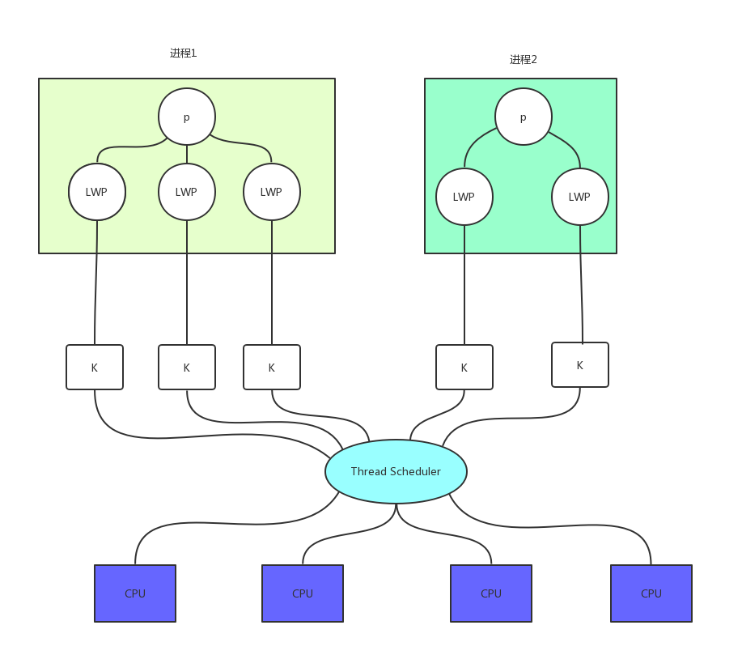
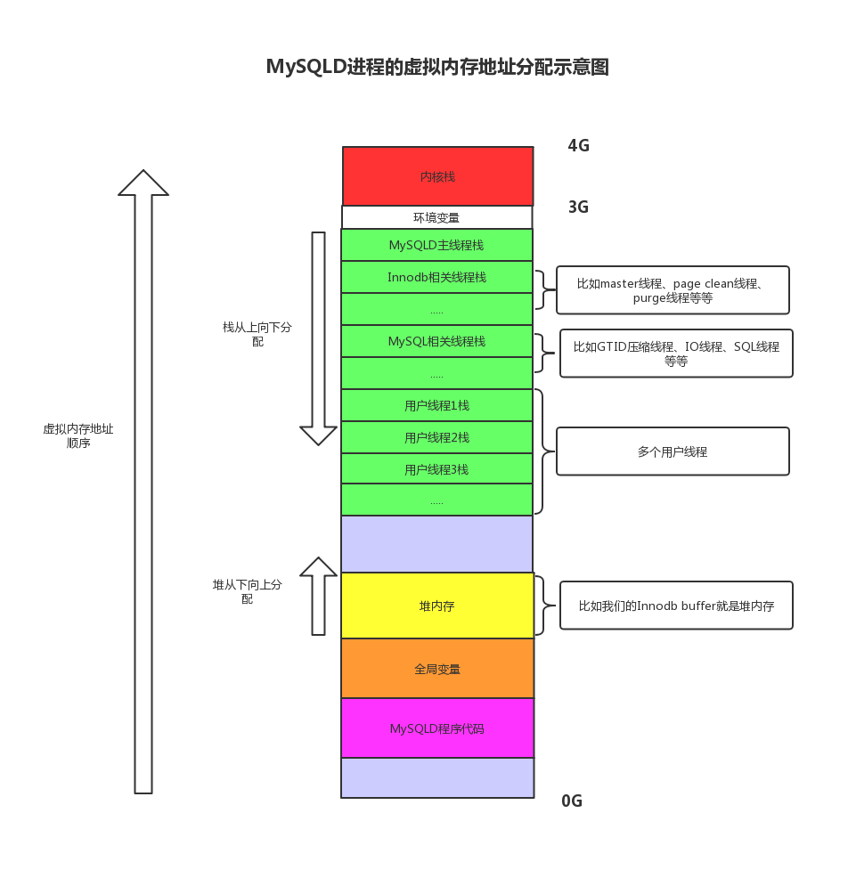
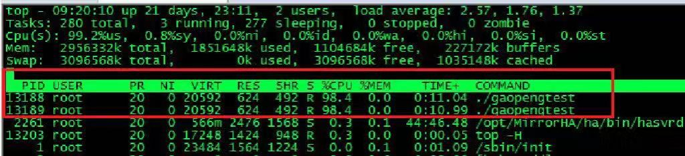
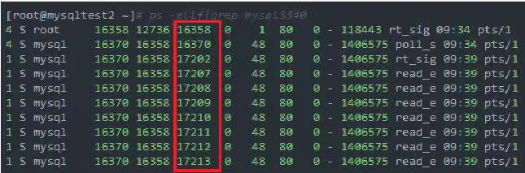

# 社区投稿 | 线程简介和 MySQL 调试环境搭建

**原文链接**: https://opensource.actionsky.com/20190919-mysql/
**分类**: MySQL 新特性
**发布时间**: 2019-09-18T22:55:53-08:00

---

**作者：****高鹏**
文章末尾有他著作的《深入理解MySQL主从原理 32讲》，深入透彻理解MySQL主从，GTID相关技术知识。本文节选自《深入理解MySQL主从原理》第29节注意：本文分为正文和附件两部分，都是图片格式，如果正文有图片不清晰可以将附件的图片保存到本地查看。
**背景**
我想简单说一下我的 MySQL 调试环境的搭建，但是在此之前不得不简单说一下，什么是线程。因为如果不解释一下什么是线程，简单的调试可能都会有阻碍，同时了解线程对我们普通DBA诊断性能问题也有极大的帮助。但是详细解释线程已经超出了我的能力范围也超出了本系列讨论的范围。具体我推荐给大家两本书：
- 《POSIX 多线程程序设计》
- 《Linux UNIX 系统编程手册》 第29到32章
第一本书很老了，但是我觉得还可以，如果有兴趣可以参考一下。
**一、线程简介**
我们知道 mysqld 是一个单进程多线程的用户程序，因此我们有必要了解一下什么线程。实际上 MySQL 中的线程都是 POSIX 线程，比如我们的会话线程、DUMP 线程、IO 线程以及其他一些 InnoDB 线程都是 POSIX 线程。
进程实际上就是运行中的程序，一个进程中可以包含多个线程，也可以只包含一个线程。在 Linux 中线程也叫轻量级进程（light-weight process）简称为 LWP，进程的第一个线程通常称为主控线程。进程是内存分配的最小单位，线程是 CPU 调度的最小单位，也就是说如果 CPU 有足够多核，那么多个线程可以达到并行处理的效果，内核直接调度线程。下面是我学习 Linux 线程的时候看到的一张我认为比较好理解的图，我重新画了一下放在下面供大家参考（图29-1，高清原图包含在文末原图中）：
											
一个进程内部的所有线程都拥有相同的代码程序、堆、全局变量、共享库等，但是每个线程拥有自己独立栈空间和寄存器，他们共享进程的虚拟内存地址空间。下面我们假定是32位操作系统下的 mysqld 进程，它的进程虚拟内存地址示意图如下，实际上这个图也是参考《Linux UNIX 系统编程手册》画的（图29-2，高清原图包含在文末原图中）：
											
我们发现线程的堆内存和全局变量是共享的，因此线程之间数据共享很轻松，但是要控制好这些共享内存就需要引入我们的线程同步技术，比如我们常说的 Mutex。
如果想了解线程到底共享了哪些资源，线程和进程到底各有什么优势和劣势，可执行参考上面我给出的书籍。
**二、PID、LWP ID、Thread TID**
如果要进行调试就需要了解这三种 ID，其中 PID 和 LWP ID 是比较重要，因为不管是调试和运维都会遇到它们，而 Thread TID 不做多线程开发一般很少用到。
下面是我对它们的总结：
- PID：内核分配，用于识别各个进程的 ID。这个应该是大家最熟悉的。
- LWP ID：内核分配，用于识别各个线程的 ID，它就像是线程是‘PID’一样。同一个进程下的所有线程有相同的 PID，但是 LWP ID 却不一样，主控线程的 LWP ID 就是进程 PID。
- Thread TID：进程内部用于识别各个线程的内部 ID，这个 ID 用得不多。
下面我写了一个简单的 C 测试程序仅仅用于观察这些 ID，它是通过主控线程再创建一个线程，也就是说这个进程包含了两个线程。它们分别打印自己的 PID、LWP ID、Thread TID，然后做一个循环自加操作引起高 CPU 消耗现象便于观察。然后我们使用 Linux 的 top -H 和 ps -eLlf 命令分别进行观察。
1. 程序输出
下面是程序的输出：
- `# ./gaopengtest`
- `main thread: pid 13188 tid 2010470144 lwp 13188`
- `new thread:  pid 13188 tid 2010461952 lwp 13189`
我们可以看到两个线程的 PID 都是 13188，但是主控线程的 LWP ID 是 13188，新建立的一个线程 LWP ID 是 13189。然后就是 Thread TID 了，不过多解释。
2. top -H 观察如下：我们可以看到这两个线程都是高耗 CPU 的线程，CPU 已经处于饱和状态。这里我们看到 top -H 命令的输出中‘PID’就是 LWP ID。这里我们还能看它们的内存信息完全一致，内存信息实际上是整个进程的内存信息，因为进程是内存分配的最小单位嘛。
											
注意如果这个时候查看这个进程占用的 %cpu 就超过了 100%，接近 200%，如下：
											
3. ps -eLlf 观察如下：
我们可以看到这里包含了 PID 和 LWP ID，不过多解释了，大家可以自己去试试。
											
**三、如何将 MySQL 的线程和 LWP ID 进行对应**在 5.7 中我们已经可以通过 MySQL 语句和 LWP ID 进行对应了，这让性能诊断变得更加便捷。比如我上面的列子如果两个高耗 CPU 的线程是 MySQL 的线程那么我们就拿到了线程的 LWP ID，然后可以通过语句找到这两个线程到底是 MySQL 的什么线程。语句如下：- `mysql> select a.thd_id,b.THREAD_OS_ID,a.user`
- `,b.TYPE from  sys.processlist`
- `a,performance_schema.threads  b where b.thread_id=a.thd_id;`
- `+--------+--------------+---------------------------+---------+------------`
- `| thd_id | THREAD_OS_ID | user                      | conn_id | TYPE`
- `+--------+--------------+---------------------------+---------+------------`
- `|      1 |        16370 | sql/main                  |    NULL | BACKGROUND`
- `|      2 |        17202 | sql/thread_timer_notifier |    NULL | BACKGROUND`
- `|      3 |        17207 | innodb/io_ibuf_thread     |    NULL | BACKGROUND`
- `|      4 |        17208 | innodb/io_log_thread      |    NULL | BACKGROUND`
- `|      5 |        17209 | innodb/io_read_thread     |    NULL | BACKGROUND`
- `|      6 |        17210 | innodb/io_read_thread     |    NULL | BACKGROUND`
- `|      7 |        17211 | innodb/io_read_thread     |    NULL | BACKGROUND`
- `|      8 |        17212 | innodb/io_read_thread     |    NULL | BACKGROUND`
- `|      9 |        17213 | innodb/io_read_thread     |    NULL | BACKGROUND`
- `|     10 |        17214 | innodb/io_read_thread     |    NULL | BACKGROUND`
- `|     11 |        17215 | innodb/io_read_thread     |    NULL | BACKGROUND`
- `|     12 |        17216 | innodb/io_read_thread     |    NULL | BACKGROUND`
- `|     13 |        17217 | innodb/io_write_thread    |    NULL | BACKGROUND`
- `|     14 |        17218 | innodb/io_write_thread    |    NULL | BACKGROUND`
- `|     15 |        17219 | innodb/io_write_thread    |    NULL | BACKGROUND`
- `|     16 |        17220 | innodb/io_write_thread    |    NULL | BACKGROUND`
- `|     17 |        17221 | innodb/io_write_thread    |    NULL | BACKGROUND`
- `......`
这里的 THREADOSID 就是线程的 LWP ID。然后我们使用刚才的 ps -eLlf 命令再看一下，如下：
											
我们可以发现他们是可以对应上的，这个最好自己实际试试就知道了。
**四、调试环境搭建**调试环境的搭建我认为不管使用什么方法只要能够起到调试的作用就可以了。这里介绍一下我的方法。我是在 Linux 下面直接使用 gdb 调试的，我觉得这个方法搭建非常简单并且很奏效，基本上只要会源码安装就能完成调试环境的搭建。下面来看看步骤：
**1. 第一步下载 MySQL 源码包，解压。**
我特意重新下载了官方版的 5.7.26 源码。
**2. 使用源码安装的方法安装 MySQL，注意需要开启 debug 选项**
下面是我使用的选项：- `|cmake -DCMAKE_INSTALL_PREFIX=/root/sf/mysql3312/ -DMYSQL_DATADIR=/root/sf/mysql3312/data/ -DSYSCONFDIR=/root/sf/mysql3312/ -DWITH_INNOBASE_STORAGE_ENGINE=1 -DWITH_ARCHIVE_STORAGE_ENGINE=1 -DWITH_BLACKHOLE_STORAGE_ENGINE=1 -DWITH_FEDERATED_STORAGE_ENGINE=1 -DWITH_PARTITION_STORAGE_ENGINE=1  -DMYSQL_UNIX_ADDR=/root/sf/mysql3312/mysql3312.sock -DMYSQL_TCP_PORT=3306 -DENABLED_LOCAL_INFILE=1 -DEXTRA_CHARSETS=all -DDEFAULT_CHARSET=utf8  -DDEFAULT_COLLATION=utf8_general_ci  -DMYSQL_USER=mysql  -DWITH_BINLOG_PREALLOC=ON   -DWITH_BOOST=/root/sf/mysql-5.7.26/boost/boost_1_59_0 -DWITH_DEBUG=1|`
- `|:-|`
注意最后的 -DWITH_DEBUG=1 必须开启。
**3. make && make install**
编译和安装。
**4. 准备参数文件和初始化 MySQL 数据库，并且确保能成功启动**
这一步自己处理，注意权限。我的环境启动成功了如下：- `[root@gp1 support-files]# ./mysql.server start`
- `Starting MySQL....... SUCCESS!`
- `[root@gp1 support-files]# ./mysql.server stop`
- `Shutting down MySQL.. SUCCESS!`
**5. 准备 gdb 命令文件**
如下是我准备的命令文件：- `[root@gp1 ~]# more debug.file`
- `break main`
- `run --defaults-file=/root/sf/mysql3312/my.cnf --user=mysql --gdb`
第一行是在 main 函数处打一个断点。第二行就是 gdb 调用 mysqld 的时候，mysqld 加什么参数了，注意 run 不要写掉了。
**6. 使用 gdb 启动 MySQL**
使用如下命令启动调试环境：- `gdb -x /root/debug.file /root/sf/mysql3312/bin/mysqld`
下面就是我启动调试环境成功的记录：- `# gdb -x /root/debug.file /root/sf/mysql3312/bin/mysqld`
- `GNU gdb (GDB) Red Hat Enterprise Linux (7.2-92.el6)`
- `Copyright (C) 2010 Free Software Foundation, Inc.`
- `License GPLv3+: GNU GPL version 3 or later <http://gnu.org/licenses/gpl.html>`
- `This is free software: you are free to change and redistribute it.`
- `There is NO WARRANTY, to the extent permitted by law.  Type "show copying"`
- `and "show warranty" for details.`
- `This GDB was configured as "x86_64-redhat-linux-gnu".`
- `For bug reporting instructions, please see:`
- `<http://www.gnu.org/software/gdb/bugs/>...`
- `Reading symbols from /root/sf/mysql3312/bin/mysqld...done.`
- `Breakpoint 1 at 0xec7c53: file /root/sf/mysql-5.7.26/sql/main.cc, line 25.`
- `[Thread debugging using libthread_db enabled]`
- 
- `Breakpoint 1, main (argc=5, argv=0x7fffffffe3b8) at /root/sf/mysql-5.7.26/sql/main.cc:25`
- `25        return mysqld_main(argc, argv);`
- `Missing separate debuginfos, use: debuginfo-install glibc-2.12-1.212.el6.x86_64 libaio-0.3.107-10.el6.x86_64 libgcc-4.4.7-18.el6.x86_64 libstdc++-4.4.7-18.el6.x86_64 nss-softokn-freebl-3.14.3-23.3.el6_8.x86_64`
- `(gdb) c`
- `Continuing.`
- `[New Thread 0x7fffee883700 (LWP 29375)]`
- `[New Thread 0x7fff9a9f3700 (LWP 29376)]`
- `[New Thread 0x7fff99ff2700 (LWP 29377)]`
- `[New Thread 0x7fff995f1700 (LWP 29378)]`
- `[New Thread 0x7fff98bf0700 (LWP 29379)]`
- `[New Thread 0x7fff981ef700 (LWP 29380)]`
- `[New Thread 0x7fff977ee700 (LWP 29381)]`
- `[New Thread 0x7fff96ded700 (LWP 29382)]`
- `[New Thread 0x7fff963ec700 (LWP 29383)]`
- `.....`
注意到了这里的 LWP ID 了吗，前面我们已经讨论过了。这个时候 MySQL 客户端程序已经可以连接 mysqld 了如下：- `# /root/sf/mysql3312/bin/mysql -S'/root/sf/mysql3312/mysql3312.sock'`
- `Welcome to the MySQL monitor.  Commands end with ; or \g.`
- `Your MySQL connection id is 2`
- `Server version: 5.7.26-debug-log Source distribution`
- 
- `Copyright (c) 2000, 2019, Oracle and/or its affiliates. All rights reserved.`
- 
- `Oracle is a registered trademark of Oracle Corporation and/or its`
- `affiliates. Other names may be trademarks of their respective`
- `owners.`
- 
- `Type 'help;' or '\h' for help. Type '\c' to clear the current input statement.`
- 
- `mysql> select version() ;`
- `+------------------+`
- `| version()        |`
- `+------------------+`
- `| 5.7.26-debug-log |`
- `+------------------+`
- `1 row in set (0.00 sec)`
好了，到这里基本的调试环境就搭建起来了，我们可以发现很简单。之后我们就可以进行断点调试了。
我常用的 gdb 命令包含：- info threads：查看全部线程
- thread n：指定某个线程
- bt：查看某个线程栈帧
- b：设置断点
- c：继续执行
- s：执行一行代码，如果代码函数调用，则进入函数
- n：执行一行代码，函数调用不进入
- p：打印某个变量值
- list：打印代码的文本信息
当然 gdb 还有很多命令，可自行参考其他资料。
**五、使用调试环境证明问题的一个列子**
这里我们就用一个例子来看看调试环境的使用方法。我们前面第 15 节[（MySQL 层事务提交流程简析）](https://opensource.actionsky.com/20190827-mysql/)说过 binlog cache 是在 order commit 的 flush 阶段才写入到 binary log 的，调用的是函数 binlog_cache_data::flush。好了我们可以将断点打到这个函数如下：
- `(gdb) b binlog_cache_data::flush`
- `Breakpoint 2 at 0x1846333: file /root/sf/mysql-5.7.26/sql/binlog.cc, line 1674.`
然后我们在 MySQL 客户端执行一个事务如下，并且提交：- `mysql> begin;`
- `Query OK, 0 rows affected (0.00 sec)`
- `mysql> insert into gpdebug values(1);`
- `Query OK, 1 row affected (0.03 sec)`
- `mysql> commit;`
commit 的时候已经卡主了，断点触发如下：- `Breakpoint 2, binlog_cache_data::flush (this=0x7fff3c00df20...)`
- `    at /root/sf/mysql-5.7.26/sql/binlog.cc:1674`
- `1674      DBUG_ENTER("binlog_cache_data::flush");`
我们使用 bt 命令查看栈帧发现如下：- `#0  binlog_cache_data::flush`
- `at /root/sf/mysql-5.7.26/sql/binlog.cc:1674`
- `#1  0x0000000001861b41 in binlog_cache_mngr::flush`
- `at /root/sf/mysql-5.7.26/sql/binlog.cc:967`
- `#2  0x00000000018574ce in MYSQL_BIN_LOG::flush_thread_caches`
- `at /root/sf/mysql-5.7.26/sql/binlog.cc:8894`
- `#3  0x0000000001857712 in MYSQL_BIN_LOG::process_flush_stage_queue`
- `at /root/sf/mysql-5.7.26/sql/binlog.cc:8957`
- `#4  0x0000000001858d19 in MYSQL_BIN_LOG::ordered_commit`
- `at /root/sf/mysql-5.7.26/sql/binlog.cc:9595`
- `#5  0x00000000018573b4 in MYSQL_BIN_LOG::commit`
- `at /root/sf/mysql-5.7.26/sql/binlog.cc:8851`
- `#6  0x0000000000f58de9 in ha_commit_trans`
- `at /root/sf/mysql-5.7.26/sql/handler.cc:1799`
- `#7  0x000000000169e02b in trans_commit`
- `at /root/sf/mysql-5.7.26/sql/transaction.cc:239`
- `......`
好了看到这个栈帧，就能证明我们的说法了，如果想深入学习代码就可以从这个栈帧出发进行学习。但是值得注意的是，这是建立在知道函数接口功能的前提下的，如果我们不知道写入 binary log 会调用 binlog_cache_data::flush 函数那么调试也就不好进行了，我就经常遇到这样的困境。因此整个系列我给出了很多这样的接口，供有兴趣的朋友调试和测试。
最后推荐高鹏的专栏《深入理解MySQL主从原理 32讲》，想要透彻了解学习MySQL 主从原理的朋友不容错过。
											
**社区近期动态**
**No.1**
**10.26 DBLE 用户见面会 北京站**
											
爱可生开源社区将在 2019 年 10 月 26 日迎来在北京的首场 DBLE 用户见面会，以线下**互动分享**的会议形式跟大家见面。
时间：10月26日 9:00 &#8211; 12:00 AM
地点：HomeCafe 上地店（北京市海淀区上地二街一号龙泉湖酒店对面）
重要提醒：
1. 同日下午还有 dbaplus 社群举办的沙龙：聚焦数据中台、数据架构与优化。
2. 爱可生开源社区会在每年10.24日开源一款高质量产品。本次在 dbaplus 沙龙会议上，爱可生的资深研发工程师闫阿龙，将为大家带来《金融分布式事务实践及txle概述》，并在现场开源。
**No.2**
**Mycat 问题免费诊断**
诊断范围支持：
Mycat 的故障诊断、源码分析、性能优化
服务支持渠道：
- 技术交流群，进群后可提问
QQ群（669663113）
- 社区通道，邮件&电话
osc@actionsky.com
- 现场拜访，线下实地，1天免费拜访
关注“爱可生开源社区”公众号，回复关键字“Mycat”，获取活动详情。
**No.3**
**社区技术内容征稿**
征稿内容：
- 格式：.md/.doc/.txt
- 主题：MySQL、分布式中间件DBLE、数据传输组件DTLE相关技术内容
- 要求：原创且未发布过
- 奖励：作者署名；200元京东E卡+社区周边
投稿方式：
- 邮箱：osc@actionsky.com
- 格式：[投稿]姓名+文章标题
- 以附件形式发送，正文需注明姓名、手机号、微信号，以便小编及时联系