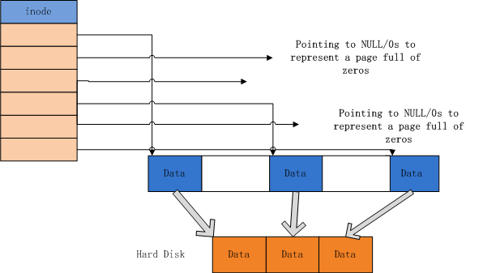
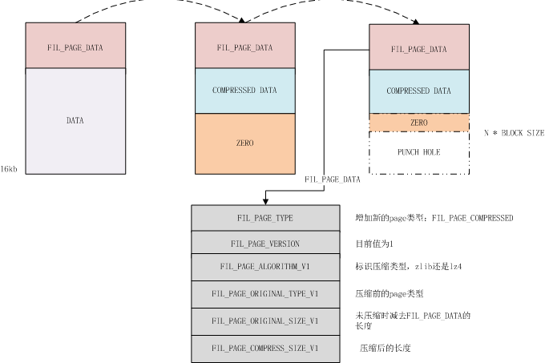

# MySQL · 社区动态 · InnoDB Page Compression

**Date:** 2015/08
**Source:** http://mysql.taobao.org/monthly/2015/08/01/
**Images:** 3 images downloaded

---

数据库内核月报

 [
 # 数据库内核月报 － 2015 / 08
 ](/monthly/2015/08)

 * 当期文章

 MySQL · 社区动态 · InnoDB Page Compression
* PgSQL · 答疑解惑 · RDS中的PostgreSQL备库延迟原因分析
* MySQL · 社区动态 · MySQL5.6.26 Release Note解读
* PgSQL · 捉虫动态 · 执行大SQL语句提示无效的内存申请大小
* MySQL · 社区动态 · MariaDB InnoDB表空间碎片整理
* PgSQL · 答疑解惑 · 归档进程cp命令的core文件追查
* MySQL · 答疑解惑 · open file limits
* MySQL · TokuDB · 疯狂的 filenum++
* MySQL · 功能分析 · 5.6 并行复制实现分析
* MySQL · 功能分析 · MySQL表定义缓存

 ## MySQL · 社区动态 · InnoDB Page Compression 
 Author: 印风 

 ## 背景：Punch hole和Sparse file

Punch hole是一个需要操作系统和文件系统支持的特性，顾名思义就是在文件中打洞。这个特性的目的是为了减少数据文件的磁盘开销。比如一个大文件中有一部分数据我们是不需要的，就可以通过punch hole特性将其删除，相当于在文件中打了个洞，这个洞是不占用磁盘的。

Punch hole特性通过fallocate调用来实现，在其第二个参数指定flag FALLOC_FL_PUNCH_HOLE时，第三个参数指定需要punch hole的偏移位置，第四个参数指定punch hole的长度。当成功打洞后，以后访问到这个范围的数据都返回0。

fallocate的描述见[文档](http://www.man7.org/linux/man-pages/man2/fallocate.2.html)。根据文档的描述，`FALLOC_FL_PUNCH_HOLE` 需要和另外一个flag `FALLOC_FL_KEEP_SIZE` 一起使用，也就是说，即使在文件中打洞，通过stat获得的文件大小也不会发生变化，你需要通过du命令来获得准确的磁盘文件大小。

目前不是所有的内核都支持该特性，在阿里环境需要使用rh6 2.6.32-358及之后的版本，另外由于对应的flag 宏没有定义，我们需要显式的定义如下两个宏：(感谢 @伯瑜 大神的指点)

`#define FALLOC_FL_PUNCH_HOLE 0x02 /* de-allocates range */
#define FALLOC_FL_KEEP_SIZE 0x01 /* default is extend size */
`

通常情况下，偏移量和长度要求是文件系统的block size大小，否则fallocate调用可能失败并返回EINVAL。

除了上面这两个flag外，还有另外一个比较有意思的flag：`FALLOC_FL_COLLAPSE_RANGE`，名字和其功能比较形象，相当于在挖洞后，这个洞并没有留下，而是把后面的数据往前面移，因此被打洞的部分，在被随后访问到时，读取到的数据就不是0，而是后面的数据。

关于这个flag可以参考[这篇文章](http://lwn.net/Articles/589260/)了解其背景。

文件的管理使用sparse file（稀疏文件），一般支持punch hole特性的，都会支持sparse file，对于sparse file，可以参阅这篇[博客](http://m.blog.csdn.net/blog/changyanmanman/8760033)，讲的非常详细。简单的重整了下博客中的配图，如下所示：

然而需要注意一种情况，由于文件中的空洞不占磁盘空间，当磁盘接近满时，如果向空洞写入数据，就可能触发写入失败的问题，导致不可预料的问题，因此空余的磁盘空间阀值需要多预留点。

## InnoDB 新压缩实现

MySQL 5.7.8版本实现了一种新的压缩方式([WL#7696](http://dev.mysql.com/worklog/task/?id=7696))，也就是所谓的Innodb Transaparent PageIO Compression，其原理很简单，就是利用punch hole + 数据压缩来实现的。其在内存中表现的是一个正常的page，只在读写到磁盘时，才进行文件压缩、解压处理。处理逻辑如下图所示：

首先，InnoDB增加了新的Page类型，这意味着如果使用该特性，则不能原地降级到老版本，需要对格式进行转换才能降级。

目前上游支持两种压缩算法：zllib及lz4，但我们也可以很方便的进行扩展新的算法。

被压缩的数据包含除FIL_PAGE_DATA之外的所有数据（包括tailer），但需要以block size对齐（线上环境的block size通常为4KB），这意味着即使我们把数据从16KB压缩到9KB，也需要存储12KB的数据。因此block size设小点，这样的场景将受益，可以减少空间浪费。

## 表定义

首先需要操作系统支持该特性，在阿里的环境里，需要装上新版内核（如上述）让系统支持punch hole。

可以通过CREATE TABLE 或ALTER TABLE 来定义压缩表：

`mysql> create table sb1 (a int, b blob) compression='zlib';
Query OK, 0 rows affected (0.05 sec)
`

也可以选择compression=’lz4’来指定lz4压缩算法；注意对compression属性的ALTER是立刻生效的，因此在做完ALTER COMPRESSION属性操作后，需要做一次表的rebuild，例如optimize table操作，才能对已有的数据做punch hole。

compression属性存储在frm文件中，以两个字节存储字符串长度，随后存储compression属性定义字符串，这也是一个操作系统降级的风险点。

具体的使用参阅[官方文档](http://dev.mysql.com/doc/refman/5.7/en/innodb-page-compression.html)。

## 相关代码逻辑

**压缩数据**

压缩数据发生在对磁盘进行IO WRITE之前：

1. 先在内存中压缩数据，并对齐Block size，确定做punch hole的范围，同时将即将写入文件的buf地址指向新分配的压缩页地址(这里存在优化的空间，需要避免重复分配内存块)。参考函数：
 * Native AIO: AIO::reserve_slot –> os_file_compress_page
* 同步写：os_file_pwrite –> os_file_io –> os_file_compress_page
2. 将压缩处理过的page写入文件;
3. 随后调用函数os_file_io_complete中，执行punch hole操作（os_file_punch_hole）。

**解压数据**

在从磁盘读取数据到磁盘后，首先要进行解压：参考函数：os_file_io_complete –> os_file_decompress_page

**特殊处理**

1. 通过dblwr恢复的corruption的page写入时禁止压缩模式，因为此时innodb处于恢复模式，还没拿到server层存储的compression属性；
2. row_merge_read 和row_merge_write，一般是用于排序的临时文件，无需做压缩/解压；
3. truncate操作的文件日志禁止压缩模式。

代码整体的逻辑比较清晰，但改动点还比较多，后续我们将该特性Port到RDS版本，结合新内核来发挥数据空间节省的目的。

最后，Facebook的大神Domas写了一篇[博客](http://dom.as/2015/04/09/how-innodb-lost-its-advantage/)，认为InnoDB推出这样的压缩特性，使其正在丧失自身的优势，非常值得一读。简单的摘要下：

* 无法完美压缩：例如9KB的数据可能需要12kb来存储，取决于block size；
* 无法压缩Buffer pool, 这是和传统innodb压缩相比，以前的压缩方式可以在内存中只存放压缩页拷贝 （然而也有可能同时存在压缩和解压页），因此用户可能需要去购买iops更高的设备，而oracle正好也卖这些….
* punch hole 可能产生的文件碎片化，底层的文件管理更加复杂；
* 对innodb文件做punch hole可能带来的后果是，使得每个文件的page变成一个独立的segment，文件系统需要单独的journal和metadata来管理。另外也有可能有性能问题：可能比non-sparse的写操作昂贵五倍 （这依赖于具体的内核）；
* 删除一个拥有几百万个段管理对象的数据文件带来的开销会非常昂贵。

 阅读： - 

本作品采用[知识共享署名-非商业性使用-相同方式共享 3.0 未本地化版本许可协议](http://creativecommons.org/licenses/by-nc-sa/3.0/)进行许可。

 