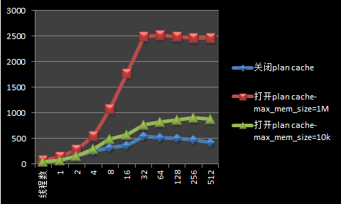
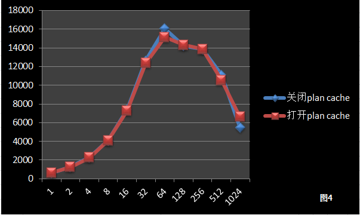

# MySQL · 特性分析 · 执行计划缓存设计与实现

**Date:** 2016/09
**Source:** http://mysql.taobao.org/monthly/2016/09/04/
**Images:** 4 images downloaded

---

数据库内核月报

 [
 # 数据库内核月报 － 2016 / 09
 ](/monthly/2016/09)

 * 当期文章

 MySQL · 社区贡献 · AliSQL那些事儿
* PetaData · 架构体系 · PetaData第二代低成本存储体系
* MySQL · 社区动态 · MariaDB 10.2 前瞻
* MySQL · 特性分析 · 执行计划缓存设计与实现
* PgSQL · 最佳实践 · pg_rman源码浅析与使用
* MySQL · 捉虫状态 · bug分析两例
* PgSQL · 源码分析 · PG优化器浅析
* MongoDB · 特性分析· Sharding原理与应用
* PgSQL · 源码分析 · PG中的无锁算法和原子操作应用一则
* SQLServer · 最佳实践 · TEMPDB的设计

 ## MySQL · 特性分析 · 执行计划缓存设计与实现 
 Author: 令猴 

 ## Plan Cache背景知识

一条SQL语句输入到MySQL服务器后，一般要经历：词法语法解析(parse)，优化（optimize），生成执行计划(plan)和执行(execute)的过程。词法语法分析，优化以及生成执行计划，这三个阶段的主要输出是SQL语句的执行计划(plan)，当SQL语句存在多种执行计划的时候，优化器会从这许多的执行计划中挑选出一个它认为最优的（通常是占用系统资源最少的，包括CPU以及IO等）作为最终的执行计划供执行器执行。生成执行计划的过程会消耗较多的时间，特别是存在许多可选的执行计划时。如果在一条SQL语句执行的过程中将该语句对应的最终执行计划进行缓存，当相似的语句再次被输入服务器时，就可以直接使用已缓存的执行计划，从而跳过SQL语句生成执行计划的整个过程，进而可以提高语句的执行速度。

ApsaraDB MySQL 执行计划缓存目前只支持SELECT操作的语句（以后会支持其他DML操作）。在相似的SQL语句大量重复出现（这里“相似”的SQL语句指的是SQL语句中除了常量有所不同外，其他都必须相同）时，使用执行计划缓存可以极大的节省语句的执行时间。同时，使用执行计划缓存会带来额外的内存开销，因此建议在内存充裕的情况下使用该功能。

## Plan Cache的架构


**说明**：
图1表示的是ApsaraDB MySQL一条SQL语句输入MySQL服务器的执行过程。
图2表示的是当前ApsaraDB MySQL Plan Cache的架构图。

## Plan Cache中的数据结构

如图2所示，Plan Cache包含了如下几种数据结构：

1. *Execute_plan_cache_manager*： 对整个Plan Cache进行管理，负责提供接口供Server其他模块调用。
2. *Execute_plan_cache_partition*（图示中的PartitionX）： 为了减少“锁“对整个Plan Cache的增删改操作引发性能方面的影响，我们将Plan Cache 划分为多个partition，对于每条符合Plan Cache条件的SQL语句只对其对应的partition进行上“锁”。
3. *Execute_plan_cache*（图示中的PlanX）：实际用来存储plan恢复所需的所有信息。

## Plan Cache相关的系统变量

* rds_enable_exec_plan_cache

 范围
 GLOBAL

 类型
 BOOL

 功能
 a) ON 打开Plan Cache功能。b) OFF 关闭Plan Cache功能，清空Plan Cache(默认)。

* rds_max_digest_length

 范围
 GLOBAL

 类型
 LONG

 功能
 a) 设置SQL语句中常量替换后的的长度，设置范围是（128 ~ 1M）。b) 默认值是4K。
 c) 如果SQL语句长度大于该值，query的plan不会被缓存。

* rds_exec_plan_hash_parititions

 范围
 GLOBAL READONLY

 类型
 ULONG

 功能
 Plan Cache manager里面可以有多少个partition。默认值是CACHE_MANAGER_PARTITIONS（8）

* rds_max_exec_plan_caches

 范围
 GLOBAL READONLY

 类型
 ULONG

 功能
 a) Plan Cache里面可以定义多少条缓存的plan记录数。b) 防止Plan Cache skew发生性能问题。
 c) 如果太大失效性能会有影响。d) 默认值是MAX_PLAN_CACHES(1024)

 备注
 如果Plan Cache中分配到某个Partition中的记录数超过了rds_max_exec_plan_caches的平均数，
即rds_max_exec_plan_caches / rds_exec_plan_hash_parititions，
Plan Cache将利用LRU对存在的执行计划记录进行淘汰。

* rds_max_plan_cache_mem_size

 范围
 GLOBAL

 类型
 ULONG

 功能
 a) 设置Plan Cache的大小，范围是（0 ~ +∞）。默认值1M。

 备注
 如果Plan Cache中分配到某个Partition中的记录所使用的内存超过了rds_max_plan_cache_mem_size的平均数，
即rds_max_plan_cache_mem_size / rds_exec_plan_hash_parititions, 
Plan Cache将利用LRU对存在的执行计划记录进行淘汰。

## Plan Cache目前支持的场景

1. 支持所有存储引擎。
2. 不支持UPDATE，INSERT，DELETE以及DDL。
3. 不支持UNION，INTERSECT， MINUS。
4. 不支持Explain。
5. Const plan不支持。
6. 系统表查询不支持。
7. 支持所有SELECT 语句，除下面列出的特殊情况
 * 多表连接不支持。
* 包含SUBQUERY或者VIEW的不支持。
* 不支持SP或者UDF。

## Plan Cache中记录的失效

### 自动失效
1. Plan Cache中对于依赖于某个表的所有执行计划记录，如果表结构发生了修改或者表被DROP掉，相关的记录都将被失效；
2. 如果关闭Plan Cache功能，即设置rds_enable_exec_plan_cache为off，所有的记录都将被失效；

### 主动失效
1. 可以使用ALTER TABLE table_name DROP cached plan语句将于该表相关的执行计划记录失效掉；

## Plan Cache相关的HINT
1. **no_plan_cache**：使用该hint，可以使当前SQL语句忽略使用Plan Cache中缓存的执行计划，同时Plan Cache也不会缓存当前SQL语句的执行计划。
2. **force_update_plan_cache**：使用该hint，如果Plan Cache中存在当前SQL语句相关的执行计划记录，Plan Cache将强制更新该条SQL对应的执行计划缓冲记录。

由于当前的Plan Cache没有考虑统计信息变化以及调优过程中使用的强制变更执行计划的选项，所以如果使用Plan Cache中缓冲的执行计划效率比较低，可以通过使用HINT来更新Plan Cache中的记录。

## Plan Cache 的监控

* 直接查看执行计划缓存。

`mysql> use test;
Database changed
mysql> create table tt(a int, b int);
Query OK, 0 rows affected (0.19 sec)

mysql> insert into tt values(1,2),(3,4);
Query OK, 2 rows affected (0.03 sec)
Records: 2 Duplicates: 0 Warnings: 0

mysql> select * from tt;
+------+------+
| a | b |
+------+------+
| 1 | 2 |
| 3 | 4 |
+------+------+
2 rows in set (0.00 sec)

mysql> SELECT * FROM INFORMATION_SCHEMA.EXEC_CACHE_STATUS;
+------------+---------------------+------------+------+-------------+-----------+--------------------------+
| SQL_PRINT | SQL_DIGEST | TABLE_NAME | KEYS | USED_MEMORY | HIT_COUNT | EXTENDED |
+------------+---------------------+------------+------+-------------+-----------+--------------------------+
| 4095414401 | SELECT * FROM `tt` | test.tt | | 144 | 0 | ALL, partition number: 1 |
+------------+---------------------+------------+------+-------------+-----------+--------------------------+
1 row in set (0.00 sec)
`

* 使用Optimizer_trace来查看当前的SQL语句是否使用了Plan Cache。

```
mysql> SET optimizer_trace="enabled=on";
Query OK, 0 rows affected (0.00 sec)

mysql> select * from tt;
+------+------+
| a | b |
+------+------+
| 1 | 2 |
| 3 | 4 |
+------+------+
2 rows in set (0.00 sec)

mysql> SELECT * FROM INFORMATION_SCHEMA.OPTIMIZER_TRACE;
...
{
 "plan_cache": [
 {
 "table": "`tt`",
 "rows": 0,
 "cost": 0,
 "use_cached_plan": "yes",
 "scan type": "ALL"
 }
 ]
 },
...

```

* 查看当前的Plan Cache的执行状态。

```
mysql> show status like '%Execute_plan%';
+--------------------------------------+-------+
| Variable_name | Value |
+--------------------------------------+-------+
| Execute_plan_cache_hits | 0 |
| Execute_plan_cache_misses | 0 |
| Execute_plan_cache_records | 0 |
| Execute_plan_cache_total_hits | 1 |
| Execute_plan_cache_total_used_memory | 176 |
| Execute_plan_cache_used_memory | 0 |
| Execute_plan_total_cache_records | 1 |
+--------------------------------------+-------+
7 rows in set (0.01 sec)

```

**说明**：

 Execute_plan_cache_hits
 显示当前session，执行的SQL语句命中Plan Cache的条数。

 Execute_plan_cache_misses
 显示当前session，执行的SQL语句未命中Plan Cache的条数。

 Execute_plan_cache_records
 当前Plan Cache中存在的与当前session相关的执行计划缓存记录数。

 Execute_plan_cache_total_hits
 显示所有session，执行的SQL语句命中Plan Cache的条数。

 Execute_plan_cache_total_used_memory
 整个Plan Cache所使用的内存大小。

 Execute_plan_cache_used_memory
 当前session相关的Plan Cache所使用的内存大小。

 Execute_plan_total_cache_records
 整个Plan Cache缓存的执行计划记录数。

## Plan Cache的测试性能

**测试环境**：
HW：64bits，32 cores- 64 processors，2.5G HZ；内存：500G； SSD。

OS: Centos

测试工具：修改后的Sysbench

测试workload：2，4，8，16…1024个sessions。

测试包括RO，RW。

数据集： 100,000行记录。

**测试效果**：




图3是打开和关闭Plan Cache，对于read only sysbench的测试性能图，可以看到在Plan Cache大小不同对于性能的提升也有差异。如果Plan Cache分配内存太小，会频繁进行LRU淘汰，导致性能受到影响。但如果Plan Cache分配的内存足够大，我们可以看到理想状态下，Plan Cache可以提升5X左右。

图4是打开和关闭Plan Cache，对于read/write sysbench的测试性能图，可以看到打开Plan Cache对于write方面的性能几乎没有影响。

## Plan Cache 的并发控制

为了能够尽量的减少加锁对并发查询性能的影响，我们的设计尽可能的减少对锁的依赖。因此我们对于plan_cache_manager这样的全局管理对象采取了lock free，并未引入任何RW Lock来控制并发。而是对plan_cache_manager下面的每一个partition使用了RW Lock。 通过将查询分散到多个partition中有效的减少了读写Plan Cache的加锁时间。对于写入某个partition中的执行计划我们首先需要对partition加W-Lock；而对于从Plan Cache中的某个partition获取执行计划记录，我们会使用R-lock来控制并发。

## 总结

如果当前用户频繁使用相似的query进行查询，Plan Cache可以有效的减少query的优化时间，进而提升query的执行性能。目前Plan Cache是我们开发的第一个版本，只是针对我们线上的场景进行优化，很多场景还不支持。希望在未来的时间里可以完善Plan Cache，提供更多的场景支持。

 阅读： - 

[](http://creativecommons.org/licenses/by-nc-sa/3.0/)
本作品采用[知识共享署名-非商业性使用-相同方式共享 3.0 未本地化版本许可协议](http://creativecommons.org/licenses/by-nc-sa/3.0/)进行许可。

 [

 ](#0)