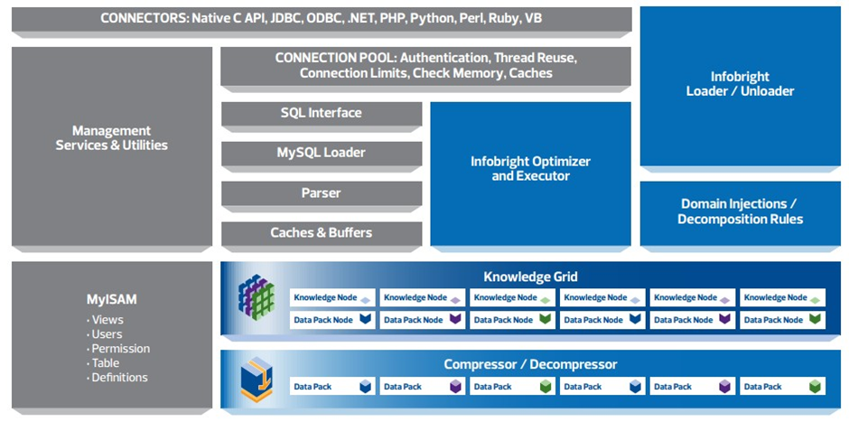
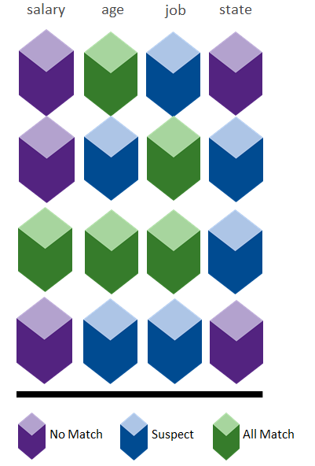
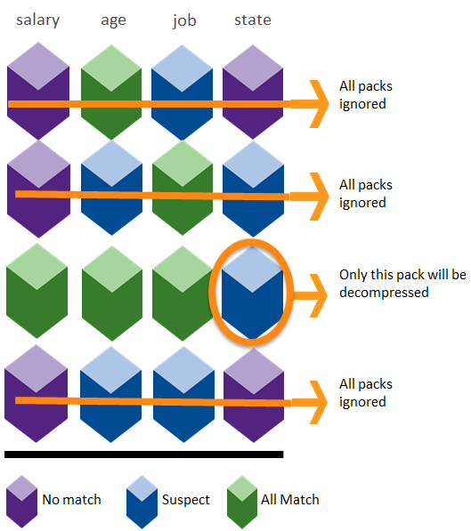
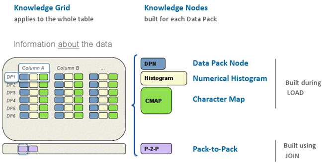

# MySQL · 引擎特性 · Infobright 列存数据库

**Date:** 2016/12
**Source:** http://mysql.taobao.org/monthly/2016/12/01/
**Images:** 6 images downloaded

---

数据库内核月报

 [
 # 数据库内核月报 － 2016 / 12
 ](/monthly/2016/12)

 * 当期文章

 MySQL · 引擎特性 · Infobright 列存数据库
* MySQL · myrocks · myrocks统计信息
* SQL Server · 特性介绍 · 统计信息
* PgSQL · 案例分享 · 从春运抢火车票思考数据库设计
* HybridDB · 最佳实践 · OLAP和OLTP一体化打造
* TokuDB · 特性分析 · 导入数据大杀器：Loader
* PgSQL · 案例分享 · PostgreSQL 性能诊断指南
* MySQL · 捉虫动态 · 5.6中ORDER BY + LIMIT 错选执行计划
* Redis · 最佳实践 · 阿里云Redis助力双11业务
* PgSQL · 案例分享 · 递归收敛优化

 ## MySQL · 引擎特性 · Infobright 列存数据库 
 Author: tianhan 

 * 简介
* 系统架构
 
 存储引擎
* 优化器和执行器
* 数据装载和卸载
* 领域知识

 [查询优化](#org52b06cc)
 * 简单场景的示例
* 小结

 [存储结构](#org145c94d)
 * Data Pack
* Knowledge Node

 [数据压缩](#org0aadbfb)
 [总结](#org29702b1)

## 简介

Infobright 是一个面向 OLAP 场景的开源列存数据库。比较容易找到代码的版本是 Infobright Community Edition 4.0.7，大概是 2006 年前后的代码。2016 年6 月，Infobright 决定停止开源[1](#fn.1)。由于它同时提供企业版和社区版，开源版本的功能相比企业版而言，肯定是存在一些明显限制的，例如对查询的并行执行、查询的并发数都有一定的限制。Infobright 不仅有 MySQL 版本，也有 PostgreSQL 版本，是比较典型的走开源软件兼容生态路线的产品。深入了解它的最好途径是阅读它的文档以及源代码。Infobright 在 VLDB 2008 年的“Industrial, application, and experience sessions: query optimization”主题下有一篇 paper [2](#fn.2)，比较详细的介绍了它的整体架构，以及查询优化、数据压缩等显著的特点。

## 系统架构

Infobright 的整体架构如上图。 相对于原生的 MySQL 而言，它主要做的改动为：

### 存储引擎

图中右下角的两个大长方形分别为“Knowledge Grid”和“Compressor/Decompressor”，二者共同组成了新的一个存储引擎 BrightHouse。这也是列存数据库区别于 InnoDB 等 OLTP 存储引擎的地方。知识网格可以简单理解为数据的元信息，例如记录数、最大值、最小值等等。压缩解压缩器代表了 Infobright 在数据压缩上做了很多工作，具备很高的压缩比。知识网格的好处是数据量相对原始数据而言很小，可以放到内存。

### 优化器和执行器

图中中间标记为“Infobright Optimizer and Executor”的是另一个重要的模块，负责处理 SQL 查询的优化和执行。与传统架构中查询优化与执行是分开的两个阶段不同，这里的优化器和执行器是紧耦合的。这也是 Infobright 比较特殊的地方。

### 数据装载和卸载

OLAP 通常要处理大量的输入数据，没有快速的数据装载和卸载能力，系统就无法发挥真正的价值。对应的是图中右上角的“Infobright Loader/Unloader”。

### 领域知识

图中还有一个比较特殊的模块，称为“Domain Injections/Decomposition Rules”。Infobright 提供了一些扩展的 SQL 和存储过程，允许用户定义取值规则，并且将规则应用到某些列上，从而使得存储模块在存储/压缩数据前可以将一个数据块内的数据分成更多的子类，并提供针对性的编码。可以简单理解为用户将领域知识通过自定义的规则告诉系统，从而采取针对性的压缩和存储优化。

## 查询优化

按照论文中的说法，Infobright 的查询优化基于粗糙集的理论，这一点很有特色。粗糙集是波兰数学家提出的理论，而 Infobright 公司是由波兰人创办的，看来把粗糙集应用到系统中也不是偶然的。不过要理解 Infobright 的查询优化，并不需要太多粗糙集的数学知识。其核心概念是利用数据的元信息来过滤需要真正访问的数据块。例如：对于范围查询，可以根据查询条件将数据块分为相关、不相关、可能相关三大类，从而减少真正的数据访问。这三种数据块的分类是粗糙集理论在该系统中用到的核心概念。更进一步，考虑到 OLAP 的数据是批量加载，而不是像 OLTP 那样实时写入的。对于 COUNT、SUM 等聚集操作，甚至可以通过预先计算好的统计值进行简单的运算得出。类似的，数据的批量加载以及只读假设也给数据的快速加载以及压缩提供了极大的便利。

### 简单场景的示例

后面通过一个简单的场景来体会一下知识网格的优势。假设我们要执行下面的查询：

`SELECT count(*)
FROM employees
WHERE salary > 100000
 AND age < 35
 AND job = ‘DBA’
 AND state = ‘TX’
`

这是一个简单的带过滤条件的聚集查询。OLTP 数据库的通用做法是利用 salary 等列上可能存在的索引进行数据的过滤，减少 IO。实际的执行计划可能会用到多个索引。Infobright 没有索引，它依靠的是知识网格中的元信息。下图展现了 employees 表中各列数据的存储。每个菱形代表一个数据块。其中紫色的表示数据块中的所有值都不满足查询条件，蓝色的表示部分值满足查询条件，绿色的表示全部值都满足条件。

因为第 1、2、4 行中都存在紫色的菱形，说明它们代表的行都不符合查询条件，进一步处理的时候可以将它们忽略掉。只有第三行的数据块需要进一步处理。而查询的结果集是要计算符合条件的行数（COUNT），我们只需要选择那些部分匹配的数据块进行处理。本查询中只有 state 列的数据块满足条件[如下图所示](#orgb7dcd94)。这样最终需要解压并逐行进行 state > 10000 条件判断的数据量就少了很多。

### 小结

上面的例子虽然很简单，但可以看到 Infobright 查询优化的几个重要特点：

1. 查询优化和执行时融合在一起的，一边优化边执行。这样的好处是可以充分利用知识网格来筛选数据，缺点是处理的查询种类有限，通用性不够。遇到不能通过知识网格有效筛选的查询，性能就会明显下降。
2. 知识网格起到了典型数据库中索引的作用，可以筛选掉部分数据块。显然，它的选择性没有索引的针对性那么强。

论文[2](#fn.2)中还有一些更具体更复杂的例子，有兴趣的读者建议直接阅读原文，可以获得更加深入的理解。

## 存储结构

Infobright 的存储结构主要包括：

### Data Pack

简称 DP，也就是数据块，用于存放实际的数据。需要注意的是，它采用的是列存格式，为每一个列产生一个或多个数据文件。这种数据格式与 OLTP 存储引擎的定长页面格式截然不同，倒是与 NoSQL 中的 SSTable 有几分神似。数据块中保存的是实际的数据以及空值的位图；数据在写出前会用多种压缩算法进行压缩；数据是没有经过排序的，按照实际加载的顺序保存。数据块在逻辑上是等长的，即每个数据块保存 65536 条记录，但是物理上不是等长的。

### Knowledge Node

简称 KN，用于存放数据块对应的元数据，它又可以细分为以下几种。

1. Data Pack Node

 简称 DPN，DP 的元信息存放在对应的 DPN 中。元信息包括：DP 中列值的最大值、最小值、SUM 值；非 NULL 的记录数，NULL 的记录数；压缩方式；占用的字节数等。
2. Histograms

 数值类型列还会保存基本的统计信息，以直方图的形式存在。具体做法是将 DP 的最小值到最大值分为 1024 段，每段占用一个 bit，表示是否含有该段的数据。查询时可以快速判断该列数据是否满足条。可以看出，这个直方图的组织与 OLTP 数据库中的存在很大的区别，而且是每个 DP 的局部信息。
3. Character Map

 简称 CMAP，这是一个字符类型列的映射表，映射表中每个格子占用一个 bit，表示字符在字符串的该位置是否存在。查询时可以快速判断该列数据是否满足条件。
4. Pack to Pack

 简称 P2P，这是一种很特殊的元数据，它存储两个表在列上的 JOIN 关系。形式有些类似 CMAP，也是一个二维矩阵。每个格子占用一个 bit，表示表 1 中某列的第 i 个 DP 与表 2 中某列的第 j 个 DP 至少有一个值相等，满足等值 JOIN 条件。可以看出，这种信息是与具体的 JOIN 条件相关的，数量可能很大，比较适合动态按需生成，不持久化。
5. 小结

 下图将所有的概念都整合到了一起，是一个不错的整体视图。

值得一提的是，与 OLTP 引擎以及其他很多 OLAP 引擎不同的是，Infobright 中没有索引，它通过 DPN 等元信息以及特殊的查询优化来替代索引的功能。这样可以省去索引占用的存储空间，还可以较好的支持 ad-hoc 的查询，避免管理员调优等代价。其列存引擎也不需要用户定义数据块的大小，数据的存储顺序就是加载的顺序，避免了某些系统需要耗费大量资源到数据的排序上。

## 数据压缩

在当时的情况下，Infobright 的数据压缩算法也是很新颖的。号称平均可以达到 10:1 的压缩比，最高可以达到 40:1。实测的时候需要注意，压缩比的计算是与原始的文本数据比还是与 InnoDB 比。Infobright 会采用链式压缩，也就是对同样的数据块采用多种算法依次压缩，尽可能达到最大的压缩比。也针对数字和字符串采用多种具体的压缩算法。例如：让所有数字减去最小值，获得更小的数字；所有数字除以最大公约数，获得更小的数字；计算数字之间的差值，获得更小的数字等等。最终采用 PPM 以及 Carryless RangeCoder 等具体的编码。

## 总结

Infobright 官网宣传号称 40:1 的压缩率，每小时加载 10TB 数据，单实例支持 150TB 的存储，维护时间 0 小时[3](#fn.3)。新产品也对 Hadoop 生态有了一定的整合。总之，Infobright 是一个有意思的数据仓库产品，具有明显的特色。它以相对较小的存储空间膨胀达到了较好的处理 ad-hoc 查询的能力，比较适合查询分析语句不是特别复杂的场景。

### 参考资料

[1](#fnr.1) The Final Frontiers of ICE [https://infobright.com/blog/the-final-frontiers-of-ice/](https://infobright.com/blog/the-final-frontiers-of-ice/)

[2](#fnr.2) Brighthouse: An Analytic Data Warehouse for Ad-hoc Queries [http://www.vldb.org/pvldb/1/1454174.pdf](http://www.vldb.org/pvldb/1/1454174.pdf)

[3](#fnr.3) Infobright Website [https://infobright.com/infobright-enterprise-edition/](https://infobright.com/infobright-enterprise-edition/)

 阅读： - 

本作品采用[知识共享署名-非商业性使用-相同方式共享 3.0 未本地化版本许可协议](http://creativecommons.org/licenses/by-nc-sa/3.0/)进行许可。

 