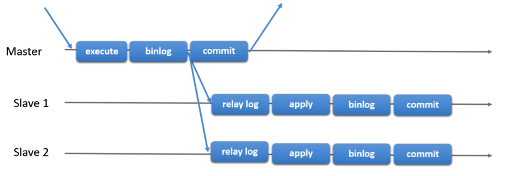
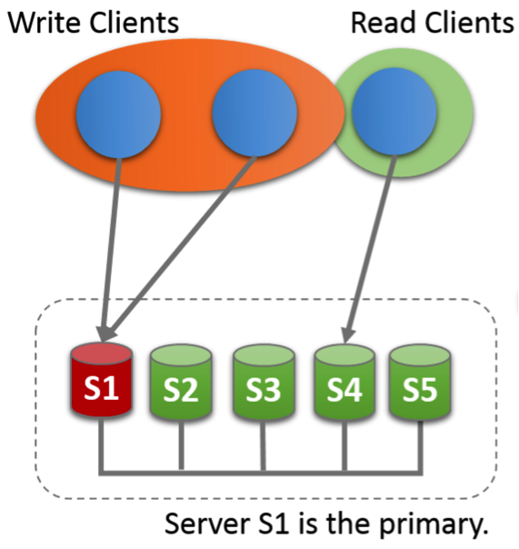
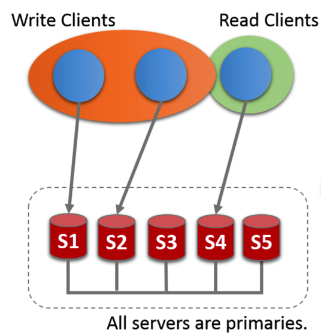
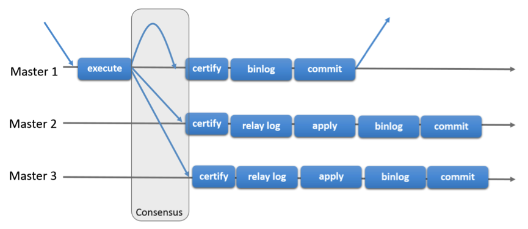
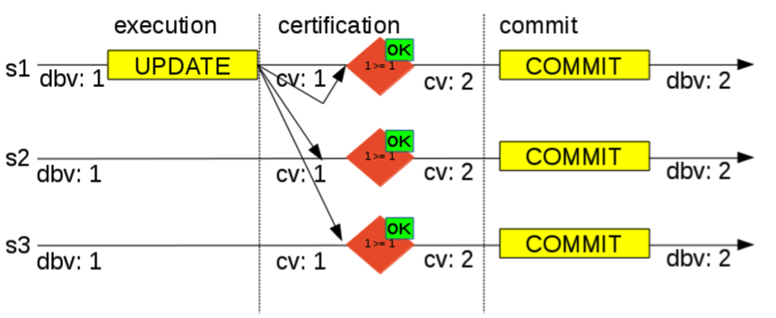

# MySQL ·  引擎特性 ·  Group Replication内核解析

**Date:** 2017/08
**Source:** http://mysql.taobao.org/monthly/2017/08/01/
**Images:** 9 images downloaded

---

数据库内核月报

 [
 # 数据库内核月报 － 2017 / 08
 ](/monthly/2017/08)

 * 当期文章

 MySQL · 引擎特性 · Group Replication内核解析
* PgSQL · 特性介绍 · 列存元数据扫描介绍
* MySQL · 源码分析 · MySQL replication partial transaction
* MySQL · 特性分析 · 到底是谁执行了FTWL
* MySQL · 源码分析 · mysql认证阶段漫游
* MySQL · 源码分析 · 内存分配机制
* PgSQL · 源码分析 · PG 优化器中的pathkey与索引在排序时的使用
* MSSQL· 实现分析 · Extend Event日志文件的分析方法
* MySQL · 源码分析 · SHUTDOWN过程
* PgSQL · 应用案例 · HDB for PG特性(数据排盘与任意列高效率过滤)

 ## MySQL · 引擎特性 · Group Replication内核解析 
 Author: 智邻 

 ## 背景

为了创建高可用数据库系统，传统的实现方式是创建一个或多个备用的数据库实例，原有的数据库实例通常称为主库master，其它备用的数据库实例称为备库或从库slave。当master故障无法正常工作后，slave就会接替其工作，保证整个数据库系统不会对外中断服务。master与slaver的切换不管是主动的还是被动的都需要外部干预才能进行，这与数据库内核本身是按照单机来设计的理念悉悉相关，并且数据库系统本身也没有提供管理多个实例的能力，当slave数目不断增多时，这对数据库管理员来说就是一个巨大的负担。

## MySQL的传统主从复制机制

MySQL传统的高可用解决方案是通过binlog复制来搭建主从或一主多从的数据库集群。主从之间的复制模式支持异步模式(async replication)和半同步模式(semi-sync replication)。无论哪种模式下，都是主库master提供读写事务的能力，而slave只能提供只读事务的能力。在master上执行的更新事务通过binlog复制的方式传送给slave，slave收到后将事务先写入relay log，然后重放事务，即在slave上重新执行一次事务，从而达到主从机事务一致的效果。

上图是异步复制(Async replication)的示意图,在master将事务写入binlog后，将新写入的binlog事务日志传送给slave节点，但并不等待传送的结果，就会在存储引擎中提交事务。

上图是半同步复制(Semi-sync replication)的示意图，在master将事务写入binlog后，将新写入的binlog事务日志传送给slave节点，但需要等待slave返回传送的结果；slave收到binlog事务后，将其写入relay log中，然后向master返回传送成功ACK；master收到ACK后，再在存储引擎中提交事务。
MySQL基于两种复制模式都可以搭建高可用数据库集群，也能满足大部分高可用系统的要求，但在对事务一致性要求很高的系统中，还是存在一些不足，主要的不足就是主从之间的事务不能保证时刻完全一致。

* 基于异步复制的高可用方案存在主从不一致乃至丢失事务的风险，原因在于当master将事务写入binlog，然后复制给slave后并不等待slave回复即进行提交，若slave因网络延迟或其它问题尚未收到binlog日志，而此时master故障，应用切换到slave时，本来在master上已经提交的事务就会丢失，因其尚未传送到slave，从而导致主从之间事务不一致。
* 基于semi-sync复制的高可用方案也存在主备不一致的风险，原因在于当master将事务写入binlog，尚未传送给slave时master故障，此时应用切换到slave，虽然此时slave的事务与master故障前是一致的，但当主机恢复后，因最后的事务已经写入到binlog，所以在master上会恢复成已提交状态，从而导致主从之间的事务不一致。

## Group Replication应运而生

为了应对事务一致性要求很高的系统对高可用数据库系统的要求，并且增强高可用集群的自管理能力，避免节点故障后的failover需要人工干预或其它辅助工具干预，MySQL5.7新引入了Group Replication，用于搭建更高事务一致性的高可用数据库集群系统。基于Group Replication搭建的系统，不仅可以自动进行failover，而且同时保证系统中多个节点之间的事务一致性，避免因节点故障或网络问题而导致的节点间事务不一致。此外还提供了节点管理的能力，真正将整个集群做为一个整体对外提供服务。

## Group Replication的实现原理
Group Replication由至少3个或更多个节点共同组成一个数据库集群，事务的提交必须经过半数以上节点同意方可提交，在集群中每个节点上都维护一个数据库状态机，保证节点间事务的一致性。Group Replication基于分布式一致性算法Paxos实现，允许部分节点故障，只要保证半数以上节点存活，就不影响对外提供数据库服务，是一个真正可用的高可用数据库集群技术。
Group Replication支持两种模式，单主模式和多主模式。在同一个group内，不允许两种模式同时存在，并且若要切换到不同模式，必须修改配置后重新启动集群。
在单主模式下，只有一个节点可以对外提供读写事务的服务，而其它所有节点只能提供只读事务的服务，这也是官方推荐的Group Replication复制模式。单主模式的集群如下图所示：

在多主模式下，每个节点都可以对外提供读写事务的服务。但在多主模式下，多个节点间的事务可能有比较大的冲突，从而影响性能，并且对查询语句也有更多的限制，具体限制可参见使用手册。多主模式的集群如下图所示：

MySQL Group Replication是建立在已有MySQL复制框架的基础之上，通过新增Group Replication Protocol协议及Paxos协议的实现，形成的整体高可用解决方案。与原有复制方式相比，主要增加了certify的概念，如下图所示：

certify模块主要负责检查事务是否允许提交，是否与其它事务存在冲突，如两个事务可能修改同一行数据。在单机系统中，两个事务的冲突可以通过封锁来避免，但在多主模式下，不同节点间没有分布式锁，所以无法使用封锁来避免。为提高性能，Group Replication乐观地来对待不同事务间的冲突，乐观的认为多数事务在执行时是没有并发冲突的。事务分别在不同节点上执行，直到准备提交时才去判断事务之间是否存在冲突。下面以具体的例子来解释certify的工作原理：

在上图中由3个节点形成一个group，当在节点s1上发起一个更新事务UPDATE，此时数据库版本dbv=1，更新数据行之后，准备提交之前，将其修改的数据集(write set)及事务日志相关信息发送到group，Write set中包含更新行的主键和此事务执行时的快照(由gtid_executed组成)。组内的每个节点收到certification请求后，进入certification环节，每个节点的当前版本cv=1，与write set相关的版本dbv=1，因为dbv不小于cv，也就是说事务在这个write set上没有冲突，所以可以继续提交。
 下面是一个事务冲突的例子，两个节点同时更新同一行数据。如下图所示，

在节点s1上发起一个更新事务T1，几乎同时，在节点s2上也发起一个更新事务T2，当T1在s1本地完成更新后，准备提交之前，将其writeset及更新时的版本dbv=1发送给group；同时T2在s2本地完成更新后，准备提交之前，将其writeset及更新时的版本dbv=1也发送给group。
此时需要注意的是，group组内的通讯是采用基于paxos协议的xcom来实现的，它的一个特性就是消息是有序传送，每个节点接收到的消息顺序都是相同的，并且至少保证半数以上节点收到才会认为消息发送成功。xcom的这些特性对于数据库状态机来说非常重要，是保证数据库状态机一致性的关键因素。
本例中我们假设先收到T1事务的certification请求，则发现当前版本cv=1，而数据更新时的版本dbv=1，所以没有冲突，T1事务可以提交，并将当前版本cv修改为2；之后马上又收到T2事务的certification请求，此时当前版本cv=2，而数据更新时的版本dbv=1，表示数据更新时更新的是一个旧版本，此事务与其它事务存在冲突，因此事务T2必须回滚。

## 核心组件XCOM的特性

MySQL Group Replication是建立在基于Paxos的XCom之上的，正因为有了XCom基础设施，保证数据库状态机在节点间的事务一致性，才能在理论和实践中保证数据库系统在不同节点间的事务一致性。
Group Replication在通讯层曾经历过一次比较大的变动，早期通讯层采用是的Corosync，而后来才改为XCom。

主要原因在于corosync无法满足MySQL Group Replication的要求，如
1. MySQL支持各种平台，包括windows，而corosync不都支持；
2. corosync不支持SSL，而只支持对称加密方式，安全性达不到MySQL的要求；
3. corosync采用UDP，而在云端采用UDP进行组播或多播并不是一个好的解决方案。

此外MySQL Group Replication对于通讯基础设施还有一些更高的要求，最终选择自研xcom，包括以下特性：

* 闭环(closed group)：只有组内成员才能给组成员发送消息，不接受组外成员的消息。
* 消息全局有序(total order)：所有XCOM传递的消息是全局有序(在多主集群中或是偏序)，这是构建MySQL 一致性状态机的基础。
* 消息的安全送达(Safe Delivery)：发送的消息必须传送给所有非故障节点，必须在多数节点确认收到后方可通知上层应用。
* 视图同步(View Synchrony)：在成员视图变化之前，每个节点都以相同的顺序传递消息，这保证在节点恢复时有一个同步点。实际上，组复制并不强制要求消息传递必须在同一个节点视图中。

## 总结

MySQL Group Replication旨在打造一款事务强一致性金融级的高可用数据库集群产品，目前还存在一些功能限制和不足，但它是未来数据库发展的一个趋势，从传统的主从复制到构建数据库集群，MySQL也在不断的前进，随着产品的不断完善和发展，必将成为引领未来数据库系统发展的潮流。

 阅读： - 

本作品采用[知识共享署名-非商业性使用-相同方式共享 3.0 未本地化版本许可协议](http://creativecommons.org/licenses/by-nc-sa/3.0/)进行许可。

 