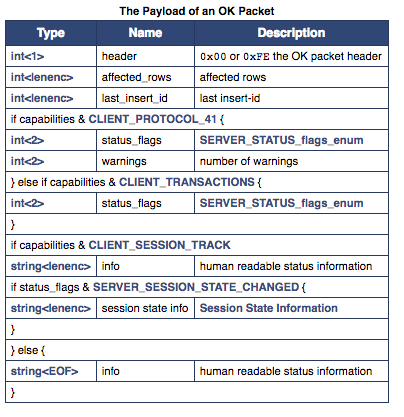
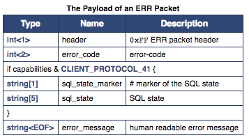
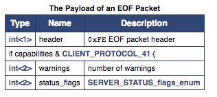

# MySQL · 源码分析 · 协议模块浅析

**Date:** 2018/04
**Source:** http://mysql.taobao.org/monthly/2018/04/05/
**Images:** 4 images downloaded

---

数据库内核月报

 [
 # 数据库内核月报 － 2018 / 04
 ](/monthly/2018/04)

 * 当期文章

 MySQL · 引擎特性 · InnoDB 表空间加密
* MongoDB · myrocks · mongorocks 引擎原理解析
* MySQL · 引擎特性 · InnoDB 数据页解析
* MySQL · MyRocks · TTL特性介绍
* MySQL · 源码分析 · 协议模块浅析
* MSSQL · 最佳实践 · 如何监控备份还原进度
* MySQL · 特性分析 · MySQL的预编译功能
* MySQL · 特性分析 · (deleted) 临时空间
* MySQL · RocksDB · WAL(WriteAheadLog)介绍
* PgSQL · 应用案例 · 相似文本识别与去重

 ## MySQL · 源码分析 · 协议模块浅析 
 Author: santo 

 这里调用栈主要基于MySQL5.7, 因为重构了protocol模块的代码, 可能与5.6的函数调用有所差异.

## TL;DR (Not that long ..)
我们之前跟踪过三次握手的调用栈, 这里跳过认证, 主要考察验证完成后, server如何监听client发起的操作, 和如何返回一系列响应报文.
以及5.7在这个模块上相比5.6做了哪些扩展.

## 从网络读取请求

server调用`Protocol_classic::read_packet()`, 在这里进入网路等待, 封装了`my_net_read()`来获取client发送的报文.

 `my_net_read(NET *net)`: 从网络获得一个或多个报文, 当client发送的报文因为太大, 分成多个报文发送时, 在这个函数中拼接为一个整体; 如果收到压缩过的报文, 也在这个函数中解压缩. 并将读到的完整数据填充到NET *net中, 并返回(解压缩后整体的)packet_length. 对上层屏蔽了网络交互细节.
堆栈如下:

`Protocol_classic::read_packet()
Protocol_classic::get_command()
do_command()
...
`

client发送一条查询时, server从读取报文, 并从`read_packet()`返回上层函数: `Protocol_classic::get_command()`. 先验证包完整性, 从报文头部(`(enum enum_server_command) raw_packet[0]`)扒出command信息, 然后进入报文解析逻辑(只填充com_data数据结构):
`Protocol_classic::parse_packet`
(这里随后会重置一下`net_read_timeout`)
进入`dispatch_command`, 指派SQL解析逻辑

## 回包
常见MySQL返回的报文有Data Packet, OK Packet, EOF Packet, 和ERROR Packet.
回包格式主要取决于查询是否需要返回结果集.

### 无结果集查询
对于诸如 COM_PING, IUD Query 等, 不需要返回结果集的命令, MySQL server如果正确执行这个查询, 会返回OK 报文给client, OK Packet的结构如下:

如果查询执行时发生异常, MySQL server返回ERROR Packet给CLIENT

以一条INSERT语句`insert into t1 (id) values (2333);`为例:
堆栈如下:

`my_net_write()
net_send_ok (thd=..., server_status=..., statement_warn_count=..., affected_rows=..., id=..., message=0x... "", eof_identifier=false)
0x0000000001aa0892 in Protocol_classic::send_ok (this=..., server_status=..., statement_warn_count=0, affected_rows=1, last_insert_id=0, message=0x... "")
0x0000000001bae46c in THD::send_statement_status (this=0x...)
0x0000000001c5ae84 in dispatch_command
...
`

语句在执行过程中不会有回包, 执行完释放thread资源前, 调用`send_statement_status`根据这条statement执行的情况确定回包类型.
INSERT可能有ERROR/OK两种状态, 这里我们考察OK的情况.
由堆栈可见, 最终在`net_send_ok`中构造报文, 调用`my_net_write()`

### 有结果集查询
对于像是 SELECT, SHOW, EXPLAIN 等等, 需要返回结果集的查询, 相应会复杂一些, MySQL会返回一系列包(包括metadata, row_data, EOF Packet), 其中EOF报文结构如下:

// 可以看到, 原生的eof包很小巧

填充元信息逻辑入口在函数`THD::send_result_metadata()`, 填充逻辑还被划分为以下几个部分:

1. `Protocol_classic::start_result_metadata()`
 将列数写入NET buffer, 然后对于每一列, 调用
2. `Protocol_classic::send_field_metadata`
 然后进入循环, 对于每一列, 都会返回:
 (变长)db_name, table_name, org_table_name , col_name, org_col_name;
 (定长)charset, type, decimals, 以及2个预留位, 这些信息.
3. `Protocol_classic::end_result_metadata`, 这里会调用一个`write_eof_packet()`, 用一个EOF包标志metadata边界(这里的EOF包内没有状态信息).
对于每一行要返回的数据, 调用`THD::send_result_set_row()`, 之后`thd->inc_sent_row_count(1)`, 计数+1.
一个常见堆栈:

` THD::send_result_set_row
 Query_result_send::send_data
 end_send
 evaluate_join_record
 sub_select
 do_select
 JOIN::exec
 handle_query
 execute_sqlcom_select
 mysql_execute_command
 mysql_parse
 dispatch_command
`
然后在 THD::send_result_set_row中逐列调用store(), 将非空的列值转化为String类型, 填入net buffer.
在每一行result in result_set都返回后, server调用Protocol_classic::send_eof返回EOF包, 通常包含查询执行的状态信息(比如说:warning_count…)

一个堆栈:

`net_send_ok
Protocol_classic::send_eof
THD::send_statement_status
dispatch_command
do_command
`
这里有个很好玩的地方是`send_eof`调用了`net_send_ok`, 这是因为5.7上有一个deprecate EOF packet的worklog, 其实ok报文和eof报文的发送放在了同一块儿逻辑.
在client和server都支持一个flag位`CLIENT_DEPRECATE_EOF`后, 就会有如上的栈出现. 如果client或者server有一方太老, 这里可能就只能看到一个send_eof() -> net_send_eof()的堆栈.

## 重构协议代码
[WL#7126: Refactoring of protocol class](https://dev.mysql.com/worklog/task/?id=7126)
5.7大幅度重构了协议模块代码, 风格非常的OO, 结构清楚的一点都不像server层的代码(好像黑到了什么)
抽象了一坨类:

`Protocol
|- Protocol_classic
 |- Protocol_binary
 |- Protocol_text
`

Protocol作为一个注释丰满且只有纯虚函数的抽象类, 非常容易理顺protocol模块能够提供的API().
细节实现主要在Protocol_classic中(所以上文的调用栈可以看到, 实际逻辑是走到Protocol_classic中的), 而逻辑上还划分出的两个类: Protocol_binary是Prepared Statements使用的协议, Protocol_text场景如[Text Protocol](https://dev.mysql.com/doc/internals/en/text-protocol.html)所写.
这个worklog对外没有引入行为上的变化, 但是代码变得非常Human Readable >,<

## 5.7 在ok和eof报文上的改动
上述讲到一个MySQL 5.7 引入的 Deprecate EOF, 实际上5.7上对OK/EOF报文做了大量修改. 使得client可以通过报文拿到更多的会话状态信息. 方便中间层会话保持, 主要涉及几个worklog:

[WL#4797: Extending protocol’s OK packet](https://dev.mysql.com/worklog/task/?id=4797)

[WL#6885: Flag to indicate session state](https://dev.mysql.com/worklog/task/?id=6885)

[WL#6128: Session Tracker: Add GTIDs context to the OK packet](https://dev.mysql.com/worklog/task/?id=6128)

[WL#6972: Collect GTIDs to include in the protocol’s OK packet](https://dev.mysql.com/worklog/task/?id=6972)

[WL#7766: Deprecate the EOF packet](https://dev.mysql.com/worklog/task/?id=7766)

[WL#6631: Detect transaction boundaries](https://dev.mysql.com/worklog/task/?id=6631)

同时新增变量控制报文行为:

* **session_track_schema = [ON | OFF]**

 ON时, 如果session中变更了当前database, OK报文中回返回新的database
* **session_track_state_change = [ON | OFF]**

ON时, 当发生会话环境改变时, 会给CLIENT返回一个FLAG(1), 环境变化包括:

` 1. 当前database;
 2. 系统变量
 3. User-defined 变量
 4. 临时表的变更
 5. prepare xxx
`
但是只通知变更发生, 具体值为多少, 需要配合`session_track_schema`, `session_track_system_variables`使用, 所以这里限制还是很多…

* **session_track_system_variables = [“list of string, seperated bt ‘,’”]**

 这个参数用来追踪的变量, 目前只有`time_zone, autocommit, character_set_client, character_set_results, character_set_connection`可选.
当这些变量的值变动时, client可以收到variable_name: new_value的键值对
* **session_track_gtids = [OFF | OWN_GTID | ALL_GTIDS]**

 OWN_GTID时, 在会话中产生新GTIDs(当然只读操作不会后推GTID位点)时, 以字符串形式返回新增的GTIDs.
ALL_GTIDS时, 在每个包中返回当前的executed_gtid值. 但是这样报文的payload很高, 不推荐(>. <)
* **session_track_transaction_info = [ON | OFF]**
打开后, 通过标志位表示当前会话状态.
有8bit可以表示状态信息(其中使用字符’_‘表示FALSE):

 T: 显示开启事务; I: 隐式开启事务(autocommit = 0)
* r: 有非事务表读
* R: 有事务表读
* w: 非事务表写
* W: 事务表写
* s: 不安全函数(比如 select uuid())
* S: server返回结果集
* L: 显示锁表(LOCK TABLES)
一个事务内, 返回的状态值是累加的, 举个栗子:

在有这些信息的基础上我们可以做很多中间层的开发工作.

举个栗子, 我们读写分离上就用这个状态追踪, 对外提供透明的…读写分离 来自笔者的安利, 请吃 

8.0 GA了… (5.7也步入了时代的眼泪 |ω・）)

 阅读： - 

本作品采用[知识共享署名-非商业性使用-相同方式共享 3.0 未本地化版本许可协议](http://creativecommons.org/licenses/by-nc-sa/3.0/)进行许可。

 