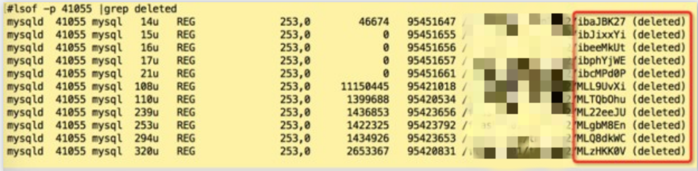
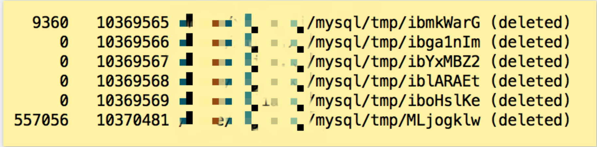
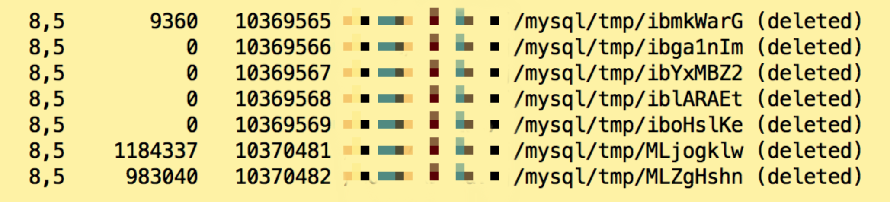
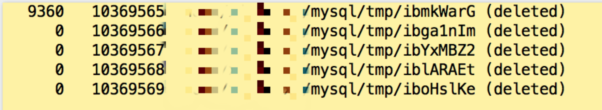

# MySQL · 特性分析 · (deleted) 临时空间

**Date:** 2018/04
**Source:** http://mysql.taobao.org/monthly/2018/04/08/
**Images:** 5 images downloaded

---

数据库内核月报

 [
 # 数据库内核月报 － 2018 / 04
 ](/monthly/2018/04)

 * 当期文章

 MySQL · 引擎特性 · InnoDB 表空间加密
* MongoDB · myrocks · mongorocks 引擎原理解析
* MySQL · 引擎特性 · InnoDB 数据页解析
* MySQL · MyRocks · TTL特性介绍
* MySQL · 源码分析 · 协议模块浅析
* MSSQL · 最佳实践 · 如何监控备份还原进度
* MySQL · 特性分析 · MySQL的预编译功能
* MySQL · 特性分析 · (deleted) 临时空间
* MySQL · RocksDB · WAL(WriteAheadLog)介绍
* PgSQL · 应用案例 · 相似文本识别与去重

 ## MySQL · 特性分析 · (deleted) 临时空间 
 Author: xijia 

 ### 1. 简介

在运行 MySQL 的服务器上，偶尔出现 du 和 df 统计空间大小差别很大的情况，原因之一是 MySQL 的临时空间过大

在Linux或者Unix系统中，通过rm或者文件管理器删除文件将会从文件系统的目录结构上解除链接(unlink)，然而如果文件是被打开的（有一个进程正在使用），那么进程将仍然可以读取该文件，磁盘空间也一直被占用，这样就会导致我们明明删除了文件，但是磁盘空间却未被释放

这些已经删除，但空间未释放的文件，可以通过 lsof 看到，末尾标明 (deleted) 就是这种文件

如下图

MySQL 服务器中，已删除未释放空间的文件主要存在于 tmp 目录，执行以下命令可以查看实例的 tmp 目录

`show variables like 'tmpdir'

`

如果 deleted 文件过大，会对实例的性能产生负面影响，因为写文件的磁盘IO操作远慢于内存操作，所以要尽量避免使用临时文件

如果 deleted 文件太多导致磁盘空间满，会造成 MySQL crash，这是后表现为 df -h 看到磁盘 100%，但是 du -h 看到磁盘 90% 或者更少，这时候重启占用文件句柄的进程可以快速解决问题

### 2.产生临时空间的原因

MySQL产生的临时文件主要有以下几类：

##### 查询产生的临时表文件
MySQL 执行带有 order by，group by 的复制查询时，经常需要建立一个或两个临时表

临时表所需的最大空间取决于以下公式

`(length of what is sorted + sizeof(row pointer))
* number of matched rows
* 2
`

临时表较小时，可以存放在内存中，较大时则会存在在磁盘中，这取决于两个参数 tmp_table_size 和 max_heap_table_size

tmp_table_size 和 max_heap_table_size 较小的一个决定了内存临时表的上线，临时表小于上限则为内存表，大于上限为磁盘表

执行以下命令可以查看创建内存临时表和磁盘临时表的数量

`mysql> show status like '%tmp%';
+-------------------------+-------+
| Variable_name | Value |
+-------------------------+-------+
| Created_tmp_disk_tables | 1 |
| Created_tmp_files | 10 |
| Created_tmp_tables | 1 |
+-------------------------+-------+

`
原则上讲，临时表的数量越少越好，磁盘临时表的数量应该远远少于内存临时表的

正常情况下 Created_tmp_disk_tables/Created_tmp_tables < 25%

如果磁盘临时表过多，可能需要优化 sql

alter table 也会产生临时表，由于alter table执行频率较低，不容易引起空间问题

##### binlog cache 文件

事务产生的 binlog 先缓存在 binlog cache 中，事务提交后再刷到磁盘

MySQL 为每个连接分配一个 binlog cache，cache 大小由参数 binlog_cache_size 决定

如果事务使用的 binlog_cache 超过 binlog_cache_size，则在 tmpdir 下建立临时文件缓存 binlog，binlog_cache 临时文件以 ML 开头

`以下两个status展示了 binlog_cache 和磁盘binlog_cache 的使用量

mysql> show status like 'binlog_cache%';
+-----------------------+-------+
| Variable_name | Value |
+-----------------------+-------+
| Binlog_cache_disk_use | 6 |
| Binlog_cache_use | 19 |
+-----------------------+-------+

我们先建一张表，插入很多条记录

mysql> show create table t;
+-------+-------------------------------------------------------------------------------------------------------------------------------------------------+
| Table | Create Table |
+-------+-------------------------------------------------------------------------------------------------------------------------------------------------+
| t | CREATE TABLE `t` (
 `i` int(11) DEFAULT NULL,
 `c` char(20) DEFAULT NULL,
 `c2` char(20) DEFAULT NULL
) ENGINE=InnoDB DEFAULT CHARSET=latin1 |
+-------+-------------------------------------------------------------------------------------------------------------------------------------------------+
1 row in set (0.00 sec)

mysql> select count(*) from t;
+----------+
| count(*) |
+----------+
| 65536 |
+----------+
1 row in set (28.08 sec)

插入一条记录，我们看到 Binlog_cache_use 加了1，Binlog_cache_disk_use 没变

mysql> insert into t values(1,'a','a');
Query OK, 1 row affected (0.01 sec)

mysql> show status like 'binlog_cache%';
+-----------------------+-------+
| Variable_name | Value |
+-----------------------+-------+
| Binlog_cache_disk_use | 6 |
| Binlog_cache_use | 20 |
+-----------------------+-------+
2 rows in set (0.37 sec)

插入大量记录，可以看到 Binlog_cache_disk_use 和 Binlog_cache_use 各加一

mysql> insert into t select * from t;
Query OK, 65537 rows affected (1 min 26.58 sec)
Records: 65537 Duplicates: 0 Warnings: 0

mysql> show status like 'binlog_cache%';
+-----------------------+-------+
| Variable_name | Value |
+-----------------------+-------+
| Binlog_cache_disk_use | 7 |
| Binlog_cache_use | 21 |
+-----------------------+-------+
2 rows in set (0.35 sec)

`
如下图，临时目录下 MLjogklw (deleted) 就是 binlog cache 文件

`换一个连接再次执行大量插入

mysql> insert into t select * from t limit 65536;
Query OK, 65536 rows affected (2 min 11.09 sec)
Records: 65536 Duplicates: 0 Warnings: 0

`

如下图，一共有两个 binlog cache文件

连接断开后，binlog cache释放，空间会自动回收

##### innodb临时文件

innodb 启动时也需要建立一些临时文件，innodb 临时文件以 ib 开头

srv_monitor_file

srv_dict_tmpfile

srv_misc_tmpfile

dict_foreign_err_file

lock_latest_err_file

主要保存一些监控、字典、错误日志和无法归类的信息，这部分文件占用空间较少，无须特殊关注

### 3.如何避免临时空间过大

针对查询产生的临时文件，应该避免频繁使用 order by、group by 操作，即使需要排序也应该尽量减少排序行数

出于提高性能的考虑，如果确实经常需要对记录排序，可以适当调大 tmp_table_size 和 max_heap_table_size

但是为了减少磁盘使用而调高 tmp_table_size 和 max_heap_table_size 并不明智，因为内存资源远比磁盘资源宝贵，不能为了节省磁盘空间而增加内存消耗

针对 binlog cache，应该少执行大事务，尤其应该减少在多个连接同时执行大事务

如果大事务比较多，可以适当调大 binlog_cache_size，但是同样不应该为了节省磁盘调整这个参数

因为连接断开后 binlog_cache 空间会释放，使用短连接执行大事务可以有效降低临时空间开销

 阅读： - 

本作品采用[知识共享署名-非商业性使用-相同方式共享 3.0 未本地化版本许可协议](http://creativecommons.org/licenses/by-nc-sa/3.0/)进行许可。

 