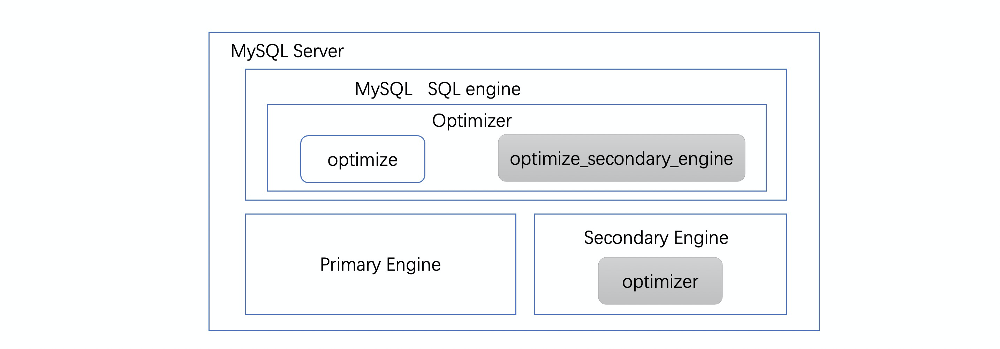

# MySQL · 源码阅读 · Secondary Engine

**Date:** 2020/11
**Source:** http://mysql.taobao.org/monthly/2020/11/04/
**Images:** 3 images downloaded

---

数据库内核月报

 [
 # 数据库内核月报 － 2020 / 11
 ](/monthly/2020/11)

 * 当期文章

 MySQL · 源码分析 · MySQL Statement Digest
* Database · 理论基础 · B-tree 物理结构的并发控制
* MySQL · 源码阅读 · 创建二级索引
* MySQL · 源码阅读 · Secondary Engine

 ## MySQL · 源码阅读 · Secondary Engine 
 Author: 雯静 

 ## 背景
MySQL默认的存储引擎是InnoDB，而引入Secondary Engine，用来实现同时支持多引擎，在同一个MySQL Server上挂多个存储引擎，在支持InnoDB的同时，还可以把数据存放在其他的存储引擎上。
全量的数据都存储在Primary Engine上，某些指定数据在Secondary Engine 上也存放了一份，然后在访问这些数据的时候，会根据系统参数和cost选择存储引擎，提高查询效率。

在最新版本8.0.22上还支持了启动和停止某个Secondary Engine。

MySQL官方集成了RAPID来为MySQL提供实时的数据分析服务，同时支持InnoDB和RAPID，但未开源，开源MySQL引入Secondary Engine，有助于我们集成其他存储引擎或者数据库。

本文是基于最新版本的MySQL-8.0.22源码解读的。

* 安装一个secondary engine MOCK
使用Secondary Engine之前需要安装插件，目前源码中有模拟Secondary Engine的插件ha_mock.so
 `INSTALL PLUGIN mock SONAME "ha_mock.so";
`
* 与Secondary Engine有关的系统变量
 ```
SET @use_secondary_engine= "ON";
SET @use_secondary_engine= "OFF";
SET @use_secondary_engine= "FORCED";

```
 
 use_secondary_engine设置为“ON”，表示在使用primary engine的cost大于Secondary engine的情况下使用secondary engine；
use_secondary_engine设置为“OFF”，表示不使用Secondary engine；
use_secondary_engine设置为“FORCED”，表示强制使用Secondary engine。
* 表定义时需要指明使用Secondary Engine，如：
 `CREATE TABLE t1 (a INT NOT SECONDARY, b INT) SECONDARY_ENGINE MOCK;
`
* 加载和卸载数据的语法如下：
 ```
ALTER TABLE T1 SECONDARY_LOAD; 
ALTER TABLE T1 SECONDARY_UNLOAD;

```
 
 ## 内核的实现
 
如图所示，Secondary Engine实际上是MySQL sever上同时支持两个存储引擎，把一部分主引擎上的数据，在Secondary Engine上也保存一份，然后查询的时候会根据优化器的的选择决定在哪个引擎上处理数据。

 ### 定义和声明
 `Sql_cmd {
// The handlerton will be assigned in open_tables_for_query()
const handlerton *m_secondary_engine;
}
TABLE_SHARE {
/// Secondary storage engine
LEX_CSTRING secondary_engine;

/// Does this TABLE_SHARE represent a table in a secondary storage engine?
bool m_secondary_engine{false};
}
//Column has an option NOT SECONDARY
Field {
// Engine specific attributes
LEX_CSTRING m_secondary_engine_attribute;
}
` 
 ### 加载/卸载数据

#### TABLE::read_set

TABLE::read_set 用来标记哪些coloum的数据需要load到Secondary Engine上。默认这个表的所有columns都需要load到Secondary Engine上，除非这个column上标记了NOT SECONDARY的属性。

` bool Sql_cmd_secondary_load_unload::mysql_secondary_load_or_unload(
 THD *thd, TABLE_LIST *table_list) {
 ...
 // Omit hidden generated columns and columns marked as NOT SECONDARY from
 // read_set. It is the responsibility of the secondary engine handler to load
 // only the columns included in the read_set.
 bitmap_clear_all(table_list->table->read_set);
 for (Field **field = table_list->table->field; *field != nullptr; ++field) {
 // Skip hidden generated columns.
 if (bitmap_is_set(&table_list->table->fields_for_functional_indexes,
 (*field)->field_index))
 continue;

 // Skip columns marked as NOT SECONDARY.
 if ((*field)->flags & NOT_SECONDARY_FLAG) continue;

 // Mark column as eligible for loading.
 table_list->table->mark_column_used(*field, MARK_COLUMNS_READ);
 // bitmap_set_bit(read_set, field->field_index);
 }
 ...
 // Initiate loading into or unloading from secondary engine.
 const bool error =
 is_load
 ? secondary_engine_load_table(thd, *table_list->table)
 : secondary_engine_unload_table(
 thd, table_list->db, table_list->table_name, *table_def, true);
 ...
`
#### 两阶段加载

加载数据到Secondary Engine的过程有两阶段组成：

* 第一阶段， ha_prepare_load_table

prepare阶段通常是很短的一段时间，需要持有一把MDL_EXCLUSIVE 表锁，持有锁的时间很短，主要是为了保证在开始数据加载之前提交对于该表的所有DML操作。

` DBUG_ASSERT(thd->mdl_context.owns_equal_or_stronger_lock(
 MDL_key::TABLE, table.s->db.str, table.s->table_name.str, MDL_EXCLUSIVE));
 DBUG_ASSERT(table.s->has_secondary_engine());

 // At least one column must be loaded into the secondary engine.
 if (bitmap_bits_set(table.read_set) == 0) {
 my_error(ER_SECONDARY_ENGINE, MYF(0),
 "All columns marked as NOT SECONDARY");
 return true;
 }
`
* 第二阶段， ha_load_table 
这个阶段是真正加载数据的阶段，使用InnoDB的Parallel_reader_adapter实现并行扫描数据以提高加载效率。

```
// InnoDB parallel scan context
Parallel_reader_adapter

struct handler {
// Parallel scan interface, could be explored to speed up offload process 
int parallel_scan_init(void *&scan_ctx, size_t &num_threads);
int parallel_scan(void *scan_ctx, void **thread_ctxs,
 Load_init_cbk init_fn, Load_cbk load_fn, Load_end_cbk end_fn);
void parallel_scan_end(void *scan_ctx);

// Allows concurrent DML in the offload process
int ha_prepare_load_table(const TABLE &table);
int ha_load_table(const TABLE &table);
int ha_unload_table(const char *db_name, const char *table_name,
 bool error_if_not_loaded);

void ha_set_primary_handler(handler *primary_handler);
};

```

### 优化器
一般情况下，如果访问主引擎获取这些数据的cost大于某一个特定值threshold的时候，会选择通过Secondary Engine访问这些数据，而其他只存储在主引擎的数据，还是通过主引擎访问。Secondary Engine用于Primary Engine上执行时间过长的查询，会尝试在Secondary Engine上执行。



在query执行之前，优化器的最后阶段增加了optimize_secondary_engine，但并不是所有的query都要经过optimize_secondary_engine。目的主要是避免在Primary engine上执行很快的query经过secondary engine执行。

* 首先先走正常的优化流程
 unit->optimize()
* 然后估算当前查询的current_query_cost
accumulate current_query_cost
* 如果current_query_cost大于secondary_engine_cost_threshold
If (current_query_cost < variables.secondary_engine_cost_threshold)
 return false;
optimize_secondary_engine

### Mock
Mock是为了对MySQL进行与Secondary Engine相关的功能测试而写的一个Secondary Engine的demo。他定义了用于适配Secondary Engine的接口。
mock 的源码在 router/src/mock_server目录下，
与secondary engine适配的接口在
storage/secondary_engine_mock/ha_mock.h
storage/secondary_engine_mock/ha_mock.cc

## 系统价值

Secondary Engine是MySQL为了支持多引擎提供一种方法和实现框架。在此基础上，MySQL可以根据不同存储引擎对数据处理的特点来把不同的查询计划匹配到合适的存储引擎的上执行，从而发挥多种存储引擎各自的优点，优化整个SQL的查询效率。为多模架构和异构数据库的实现提供了一种框架。
比如，我们可以利用Secondary Engine接入ClickHouse，来承接分析型的查询。

### 现状

Secondary Engine的基础框架已经搭建起来了，实现了一个用于功能测试demo mock。但是还不够完善：
目前load数据只支持存量数据的加载，还不能支持增量数据的加载。不能支持实时的数据同步到secondary engine上。
目前还没有直接可以作为MySQL的Secondary Engine的存储引擎，如果接入，需要做一些适配的研发工作。

### 前景

随着数据库的发展，人们对处理异构数据的需求 越来越强烈，需要这种支持多引擎的数据库出现，Secondary engine还有很多事情要做 
1、支持增量数据的loading，除了一次性把所有标记需要存储到Secondary Engine的数据加载过去，还需要支持实时的把主引擎产生的增量数据同步过去。 
2、支持只写Secondary Engine，支持某些指定的数据只写在Secondary Engine上，而不需要先写主引擎，再同步到Secondary Engine。 
3、支持hint。查询时可以通过hint指定在某个特定的Secondary Engine上执行某一部分执行计划。 
4、可以使用Secondary Engine 来实现多模、异构数据库。

 阅读： - 

[](http://creativecommons.org/licenses/by-nc-sa/3.0/)
本作品采用[知识共享署名-非商业性使用-相同方式共享 3.0 未本地化版本许可协议](http://creativecommons.org/licenses/by-nc-sa/3.0/)进行许可。

 [

 ](#0)