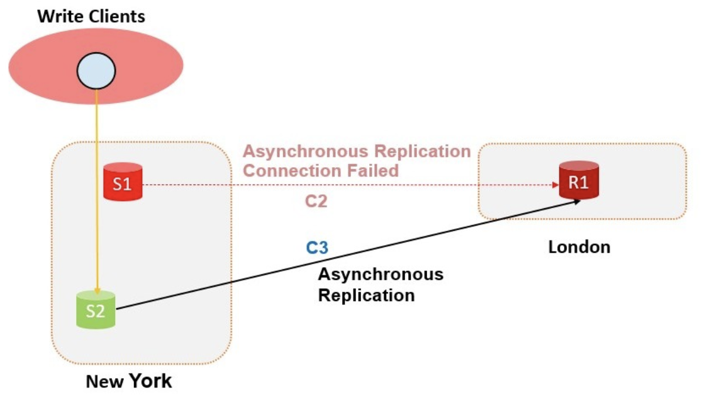
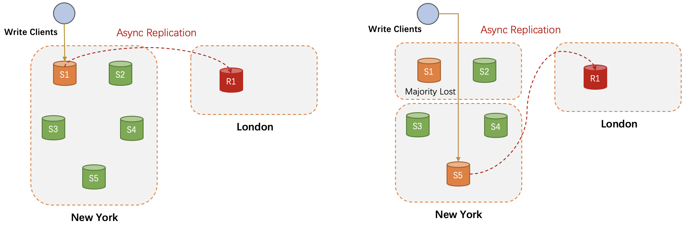

# MySQL · 内核特性 · Automatic connection failover

**Date:** 2021/04
**Source:** http://mysql.taobao.org/monthly/2021/04/01/
**Images:** 7 images downloaded

---

数据库内核月报

 [
 # 数据库内核月报 － 2021 / 04
 ](/monthly/2021/04)

 * 当期文章

 MySQL · 内核特性 · Automatic connection failover
* MongoDB · 内核特性 · 一致性模型设计与实现
* MySQL · 资源管理 · PFS内存管理分析
* MySQL · HTAP · 分析型执行引擎
* MySQL · 内核分析 · InnoDB主键约束和唯一约束的实现分析
* MySQL · 源码阅读 · Window function解析

 ## MySQL · 内核特性 · Automatic connection failover 
 Author: zhenpin 

 ## 简介
从MySQL 8.0.22开始，官方对主备复制链路的容错性做了进一步的增强，支持了一个称为“*Automatic Asynchronous Replication connection failover*”的自动连接容错功能。该功能在两个版本中分两个阶段进行了实现，具体来说：

* 在MySQL 8.0.22版本上，我们可以为某个异步复制链路配置多个备用的源端，若当前使用的源端和目的端之间的连接不可用，如源节点宕机或者网络故障导致IO线程报错，备库能够自动地尝试连接备用的主地址。借助原有的GTID和MASTER_AUTO_POSITION功能，链路切换之后也可以找到正确的位点进行数据续传。此外，该功能也支持对多个备用的源端配置不同的优先级，优先切换高优先级的备选节点。需要注意的是，它不同于多源复制，备库依然只维护一条异步复制链路，而不是同时连接多个主库。
* 在MySQL 8.0.23版本上，官方进一步把该机制和MySQL Group Replication（MGR）结合到了一起。Group Replication一般以多节点的模式进行部署，多个节点通过Paxos协议互联，这意味着理论上从任意一个节点都可以用binlog dump获取全量数据。如果当前复制链路的源端是Group Replication中的一个节点，且开启了自动连接容错，IO线程能够感知Group Replication中的HA切换和增减节点的行为，自动的将源端跟踪到最新的主节点。

## 使用场景
以官方blog中的图片为例。假设当前我们有两个数据中心，分别在New York和London。New York是主机房，部署了多个MySQL的副本，S1为主库接收读写请求，S2为从库，他们之间以C1链路进行连接，C1链路可以是异步复制或者Group Replication。如果是Group Replication，New York机房还会有S3，下图暂时省略掉。London机房有一个只读节点R1，由于New York和London是不同的数据中心，考虑到延迟的问题，MGR不适合跨地域的场景，他们之间一般会用异步模式进行复制。

正常情况下R1从S1通过C2链路同步数据。当S1发生故障时，C2链路的IO线程会报错。在传统的场景下，一般有两种处理方法：R1发出IO线程不可用的告警，通知DBA手动执行CHANGE MASTER命令修正复制链路；或者在London部署一个第三方监控工具，定期探测New York机房的实例状态，探测到S1故障后，执行London的链路切换。

S1宕机后，New York中心机房会触发高可用机制，Group Replication会自动将主节点切换到S2，如果是异步复制则会借助MySQL MHA等外部工具。开启Automatic connection failover功能后，我们会给R1的源端配置一个包括S1、S2的可选列表。考虑到短期网络抖动的可能，C2链路会在一定时间内进行重连。当重试时间超过一定阈值后，R1会自动和S2建立一个新的链路C3，继续同步New York中心机房的数据，无需外部系统介入。

## 注意事项

* 所有节点需要开启GTID：gtid_mode=ON；
* 在配置复制链路的时候，需要设置MASTER_AUTO_POSITION=1；
* 所有节点的复制账号需要用同一套账号密码；

## 使用样例
首先我们拉起两个实例S1和S2，假设端口分别是13000和13100。
在S1上创建复制账号。

`mysql> CREATE USER 'replicator'@'%' IDENTIFIED BY 'mypass';
Query OK, 0 rows affected (0.01 sec)

mysql> GRANT ALL ON *.* TO 'replicator'@'%';
Query OK, 0 rows affected (0.00 sec)
`
在S2上创建S1→S2的主备复制关系。

`mysql> CHANGE MASTER TO MASTER_HOST='127.0.0.1', MASTER_PORT=13000, MASTER_USER='replicator', MASTER_PASSWORD='mypass', GET_MASTER_PUBLIC_KEY=1, MASTER_AUTO_POSITION = 1 FOR CHANNEL 'c1';
Query OK, 0 rows affected, 8 warnings (0.01 sec)

mysql> START SLAVE FOR CHANNEL 'c1';
Query OK, 0 rows affected, 1 warning (0.00 sec)

mysql> show slave status\G
*************************** 1. row ***************************
 Slave_IO_State: Waiting for master to send event
 Master_Host: 127.0.0.1
 Master_User: replicator
 Master_Port: 13000
 Slave_IO_Running: Yes
 Slave_SQL_Running: Yes
 Auto_Position: 1
 Channel_Name: c1
1 row in set, 1 warning (0.00 sec)
`
拉起实例R1，假设端口是13200。执行如下命令创建复制链路。之前提到过当重试时间超过一定阈值后，才会触发自动连接容错，该阈值依赖两个参数，MASTER_RETRY_COUNT和MASTER_CONNECT_RETRY。其中MASTER_RETRY_COUNT默认值是86400，MASTER_CONNECT_RETRY默认值是60秒，即默认场景下，60天之后才超出重连阈值。因此我们把他调小为2分钟。

`mysql> CHANGE MASTER TO MASTER_HOST='127.0.0.1', MASTER_PORT=13000, MASTER_USER='replicator', MASTER_PASSWORD='mypass', GET_MASTER_PUBLIC_KEY=1, MASTER_AUTO_POSITION = 1, MASTER_RETRY_COUNT=2, MASTER_CONNECT_RETRY=60 FOR CHANNEL 'c2';
Query OK, 0 rows affected, 10 warnings (0.01 sec)

mysql> START SLAVE FOR CHANNEL 'c2';
Query OK, 0 rows affected, 1 warning (0.00 sec)

mysql> show slave status\G
*************************** 1. row ***************************
 Slave_IO_State: Waiting for master to send event
 Master_Host: 127.0.0.1
 Master_User: replicator
 Master_Port: 13000
 Connect_Retry: 60
 Slave_IO_Running: Yes
 Slave_SQL_Running: Yes
 Master_Retry_Count: 2
 Auto_Position: 1
 Channel_Name: c2
1 row in set, 1 warning (0.00 sec)
`
然后在R1调用官方提供的UDF（asynchronous_connection_failover_add_source）添加备选源端，还可以通过系统表查询已添加的地址。相关UDF的使用方法和参数可以参考官方文档 [Functions which Configure the Source List](https://dev.mysql.com/doc/refman/8.0/en/replication-functions-source-list.html)。

`mysql> SELECT asynchronous_connection_failover_add_source('c2', '127.0.0.1', 13000, '', 50);
+-------------------------------------------------------------------------------+
| asynchronous_connection_failover_add_source('c2', '127.0.0.1', 13000, '', 50) |
+-------------------------------------------------------------------------------+
| The UDF asynchronous_connection_failover_add_source() executed successfully. |
+-------------------------------------------------------------------------------+
1 row in set (0.00 sec)

mysql> SELECT asynchronous_connection_failover_add_source('c2', '127.0.0.1', 13100, '', 50);
+-------------------------------------------------------------------------------+
| asynchronous_connection_failover_add_source('c2', '127.0.0.1', 13100, '', 50) |
+-------------------------------------------------------------------------------+
| The UDF asynchronous_connection_failover_add_source() executed successfully. |
+-------------------------------------------------------------------------------+
1 row in set (0.00 sec)

mysql> select * from mysql.replication_asynchronous_connection_failover;
+--------------+-----------+-------+-------------------+--------+--------------+
| Channel_name | Host | Port | Network_namespace | Weight | Managed_name |
+--------------+-----------+-------+-------------------+--------+--------------+
| c2 | 127.0.0.1 | 13000 | | 50 | |
| c2 | 127.0.0.1 | 13100 | | 50 | |
+--------------+-----------+-------+-------------------+--------+--------------+
2 rows in set (0.00 sec)
`
调用CHANGE MASTER在R1开启自动连接容错功能，之后replication_connection_configuration中SOURCE_CONNECTION_AUTO_FAILOVER列会显示为1，replication_connection_status中SERVICE_STATE会显示为ON。

`mysql> CHANGE MASTER TO SOURCE_CONNECTION_AUTO_FAILOVER=1 FOR CHANNEL 'c2';
Query OK, 0 rows affected, 1 warning (0.00 sec)

mysql> SELECT CHANNEL_NAME, SOURCE_CONNECTION_AUTO_FAILOVER FROM performance_schema.replication_connection_configuration;
+--------------+---------------------------------+
| CHANNEL_NAME | SOURCE_CONNECTION_AUTO_FAILOVER |
+--------------+---------------------------------+
| c2 | 1 |
+--------------+---------------------------------+
1 row in set (0.00 sec)

mysql> select CHANNEL_NAME, SERVICE_STATE from performance_schema.replication_connection_status\G
*************************** 1. row ***************************
 CHANNEL_NAME: c2
SERVICE_STATE: ON
1 row in set (0.00 sec)
`
进行破坏性测试，我们主动kill实例S1，并观察R1的状态。

`mysql> show slave status\G
*************************** 1. row ***************************
 Slave_IO_State: Reconnecting after a failed master event read
 Master_Host: 127.0.0.1
 Master_User: replicator
 Master_Port: 13000
 Slave_IO_Running: Connecting
 Slave_SQL_Running: Yes
 Last_IO_Error: error reconnecting to master 'replicator@127.0.0.1:13000' - retry-time: 60 retries: 1 message: Can't connect to MySQL server on '127.0.0.1:13000' (111)
 Channel_Name: c2
1 row in set, 1 warning (0.00 sec)
`
等待2分钟左右，我们可以看到R1成功连接到了S2，功能测试完成。

`mysql> show slave status\G
*************************** 1. row ***************************
 Slave_IO_State: Waiting for master to send event
 Master_Host: 127.0.0.1
 Master_User: replicator
 Master_Port: 13100
 Slave_IO_Running: Yes
 Slave_SQL_Running: Yes
 Channel_Name: c2
1 row in set, 1 warning (0.01 sec)
`
前面的步骤只用到了添加节点的接口，除此之外，官方还支持删除节点、添加MGR节点、删除MGR节点的功能，具体的细节可以参考上面提到的官方文档。

## 总结和思考
本文主要介绍了新版本MySQL 8.0提供的Automatic connection failover相关功能，可以看到该功能对跨数据中心复制链路的高可用有一定的帮助。目前本文还未深入研究内部的实现方案，只是做了初步的功能测试，直观上感觉类似功能的代码实现并不复杂，感兴趣的朋友可以一起进一步阅读源码。在此引申两点思考：

1. 在Group Replication的场景下，如何解决老主与多数派网络隔离的问题？举一个例子，假设我们有一组包含5个节点的MGR的实例，同时有一个配置了Automatic connection failover的异步只读节点。假设这5个节点发生了2-3网络隔离，5个节点被隔离为2个网络分区，分区内节点网络正常，分区间的节点隔离。假设老主留在2个节点的那个分区，此时新的事务已经无法达成多数派了，新主会在另一个分区选出来。在这种情况下，老主并没有宕机，只读节点的IO线程不会断连报错，但理论上只读节点应将源库切换到另一个分区中的节点才能同步到最新的数据。从官方文档来看，MySQL在8.0.23版本的MGR方案支持了这个场景，在阅读源码的过程中可以注意一下相关实现。当然，如果源端的集群是自研的多节点集群方案，就需要自己考虑这个问题。

1. Automatic connection failover功能解决了备机房单个只读节点跟随主机房HA同步切换的问题，但如果备机房有多个节点，然后发生了故障切换呢？事实上一个更常见的部署模式为，A机房作为主机房用MGR部署三个节点，B机房作为备机房同样用MGR部署三个节点，B机房同步A机房的数据。我们希望作如下扩展，当B机房发生HA的时候，B机房的新主可以自动重新建立和当前A机房主节点的连接。目前官方并没有给出这类问题的系统性解法，Percona有一篇博客提到了借助cron工具定期调用自定义函数的解决思路，可行但并不优雅，可供参考。

阿里云在MySQL高可用方面已经有了多年的探索经验。阿里云数据库有一个项目叫X-Cluster，对应云上的产品叫RDS三节点企业版。我们的三节点产品在2017年就支持通过以Learner角色接入一致性协议，实现异步只读节点。Learner不依赖GTID，依靠Paxos协议保证只读节点和主库的数据一致性，解决自动连接容错的问题。基于Paxos协议，在网络分区的场景下，新主会主动和Learner通信，创建新的同步链路。此外还支持级联复制，备机房的只读节点既可以挂载在主机房的读写节点上，也可以级联挂载在任意其他只读节点上，从而搭建多机房单元化的部署模式。对于级联复制，同样借助一致性协议实现自动容错。可以看到，在跨机房、跨地域部署的高可用技术上，阿里云数据库已经走在了官方的前面，对上文提到的两点思考都有系统性的解决方案，具体的技术细节可以参考我之前写的文章 [RDS三节点企业版·一致性协议](http://mysql.taobao.org/monthly/2019/11/06/) 和 [RDS三节点企业版·Learner 只读实例](http://mysql.taobao.org/monthly/2019/11/07/)。

数据库上云是大势所趋，当前基本所有公有云提供的MySQL服务都具备高可用能力，平台或多或少的解决了复制链路容灾的问题，无需用户或运维人员介入。官方的Automatic connection failover功能可以说是姗姗来迟，但也并不是一无是处，在这里我抛砖引玉，提供一个未来展望的方向。

随着企业在数字化转型的过程中，对合规、数据安全、功能定制化等需求逐步上升，混合云的概念现在火热起来。简单来说，混合云将私有云和公有云结合起来，中间通过专用网络进行数据同步，其优势不再赘述。以数据库为场景举个例子，客户基于开源版本的MySQL在私有云部署敏感业务，同时在公有云购买云服务商的MySQL高可用版本，以支持弹性、高增长的新业务。此外，客户希望自己手里有完整的数据，会异步的将公有云的数据同步到私有云。由于数据同步链路脱离于云服务商的系统，公有云执行容灾切换或弹性扩缩容后，如何保证这个中间链路的可靠性就成为了一个核心问题。考虑到客户不一定有足够的研发能力，所以一般混合云解决方案会附带售卖如DTS这样的数据同步服务。现在有了Automatic connection failover后，客户可以将私有云MySQL的备选源端配置为公有云的多个高可用节点，无需第三方的服务就能实现较为稳定可靠的同步链路，是不是可以省下一大笔钱。

那么本文就说到这里，随着MySQL的完善和发展，我相信未来会有更多的业务场景被不断发掘出来。

## 参考资料

* 官方Worklog WL#12649: Automatic connection failover for Async Replication Channels - Step I: Automatic Connection Failover https://dev.mysql.com/worklog/task/?id=12649
* 官方WorkLog WL#14019: Automatic connection failover for Async Replication Channels - Step II: Automatic senders list https://dev.mysql.com/worklog/task/?id=14019
* 官方文档 Switching Sources with Asynchronous Connection Failover https://dev.mysql.com/doc/refman/8.0/en/replication-asynchronous-connection-failover.html
* 官方博客 Automatic Asynchronous Replication Connection Failover https://mysqlhighavailability.com/automatic-asynchronous-replication-connection-failover/
* MySQL · 引擎特性 · RDS三节点企业版 一致性协议 http://mysql.taobao.org/monthly/2019/11/06/
* MySQL · 引擎特性 · RDS三节点企业版 Learner 只读实例 http://mysql.taobao.org/monthly/2019/11/07/
* What You Can Do With Auto-Failover and Percona Distribution for MySQL (8.0.x) https://www.percona.com/blog/2021/04/14/what-you-can-do-with-auto-failover-and-percona-distribution-for-mysql-8-0-x/

 阅读： - 

本作品采用[知识共享署名-非商业性使用-相同方式共享 3.0 未本地化版本许可协议](http://creativecommons.org/licenses/by-nc-sa/3.0/)进行许可。

 