# MySQL · 源码阅读 · Window function解析

**Date:** 2021/04
**Source:** http://mysql.taobao.org/monthly/2021/04/06/
**Images:** 15 images downloaded

---

数据库内核月报

 [
 # 数据库内核月报 － 2021 / 04
 ](/monthly/2021/04)

 * 当期文章

 MySQL · 内核特性 · Automatic connection failover
* MongoDB · 内核特性 · 一致性模型设计与实现
* MySQL · 资源管理 · PFS内存管理分析
* MySQL · HTAP · 分析型执行引擎
* MySQL · 内核分析 · InnoDB主键约束和唯一约束的实现分析
* MySQL · 源码阅读 · Window function解析

 ## MySQL · 源码阅读 · Window function解析 
 Author: mamiao 

 **1 window function 分类** 

Aggregates: COUNT, SUM, AVG 

Ranking: RANK, DENSE_RANK, PERCENT_RANK, CUME_DIST, ROW_NUMBER 

Analytical: NTILE, LEAD, LAG, NTH, FIRST_VALUE, LAST_VALUE 

其中标红为额外需要buffer的window函数 

下面我们先看一下每个window function的执行情况，用于理解window function的使用场景： 

**1.1 Rank:** 

SELECT name, department_id AS dept, salary, 

RANK() OVER w AS `rank` 

FROM employee 

WINDOW w AS (PARTITION BY department_id 

ORDER BY salary DESC);

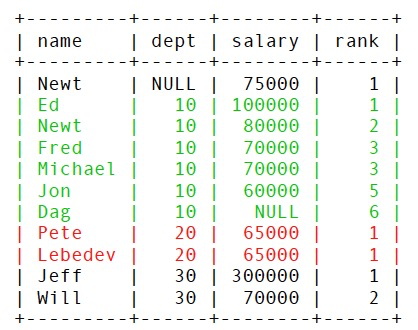

**1.2 Dense_rank** 

SELECT name, department_id AS dept, salary, 

RANK() OVER w AS `rank`, DENSE_RANK() OVER w AS dense 

FROM employee 

WINDOW w AS (PARTITION BY department_id 

ORDER BY salary DESC); 

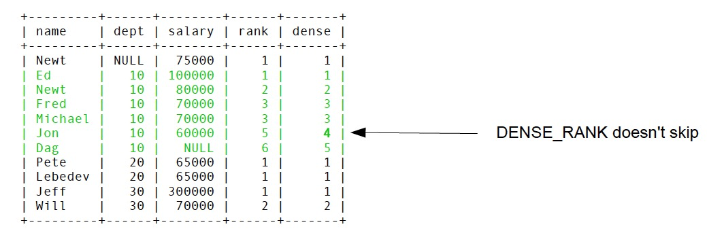
**1.3 Row_number** 

SELECT name, department_id AS dept, salary, 

RANK() OVER w AS `rank`, DENSE_RANK() OVER w AS dense, 

ROW_NUMBER() OVER w AS `#` 

FROM employee 

WINDOW w AS (PARTITION BY department_id 

ORDER BY salary DESC); 

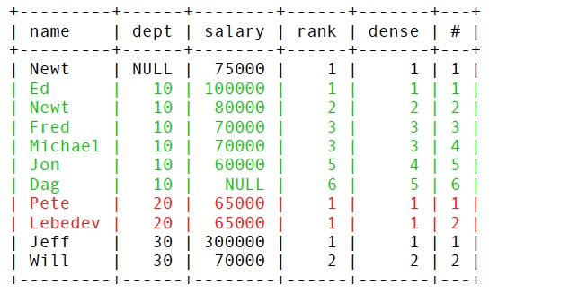

**1.4 cume_dist** 

0< cume_dist () <=1 

SELECT name, department_id AS dept, salary, 

RANK() OVER w AS `rank`, DENSE_RANK() OVER w AS dense, 

ROW_NUMBER() OVER w AS `#`, CUME_DIST() OVER w AS cume 

FROM employee 

WINDOW w AS (PARTITION BY department_id 

ORDER BY salary DESC); 

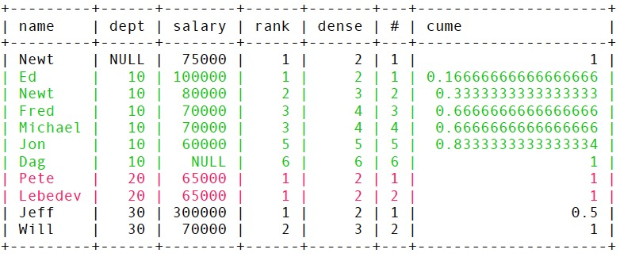
**1.5 percent_rank** 

0<= percent_rank () <=1 

SELECT name, department_id AS dept, salary, 

RANK() OVER w AS `rank`, DENSE_RANK() OVER w AS dense, 

ROW_NUMBER() OVER w AS `#`, CUME_DIST() OVER w AS cume, 

PERCENT_RANK() OVER w AS p_r 

FROM employee WINDOW w AS (PARTITION BY department_id 

ORDER BY salary DESC); 

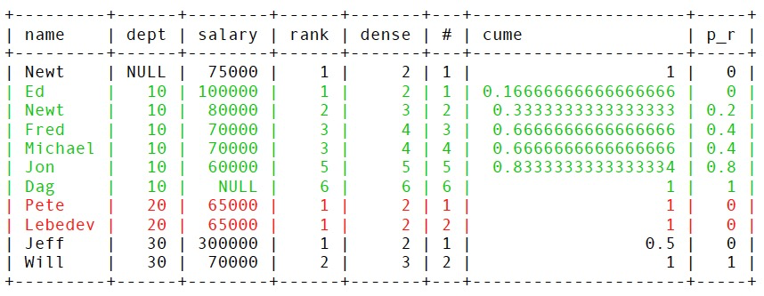
**Note:cume_dist** computes the fraction of partition rows that are less than or equal to the current row and its peers, while **percent_rank** computes the fraction of partition rows that are less than the current row, assuming the current row does not exist in the partition.

**1.6 NTILE** 

SELECT name, department_id AS dept, salary, 

… 

PERCENT_RANK() OVER w AS p_r, NTILE(3) OVER w AS `ntile` 

FROM employee WINDOW w AS (PARTITION BY department_id 

ORDER BY salary DESC); 

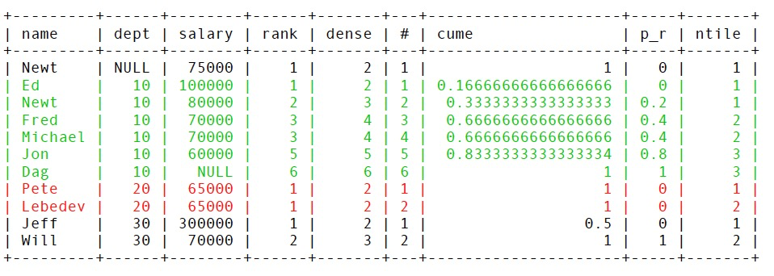

**1.7 LEAD** 

SELECT name, department_id AS dept, salary, 

LEAD(salary, 1) OVER w AS `lead` 

FROM employee 

WINDOW w AS (PARTITION BY department_id 

ORDER BY salary DESC); 

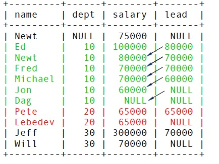

**1.8 LAG** 

SELECT name, department_id AS dept, salary, 

LAG(salary, 1) OVER w AS `lag`, 

LEAD(salary, 1) OVER w AS `lead` 

FROM employee 

WINDOW w AS (PARTITION BY department_id 

ORDER BY salary DESC); 

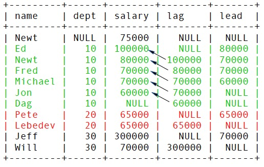

**1.9 FIRST_VALUE** 

SELECT name, department_id AS dept, salary, 

SUM(salary) OVER w AS `sum`, 

FIRST_VALUE(salary) OVER w AS `first` 

FROM employee WINDOW w AS (PARTITION BY department_id 

ORDER BY name 

ROWS BETWEEN 2 PRECEDING AND CURRENT ROW) 

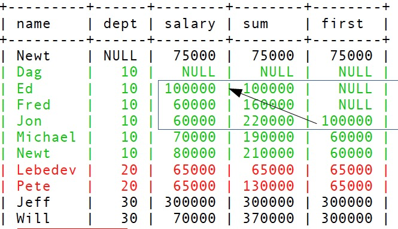

**1.10 LAST_VALUE** 

SELECT name, department_id AS dept, salary, 

SUM(salary) OVER w AS `sum`, 

FIRST_VALUE(salary) OVER w AS `first`, LAST_VALUE(salary) OVER w AS `last` 

FROM employee WINDOW w AS (PARTITION BY department_id 

ORDER BY name 

ROWS BETWEEN 2 PRECEDING AND CURRENT ROW) 

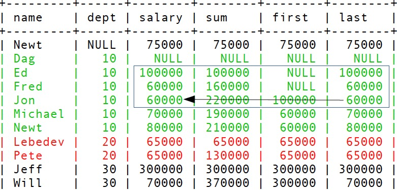

**1.11 NTH_VALUE** 

SELECT name, department_id AS dept, salary, 

SUM(salary) OVER w AS `sum`, 

NTH_VALUE(salary, 2) OVER w AS nth

FROM employee WINDOW w AS (PARTITION BY department_id 

ORDER BY name 

ROWS BETWEEN 2 PRECEDING AND CURRENT ROW)

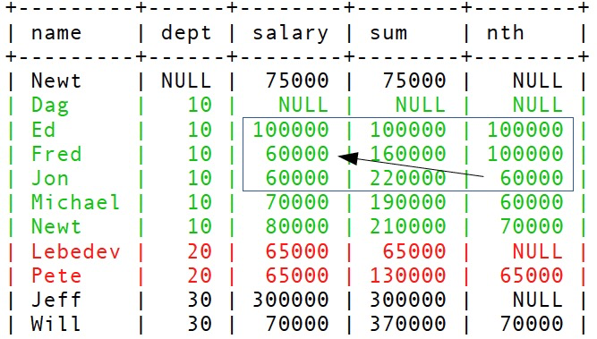

**2 Window function的解析:** 

**2.1 Implicit and explicit windows** 

Windows can be implicit and unnamed: 

COUNT(*) OVER (PARTITION BY DEPARTMENT_ID) 

 Windows can be defined and named via the windows clause clause: 

SELECT COUNT(*) OVER w FROM t 

WINDOW w as (PARTITION BY department_id) 

**2.2 window解析** 

window function 按照用户的输入进行解析，window和window function是有一定的解析顺序和规则的。 

规则1 SELECT COUNT(*) OVER（w), mysql认为(w)为一个新的uname window, 新生成一个unnamed window, w是该unamed window的ancestor 

规则2 SELECT COUNT(*) OVER w, SELECT sum(*) OVER w 会做为一个window的两个window function, 所以一个window可能有多个window function 

规则3 每个window都有自己唯一的position, 用于区分不同的window（有name和无name的），其生成序号的顺序是按照用户输入的window的顺序生成，但是执行顺序可能会不一样，有一定的优化 

规则4 SELECT COUNT(*) OVER (w order by a), WINDOW w as (PARTITION BY department_id), window可以定义一部分如partition by，继承后的window function可以定义自己的另一部分如order by, 但不允许两边同时定义相同的部分。 

规则5 window的SQL解析要避免嵌套依赖关系，如： 

 SELECT ROW_NUMBER() OVER w FROM t1 WINDOW w AS (w2), w1 AS (w), w2 as (w1); 

w->w2 w1->w w2->w1 

 SELECT ROW_NUMBER() OVER w FROM t1 WINDOW w AS (w); 

w->w

规则6 A window which depends on another cannot define partitioning. 

 select ROW_NUMBER() OVER (w1 partition by dept) AS ‘row_number’ from employee_salaries WINDOW w1 as (); 

规则7 继承关系的window不能存在多个order by定义 

mysql> explain select ROW_NUMBER() OVER (w1 order by dept) AS ‘row_number’ from employee_salaries WINDOW w1 as (order by salary desc); 

ERROR 3583 (HY000): Window ‘' cannot inherit 'w1' since both contain an ORDER BY clause.

**2.3 window inheriting** 

**继承关系表示一个window继承了另一个window的partition by和order by的信息，如：** 

SELECT name, department_id, 

COUNT(*) OVER w1 AS cnt1, 

COUNT(*) over w2 AS cnt2 FROM employee 

WINDOW w1 AS (PARTITION BY department_id), 

w2 AS (w1 ORDER BY name) 

ORDER BY department_id, name; 

w2继承了w1的partition by department_id, 并且自定义自己的order by name.

**2.4 window frame clause bound 定义** 

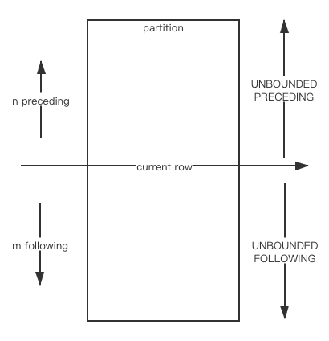

**2.5 串行的执行流程** 

**2.5.1 no need buffer** 

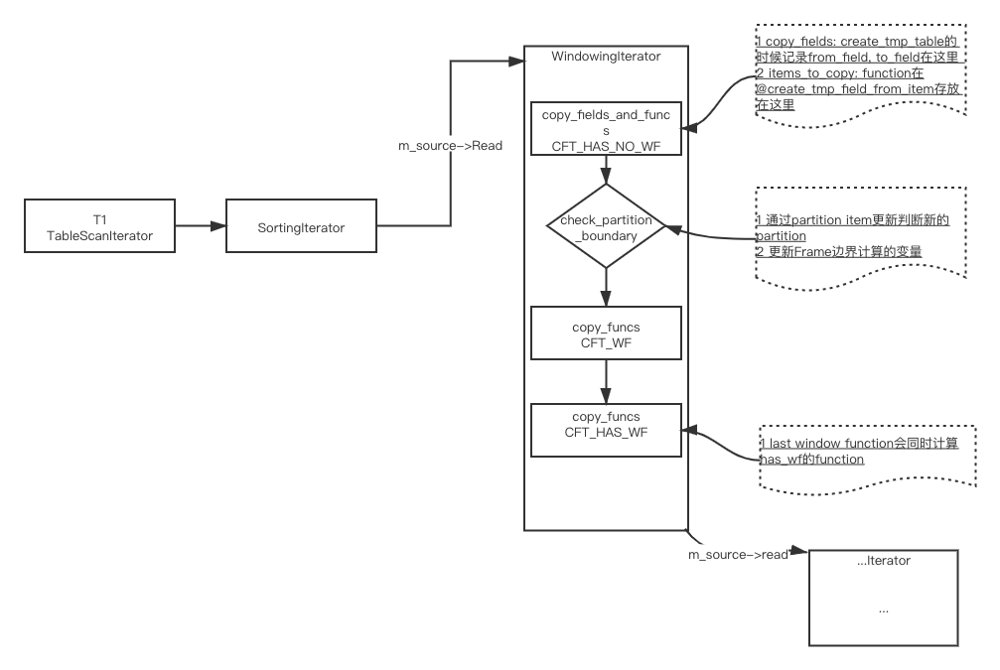
**2.5.2 need buffer**

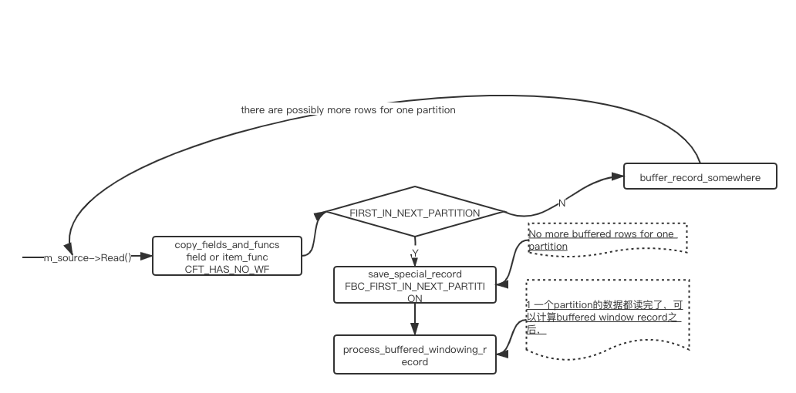
**3 PolarDB对window的支持** 

目前PolarDB对window支持了并行，支持了多worker并行执行windows, 大大提升了window的查询性能。 

以TCPH Q2和Q17为例，100G的数据量，32个并行度情况下，Q2从原来的1.5秒左右提升到0.65秒左右，Q17从11.8秒左右到1.1秒左右.

 阅读： - 

本作品采用[知识共享署名-非商业性使用-相同方式共享 3.0 未本地化版本许可协议](http://creativecommons.org/licenses/by-nc-sa/3.0/)进行许可。

 