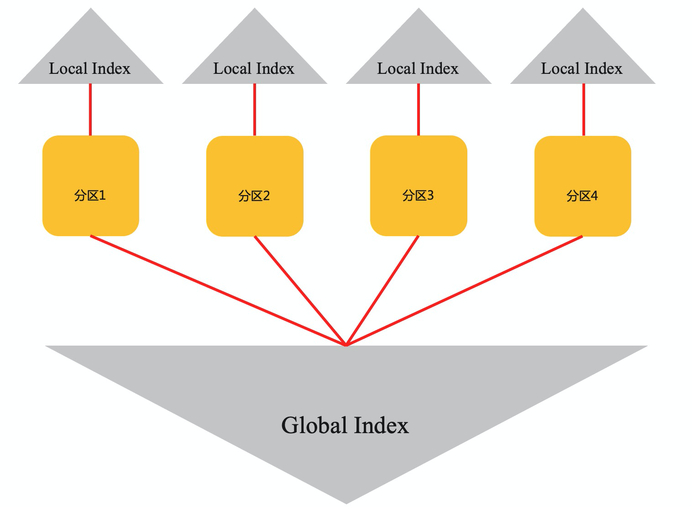
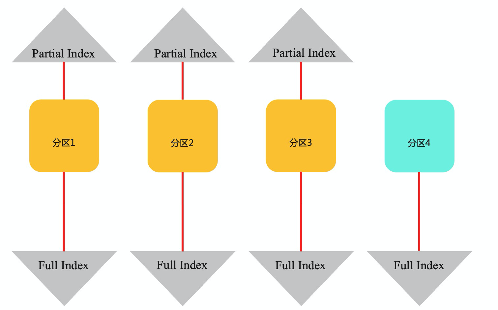

# MySQL · 内核特性 · 分区表下的多种索引类型

**Date:** 2021/06
**Source:** http://mysql.taobao.org/monthly/2021/06/06/
**Images:** 3 images downloaded

---

数据库内核月报

 [
 # 数据库内核月报 － 2021 / 06
 ](/monthly/2021/06)

 * 当期文章

 MySQL · 性能优化 · Undo Log IO优化
* MySQL · 源码分析 · Semi-join优化与执行逻辑
* MySQL · 源码分析 · Range (Min-Max Tree)结构分析
* MySQL · 源码分析 · Order By优化逻辑代码分析
* MySQL · 内核特性 · Btree 顺序插入优化及问题
* MySQL · 内核特性 · 分区表下的多种索引类型

 ## MySQL · 内核特性 · 分区表下的多种索引类型 
 Author: 西格 

 ### 分区表简述

对于MySQL的大表用户，分区表是非常重要的特性。分区表可以根据用户指定的分区键和分区规则，把一张大表划分为多个不相交的分区。相比于原本的一张大表，每个分区的数据就可以大大减少，对于表内数据的查询和修改等操作可以更加的高效。例如常见的把时间字段作为分区键，就可以完成新老数据的划分，对新数据的访问就会大大减少查找的数据量，让不常被访问的老数据进去到独立的分区，运维起来也会更加方便，可以高效地清理历史数据。而用户在使用分区表时，就和使用非分区表一样，访问分区表时不用在业务侧修改DML的语法。

### 分区表上多样的索引类型

在分区表上，可以有多种索引类型。除了传统的局部索引（Local Index）和完整索引（Full Index），本文还将介绍全局索引（Global Index）和部分索引（Partial Index）的概念。

#### Local Index和Global Index

分区表上传统的索引形式都是局部索引，在分区表上创建一个普通的索引时，实际上会在每个分区内都为这个索引建立一棵b+树。以下面的sql为例，创建一个拥有4个分区的分区表t1，当在字段b上创建索引时，会在每个分区的ibd文件内都生成一个索引的b+树，每个分区的b+树都只会包含对应分区内的数据。

`create table t1(a int, b int) partition by hash(a) partitions 4;
alter table t1 add index(b);
`

对于Local Index，当DML操作的where条件包含了完整的分区键时，可以快速地找到具体要到哪个分区去做具体DML操作。比如下面的第一条sql，where条件包含了分区键字段a，就可以根据a的条件定位到具体分区，然后在该分区的索引b上进行查找。而如果是第二条sql，where条件中没有包含分区键，那就只能对所有分区的索引b进行查找。

`select * where a = 1 and b > 5;
select * where b > 5;
`

从这个例子可以看出，对于条件中不包含分区键的DML操作，会对分区表内所有分区都进行操作，这样一次的开销会变得更大。在OLTP的应用场景下，DML往往是需要灵活的查询条件，可能就会频繁遇到这样的情况。

分区表的约束也是一个问题，在分区表中，主键必须包含全部的分区键，对于表t1，指定主键必须包含字段a。同样的，对于唯一约束（unique key），也是必须包含全部的分区键。这样一来，分区表的约束显然是不够灵活的。

而为了增强分区表的约束能力和不包含分区键的DML能力，Global Index就诞生了。如图所示，Global Index用全部分区的数据构建一个大的索引。当需要使用索引进行查询时，不需要定位到具体分区，因为一棵b+树上已经包含了全部分区的数据，直接进入Global Index的b+树进行查找就可以了，可以增强不包含分区键的DML能力。不过如果需要回表操作的话，还是需要到具体分区的主键索引上拿数据。

而对于分区表的约束问题，Global Index可以做到支持不包含分区键的唯一约束。Local Index不支持唯一约束是因为当插入一条数据的时候，只会往对应分区内插入这条数据，而Local Index在一个分区内只会包含这个分区的数据，不足以支撑唯一性判断，如果需要达到这个目的，就得遍历local index在全部分区中的b+树，这样的开销就会非常大了。而Global Index因为只存在一棵b+树，插入时候的检查就足够了。

#### Full Index和Partial Index

在传统意义上，当我们在表t1上创建一个索引b的时候，不管是平时的Local Index，还是前文讲到的Global Index，这个索引b都会包含分区表字段b的全部数据（这里Local Index的索引b包含所有分区上该索引的b+树），这种对索引字段在表内的全部数据上建立的索引称为Full Index，相对的，如果只对索引字段在表内的部分数据上建立的索引称为Partial Index。

Partial Index可以满足更灵活的索引需求，在一些情况下，Partial Index可以实现性能的提升或是成本的降低。例如用户可以只在一些经常需要用到的数据上建立索引，而不常用的数据就不在索引内，这样构建的Partial Index比起Full Index，数据量更小，节约存储成本也提升查询效率；又或者是用户可以只在较为稳定的数据上构建索引，这样在大量更新数据的时候，减少索引维护的性能开销。

#### 更多的组合类型

Global Index、Local Index和Partial Index、Full Index在大部分情况下并不冲突，他们可以组合形成如Partial Global Index这样的索引，不过需要注意的是，Partial Index和唯一约束是冲突的，两者无法一同使用。

 阅读： - 

本作品采用[知识共享署名-非商业性使用-相同方式共享 3.0 未本地化版本许可协议](http://creativecommons.org/licenses/by-nc-sa/3.0/)进行许可。

 