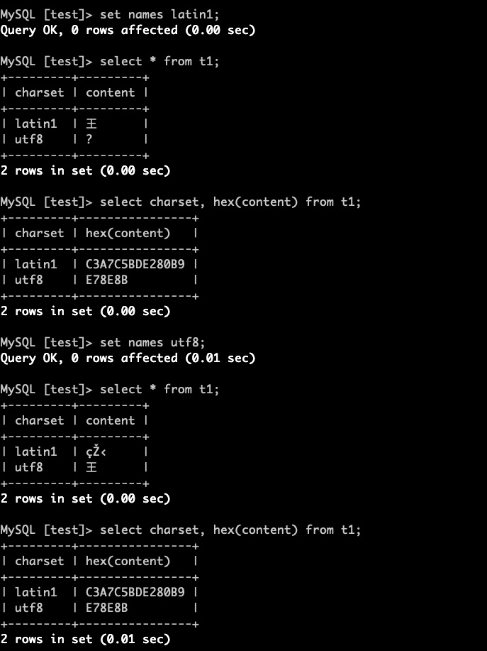

# MySQL · 最佳实战 · SQL编码转换浅析

**Date:** 2021/08
**Source:** http://mysql.taobao.org/monthly/2021/08/01/
**Images:** 3 images downloaded

---

数据库内核月报

 [
 # 数据库内核月报 － 2021 / 08
 ](/monthly/2021/08)

 * 当期文章

 MySQL · 最佳实战 · SQL编码转换浅析
* MySQL · 源码分析 · 详解 Data Dictionary
* POLARIS · 引擎分析 · 基于单机数据库扩展的分布式查询处理引擎
* MySQL · 源码分析 · 参数解析流程

 ## MySQL · 最佳实战 · SQL编码转换浅析 
 Author: rixiu 

 ## 背景
故事从一次中文乱码事件说起。某用户发现插入的中文数据为乱码，不知道是如何引起。用户想知道问题的根因，确保系统的配置正确，未来不再出现乱码。用户数据表存中文数据的列为字符集为utf8。经过对审计日志的分析，发现乱码数据系插入或更新数据时，数据库连接使用了latin1字符集（set names latin1;）。

## 乱码重现
• use test;

• drop table if exists t1； 
• dcreate table t1 (charset varchar(10), content varchar(100)) default charset=utf8;

• set names latin1;

• insert into t1 values(‘latin1’, ‘王’);

• set names utf8;

• insert into t1 values(‘utf8’, ‘王’);

• set names latin1;

• select * from t1;

• select charset, hex(content) from t1;

• set names utf8;

• select * from t1;

• select charset, hex(content) from t1;

## 乱码分析
### MySQL字符集转换时机
一条SQL语句进入MySQL执行，到最后结果返回，可能会经历两次字符集转换。

a. MySQL在收到SQL语句之后，会进行一次字符集转换。如果连接的字符集和列的字符集不同，则进行转换。

b. MySQL在发送结果之前，同样也会进行一次字符集转换。如果连接的字符集和列的字符集不同，则进行转换。

### 字符集转换分析
王的utf8编码为E7 8E 8B

### Case#1
1.1 插入Set names latin1;

• 收到E7 8E 8B as latin1 (客户端直接把utf8的编码作为latin1了，why？）

• 转换编码C3 A7 C5 BD E2 80 B9 as utf8， 存入InnoDB记录中—这步转换导致乱码

1.2 查询Set names latin1;
• 查询结果返回，编码转换E7 8E 8B as latin1

• 界面显示正确中文字符。

1.3 查询Set names utf8;
• 查询结果返回，无需编码转换C3 A7 C5 BD E2 80 B9 as utf8

• 界面显示为乱码，无法识别为utf8的字符。

### Case#2
2.1 插入Set names utf8;

• 收到E7 8E 8B as utf8
• 无需编码转换E7 8E 8B as utf8，存入InnoDB记录中

2.2 查询Set names utf8;

• 查询结果返回，无需编码转换E7 8E 8B as utf8

• 界面显示正确中文字符

2.3 查询Set names latin1;

• 查询结果返回，编码转换为3F as latin1 —编码信息丢失！！！

• 界面显示为？，可以理解为乱码

以我个人的理解，数据库的乱码是指按照列的字符集属性去解析存入磁盘页面中列的内容而无法显示正确的字符。情况1属于数据库乱码，情况2则不属于。

## 乱码识别
那么如何识别乱码呢？当然最直观的是从用户界面的显示一眼就可以看出是否为乱码。那么有没有办法通过程序自动的识别乱码呢？针对这种中文乱码情况，可以通过以下方法来进行识别。

转换为gbk，如果出现3F，则表示乱码。

SELECT charset, HEX(cast(CONVERT(content, CHAR CHARACTER SET gbk) as binary)) from t1;

• (latin1插入)C3 A7 C5 BD E2 80 B9 as utf8，编码转换3F 3F 3F as gbk —编码信息丢失！！！

• (utf8 插入)E7 8E 8B as utf8, 编码转换CD F5

• Binary返回无需编码转换

## 乱码修复
乱码编码是否可以转换（可逆）?

• SELECT HEX(CAST(CONVERT(CONVERT(X’C3A7C5BDE280B9’, CHAR CHARACTER SET utf8), CHAR CHA
RACTER SET latin1) AS BINARY));

• E7 8E 8B

• 转换成功!

• update t1 set content = CAST(CAST(CONVERT(content, CHAR CHARACTER SET latin1) AS BINARY) AS
CHAR CHARACTER SET utf8) where charset=’latin1’; 

• 记录中C3 A7 C5 BD E2 80 B9 as utf8

• 第一次转换为E7 8E 8B as latin1. —此时已经恢复为正确的utf8编码，但是字符集属性为latin1

• 第二次转换为E7 8E 8B as binary —利用binary作为过渡

• 第三次转换为E7 8E 8B as utf8 —编码恢复正常！

## 字符集和字符集编码
Unicode是一个字符集

Unicode编码

• UTF-8使用1-3个字节对Unicode字符集进行编码，兼容ASCII码，但不包含emoji表情包，对应MySQL
字符集utf8

• UTF-16使用1-2个16位对Unicode字符集进行编码，通常所说的wide character（UTF-16 littleendian
is the encoding standard at Microsoft (and in the Windows operating system).）

• UTF-32使用4个字节对Unicode字符集进行编码，也是大家日常所说的utf8，对应MySQL字符集
utf8mb4

严格意义上来说，MySQL说的字符集实际指的是字符集编码。

## 字符集转换原理
MySQL一共有几十种字符集，这么多字符集之间是如何进行转换的呢？

• 所有转换都是通过UTF-16字符集编码进行中转！！！

• 参见函数my_convert_internal()

• 第一步源字符集转换为ucs2： my_charset_conv_mb_wc mb_wc

• 第二步ucs2转换为目的字符集：my_charset_conv_wc_mb wc_mb

注：UTF-16与ucs2大多数情况可以理解为是等同的，具体的差别可以参考[UCS-2 and its relationship to Unicode (UTF-16)](https://www.ibm.com/docs/en/i/7.1?topic=unicode-ucs-2-its-relationship-utf-16)

## 字符集相关变量
MySQL中关于字符集的全局变量有8个，具体可以参考官方文档。

character_set_client

character_set_connection

character_set_database

character_set_filesystem

character_set_results

character_set_server

character_set_system

character_sets_dir

## 参考链接
1.[MySQL Character Sets & Collations](https://dev.mysql.com/doc/refman/5.7/en/charset.html) 

2.[MySQL字符集知识总](https://www.cnblogs.com/cchust/p/4327019.html)

 阅读： - 

本作品采用[知识共享署名-非商业性使用-相同方式共享 3.0 未本地化版本许可协议](http://creativecommons.org/licenses/by-nc-sa/3.0/)进行许可。

 