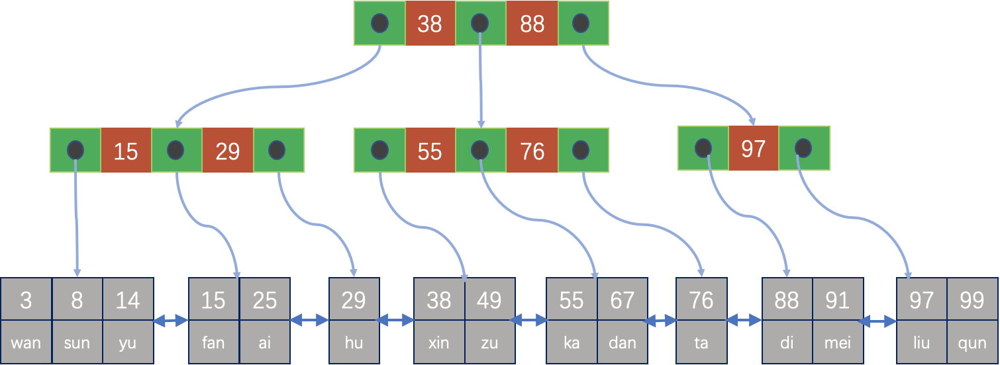
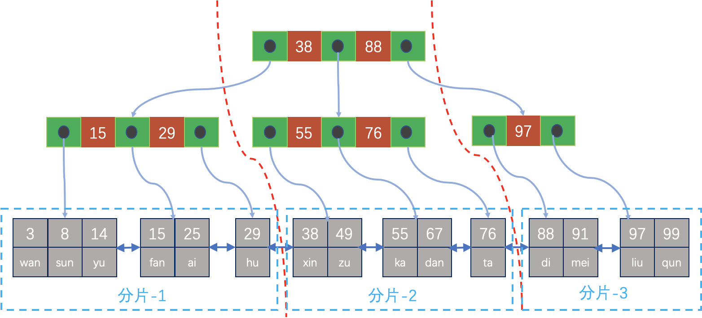
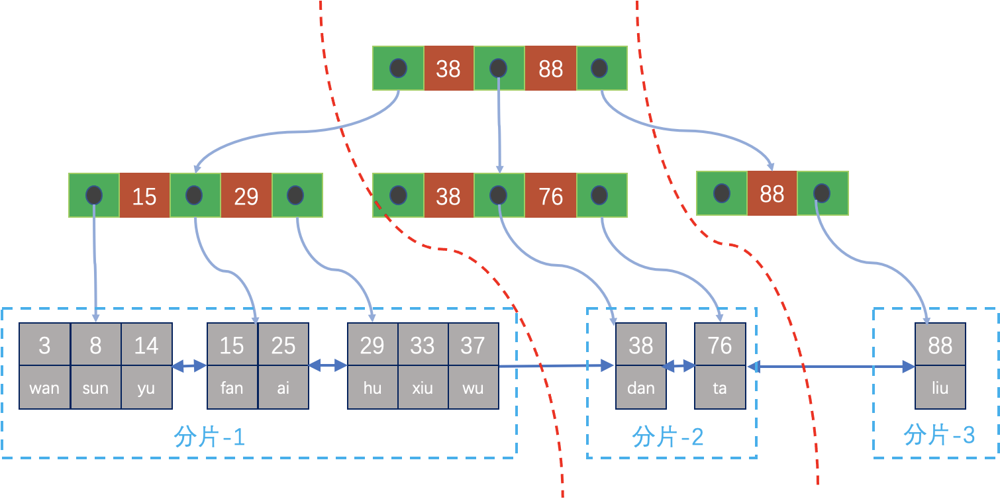
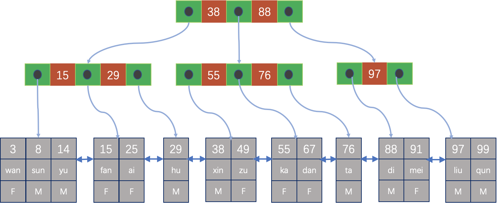
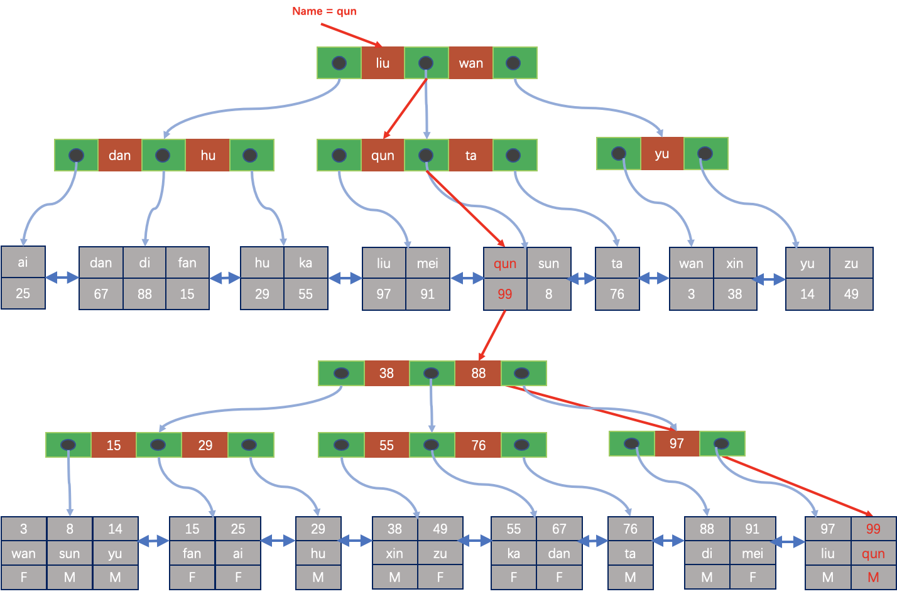
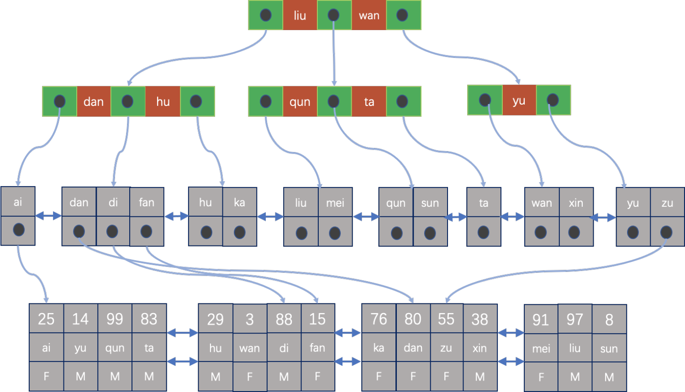

# MySQL · 源码阅读 ·  数据库的扫描方法

**Date:** 2022/04
**Source:** http://mysql.taobao.org/monthly/2022/04/01/
**Images:** 11 images downloaded

---

数据库内核月报

 [
 # 数据库内核月报 － 2022 / 04
 ](/monthly/2022/04)

 * 当期文章

 MySQL · 源码阅读 · 数据库的扫描方法
* MariaDB · 功能特性 · 无DDL延迟的主备复制
* MySQL · 源码阅读 · mysqld_safe的代码考古
* MySQL · 源码阅读 · 非阻塞异步C API简介
* MySQL · InnoDB · Instant DDL扩展

 ## MySQL · 源码阅读 · 数据库的扫描方法 
 Author: 智邻 

 ## 引言

关于存储引擎的介绍有很多，基于HEAP的传统存储引擎，以及基于聚簇索引的Innodb引擎等，但优化器如何充分利用存储引擎的特点来实现快速高效的扫描，从而以最小的代价得到用户所需要的结果，是一个非常复杂过程。为了了解优化器是如何运作的，首先我们要了解每一种扫描方式的特点，下面我们以MySQL为例，就一些常见的表扫描方式进行讨论。

## 全表扫描
MySQL的full table scan本质上还是通过Primary index scan来实现的，遍历整个B+tree，这是因为MySQL采用的是基于B+树实现的索引组织表，如下图所示，它的叶子节点上存储的就是实际的数据，而叶子节点上有一个双向链表，依次扫描所有的叶子节点即可以实现全表扫描。
早期的MySQL仅支持copy模式的DDL。在MySQL 5.5中，引入了inplace算法，可以将部分DDL操作交给引擎层进行处理，但是在进行DDL期间，依旧会阻塞DML操作。在5.6中，部分inplace DDL操作可以采用online算法。该算法允许用户在进行DDL操作过程中，并行的执行写入操作。有关上述三种DDL的差异及主要特点，可以参照文末的扩展阅读部分。

而HEAP表也就是堆表就有非常明显的区别，对于HEAP表来说，如下图所示，全表扫描是在物理上顺序扫描所有的数据页面，所以也称之为顺序扫描(sequential scan)，对于全新导入的数据，甚至在物理上这些页面都是连续的。然而如果经过不断的更新、删除操作，就无法再保证页面的连续性。

### 比较与总结
由于组织方式的不同，这两种存储引擎的全表扫描各自不同的特点，主要的不同如下所示：

**IO的特点** 

对于索引组织表，叶子节点虽然是依次扫描所有节点节点，但是这些叶子节点并不保证在物理上是连续的，也不保证是有序的，因此对应的IO是随机IO。而对于HEAP表，数据页在物理上是邻近的，可以顺序访问这些数据页，对应的IO是顺序IO。通常来说，随机IO的代价要比顺序IO的代价要高很多。

**结果的有序性** 

 对于索引组织表，全表扫描出来的数据对主键天然有序，这对优化器来说是一个非常有用的特性，如果查询的结果要求对主键有序，那么这样扫描出来的结果就无需再做额外的排序操作，节省了排序的开销。而对于HEAP表，扫描出来的结果是无序的，如果查询的结果要求有序，就必须对扫描出来的结果再进行排序方可。

**并行扫描的分片方式** 

 为了提升全表扫描的性能，还有一种显尔易见的方法，就是并行扫描，采用多个线程或进程，每个线程或进程只扫描全表的一个分片。对于索引组织表，可以按B+树的特点，分成几个子树，每个线程或进程只扫描一个子树；

对于HEAP表，可以直接按数据页分片，每个线程或进程扫描几个连续的数据页。因为数据组织方式的不同，会发现对于索引组织表的分片，数据其实是按Range分片的，而对于HEAP表的分片，数据分片是随机的，本身没有什么特殊的规律。

这些分片方式的不同对于并行计划的生成是非常重要的，比如在并行扫描的结果上做group by操作，对于已经按range分片的数据，如果group by的列与range分片相兼容，那么聚集操作就可以直接下推到每个range分片上即可；而对于按随机分片的数据，聚集操作只能在分片上做第一次聚集，然后在所有分片聚集的结果上再做一次二次聚集方可。

**数据倾斜** 

但是Range分片，有可能数据分片的大小不均匀，有些分片内的数据多，有些分片内的数据少，极端情况下如果数据倾斜特别严重时，可能会导致并行扫描效率更低，因为还增加了进线程的开销。而对于HEAP表的随机分片方式，数据分片不均的可能性就会小很多。

## 索引扫描
### 索引组织表的索引扫描
在MySQL中，主键索引是基于B+树的聚簇索引，相应的表被称为索引组织表，简称IOT表。MySQL在表上另外再创建的索引，称为二级辅助索引，简称二级索引。MySQL的二级索引其实是一个比较变态的组织方式，因为只有主键表中才真正存储数据，并且因为涉及到B+树的分裂和合并等，每个ROW的实际物理位置并不是总是固定不变的，因此二级索引只能记录ROW的逻辑地址，即主键，然后通过主键再确定其实际的物理位置。但这样也有一个优点，当数据更新时，如果没有更新主键或二级索引自身的键值时，就不需要更新二级索引。
如果要通过二级索引来扫描完整的ROW，必需要先扫描二级索引，找到对应的主键，再利用主键找到对应的ROW。因此在MySQL中，使用二级索引来进行扫描原始的ROW代价会很大，但二级索引利用的好，也还是非常有用的，MySQL针对二级索引也做了很多优化访问方式，优化器会根据二级索引的特点来确定是否选择二级索引。
如下图的IOT表，主键索引如下图所示:

如在Name列是新建二级索引，那么二级索引如下所示：

在二级索引的叶子节点中的ROW中，会记录主键，如果需要读取二级索引中未包含的列，就必须通过主键索引查询完整的ROW，如下图所示:

### HEAP表的索引扫描
在Heap表中，通常没有二级索引的概念，索引中记录的是记录的row_id，row_id指向实际的物理存储位置，可以通过这个row_id直接定位到记录所在的page和在page中的位置。如下图所示：

如果数据更新导致ROW的物理位置发生变化，那么所有相关的索引都需要更新，如果索引比较多，就会导致效率比较低，从而遭遇到著名的”写放大”效应。通过HEAP表的索引访问ROW相对就比较简单，效率也比较高，而且是每个索引的效率基本都差不多，这点与IOT表的索引不同，IOT表只有主键索引效率比较高，所有其它二级索引的效率都比较低。当然如果只是访问索引自身包含的键值列，就另当别论了，这种称之谓covering index scan，或者覆盖索引扫描。通过索引访问物理ROW的方式如下图所示:

### 比较与总结
总之，不同的数据和索引组织方式都有其特点，对于IOT表来说，主键索引效率最高，二级索引的效率比较差；对于HEAP表来说，索引的效率差不多，索引键的distinct值(不重复的键值)对索引的访问有一定影响，对于特别小的表来说，直接做全表的顺序扫描可能更有效率。两种不同索引方式的对比如下表所示：

**点查询效率** 

HEAP表的索引的点查询效率和IOT表的主键索引的点查效率，差不多，但IOT表的二级索引的点查询效率就会差很多。

**范围查询效率** 

IOT表的主键索引的范围查询效率很高，因为数据天然有序，可以直接定位到范围起点，然后沿着叶子节点向右查询，直到结束位置即可。但通过二级索引做范围查询的效率就比较低了，因为二级索引只能得到范围内的主键集合，还需要再次通过主键进行点查才能得到ROW，而且每个二级索引的效率基本都一样，除非是covering index查询。
与之IOT表的主键索引的范围查询效率相比，HEAP表的索引的范围查询效率也比较低，但比二级索引的范围查询效率略高。原因是虽然也可以通过定位范围的起点，沿着叶子节点向右查询，直到结束位置为止，但此时只能得到指同实际ROW存储的物理位置，还需要访问物理位置才能得到ROW，而且这些物理位置并不连续，属于随机分布，访问效率就会大大降低。但优点在于每个索引的效率基本都一样， 不会有太差的索引出现。 

**数据更新效率** 

由于IOT表的二级索引中保存的是ROW的逻辑地址，通常是主键，没有主键的表保存的是ROW-ID，那么在数据更新时，只要主键没有发生变化，二级索引是没有必要更新的。对于HEAP表来说，由于索引中保存的是ROW的物理地址，那么在数据更新时，如果ROW的物理地址发生变化，索引就必须更新，当然实际的实现中也有很多不同的实现机制，比如尽可能的原地更新，保持物理地址不变；有些数据库采用多版本之间的链表来实现保持物理地址不变，各有优劣和特点，这些特点对优化器在选择扫描方式时都有不同的影响。

 阅读： - 

本作品采用[知识共享署名-非商业性使用-相同方式共享 3.0 未本地化版本许可协议](http://creativecommons.org/licenses/by-nc-sa/3.0/)进行许可。

 