# MYSQL·分区表特性·一致性哈希算法应用

**Date:** 2022/06
**Source:** http://mysql.taobao.org/monthly/2022/06/05/
**Images:** 14 images downloaded

---

数据库内核月报

 [
 # 数据库内核月报 － 2022 / 06
 ](/monthly/2022/06)

 * 当期文章

 MySQL · 引擎特性 · PolarDB-CloudJump：优化基于云存储服务的云数据库(发表于VLDB 2022)
* MySQL · 引擎特性 · 通过performance_schema 定量分析系统瓶颈
* MySQL · 源码阅读 · RAND 表达式
* MySQL中的HyperGraph优化器
* MYSQL·分区表特性·一致性哈希算法应用
* PolarDB ·性能大赛·云原生共享内存数据库性能优化

 ## MYSQL·分区表特性·一致性哈希算法应用 
 Author: 知万 

 本文将结合MySQL分区表功能重点介绍一致性哈希算法以及其他一些哈希算法的特性和在分区表中的使用。

## 分区表介绍
分区表是数据库根据一定的分区规则，把一个表划分为多个更小的、更容易管理的子数据集合。
数据库创建示例：

`CREATE TABLE test (id INT)
PARTITION BY HASH (id) PARTITIONS 1000;
`

比起分区表，很多人可能更熟悉分库分表操作，这两者的目的都是为了减少单表的数据量，提升整体的性能。

二者的区别在于：分库分表通常由应用层程序员开发时实现，会引入分布式事务等问题，加大应用设计复杂程度；而分区表则是由数据库自动支持，对上层屏蔽具体细节。

分区表拥有诸多优势，例如：

1、分区表支持按照时间或者其他概念分区，可以很好地支持数据生命周期管理（例如按照时间分区，自动将过去一年的数据扔掉，只保留最近一年内的数据，滚动更新）。

2、分区表通过剪枝和数据分而治之等方式，可以极大提升sql语句的执行效率。同时，分区表可以与并行查询（MPP）结合，为TP数据库极大增强AP能力。

分区表有三种大类型：HASH、LIST、RANGE，其中每种类型又可对应多种不同的子类型。本文将重点介绍诸多可为HASH类型分区表所选用的哈希算法及各自特性。

## 哈希算法与HASH类型分区表的关联
分区表与哈希算法有什么关联呢？

以数据库的INSERT操作为例。

对于一张单表而言，插入数据的时候只需要按照索引或其他设置寻找B+树对应的位置即可。

但如上文所说，分区表本质是将单表的数据进行拆分变成多张子表，维护多个B+树。在有多个B+树的情况下，对于HASH分区表而言，应该将数据插入到哪个B+树中呢？这时候就需要使用哈希算法进行判断。

分区表将跟据HASH_VALUE（哈希值）和NUM_PART（分区数）计算得出数据应该存放的分区表PART_ID（PART_ID <= NUM_PART），按照与单表类似的方式存入数据到对应的PARTITION TABLE中。
同理，对于HASH分区表而言SELECT、UPDATE、DELETE操作通常也需要哈希算法的参与。

哈希算法有很多种，不同哈希算法具有不同的特性，用户可根据自己的需求以及当前选用的数据库产品分区表对不同HASH算法的支持情况进行选择。

## 哈希算法介绍
本文接下来将依次介绍取模哈希、线性哈希（LINEAR HASH）以及一致性哈希（CONSISTENT）中的割环一致性哈希和跳跃一致性哈希。

### 取模哈希
目前MySQL分区表已添加了对取模哈希的支持。

创建HASH分区表示例语句：

`CREATE TABLE test (id INT)
PARTITION BY HASH (id) PARTITIONS 1000;
`
#### 算法
取模哈希根据表达式计算分区ID的函数如下所示：

`static int get_part_id_hash(uint num_parts, Item *part_expr, uint32 *part_id,
 longlong *func_value) {
 longlong int_hash_id;

 if (part_val_int(part_expr, func_value)) return HA_ERR_NO_PARTITION_FOUND;

 int_hash_id = *func_value % num_parts;

 *part_id = int_hash_id < 0 ? (uint32)-int_hash_id : (uint32)int_hash_id;
 return false;
}
`
逻辑很简单，就是根据用哈希值func_value % num_parts即可。

#### 增删分区数据流动示意图

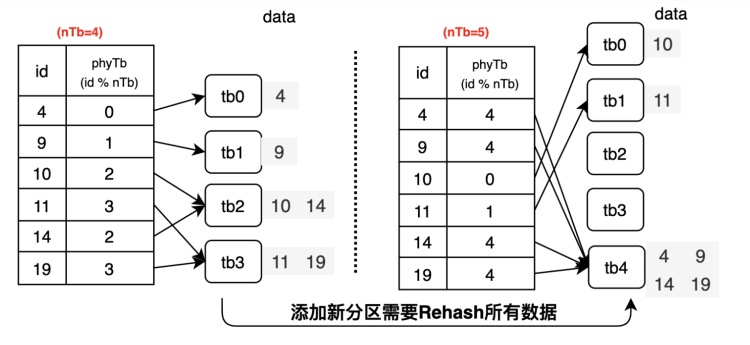

在取模哈希中，增删分区时大量数据的对应分区会发生变化。抽象出来其数据流动图如下所示：

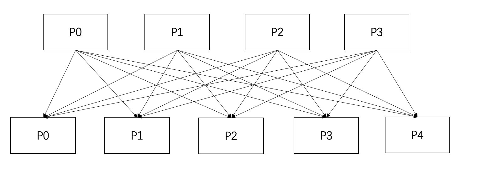

从4个分区变成5个分区的情况下数据全部重映射（缩减分区，从5个分区变成4个分区为上述图示的逆过程，不再赘述）

#### 特点

* 数据分布较均匀
* 增删分区数时需要变化的数据量较大

### 线性哈希(LINEAR HASH)
目前MySQL分区表已添加了对线性哈希的支持。
创建LINEAR HASH分区表示例语句：

`CREATE TABLE test (id INT)
PARTITION BY LINEAR HASH (id) PARTITIONS 1000;
`
#### 算法
线性哈希相比取模哈希而言会更难理解一些，其算法引入了新的变量：**mask**

`static uint32 get_part_id_from_linear_hash(longlong hash_value, uint mask,
 uint num_parts) {
 uint32 part_id = (uint32)(hash_value & mask);

 if (part_id >= num_parts) {
 uint new_mask = ((mask + 1) >> 1) - 1;
 part_id = (uint32)(hash_value & new_mask);
 }
 return part_id;
}
`
值得特别注意的是，这里part_id的计算方式不再是hash_value % mask，而是hash_value & mask。

mask本身是根据桶的总数num_parts计算得出的，计算方式如下所示：

`void set_linear_hash_mask(partition_info *part_info, uint num_parts) {
 uint mask;

 for (mask = 1; mask < num_parts; mask <<= 1)
 ;
 part_info->linear_hash_mask = mask - 1;
}
`
从上可以看出，mask实际意义是大于等于num_parts的二的幂数。

比如，如果num_parts = 5， 那么mask值为8 - 1 = 7。如果num_parts = 11， 那么mask值为16 - 1 = 15。

引入mask的原理很简单：
假设m % n = v，那么m % 2n = v或者v + n。

基于上述原理，只要hash bucket的数量取2的整数次幂，那么在增加或者减少分区数量时，最多只会影响一个已有的分区数据分布。

这个描述有丝丝晦涩，让我们以图示的方式加深对于线性哈希的理解
。
举例而言，初始为3个分区，此时num_parts为3，mask为4-1=3，4是2的2次幂。

我们分别插入0，1，,2，,3这四个数据。

插入逻辑如下：

0&3=0，插入分区P0。

1&3=1，插入分区P1。

2&3=2，插入分区P2。

3&3=3，发现3>=num_parts。此时将mask调整生成new_mask:

`uint new_mask = ((mask + 1) >> 1) - 1;
`
此时new_mask=((3+1)»1-1)=1；

3&new_mask=1，插入分区P1。

即本来取后两位插入分区，如果后两位没有对应的匹配分区，就找最后一位对应的匹配分区插入。

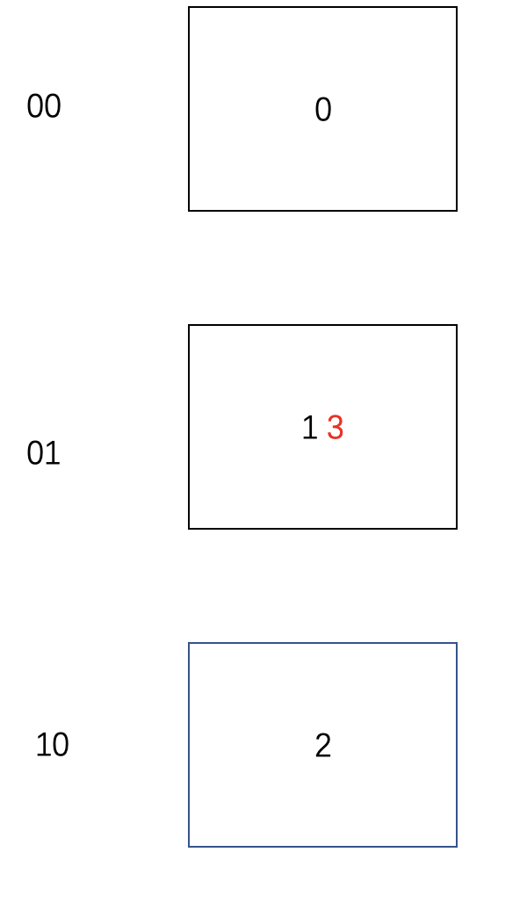

#### 增删分区数据流动示意图
从3个分区变成4个分区的流程中，新增的分区P3(对应二进制为11)只可能由P1(对应二进制为01)分裂得到，示意图如下所示：

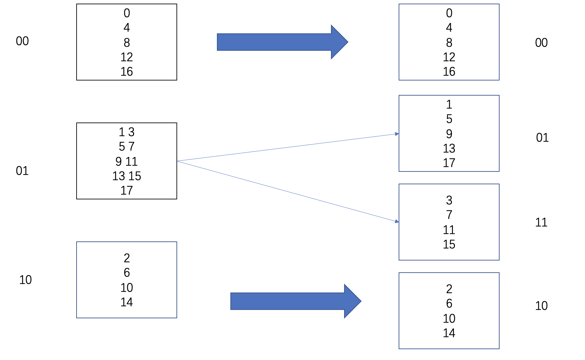

同理，从4个分区到5个分区的情况下，新分区P4的数据只可能由旧分区P0分裂得到，不可能来自任何其他分区，满足一对一的关系。

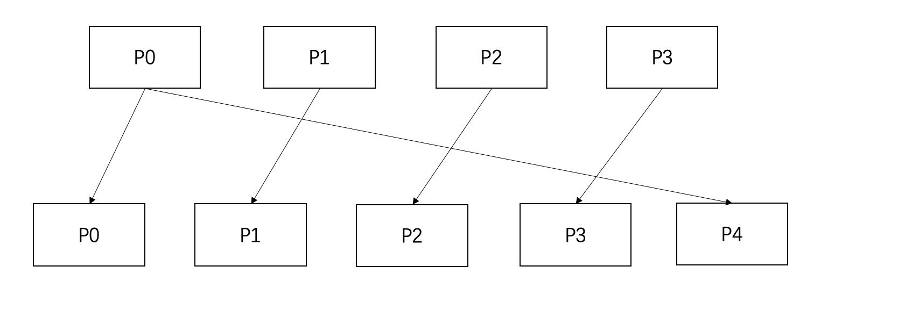

线性哈希分区主要利用二次幂的特性进行便捷计算，比较巧妙，理解起来需要些时间。

#### 特点

* 每个新分区只可能由之前一个确定分区分裂得到，增删分区时需要读写的数据比例很小
* 映射均匀性较差

### 割环一致性哈希
目前MySQL分区表功能尚未添加对割环一致性哈希的支持。

#### 算法
下面讨论的是**不引入虚拟节点版本**的割环法哈希算法。
插入数据的算法：

1. 设 hash(key) 是映射到区间 [0,2^32]上的一个哈希函数。 把区间首尾相连，形成一个顺时针增长的哈希环（如下图所示） 。
2. 将所有槽位(或者节点) N0,..,Nn−1的标号 0,…,n−10,…,n−1 依次作为 hash函数的输入进行哈希，把结果分别标记在环上。
3. 对于关于 k 的映射，求出 z=hash(k)， 标记在环上：
 
 如果 z正好落在槽位上，返回这个槽位的标号。
4. 否则，顺时针沿着环寻找离 z 最近的槽位，返回槽位标号。

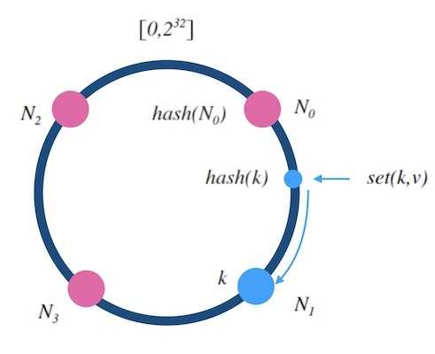

#### 增删分区数据流动示意图
增删分区的算法：
当往一个哈希环中新增一个槽位时，如下图所示， 红色的N4是新增的槽位。 可以看到 k 从 N1 重新映射到了 N4 , 而 k1 的映射结果不变。 稍加分析可以知道， 只有被新增槽位拦下来的 k的映射结果是变化了的。 新增槽位拦截了原本到下一节点的部分映射，其他槽位不受影响。以下图为例， 顺时针方向的下一个节点 N1 需要迁移部分数据到新节点 N4上才可以正常服务， 其他节点不受影响。

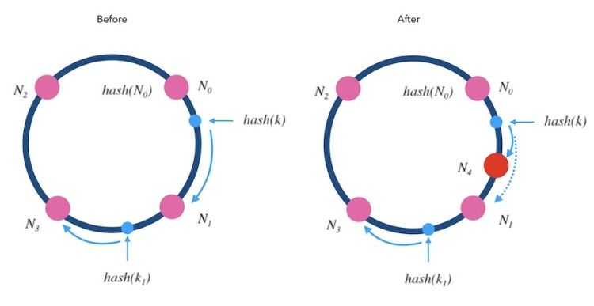
不引入虚拟节点时，其数据变化图类似于线性哈希，增加的新分区的数据来自于之前某个分区的分裂：

#### 特点

* 工程上实现复杂，目前该算法主要应用在memcache、nginx等领域进行分布式集群负载平衡
* 计算方式复杂，为有状态的函数，需要记录很多其他信息，例如各个机器/分区对应的环位置等
* 在增删分区的时候无法保证映射均匀性（引入**虚拟节点法**后可以部分解决本问题）
* 映射一致性较好，增删分区时需要挪动的数据较少

### 跳跃一致性哈希
目前MySQL分区表功能尚未添加对跳跃一致性哈希的支持。

#### 算法
跳跃一致性哈希算法是Google于2014年提出的一种极简的、快速的一致性哈希算法。其实现代码如下所示：

`int32 jump_consistent_hash(uint64 key, int32 num_segments)
{
 int64 b = -1;
 int64 j = 0;
 while (j < num_segments)
 {
 b = j;
 key = key * 2862933555777941757ULL + 1;
 j = (b + 1) * ((double)(1LL << 31) / (double)((key >> 33) + 1));
 }
 return b;
}
`
这部分函数的核心思路如下：

从k个分区变为k+1个分区时，理想情况下有1/(k+1)比例的数据被移动到最新分区。

那么如何决定哪些数字移动到最新分区呢？

答：利用**伪随机数**生成器，结合每个分区的数据和原始种子，生成伪随机数，通过比对伪随机数和1/k+1的值大小确定是否跳跃。

上面函数就是由这个思路推导并精简得出的，其中比较令人费解的2862933555777941757ULL数字为Google实验选出的种子。

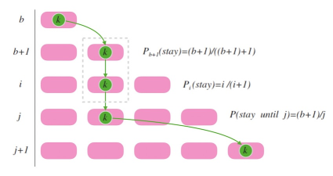

` 跳跃过程示意图
`

#### 增删分区数据流动示意图

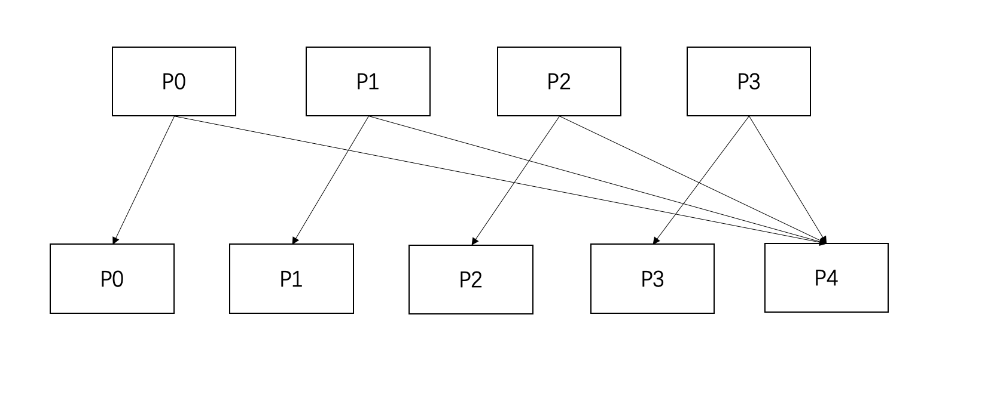

从4个分区变成5个分区的情况下，每个旧分区的数据都可能需要迁移到新分区，但整体迁移的数据量只有1/5，映射，且旧分区的数据只有两种选择：保留在原分区或者跳跃到最后一个分区，不会出现从一个分区迁移到另一个分区的情况。
同理，删除尾分区时，数据只有一种选择，就是被迁入仍被保留的剩余分区中。

#### 特点

* 映射一致性较好，增删分区时需要移动的数据较少
* 映射均匀性较好，在大部分时候可保证分区数据均匀
* 内存消耗少，计算速率较快

### 哈希算法对比总结
通常而言用户在使用分区表中的HASH分区所考虑的是数据映射均匀性和增删分区花费的时间。
增删分区与工程上的实现方式相关，不好准确评估。整体而言，执行时间会与读写数据量有较大关系，因此这里将主要讨论其读写数据量和对应的理论执行时间。

为了便于理解，这里提供一个非量化的简单示意图展示四种哈希算法在均匀性和**增删少量分区**时读写数据量（执行时间）的示意图。

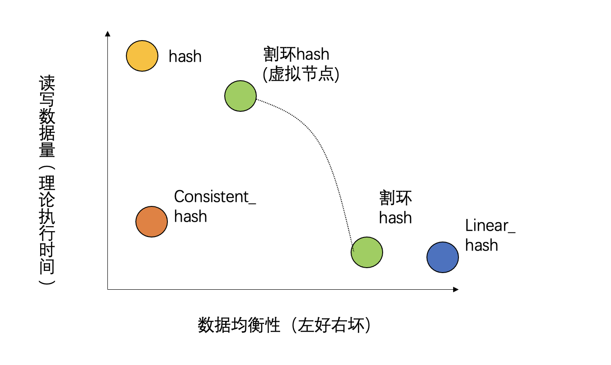

原始割环法通常数据映射性较差，因此工程实现上通常会通过引入虚拟节点的方法对其性能进行调整。随着引入的虚拟节点增多，增删分区时需要访问的分区数不再是固定的一对一关系，而是逐渐发展成一对多关系（分区发生交叉），此时数据均衡性增强，但是读写数据量和执行时间会增加，因此在图里割环hash会有一条弧线。

用户在使用分区表时需要根据实际的业务场景，考量数据均匀的必要性、增删分区的频率、通常增删分区的个数等诸多需求选定适宜的分区类型。

## 一致性哈希和取模哈希在增删分区时的性能对比
这节将进行简单实验，通过对比一致性哈希和取模哈希分区在增删分区时的性能来让用户对于一致性哈希分区的效果有更好的理解。

数据表：TPCH中的lineitem表

`create table lineitem ( l_orderkey integer not null,
 l_partkey integer not null,
 l_suppkey integer not null,
 l_linenumber integer not null,
 l_quantity decimal(15,2) not null,
 l_extendedprice decimal(15,2) not null,
 l_discount decimal(15,2) not null,
 l_tax decimal(15,2) not null,
 l_returnflag char(1) not null,
 l_linestatus char(1) not null,
 l_shipdate date not null,
 l_commitdate date not null,
 l_receiptdate date not null,
 l_shipinstruct char(25) not null,
 l_shipmode char(10) not null,
 l_comment varchar(44) not null,
 primary key (l_orderkey,l_linenumber))
PARTITION BY KEY(l_orderkey,l_linenumber) PARTITIONS 100; 
`
数据量：4G

原始分区数：100

innodb_buffer_pool_size：128M（该参数的设置对于实际表现会有较大影响）

ADD PARTITION中的表现：

COALESCE PARTITION中的表现：

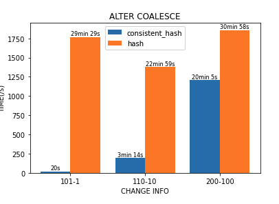

此处仅为简单测试，未完全排除干扰因素，不过并不妨碍看出性能的明显提升。
另外从各分区文件大小看，一致性哈希分区的数据量分布也更均衡。

更多使用测试细节将在功能正式上线后登录PolarDB产品分区表功能文档。

## 参考资料
1、[https://writings.sh/post/consistent-hashing-algorithms-part-1-the-problem-and-the-concept](https://writings.sh/post/consistent-hashing-algorithms-part-1-the-problem-and-the-concept)

2、[https://blog.csdn.net/u013411339/article/details/115911475](https://blog.csdn.net/u013411339/article/details/115911475)

3、[https://writings.sh/post/consistent-hashing-algorithms-part-2-consistent-hash-ring](https://writings.sh/post/consistent-hashing-algorithms-part-2-consistent-hash-ring)

 阅读： - 

本作品采用[知识共享署名-非商业性使用-相同方式共享 3.0 未本地化版本许可协议](http://creativecommons.org/licenses/by-nc-sa/3.0/)进行许可。

 