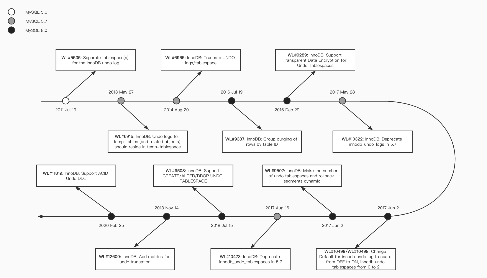
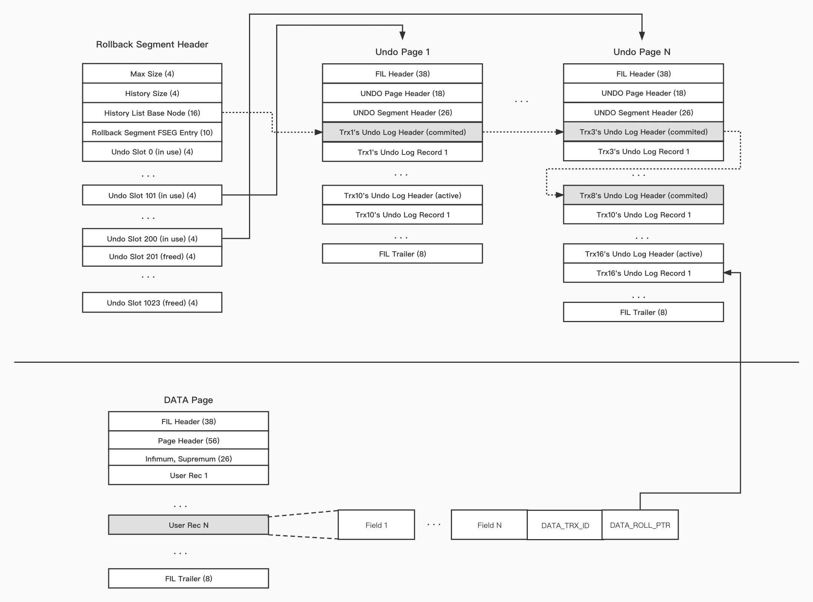
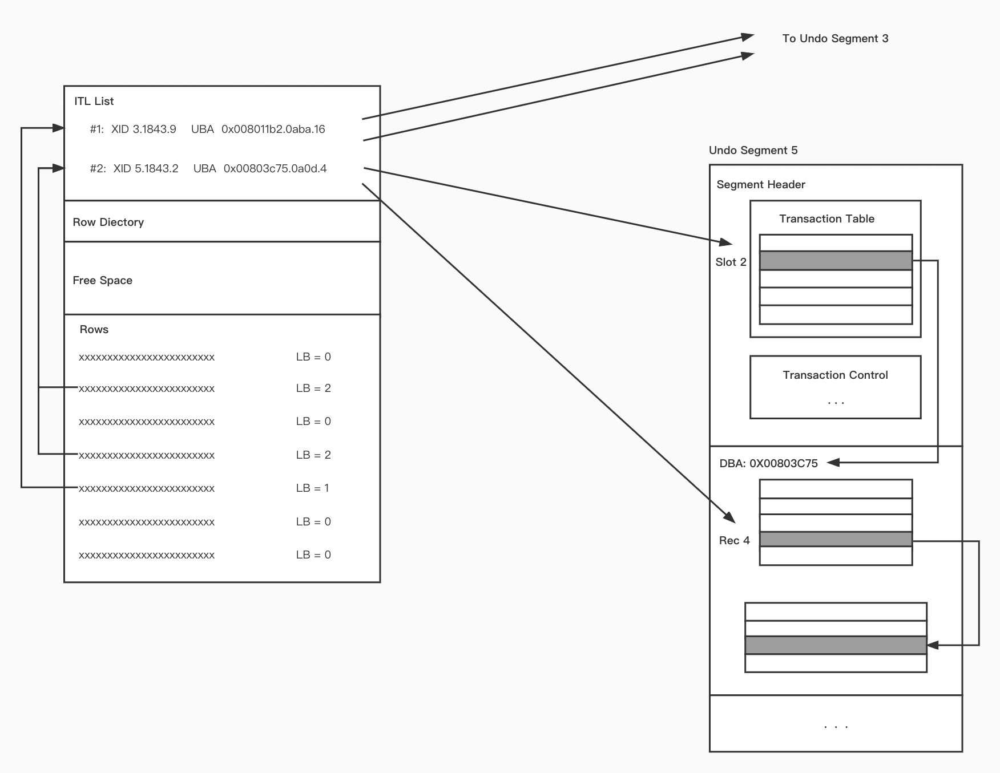

# MySQL · UNDO LOG的演进与现状

**Date:** 2022/10
**Source:** http://mysql.taobao.org/monthly/2022/10/02/
**Images:** 4 images downloaded

---

数据库内核月报

 [
 # 数据库内核月报 － 2022 / 10
 ](/monthly/2022/10)

 * 当期文章

 PolarDB · 功能特性 · 非阻塞DDL
* MySQL · UNDO LOG的演进与现状
* 源码分析 · MySQL Event 源码分析
* B+树数据库故障恢复概述
* MySQL 深潜 - 统计信息采集
* PolarDB · 功能特性 · 嵌套子查询优化的性能分析

 ## MySQL · UNDO LOG的演进与现状 
 Author: bayan 

 ### Undo Log的背景以及理论
数据库与普通文件系统的一个重要的区别就是；数据库可以在多种故障下仍然可以正确运行，保证系统以及数据的正确性；这些故障包括但不限于数据库系统本身故障，操作系统故障，以及存储介质故障等。那么数据库是如何在这些故障下面还能保证系统和数据的正确性的呢？主要靠Redo Log和Undo Log日志与WAL(Write Ahead Log)机制的配合来支持，其理论支持在论文《[ARIES: a transaction recovery method supporting fine-granularity locking and partial rollbacks using write-ahead logging](https://cs.stanford.edu/people/chrismre/cs345/rl/aries.pdf)》中介绍的非常详细。

该论文主要介绍通过Logging的方式来记录数据库最新的修改，在故障恢复时通过Log的内容将数据库恢复到正确的状态。那么为了保证恢复中可以看到数据库最新的状态，就要求Log先于数据落盘，这就是**WAL**的概念；其中记录了数据库最新数据内容的Log称之为Redo Log；但是为了方便事务回滚，数据库在修改数据时也必须记录数据的旧值，这就是Undo Log。正因为有了Redo Log，对于已经提交的事务的数据一定存在于磁盘，所以保证了数据库系统的持久性；而有了Undo Log，数据库可以保证在故障恢复时对没有完成的事务进行回滚，也就保证的事务的原子性。

与此相对的，如果数据库系统只记录Undo Log不记录Redo Log，那么事务在commit之前必须保证数据已经落盘，这样才能完成数据持久化；如果只记录Redo Log不记录Undo Log，那么在事务提交之前数据不能落盘，这样在故障恢复时就不会出现还未提交的事务，保证了事务的原子性。显然，这两种方案在具体实现时都有较大的瓶颈。

关于MySQL Undo Log的具体内容，在《[InnoDB之Undo Log介绍](https://zhuanlan.zhihu.com/p/453169285)》这篇文章中已经按照Undo Log的生命周期进行了比较详细的介绍。这篇文章我们主要介绍一下这些年MySQL Undo Log的演进；并且介绍一下基于同样的数据库理论，Oracle是如何实现Undo Log的。

### Undo Log在MySQL的发展
Undo Log在InnoDB第一次被加入到MySQL时就已经存在；但是后面逐渐又有很多新的特性被加入到Undo Log中；而且每个版本能支持Undo Log的特性又有所不同，所以我们通过下列一个时序图来介绍Undo Log在这些年的发展。

我们通过上述图表可以很清楚的看到Undo Log这些年的发展，下面我们通过不同版本分别来介绍Undo Log在不同版本上面的特性。

#### MySQL 5.6
[WL#5535](https://dev.mysql.com/worklog/task/?id=5535) 将Undo Log从系统表空间中分离出来成为单独的Undo表空间；这样做用户可以将数据文件存储在SSD，系统文件存放在HDD上，这样系统可以降低成本的同时拥有更高的性能；而且用户可以灵活的决定使用回滚段的数量，以控制系统资源的使用。

#### MySQL 5.7
[WL#6915](https://dev.mysql.com/worklog/task/?id=6915) 将临时表的Undo Log只记录在临时表空间中，减少普通Undo Log表空间的浪费；临时表的Undo Log仅仅在事务回滚时使用，不在故障恢复时使用(也没有必要)。

[WL#6965](https://dev.mysql.com/worklog/task/?id=6965) 在一个Undo表空间没有事务使用时，允许将其Truncate；虽然Undo Log可以被Purge，但是一旦其文件增大那么就无法缩小；这将产生空间浪费。

[WL#10322](https://dev.mysql.com/worklog/task/?id=10322) 8.0重新设计了Undo Tablespace，弃用innodb_undo_logs参数，不再用此变量指代回滚段。

[WL#10473](https://dev.mysql.com/worklog/task/?id=10473) 8.0重新设计了Undo Tablespace，弃用innodb_undo_logs参数，参数innodb_undo_tablespaces的默认值和最小值设置为2。

#### MySQL 8.0
[WL#9387](https://dev.mysql.com/worklog/task/?id=9387) 在多个Purge线程对Undo Log进行Purge时，按照Table ID来进行分类，以免锁的争抢太激烈导致Purge性能下降。

[WL#9289](https://dev.mysql.com/worklog/task/?id=9289) Undo Tablespace支持加密；因为某种意义上Undo Log也属于数据，也应该支持加密，以提高数据安全性。

[WL#9507](https://dev.mysql.com/worklog/task/?id=9507) 动态的调整Undo Tablespace和回滚段的数量；因为这关系到空间使用率与事务的并发性，这让用户可以更加灵活的使用MySQL。

[WL#10499](https://dev.mysql.com/worklog/task/?id=10499)/[WL#10498](https://dev.mysql.com/worklog/task/?id=10498) 调整参数innodb_undo_log_truncate的默认值为打开，默认打开Undo Log Truncate的功能。调整参数innodb_undo_tablespaces的默认值为2；Undo Tablespace最少需要2个，因为如果需要进行Undo Truncate最少需要一个Undo Tablespace可用。

[WL#9508](https://dev.mysql.com/worklog/task/?id=9508) 支持使用 CREATE/ALTER/DROP 语句来操作Undo Tablespace；可以在运行时创建Undo Tablespace，使用Undo Tablespace更加灵活。

[WL#12600](https://dev.mysql.com/worklog/task/?id=12600) 为Undo Truncate添加一些监控指标；包括Purge耗时，Purge次数，Truncate次数，Truncate耗时等。

[WL#11819](https://dev.mysql.com/worklog/task/?id=11819) 因为目前Undo Tablespace也支持DDL(CREATE/ALTER/DROP)，通过Redo Log使得Undo Tablespace的DDL支持ACID。

#### 小结
通过上面的介绍，我们大致明白了Undo Log在不同版本之间的区别；因为MySQL 8.0重新设计了Undo Tablespace，可以让每个Undo Tablespace都有128(TRX_SYS_N_RSEGS)个回滚段，依次提高MySQL的并发度和Undo Tablespace的灵活性。

我们通过不同版本上面Undo Log特性的介绍；可以充分了解到，在满足对Undo Log一些基本性(加密，DDL ACID)的要求的同时，Undo Log的使用变的越来越灵活，已经可以像正常使用表那样来使用Undo Tablespace。如果想了解其具体实现，可以查看文章 [MySQL · 源码分析 · undo tablespace 的发展](http://mysql.taobao.org/monthly/2020/10/02/)。

### Undo Log现状
因为Oracle数据库也同样基于《[ARIES](https://cs.stanford.edu/people/chrismre/cs345/rl/aries.pdf)》来实现的；所以为了对比Undo Log在MySQL下面的实现，我们同时也介绍一下Undo Log在Oracle的实现；通过其在不同数据库系统下的实现，来比较一下其优缺点。

#### Undo Log在MySQL的实现
本节内容主要来自《[InnoDB之Undo Log介绍](https://zhuanlan.zhihu.com/p/453169285)》，并基于MySQL 8.0；首先，我们通过下图来介绍一下Undo Log的文件组织方式：

回滚段(Rollback Segment)是管理undo log的基本单位，回滚段头存储了管理Undo Log的元信息。其中比较重要的是History List与Undo Slot。History List可以将所有提交事务的Undo Log Header按照提交的先后顺序串联起来；此数据结构主要用于后面对Undo Log的purge。一般一个回滚段最多有1024个Undo Slot，Undo Slot存储这活跃事务Undo Log Header所在的page；通过这个数据结构可以快速的找到此回滚段有哪些活跃的事务。

##### 一致性读取
最后在每一个用户数据记录(User Rec)上，有两个系统列：DATA_TRX_ID 是最近修改过此数据记录的事务ID，用户在查询数据时可以通过此来判断其数据可见性；DATA_ROLL_PTR 指向数据记录的Undo Log；如果当前数据记录用户查询不可见，可以通过此指针回溯，直到其可见位置。

关于Undo Log关于上面更加详细的内容，可查看《[MySQL · 引擎特性· InnoDB之UNDO LOG介绍](http://mysql.taobao.org/monthly/2021/12/02/)》这篇文章。

##### Undo Log清理
有了上面的设计，MySQL在产生Undo Log后，用户便不用再管理；系统会根据其状态来对Undo Log进行Purge。但是如果Undo Log的Purge有Bug，一方面Undo Log会一直膨胀；另一方面，因为Undo Log太多，会导致用户查询慢的问题。

通过上面的介绍，我们可以了解到回滚段是管理MySQL Undo Log的基本单位；在回滚段中，有两个比较重要的数据结构：Hisory List与Undo Slots；通过Hisotry List来管理已经提交的事务；通过Undo Slots来管理正在活跃的事务。

如果你想对MySQL的Undo Purge有更加深入的了解，可以查看文章 《[innodb之undo log的purge](https://zhuanlan.zhihu.com/p/529153803)》

#### Undo Log在Oracle的实现
本节内容主要来自《[Oracle Core Essential Internals for DBAs and Developers](https://jonathanlewis.wordpress.com/oracle-core/)》，我们通过一张图表来介绍一下Undo Log的文件组织方式。

Oracle在每一个数据页上面都有一个interested transaction list(ITL)，ITL存储了最新修改了当前数据页的一些事物信息；而在每一个用户数据记录上(Row)，可以通过一个字段(LB)查询到在ITL中具体那个事务修改了此记录；而根据ITL中记录的具体的事务信息，我们可以查找到具体是那些Undo Log Rec修改了此数据记录。如果新开启一个事务会被放入对应的Undo Segmen的Slot中；如果事务已经提交同时将其Commit SCN更新到**ITL Entry**中。

关于ITL具体包含了下列信息：

**Itl**：事务的索引信息，也就是上图中用户数据记录中的

**LB**；通过此字段，用户在查询数据时可以找到最近修改过此数据记录的事务。

**Xid**：最进修改过此数据页的事务ID，其格式为 **undo_segment.undo_sequence_number.undo_slot**

**Uba**：Undo Log Rec的地址，通过此字段可以找到当前事务最新的Undo Log Rec；其格式为 **block_adress.block_number.page_offset**.

**Flag**：事务的状态位，可以通过此字段知道当前事务的状态，包括：活跃，正在提交，已经提交等。

**Lck**：此事务在当前数据页锁住的行数。

**Scn/Fsc**：此事务占用的空间；可以知道事务提交后可以释放多少空间。

这里需要注意的是在每个数据页上的**ITL List**的长度不是无限长的(如果此list可以无限长，此数据页将没有空间存放用户数据)；所以必须限制**ITL List**的长度，在Oracle数据库中，此长度是可以通过参数来调整的；如果记录的事务超过了**ITL List**的长度，将会对**ITL List**中已经提交或最老的事务进行清理，依次来防止**ITL List**占用空间太大；

具体管理Undo Log的基本单位是Undo Segment：

**Segment Header:** 管理Undo Log空间的元数据信息，其中有最重要的两个结构，Transaction Table与Transaction Control。

**Transaction Table**：存放着最新事务的信息；当开启一个新事务时，会分配一个Undo Segment，然后将新事务的信息记录到Transaction Table的一个Entry中；但是由于Segment Header不能无限膨胀，所以这里必须限制Transaction Table的大小，这里面存储的事务必须是最新的事务；所以该Table中的Entry可以重用，如果发生重用，如上图所示，将该最新事务的第一条Undo Log Rec指向之前该Entry存储事务的第一条Undo Log Rec；通过这些“first undo recs”，就可以将该Entry所有相关的事务串联起来。

**Transaction Control**：统计了Transaction Table的一些状态信息和一些基本内容；防止在一致性读时扫描Transaction Table。

##### 一致性读取
当用户开启一个一致性读取请求时，会从各个Undo Segment中获取一个Snapshot SCN作为traget SCN；然后按照以下顺序来获取所要查询的数据：

1. 拷贝当前数据页到buffer中，用这个副本进行下列步骤
2. 应用所有已经提交事务的清理动作(Commit时对 ITL entry 的修改)到这个副本。
3. 回滚这个副本上所有未提交事务的修改。
4. 回滚大于Target SCN 所有提交事务的所有修改。

如果完成以上四步，那么该数据页上的数据就是用户可见的。

##### Undo Log的清理
与MySQL不同的是，Oracle在用户数据记录上没有Delete Mark标记，所以无需对Undo Log进行purge；但是如果Undo Log文件太大，需要通过**automatic undo management**功能对Undo Log进行Truncate，以保持Undo Log文件大小在一个合理的范围。

通过上面的设计；我们可以比较清楚的知道，在Oracle数据库中，管理Undo Log的基本单位是Undo Segment；通过Undo Segment来管理Undo Log。在Undo Segment中有两个比较重要的数据结构：Transaction Table与Transaction Control；Transaction Table用来管理正在活跃的事务，以及串联起已经提交的事务；Transaction Control用来统计Transaction Table一些信息，方便用户一致性读取时获取Snapshot。
而在用户数据页上又有一个比较重要的数据结构：ITL List，这个数据结构记录了最新修改此数据页的事务，方便用户一致性读取时做数据回滚。

##### 小结
上面我们介绍了Undo Log在MySQL和Oracle的大致实现；可以看到虽然其实现不同，但原理相同；我们先通过下列一个表格来说明其区别。

 MySQL
 Oracle

 Data Rec
 DATA_TRX_ID, DATA_ROLL_PTR, Delete Mark
 LB

 Data Block
 无
 ITL List

 Undo Segment
 History List, Undo Slots
 Transaction Table, Transaction Control

从上面的表格我们可以很清晰的看出MySQL与Oracle在Undo Log实现上的区别：

**Data Rec**：关于具体的数据记录，MySQL Undo Log在每一条用户数据记录上存储了最近修改此数据记录的事务ID(DATA_TRX_ID)，可以通过回滚指针(DATA_ROLL_PTR)回到这条记录的前一个历史版本，并且如果记录被删除先打上Delete Mark标记，并不会真正的删除。Oracle Undo Log在每一条用户数据记录上只存储了一个LB字段，这个字段指向了ITL List中最新修改过此数据记录的事务。

**Data Block**：关于用户数据页，MySQL没有记录Undo的信息；Oracle在数据页的开头有一个ITL List的结构，存储这最新修改这个数据页的事务，但是有长度限制。

**Undo Segment**：MySQL管理Undo的基本结构为Undo Rollback Segment，其主要结构为HistoryList：串联已经提交的事务；Undo Slots：长度有限，存储正在活跃的事务。Oracle管理Undo的基本结构为Undo Segment，其主要结构为Transaction Table：存储正在活跃的事务，长度有限，Entry可重用，每一个Entry上面通过“firrst undo rec”把其关联的事务串联起来，只有第一个是活跃事务，后面的都是已经提交的事务(结合了Mysql History List和Undo Slot的功能)；Transaction Control：统计当前Transaction Table活跃事务的信息。

从上面的区别可以看出。
如果需要数据记录需要回到前一个版本， MySQL通过DATA_ROLL_PTR即可；但是Oracle需要将整个Data Block回滚到前一个版本才可以。

如果需要删除数据，MySQL只需要给对应数据记录打上Delete Mark标记，等待Undo Purge真正清理数据；而Oracle是将数据直接进行清理。

如果需要一致性读，MySQL需要在内存中统计所有正在活跃的事务，才能给出一个合适的“Snapshot”；而Oracle则直接读取各个Undo Segment的Transaction Control信息即可。

综上，MySQL与Oracle虽然在Undo Log的实现不同，但原理相同；只能说这两个数据库在Undo Log实现上面侧重点不同：

MySQL的数据记录虽然查询历史版本更加方便，但是Undo Purge无疑增加了Undo Log管理的复杂度。

Oracle虽然通过Transaction Control获取一致性读取“Snapshot”更加方便，但是Transaction Control的管理的也增加了Undo Log管理的复杂度。

MySQL数据记录虽然删除只需要打上Delete Mark标记提高了性能，但是Delete Mark后续的清理也提高了Undo Log管理的复杂度。

Oracle虽然对数据记录没有做更多的修改，但是ITL List的管理也提高了对DBA的要求。

### 总结
通过本文的介绍，我们不仅可以了解到Undo Log在Mysql的发展；还可以通过与Undo Log在Oracle的对比，更好的理解Mysql Undo Log的实现。相信通过本文可以对Undo Log有更加深入的了解。后面我们会继续介绍Undo Log在MySQL的InnoDB存储引擎中，是怎么与其他模块交互与联动的。

### 参考内容

 [ARIES](https://cs.stanford.edu/people/chrismre/cs345/rl/aries.pdf)

[MySQL’s Work Log](https://dev.mysql.com/worklog/)

[MySQL 8.0.23’s source code](https://link.zhihu.com/?target=https%3A//github.com/mysql/mysql-server/tree/mysql-8.0.23)

[innodb之undo log的purge](http://mysql.taobao.org/monthly/2022/05/04/)

[MySQL · 引擎特性· InnoDB之UNDO LOG介绍](http://mysql.taobao.org/monthly/2021/12/02/)

[MySQL · 源码分析 · undo tablespace 的发展](http://mysql.taobao.org/monthly/2020/10/02/)

[Oracle Core Essential Internals for DBAs and Developers](https://jonathanlewis.wordpress.com/oracle-core/)

 阅读： - 

本作品采用[知识共享署名-非商业性使用-相同方式共享 3.0 未本地化版本许可协议](http://creativecommons.org/licenses/by-nc-sa/3.0/)进行许可。

 