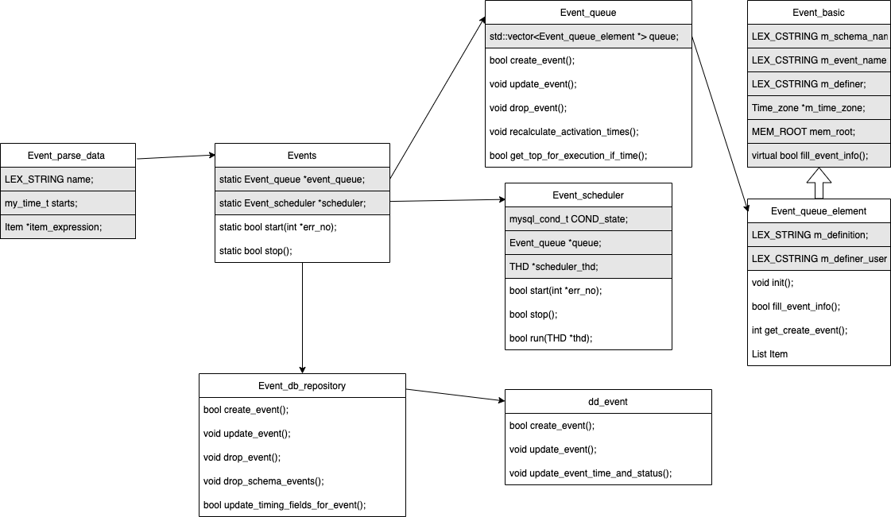
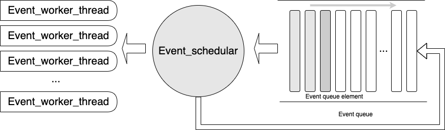

# 源码分析 · MySQL Event 源码分析

**Date:** 2022/10
**Source:** http://mysql.taobao.org/monthly/2022/10/03/
**Images:** 3 images downloaded

---

数据库内核月报

 [
 # 数据库内核月报 － 2022 / 10
 ](/monthly/2022/10)

 * 当期文章

 PolarDB · 功能特性 · 非阻塞DDL
* MySQL · UNDO LOG的演进与现状
* 源码分析 · MySQL Event 源码分析
* B+树数据库故障恢复概述
* MySQL 深潜 - 统计信息采集
* PolarDB · 功能特性 · 嵌套子查询优化的性能分析

 ## 源码分析 · MySQL Event 源码分析 
 Author: yifei 

 ## 背景介绍

mysql5.1版本开始引进Event概念。Event，顾名思义，属于时间触发器，相比于triggers的事件触发器来说，Event更加类似与`linux crontab`计划任务，Event中可以使用单独的SQL语句或调用使用存储过程，在某一特定的时间点，触发相关的SQL语句或存储过程。

使用`Event`调用SQL语句时，用户需要具有`Event`权限和执行该SQL的权限。`Event`权限的设置保存在`mysql.user`表和`mysql.db`表的`Event_priv`字段中。

当`Event`和`procedure`配合使用的时候，用户需要具有`create routine`权限和调用存储过程执行时的`excute`权限，存储过程调用具体的SQL语句时，需要用户具有执行该SQL的权限。Event可以通过以下几种方式查看其详细信息：

* 通过`SHOW EVENTS`命令。
* 查询`information_schema.events`表。
* `SHOW CREATE EVENT event_name`命令。

本文基于官方`mysql-8.0.31`版本的代码，对Event的实现进行分析。

## 源码分析

在使用`Event`的过程中，可以看到`Event`的主要功能包括：

* 创建，删除，修改对应的Event
* `Event`的定期调度
* `Event`的解析与执行
下面结合源码对以上几个问题进行分析

### 数据结构

Event的实现架构主要包括`Event，Event_schedular，Event_queue，Event_queue_element，Event_db_repository，Event_dd，Event_parse_data`等几个类，主要关系如下：

当用户输入`Event`相关语句时，首先会通过`Event_parse_data`将SQL转换为Event结构，随后在`mysql_execute_command`中调用`Events::create_event`创建新的Event事件。`Events`类是`Event`功能对外暴露的静态接口类，其中包括一个`Event_schedular`和`Event_queue`，`Event_queue`是包括所有Event事件的队列，`Event_schedular`是Event线程的后台调度器，负责从`Event_queue`中拿出对应的`Event`运行。`Event_queue`中包括一个由`Event_queue_element`构成的vector数组，每一个`Event_queue_element`都是一个Event事件，它继承于`Event_basic`，包括单个Event事件所需要的所有参数。

在`Events::create_event`的过程中，还会调用`Event_db_repository::create_event`，把对应的`Event`事件插入到dd中，用来帮助用户在`Information_schema`中查看对应的Event。`Event_db_repository`也是一个接口类，其实际的实现还是在`dd_event`类中。

### 执行流程

#### 调度流程

`// Event init
|--> Events::init
| |--> opt_event_scheduler == Events::EVENTS_DISABLED // 检查环境变量
| |--> check_access // 检查权限
| |--> event_queue = new Event_queue() // 创建新的 queue
| |--> scheduler = new Event_scheduler(event_queue) // 创建新的调度器
| |--> event_queue->init_queue() // 初始化队列
| |--> load_events_from_db(thd, event_queue) // 从存储层读取对应的Event

// 创建新的Events
|--> Events::create_event
| |--> check_access // 检查权限
| |--> Event_db_repository::create_event // 创建Event的dd信息
| |--> event_queue->create_event // 创建Event_queue_element
| | |--> new_element->compute_next_execution_time(thd); // 计算新的event的执行时间
| | |--> queue.push(new_element); // 把新的event插入到队列中
| | |--> mysql_cond_broadcast(&COND_queue_state); // 通知Event_schedular
| |--> end

// Events_schedular 后台执行
|--> Events::start
| |--> scheduler->start
| | |--> scheduler->run
| | | |--> queue->recalculate_activation_times(thd) // 重新计算所有event的执行时间
| | | |--> while (is_running())
| | | | |--> get_top_for_execution_if_time(thd, &event_name) // 获得最早执行的event
| | | | | |--> while(true)
| | | | | | |--> if (queue.empty())
| | | | | | | |--> cond_wait(thd); // 等待新的event事件插入
| | | | | | |--> endif
| | | | | | |--> top = queue.top()
| | | | |--> res = execute_top // 执行event
| | | |--> end loop

`
`Events::init `是`Event`功能最开始的初始化入口，如果当前系统的环境变量 `event_schedular`为`ON`，就会启动`Event_schedular`线程，来控制`event`的执行。此时，这个线程可以通过` show processlist; `命令查看到。

`mysql> show processlist;
+----+-----------------+-----------+-------+---------+--------+-----------------------------+------------------+
| Id | User | Host | db | Command | Time | State | Info |
+----+-----------------+-----------+-------+---------+--------+-----------------------------+------------------+
| 1 | event_scheduler | localhost | NULL | Daemon | 3 | Waiting for next activation | NULL |
+----+-----------------+-----------+-------+---------+--------+-----------------------------+------------------+
1 rows in set (0.00 sec)

`

`event_queue`是一个基于`std::vector<>`的排序队列，`mysql`在其中实现了`event_queue_element`的排序算法，是基于时间的，因此从`queue`上通过`get_top`的`event`一定是最新要执行的。如果当前`queue`是空的，则会等待新`event`的插入，并唤醒当前的`schedular`线程。当拿到最新的`Event_queue_element`之后，会由`Event_worker_thread::run` 来真正执行当前的`event`。

#### 实际执行

`// Event_worker_thread::run
|--> post_init_event_thread(thd); // 初始化当前线程的THD
|--> mysql_thread_set_secondary_engine(false); // 设置不支持secondary_engine
|--> thd->mdl_context.acquire_lock // 获得mdl锁
|--> Event_db_repository::load_named_event // 从dd中读取对应的event的详细信息
|--> job_data.execute
| |--> mysql_reset_thd_for_next_command(thd); // 重新设执行环境
| |--> event_sctx.change_security_context // 修改event线程的权限
| |--> construct_sp_sql(thd, &sp_sql) // 构建存储过程
| |--> thd->set_query(sp_sql.c_ptr_safe(), sp_sql.length()); // 设置query
| |--> parse_sql(thd, &parser_state, m_creation_ctx) // sql parse
| |--> sphead->execute_procedure(thd, &empty_item_list) // 执行存储过程
| |--> end:
| |--> construct_drop_event_sql(thd, &sp_sql, m_schema_name, m_event_name) // 如果event只执行一次，就删除
| |--> event_sctx.restore_security_context // 重新设置权限

`
Event的真正执行是靠`Event_worker_thread::run`来实现的，执行过程是通过`construct_sp_sql`，把用户创建Event时的sql包在一个存储过程中，按照存储过程的方式去执行。这样做的好处是用户可以在event中使用存储过程，方便创建比较复杂的Event。同时，Event执行前会由系统赋予对应的权限，则是因为`Event_worker_thread`是由`event_schedular`创建的，没有对应的权限信息。因此mysql的做法时在`create event`时检查客户是否有对应的权限，在`Event_worker_thread`真正执行时，已经可以保证当前sql是有权限的了，所以不需要再一次检查。

# 总结
总的来说，Event的执行流程还是非常清晰的，其流程如下所示：

Event_queue是一个按事件排序的Event队列，当到达Event的执行时间时，Event_schedular会被唤醒，并从从Event_queu中拿出需要执行的Event，创建新的Event_worker_thread来执行对应的Event。当前Event如果是循环执行的话，会再次被插入到Event_queue中，等待下一次调度。

整个实现的过程还包含了很多的细节，本文都没有进行详细的展开，包括dd的写入，主从集群的Event调度等，后续有机会再展开介绍。

 阅读： - 

本作品采用[知识共享署名-非商业性使用-相同方式共享 3.0 未本地化版本许可协议](http://creativecommons.org/licenses/by-nc-sa/3.0/)进行许可。

 