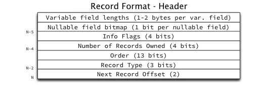
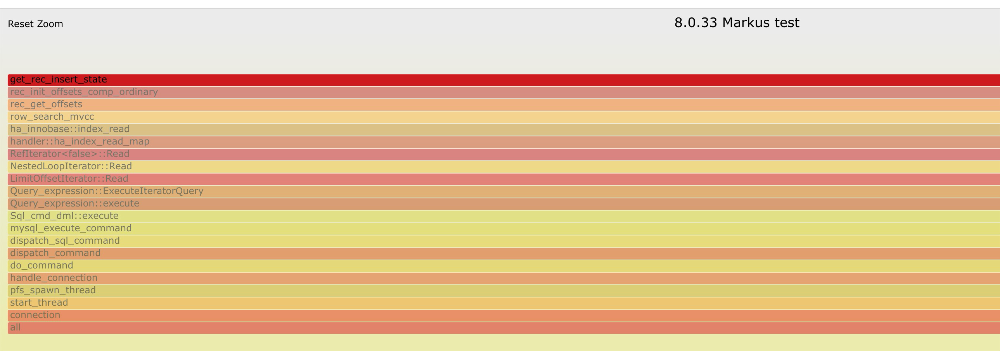

# MySQL ·  内核剖析 · issue 111538 MySQL 8.0 instant add/drop column 性能回退问题

**Date:** 2023/12
**Source:** http://mysql.taobao.org/monthly/2023/12/02/
**Images:** 5 images downloaded

---

数据库内核月报

 [
 # 数据库内核月报 － 2023 / 12
 ](/monthly/2023/12)

 * 当期文章

 MySQL · 行业动态 · AWS re:Invent2023 Aurora 发布了啥
* MySQL · 内核剖析 · issue 111538 MySQL 8.0 instant add/drop column 性能回退问题
* PolarDB MySQL自适应查询优化-自适应行列路由
* MySQL 中的压缩技术

 ## MySQL · 内核剖析 · issue 111538 MySQL 8.0 instant add/drop column 性能回退问题 
 Author: baotiao 

 issue 地址: https://bugs.mysql.com/bug.php?id=111538

影响范围: 从 8.0.29 版本开始, 在read heavy 场景, 性能可能有 5%~10% 的性能回退

MySQL 官方在8.0.29 里面加了instant add/drop column 能力, 能够实现 instant add 或者 drop cloumn 到表的任意位置. PolarDB 在这基础上增加了可以 Instant 修改列的能力, 具体可以看我们的月报

官方的实现介绍:

https://dev.mysql.com/blog-archive/mysql-8-0-instant-add-and-drop-columns/

instant DDL 核心观点只有一个: **don’t touch any row but update the metadata only**, 也就是仅仅去修改 Data Dictionary(DD) 信息, 而不去修改数据信息,这样才有可能做到 Instant.

具体的做法就是给每一个行增加了row_version, 然后DD 本身就是多版本, 不同的数据信息用不同的DD 信息去解析.

首先一个record 是否有row_version 信息添加到了Record info bits 里面.

info bits 包含有deleted flag, min record 等等信息, 后来在8.0.13 的时候增加record 是否有Instant ADD column 信息. 在 8.0.29 版本中增加了record 是否有 row_version 信息.

以上是这个 issue 背景, Instant add/drop column 的原理, 但是原因在哪里呢?

从Markus 提交上来的Flamegraph 可以看到, 在 8.0.33 里面 rec_get_offsets/cmp_dtuple_rec/rec_get_nth_field 等等相比 8.0.28 占比明显增多了. 整个 row_serch_mvcc 的调用开销也增加了.

核心原因由于数据record 增加了 row_version 信息, 导致在执行数据解析的函数 rec_get_offsets/rec_get_nth_field 等函数中增加了很多额外的判断, 并且官方把很多 inline function 改成了 non-inline.

为了验证想法, 我们做了 3 个地方的修改, 具体可以看 Issue 上面的代码提交:

**1. 将一些 non-inline function 改回inline function**

从 inline => non-inline. 修改的函数如下:

8.0.27

rec_get_nth_field => inline

rec_get_nth_field_offs => inline

rec_init_offsets_comp_ordinary => inline

rec_offs_nth_extern => inline

8.2.0

rec_get_nth_field => non-inline

rec_get_nth_field_offs => non-inline

rec_init_offsets_comp_ordinary => non-inline

rec_offs_nth_extern => non-inline

我们测试下来在 oltp_read_only 场景里面, 将这些 non-inline 函数改成 inline 以后, 性能可以有 3~5% 左右的提升空间. 具体改动代码可以在 issue 里面获得.

**2. 简化get_rec_insert_state 逻辑**

8.0.29 增加了 get_rec_insert_state 函数, 需要判断当前 record 是来自哪一个版本升级上来的, 从而使用合适的 DD 代码逻辑进行解析. 如果是包含有 row_version 版本, 还需要判断是否带有 version 信息, 如果没有 version 信息, 是不是8.0.12 instant add column 版本等等, 这里的逻辑非常琐碎.

所以 REC_INSERT_STATE 的状态非常多.

`enum REC_INSERT_STATE {
 /* Record was inserted before first instant add done in the earlier
 implementation. */
 INSERTED_BEFORE_INSTANT_ADD_OLD_IMPLEMENTATION,
 /* Record was inserted after first instant add done in the earlier
 implementation. */
 INSERTED_AFTER_INSTANT_ADD_OLD_IMPLEMENTATION,
 /* Record was inserted after upgrade but before first instant add done in the
 new implementation. */
 INSERTED_AFTER_UPGRADE_BEFORE_INSTANT_ADD_NEW_IMPLEMENTATION,
 /* Record was inserted before first instant add/drop done in the new
 implementation. */
 INSERTED_BEFORE_INSTANT_ADD_NEW_IMPLEMENTATION,
 /* Record was inserted after first instant add/drop done in the new
 implementation. */
 INSERTED_AFTER_INSTANT_ADD_NEW_IMPLEMENTATION,
 /* Record belongs to table with no verison no instant */
 // 如果index 上面没有做过instant add 或者 最新的row_version 版本Instant add/drop
 INSERTED_INTO_TABLE_WITH_NO_INSTANT_NO_VERSION,
 NONE
};
`

具体获得 insert_state 代码:

`static inline enum REC_INSERT_STATE get_rec_insert_state(
 const dict_index_t *index, const rec_t *rec, bool temp) {
 ut_ad(dict_table_is_comp(index->table) || temp);

 if (!index->has_instant_cols_or_row_versions()) {
 return INSERTED_INTO_TABLE_WITH_NO_INSTANT_NO_VERSION;
 }
 /* Position just before info-bits where version will be there if any */
 const byte *v_ptr =
 (byte *)rec -
 ((temp ? REC_N_TMP_EXTRA_BYTES : REC_N_NEW_EXTRA_BYTES) + 1);
 const bool is_versioned =
 (temp) ? rec_new_temp_is_versioned(rec) : rec_new_is_versioned(rec);
 // 如果有versioned 以后, 这里可以看到version 值是保存在Info bits 和 null field bitmap 中间的1 byte, 如下图
 const uint8_t version = (is_versioned) ? (uint8_t)(*v_ptr) : UINT8_UNDEFINED;

 const bool is_instant = (temp) ? rec_get_instant_flag_new_temp(rec)
 : rec_get_instant_flag_new(rec);
 // 说明一个Record 不能同时被instalt add 和 row_version 版本instant add/drop 处理过
 // 应该以后默认的新版本是row_version 版本 instant add/drop, 老的要被淘汰
 if (is_versioned && is_instant) {
 ib::error() << "Record has both instant and version bit set in Table '"
 << index->table_name << "', Index '" << index->name()
 << "'. This indicates that the table may be corrupt. Please "
 "run CHECK TABLE before proceeding.";
 }
 enum REC_INSERT_STATE rec_insert_state = REC_INSERT_STATE::NONE;
 if (is_versioned) {
 ut_a(is_valid_row_version(version));
 if (version == 0) {
 ut_ad(index->has_instant_cols());
 // is_versioned 说明record 有row_version, 如果version = 0, 说明是row_version DD 之前插入, 然后row_version DD 做过以后, 又升级了实例, 所以给这些row_version 设置成0
 rec_insert_state =
 INSERTED_AFTER_UPGRADE_BEFORE_INSTANT_ADD_NEW_IMPLEMENTATION;
 } else {
 // 最正常的record, row_version DD 之后插入的, 有自己的row_version 版本
 ut_ad(index->has_row_versions());
 rec_insert_state = INSERTED_AFTER_INSTANT_ADD_NEW_IMPLEMENTATION;
 }
 } else if (is_instant) {
 // 到这里说明record 上面没有row_version DD 标记, 只有instant add 标记
 // 说明这个Record 是Instant add 之后插入的record, 并且没有做过row_version DD
 ut_ad(index->table->has_instant_cols());
 rec_insert_state = INSERTED_AFTER_INSTANT_ADD_OLD_IMPLEMENTATION;
 } else if (index->table->has_instant_cols()) {
 // 到这里说明record 上面 没有row_version DD 和 instant add 标记, 但是这个index 上面有instant add 标记
 // 说明这个record 是instant add 之前就插入的
 rec_insert_state = INSERTED_BEFORE_INSTANT_ADD_OLD_IMPLEMENTATION;
 } else {
 // record 上面没有row_version DD, 也没用instant add 标记, 并且index 上面也没用instant add
 // 那么这个Record 是在row_version DD 以及 instant add 做过之前就插入的
 rec_insert_state = INSERTED_BEFORE_INSTANT_ADD_NEW_IMPLEMENTATION;
 }

 ut_ad(rec_insert_state != REC_INSERT_STATE::NONE);
 return rec_insert_state;
}
`

这里虽然 inline enum REC_INSERT_STATE get_rec_insert_state 定义的是 inline, 但是其实这个只是代码给编译器的定义, 具体函数是否 Inline 其实是编译器自己决定的, 最后其实具体运行的时候该函数并没有 inline, 因为可以从Flamegraph 看到, 说明这个函数是有符号表的信息的, 因此肯定不是 inline 的

**3. 将 swatch case 改成 if/else, 并且给编译器提示likely 执行的 branch**

最后我们发现 switch case 对于有些明显的分支预测并不友好, 通过 if/else 可以手动调整哪些 branch 更有可能执行, 从而优化编译器的选择.

 阅读： - 

本作品采用[知识共享署名-非商业性使用-相同方式共享 3.0 未本地化版本许可协议](http://creativecommons.org/licenses/by-nc-sa/3.0/)进行许可。

 