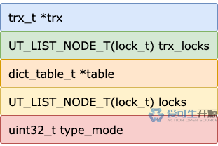
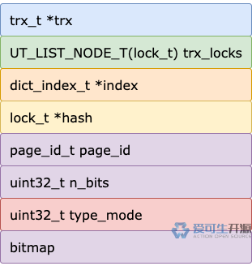

# 18 期 | 锁在内存里长什么样？

**原文链接**: https://opensource.actionsky.com/18-%e6%9c%9f-%e9%94%81%e5%9c%a8%e5%86%85%e5%ad%98%e9%87%8c%e9%95%bf%e4%bb%80%e4%b9%88%e6%a0%b7%ef%bc%9f/
**分类**: 技术干货
**发布时间**: 2024-05-30T18:16:54-08:00

---

表锁和行锁都由锁结构承载，这些锁结构在内存里是个什么样的存在？
> 作者：操盛春，爱可生技术专家，公众号『一树一溪』作者，专注于研究 MySQL 和 OceanBase 源码。
爱可生开源社区出品，原创内容未经授权不得随意使用，转载请联系小编并注明来源。
本文基于 MySQL 8.0.32 源码，存储引擎为 InnoDB。
## 1. 共用的结构
InnoDB 的表锁结构和行锁结构，有一些共同属性，也有一些不同属性。
因为有共同属性，表锁结构和行锁结构都使用结构体 `lock_t` 来表示锁结构。
在 lock_t 之下，又定义了 `lock_table_t`、`lock_rec_t` 分别包含表锁结构和行锁结构的不同属性。
为了更直观的理解表锁结构和行锁结构，我们去掉 `lock_t` 的一些非核心信息之后，整理如下：
`// storage/innobase/include/lock0priv.h
struct lock_t {
trx_t *trx;
UT_LIST_NODE_T(lock_t) trx_locks;
dict_index_t *index;
lock_t *hash;
union {
lock_table_t tab_lock;
lock_rec_t rec_lock;
};
uint32_t type_mode;
};
`
虽然表锁结构和行锁结构都定义了自己的结构体，用于表示各自不同的属性，但是 lock_t 中 `index`、`hash` 这两个只用于行锁结构的属性，并没有放入 `lock_rec_t`。
我们就不去追溯为什么这两个属性会放在 lock_t 中，而没有放入 lock_rec_t 了。
## 2. type_mode
从属性名上看，表锁结构和行锁结构的 `type_mode` 属性存放的是锁类型和锁模式。
实际上，这个属性比较复杂，它占用 4 字节，共 32 位，分为四个部分。

**第一部分**，1 ~ 4 位，这 4 位是个整体，共同表示一个整数值，就是`锁模式`。
- 0（LOCK_IS），表级别的意向共享锁。
- 1（LOCK_IX），表级别的意向排他锁。
- 2（LOCK_S），表级别或行级别的共享锁。
- 3（LOCK_X），表级别或行级别的排他锁。
- 4（LOCK_AUTO_INC），表级别的 Auto-Inc 锁。
锁模式部分的 4 字节，作为一个整体使用，而没有按位使用，这是有原因的。
按整体使用，4 字节的无符号整数最大值为 15，最多可以表示 15 种锁模式。
按位使用，每位只能表示一种锁模式，4 位只能表示 4 种锁模式。
**第二部分**，5 ~ 8 位，按位使用，存放的是`锁类型`。
- 第 5 位标识是否为表锁（`LOCK_TABLE`）。
- 第 6 位标识是否为行锁（`LOCK_REC`）。
- 第 7 ~ 8 位，暂未使用。
**第三部分**，第 9 位，按位使用，存放的是`锁等待状态`（LOCK_WAIT），置为 0 表示已经获得锁，置为 1 表示处于锁等待状态。
**第四部分**，10 ~ 32 位，按位使用，存放的是`锁的精确模式`，这部分只有行锁和谓词锁会用到，表锁不会用到。
- 第 10 位用于标识间隙锁（`LOCK_GAP`）。
- 第 11 位用于标识普通记录锁（`LOCK_REC_NOT_GAP`）。
- 第 12 位用于标识插入意向锁（`LOCK_INSERT_INTENTION`）。
- 第 13 位，暂未使用。
- 第 14 ~ 15 位分别用于标识 `LOCK_PREDICATE`、`LOCK_PRDT_PAGE`，都属于谓词锁。
- 第 16 ~ 32 位，暂未使用。
看到这里，大家有没有觉得奇怪，怎么没有用于标识 Next-Key 位置？
锁模式为行锁（LOCK_REC）时，如果 10 ~ 32 位中所有位都被设置为 0，就表示加的行锁是 Next-Key 锁。
## 3. 表锁结构
lock_t 中，表锁结构只使用 `trx`、`trx_locks`、`type_mode` 三个属性，加上 lock_table_t 的 `table`、`locks` 属性，就是表锁结构的全部属性了。

MySQL 执行 DDL、DML 语句时，InnoDB 都会有对应的事务（用户手动启动或者 InnoDB 自动启动）来执行这些语句对应的操作。
加锁操作自然也是在事务中进行的，`trx` 属性就是加这个表锁的事务对象。
事务执行一条或多条 DML 语句，可能涉及多个表，也就有可能加多个表锁。事务除了加表锁，还有可能加行锁，同一个事务加的一个或多个表锁和一个或多个行锁的锁结构通过 `trx_locks` 属性形成一个表锁结构和行锁结构混合的链表。
表锁是加在表上的，自然就需要知道表锁结构属于哪个表了，`table` 属性就是这个表锁结构所属的表对象。
同一时刻，可能有多个事务已经或者想要对同一个表加锁。对于兼容的表锁，多个事务可以同时加锁，对于不兼容的表锁，后加锁的事务就会处于等待状态。
事务想要对某个表加锁，InnoDB 怎么判断事务可以立即获得锁，还是要进入等待状态？
这就是 `locks` 属性的用武之地了。
多个事务对同一个表加了表锁，这些表锁的锁结构会通过 `locks` 属性形成一个链表。
事务想要对某个表加表锁，InnoDB 就会遍历这个链表。
如果链表中还没有表锁结构，或者所有锁结构对应的表锁都和事务当前要加的表锁兼容，事务就可以立即获得锁，否则就需要进入等待状态。
`type_mode` 属性的第 5 位用于标识锁结构是否为表锁（`LOCK_TABLE`）。
对于表锁，锁结构中 `type_mode` 属性的第 5 位会被设置为 1，第 1 ~ 4 位会写入锁模式对应的整数值。
如果事务不能立即获得表锁，`type_mode` 属性的第 9 位会被设置为 1，表示处于锁等待状态。
## 4. 行锁结构
lock_t 中，行锁结构使用 `trx`、`trx_locks`、`index`、`hash`、`type_mode` 五个属性，加上 lock_rec_t 的 `page_id`、`n_bits` 两个属性，外加行锁结构最后外挂了一块没有属性名的内存区域（我们暂且命名为 bitmap），就是行锁的整体结构了。

### 4.1 有名有姓的那些属性
和表锁结构一样，行锁结构里也有 `trx` 和 `trx_locks` 两个属性。
`trx` 属性是加这个行锁的事务对象。同一个事务加的一个或多个表锁和一个或多个行锁的锁结构，通过 `trx_locks` 属性形成一个表锁结构和行锁结构混合的链表。
主表的记录存储在主键索引中，二级索引（包括唯一索引、非唯一索引）的记录存储在二级索引中，行锁都是对主键索引或二级索引的记录加锁。`index` 属性就是这个行锁结构所属的索引对象。
InnoDB 可能同时有很多个事务在运行，这些事务加的行锁，可能会产生多个行锁结构。
每个行锁结构都会根据 `page_id` 属性中保存的表空间 ID、数据页号计算得到一个哈希值。哈希值相同的多个行锁结构通过 `hash` 属性形成一个行锁结构链表。
`n_bits` 属性的值是个无符号整数，表示这个锁结构能保存多少条记录的行锁状态，也就是最多有多少记录能共用这个行锁结构。
对于行锁，锁结构中 `type_mode` 属性的第 6 位会被设置为 1，第 1 ~ 4 位会被写入锁模式对应的整数值。
行锁的不同精确模式，`type_mode` 属性第四部分（10 ~ 32 位）各位的赋值情况如下：
- 普通记录锁，type_mode 属性的第 10 位会被设置为 1。
- 间隙锁，type_mode 属性的第 11 位会被设置为 1。
- 插入意向锁，type_mode 属性的第 12 位会被设置为 1。
- Next-Key 锁，type_mode 属性的第 10 ~ 32 位都设置为 0。
如果事务不能立即获得行锁，`type_mode` 属性的第 9 位会被设置为 1，表示处于锁等待状态。
### 4.2 隐姓埋名的内存区域
前面介绍的那些，都是 InnoDB 给取了名字的行锁结构属性。
还有一块没有名字的内存区域没有介绍。在前面的行锁结构图中，我们给这块内存区域取了个名字，为 `bitmap`。
bitmap 这块内存区域是干嘛用的呢？
待我们细细说来。
我们先忽略 bitmap 内存区域的存在，**假设**一个事务对一条记录加行锁，会产生一个行锁结构，对多条记录加行锁，就会产生多个行锁结构。
又**假设**事务对多条记录加的都是共享 Next-Key 锁，并且已经获得了锁，巧合的是这些记录又位于同一个数据页，那么，这些锁结构除了加锁记录不一样，其它属性的值都相同。
如果真这么设计行锁结构，是不是太浪费内存空间了？
当然是了。虽然现在内存越来越便宜，但是毕竟还要花钱，也不能那么铺张浪费。
本着勤俭节约的原则，InnoDB 把加锁记录不同、其它属性值都相同的多个行锁结构合并成一个，另外开辟一块内存区域用于标识加锁记录，于是就有了我们命名为 `bitmap` 的内存区域。
bitmap 内存区域按位使用，每一位都用于标识事务是否对某条记录加了行锁。如果某一位被设置为 1，就表示事务对该位对应的记录加了行锁。

上图是事务对象初始化时，预先创建的一个行锁结构的 bitmap 内存区域示意图，大小为 256 字节，可以用于标识这个事务对 2048 条记录加行锁的情况。
示意图中，第 3 位和第 5 位被设置为 1，说明事务对数据页中序号为 0 和 4 的记录加了行锁。
没有规矩不成方圆，InnoDB 不会胡乱的把多个行锁结构合并成一个。
事务对多条记录加行锁，想要共用一个行锁结构，需要同时满足以下个条件：
- 同一个事务对多条记录加行锁。
- 这些记录位于同一个数据页中（也就是同一个表同一个索引的同一个数据页）。
- 这些行锁的锁模式相同，必须都是共享锁，或者都是排他锁。
- 这些行锁的精确模式相同，必须都是普通记录锁，或者都是间隙锁，或者都是 Next-Key 锁。
- 这些行锁都处于获得锁的状态，不能处于锁等待状态。
### 4.3 共用行锁结构的两个问题
**问题一**：多个处于等待状态的行锁能共用一个锁结构吗？
理论上是可以的，但实际上不会出现这种情况。
因为共用一个行锁结构需要满足的条件之一，是一个事务对多条记录加行锁。
然而，一个事务对某条记录加行锁处于等待状态，在获得锁或者锁超时之前（不考虑异常情况），这个事务不会继续往下执行。
这样一来，一个事务在某一时刻，最多只有一个行锁结构（对应一条记录）处于等待状态，也就不存在多个处于等待状态的行锁共用一个行锁结构的情况了。
获得锁或者锁等待超时之后，行锁结构中 `type_mode` 的第 9 位就会被设置为 0，表示这个行锁处于非等待状态，后续在满足共用条件的情况下，这个锁结构才可以被共用。
**问题二**：多个插入意向锁能共用一个锁结构吗？
同样，理论上是可以的，但实际上不会出现这种情况。
首先，插入意向锁的加锁场景，是事务 T 想要在某条记录前面的间隙插入一条记录，而这个间隙被其它事务加了间隙锁或者 Next-Key 锁，导致事务 T 必须在这个间隙上加插入意向锁，并等待其它事务释放间隙锁或者 Next-Key 锁。
前面已经介绍过，处于等待状态的行锁结构，是不能共用的。
然后，事务 T 获得锁之后，它的精确模式为 `LOCK_GAP + LOCK_INSERT_INTENTION`，其它间隙锁也不能共用这个锁结构，因为间隙锁的精确模式为 `LOCK_GAP`。
虽然插入意向锁的锁结构不能共用，会浪费一些内存，但好在加插入意向锁的情况也不会非常多，浪费的内存也就不会太多。
## 5. 总结
InnoDB 的表锁结构和行锁结构，有一部分属性是相同的，也有一部分属性是专用的，所以，代码里定义了三个结构体来描述表锁结构和行锁结构。
一个事务对每个表加表锁，都会产生一个表锁结构。
一个事务对多条记录加行锁，满足条件时，多条记录的行锁可以共用一个行锁结构，以节省内存。
处于等待状态的行锁结构，不能共用。获得行锁或者锁等待超时之后，这个锁结构会变为非等待状态，之后满足条件时，这个锁结构可以被共用。
插入意向锁的锁结构不能共用。