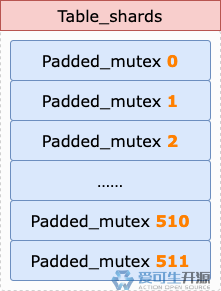
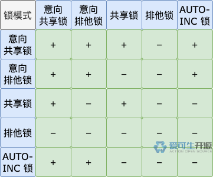
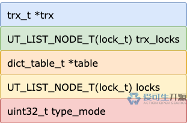
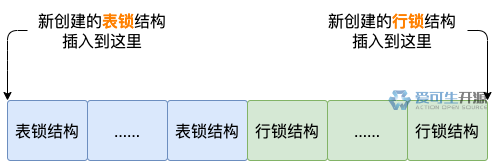

# 20 期 | MySQL 怎么加表锁？

**原文链接**: https://opensource.actionsky.com/20-%e6%9c%9f-mysql-%e6%80%8e%e4%b9%88%e5%8a%a0%e8%a1%a8%e9%94%81%ef%bc%9f/
**分类**: MySQL 新特性
**发布时间**: 2024-06-12T22:27:53-08:00

---

意向共享锁、意向排他锁、AUTO-INC 锁是 InnoDB 最常用的表锁，它们的加锁流程是什么样的？
> 
作者：操盛春，爱可生技术专家，公众号『一树一溪』作者，专注于研究 MySQL 和 OceanBase 源码。
爱可生开源社区出品，原创内容未经授权不得随意使用，转载请联系小编并注明来源。
本文基于 MySQL 8.0.32 源码，存储引擎为 InnoDB。
## 1. 是否已经加锁？
一个事务，在执行过程中，可能多次操作同一个表。如果多次操作都需要表锁保护，InnoDB 并不会简单粗暴的重复加锁。
每次加表锁之前，如果 InnoDB 判断事务已经对这个表加了相同或者更高级别的表锁，就不会执行本次加表锁操作了。
以事务 T1 读取某个表的多条记录，并且需要加行级别的共享锁为例。
每次加行级别的共享锁之前，都会触发操作：给记录所在的表加表级别的意向共享锁。
每次加表级别的意向共享锁之前，如果 InnoDB 判断事务 T1 已经给这个表加了表级别的意向共享锁、意向排他锁、共享锁、排他锁中的一个，就不会执行本次加表锁操作了。
接下来，我们看看 InnoDB 怎么判断事务是否已经对某个表加了相同或者更高级别的表锁。
前面关于锁结构的文章，我们介绍过，同一个事务加的一个或多个表锁、一个或多个行锁的锁结构，会通过每个锁结构的 `trx_locks` 属性形成一个锁结构链表，我们称之为 **trx_locks 链表**。
判断事务是否已经给某个表加了相同或者更高级别的表锁，需要遍历这个事务的 trx_locks 链表。
因为 trx_locks 链表中，既可能有表锁结构，也可能有行锁结构，并且这些锁结构可能属于不同的表。
遍历 trx_locks 链表的过程中，每次取出一个锁结构，我们称之为 **trx_locks 锁结构**。
对于 `trx_locks 锁结构`，先判断它的锁类型。
如果是行锁结构，就直接忽略，不做任何处理。
如果是表锁结构，但是它对应的表不是本次要加表锁的表，不会阻塞本次加表锁操作，也直接忽略，不做任何处理。
否则，判断这个锁结构对应的表锁，和本次要加的表锁相比，级别相同还是更强。
那要怎么判断两个表锁的强弱关系？
回答这个问题之前，我们有必要先来看看各种锁模式的强弱关系图。

有了这张图，我们就可以继续回答上面的问题了，具体判断逻辑如下。
**第 1 步**，根据 `trx_locks 锁结构`的锁模式，找到上图中对应的行。
**第 2 步**，根据本次要加的表锁的锁模式，找到上一步的行中对应的列。
**第 3 步**，确定了行和列之后，就有了表示两个表锁强弱关系的结果。
如果结果为加号（`+`），说明 `trx_locks 锁结构`对应的表锁，和本次要加的表锁相比，级别相同或者更高。
如果结果为减号（`-`），说明 `trx_locks 锁结构`对应的表锁，比本次要加的表锁级别低。
## 2. 先拿个令牌
一个事务加的一个或多个表锁、一个或多个行锁的锁结构，通过各锁结构的 `trx_locks` 属性形成一个链表，前面我们已经把这个链表称为 `trx_locks 链表`。
多个事务对同一个表加的表锁，通过各锁结构的 `locks` 属性形成一个链表，我们称之为 **locks 链表**。
事务给某个表加表锁的过程中，新申请的表锁结构除了要加入这个事务的 trx_locks 链表，还要加入这个表的 locks 链表。
如果多个事务同时把表锁结构加入 locks 链表，可能会出现冲突。
为了避免冲突，最简单的办法就是一个一个来，InnoDB 为此使用了一种称为**互斥量**的机制，英文名字是 `mutex`。
我们可以把互斥量理解为一个令牌，在加表锁的场景下，每个表都对应一个令牌。
每个事务都需要先拿到令牌，才能把对应的表锁结构加入 locks 链表，完事之后再把令牌还回去。
没有拿到令牌的事务，想要把表锁结构加入 locks 链表，需要等待。
如果多个事务同一时间都想拿到同一个表的令牌，需要按照先来后到的顺序排队，等前面拿到令牌的事务把令牌还回去之后，剩下的排队事务中，最早排队的那个事务就能拿到令牌，把它的表锁结构加入 locks 链表。
前面关于锁结构的文章，我们介绍过，锁模块结构的对象（`lock_sys`），有个 `latches` 属性，也是个对象。
latches 对象有两个属性，分别管理用于表锁结构和行锁结构的互斥量们。其中用于管理表锁结构互斥量的属性为 `table_shards`。
table_shards 属性也是个对象，它里面有个名为 `mutexes` 的数组，有 512 个单元，每个单元都保存了一个表锁互斥量。

事务把表锁结构加入 locks 链表之前，要先拿到这个表的令牌，也就是要获得这个表对应的表锁互斥量。
获得表锁互斥量的过程比较简单：
- 用表 ID 对数组单元数量（512）取模，得到的结果作为 `mutexes` 数组的下标。
- 申请获得下标对应的表锁互斥量。
如果有其它事务已经获得并持有这个表锁互斥量，当前事务需要等待，直到获得表锁互斥量，才能继续进行接下来的加表锁流程。
如果没有其它事务持有这个表锁互斥量，当前事务可以立即获得这个表锁互斥量，继续进行接下来的加表锁流程。
前面不是说每个表都对应一个令牌（也就是一个表锁互斥量）吗？为什么获取表锁互斥量时，还要对数组单元数量取模？
这是因为 InnoDB 中只有 512 个互斥量，用于避免把表锁结构加入 locks 链表出现冲突。
这样一来，虽然每个表都对应一个互斥量，但一个互斥量并不只对应一个表，也就是说表锁互斥量和表是一对多的关系。
这会出现一种现象，就是多个表的 ID 对 512 取模，得到的结果相同。
这些表会共用同一个表锁互斥量，多个事务对这些表加表锁，同一时间把各自的表锁结构加入表对象的 locks 链表，申请获得同一个表锁互斥量，会相互影响。
## 3. 会不会被阻塞？
前面介绍了获得表锁互斥量的过程，事务想要加表锁，获得表锁互斥量之后，接下来就要判断是否能立即获得表锁了。
换句话说，也就是要判断是否有其它事务已经获得并持有的表锁，和本次要加的表锁不兼容，从而阻塞本次加表锁。
对表中记录加行级别的共享锁、排他锁之前，需要分别加表级别的意向共享锁、意向排他锁，意味着这两种意向锁的加锁操作会比较频繁。
InnoDB 使用了锁模式计数，来加速判断两种意向锁的加锁操作是否会被阻塞。
每次加表锁申请一个锁结构，都会在锁结构对应的表对象上，增加锁模式的计数。代码如下：
`// storage/innobase/lock/lock0lock.cc
static inline lock_t *lock_table_create(...)
...
// 锁模式计数加 1
++table->count_by_mode[type_mode & LOCK_MODE_MASK];
...
}
`
表级别的排他锁和意向共享锁不兼容，表级别的共享锁、排他锁和意向排他锁不兼容。
对某个表加意向共享锁、意向排他锁之前，可以通过表级别的共享锁、排他锁这两种锁模式的计数，快速判断本次是否能立即获得意向共享锁、意向排他锁。代码如下：
`static inline const lock_t *lock_table_other_has_incompatible(...)
{
...
// LOCK_IS：意向共享锁
// LOCK_IX：意向排他锁
if ((mode == LOCK_IS || mode == LOCK_IX) &&
table->count_by_mode[LOCK_S] == 0 &&
table->count_by_mode[LOCK_X] == 0) {
// 返回 nullptr,
// 表示没有其它事务持有的表锁阻塞当前事务要加的表锁
// 当前事务可以立即获得表锁
return nullptr;
}
...
}
`
如果两种锁模式的计数都为 0，说明没有其它事务持有表级别的共享锁、排他锁，本次可以立即获得意向共享锁、意向排他锁，不会被阻塞。
如果满足以下两个条件之一，就要遍历这个表对象的 locks 链表，逐个判断其中的表锁结构对应的锁模式，是否和本次要加的表锁的锁模式兼容。
- 两种锁模式的计数都不为 0，或者其中一个不为 0。
- 本次要加的表锁，即不是意向共享锁，也不是意向排他锁。
遍历 locks 链表的过程中，每次取出一个表锁结构，我们称之为 **locks 表锁结构**。
对于 `locks 表锁结构`，需要判断它的锁模式是否和本次要加的表锁的锁模式兼容，碰到第一个不兼容的，就结束遍历，本次要加的表锁就不能立即获得，加锁操作会被阻塞。
那么，问题来了：**怎么判断两个表锁的锁模式是否兼容？**
在回答这个问题之前，我们还是先来看一下锁模式的兼容关系图。

有了这张图，我们就可以继续回答上面的问题了，具体判断逻辑如下。
**第 1 步**，根据 `locks 表锁结构`的锁模式，找到上图中对应的行。
**第 2 步**，根据本次要加的表锁的锁模式，在上一步的行中找到对应的列。
**第 3 步**，确定行和列之后，就有了表示两种锁模式的兼容关系的结果。
如果结果为加号（`+`），说明 `locks 表锁结构`的锁模式和本次要加的表锁的锁模式兼容，结果为减号（`-`），则说明不兼容。
## 4. 申请表锁结构
不管本次加表锁操作，是能够立即获得锁，还是被阻塞进入等待状态，都需要申请一个新的表锁结构，这会分为两种情况。
**情况 1**，使用事务预先创建的表锁结构。
每个事务对象初始化时，都会预先创建 8 个表锁结构，供事务运行过程中加表锁使用。
事务加表锁需要新的锁结构时，只要预先创建的这些表锁结构，还有空闲的，就可以拿一个来使用。
如果事务预先创建的所有表锁结构都已经被使用了，那就进入`情况 2`。
**情况 2**，创建新的表锁结构。
创建过程的第一步是申请一块内存，接下来就是初始化表锁结构的各个属性了。
首先要初始化的属性是 `type_mode`。对于表锁结构，type_mode 属性的锁模式、锁类型区域肯定要初始化。

type_mode 属性的第 1 ~ 4 位，是锁模式区域，本次要加的表锁的锁模式作为一个整数，写入这块区域中。
type_mode 属性的第 5 位设置为 1，表示这个锁结构对应的锁类型是表锁。
如果不能立即获得表锁，type_mode 属性的第 9 位会被设置为 1，表示这个锁结构对应的锁处于等待状态。

上图是表锁结构的所有属性，除 type_mode 属性外，其它属性的初始化没有什么特殊的，我们就不一一展开介绍了。
初始化表锁结构的各属性完成之后，接下来就是把表锁结构加入事务对象的 trx_locks 链表和表对象的 locks 链表。
**首先**，表锁结构会加入 trx_locks 链表。
这个链表中既有表锁结构，也有行锁结构，并且这些锁结构可能属于不同的表。
虽然混合了表锁结构和行锁结构，但是 trx_locks 链表把两种锁结构作了分区处理。

表锁结构都插入到链表的开始处，行锁结构都插入到链表的末尾。也就是说，表锁结构位于链表的头部区域，行锁结构位于链表的尾部区域。
**然后**，表锁结构会加入 locks 链表的尾部。
这个链表中包含的是多个事务对这个表加的各种模式的表锁的锁结构。
前面介绍的创建表锁结构的过程，是通用流程。接下来，我们再说说有点特殊的 AUTO-INC 锁（不包含轻量锁）。
每个表对象都有个 `autoinc_lock` 属性，表对象初始化时，就会创建一个 AUTO-INC 锁的表锁结构，保存在这个属性中。
当有事务需要对这个表加 AUTO-INC 锁时，如果能立即获得锁，就直接使用 `autoinc_lock` 属性中保存的表锁结构，不需要再额外创建一个新的表锁结构。
如果不能立即获得 AUTO-INC 锁，就和其它表锁一样，需要申请一个新的表锁结构，具体流程就是前面介绍的通用流程。
## 5. 总结
事务（T1）对某个表（A）加表锁的主要流程如下。
**第 1 步**，判断事务 T1 是否已经对表 A 加了相同或者更高级别的表锁，如果是，本次加锁流程结束。
**第 2 步**，获得表锁互斥量。如果有其它事务持有这个表锁互斥量，事务 T1 需要等待，直到获得这个表锁互斥量。
**第 3 步**，判断是否有其它事务持有的表锁阻塞本次加锁操作。如果是，事务 T1 进入锁等待状态，直到没有其它事务持有的表锁阻塞本次加锁操作。
**第 4 步**，申请一个新的表锁结构，并初始化表锁结构的各属性，然后把表锁结构加入事务对象的 trx_locks 链表、表对象的 locks 链表。