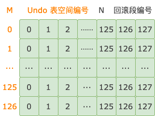
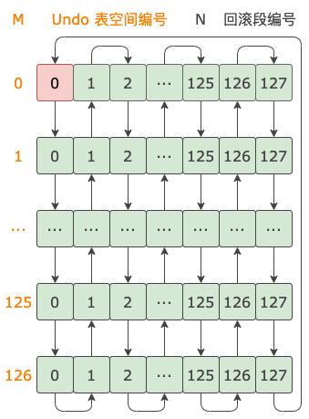

# 45 期：分配回滚段

**原文链接**: https://opensource.actionsky.com/45-%e6%9c%9f%ef%bc%9a%e5%88%86%e9%85%8d%e5%9b%9e%e6%bb%9a%e6%ae%b5/
**分类**: 技术干货
**发布时间**: 2025-01-05T21:39:12-08:00

---

事务写第一条 Undo 日志之前，需要先分配回滚段。
> 作者：操盛春，爱可生技术专家，公众号『一树一溪』作者，专注于研究 MySQL 和 OceanBase 源码。
爱可生开源社区出品，原创内容未经授权不得随意使用，转载请联系小编并注明来源。
本文基于 MySQL 8.0.32 源码，存储引擎为 InnoDB。
## 1. 内存结构
回滚段除了在 Undo 表空间中有一个段首页之外，在内存里也有对应的结构。回滚段的内存结构有 16 个属性，这里我们介绍主要的 8 个属性。
以下 4 个属性，分配 Undo 段时会用到。
**update_undo_cached**，回滚段中缓存的 Update Undo 段的链表。更新、删除操作优先从这个链表中分配一个 Update Undo 段。
**update_undo_list**，回滚段管理的 Update Undo 段的链表。从 update_undo_cached 链表中分配的、新创建的 Update Undo 段，都会插入这个链表的头部。
**insert_undo_cached**，回滚段中缓存的 Insert Undo 段的链表。插入操作优先从这个链表中分配一个 Insert Undo 段。
**insert_undo_list**，回滚段管理的 Insert Undo 段的链表。从 insert_undo_cached 链表中分配的、新创建的 Insert Undo 段，都会插入这个链表的头部。
以下 4 个属性，后台 purge 线程会用到。这些属性是最早加入到回滚段 history 链表中，还没有执行 purge 操作的一组 Undo 日志的相关信息。
**last_page_no**，这组 Undo 日志的头信息所在 Undo 页的页号。
**last_offset**，这组 Undo 日志的头信息在 Undo 页中的偏移量。
**last_trx_no**，产生这组 Undo 日志的事务的 ID。
**last_del_marks**，这组 Undo 日志中是否包含标记删除记录、修改溢出字段产生的 Undo 日志。如果这个属性值为 true，后台 purge 线程会清除标记删除记录、清除溢出字段修改之前的内容。
## 2. 分配用户临时表回滚段
改变用户临时表中数据分配的回滚段，位于哪个文件，由系统变量 `innodb_temp_data_file_path` 控制。默认值为 `ibtmp1:12M:autoextend`。其中，ibtmp1 为文件名，12M 为初始大小，autoextend 表示文件会按需增长。
用户临时表 Undo 表空间中的回滚段数量，由系统变量 `innodb_rollback_segments` 控制，默认值为 128。这些回滚段的内存结构都保存在事务子系统全局对象的 tmp_rsegs 数组中。
分配用户临时表回滚段的操作有个 `temp_rseg_counter` 计数器，初始值为 0。分配回滚段的完整流程如下：
- 获取 temp_rseg_counter 的值，加 1（不改变 temp_rseg_counter）。
- 上一步相加的结果，对回滚段数量（128）取模，得到 tmp_rsegs 数组的下标。
- temp_rseg_counter 加 1。
- 根据前面得到的数组下标，从 tmp_rsegs 数组中获取回滚段。
从以上流程可以看到，MySQL 启动之后，第一次分配用户临时表回滚段，分配的是 tmp_rsegs 数组中下标为 1 的回滚段，也就是第二个回滚段。
## 3. 分配用户普通表回滚段
对于用户普通表，InnoDB 最多支持 127 个 Undo 表空间。每个 Undo 表空间的回滚段数量，由系统变量 `innodb_rollback_segments` 控制，默认值为 128。
以 127 个 Undo 表空间、每个 Undo 表空间 128 个回滚段为例。一个 Undo 表空间的 128 个回滚段，从第一个到最后一个组成一行。所有 Undo 表空间中编号相同的回滚段组成一列。我们能得到一个 `127 * 128` 的矩阵。
矩阵的行号对应 Undo 表空间的编号，范围是 0 ~ 126。矩阵的列号对应 Undo 表空间中回滚段的编号，范围是 0 ~ 127，如下图所示。

分配回滚段时，从矩阵第一列开始，第一次分配第一行对应的回滚段，下次分配第二行对应的回滚段。依此类推，第一列都分配一遍之后，再从第二列的第一行开始分配。所有列的所有行都分配一遍之后，又从第一列开始。循环往复，直到天荒地老。
分配回滚段的顺序，从下图中红色方块开始，按照箭头方向依次分配。

以 (Undo 表空间编号, 回滚段编号) 的二维坐标方式表示的分配回滚段的顺序如下：
`(0, 0), (1, 0), ..., (125, 0), (126, 0),
/* 接上一行 */ (0, 1), (1, 1), ..., (125, 1), (126, 1),
/* 接上一行 */ (0, 2), (1, 2), ..., (125, 2), (126, 2),
/* 接上一行 */ ... ... ...
/* 接上一行 */ (0, 125), (1, 125), ..., (125, 125), (126, 125),
/* 接上一行 */ (0, 126), (1, 126), ..., (125, 126), (126, 126),
/* 接上一行 */ (0, 127), (1, 127), ..., (125, 127), (126, 127),
`
分配用户普通表回滚段的操作有个 `rseg_counter` 计数器，初始值为 0。分配回滚段的完整流程如下：
- 获取 rseg_counter 的值，保存到 current 中。
- rseg_counter 加 1（改变了 rseg_counter）。
- 计算本次分配的回滚段在所有 Undo 表空间的回滚段中的编号，结果保存到 window 中。
计算公式为 `window = current % [所有 Undo 表空间的回滚段数量之和]`。
- 计算本次分配的回滚段位于哪个 Undo 表空间，结果保存到 space_slot 中。
计算公式为 `space_slot = window % [Undo 表空间数量]`。
- 计算本次分配的回滚段在 Undo 表空间中的编号，结果保存到 reg_slot 中。
计算公式为 `reg_slot = window / [Undo 表空间数量]`。
- 根据 space_slot 获取到 Undo 表空间对象，保存到 undo_space 中。
- 从 undo_space 中获取 reg_slot 编号对应的回滚段。
## 4. 分配给谁？
用户临时表、用户普通表的回滚段都是分配给事务的，分配之后都保存到事务对象中。
每个事务对象（trx）都有一个 rsegs 属性，用于保存分配给这个事务的回滚段。
rsegs 属性也是个对象，有两个属性：
- **m_redo**，分配给该事务的用户普通表回滚段。
- **m_noredo**，分配给该事务的用户临时表回滚段。
## 5. 总结
用户临时表的 Undo 表空间只有一个，默认位于 ibtmp1 文件中。分配回滚段时，从第二个回滚段开始，依次分配，分配到最后一个回滚段之后，后面就从一个回滚段开始，循环往复。
用户普通表的 Undo 表空间有多个。分配回滚段时，依次分配每个 Undo 表空间中的 0 号回滚段，然后依次分配每个 Undo 表空间中的 1 号回滚段。依此类推，分配完所有 Undo 表空间的最后一个回滚段之后，重复前面的过程。
**留个小问题，欢迎评论区留言交流：**分配用户普通表的回滚段时，为什么不依次分配每个 Undo 表空间的 0 ~ 127 号回滚段，然后再依次分配下一个 Undo 表空间的 0 ~ 127 号回滚段？