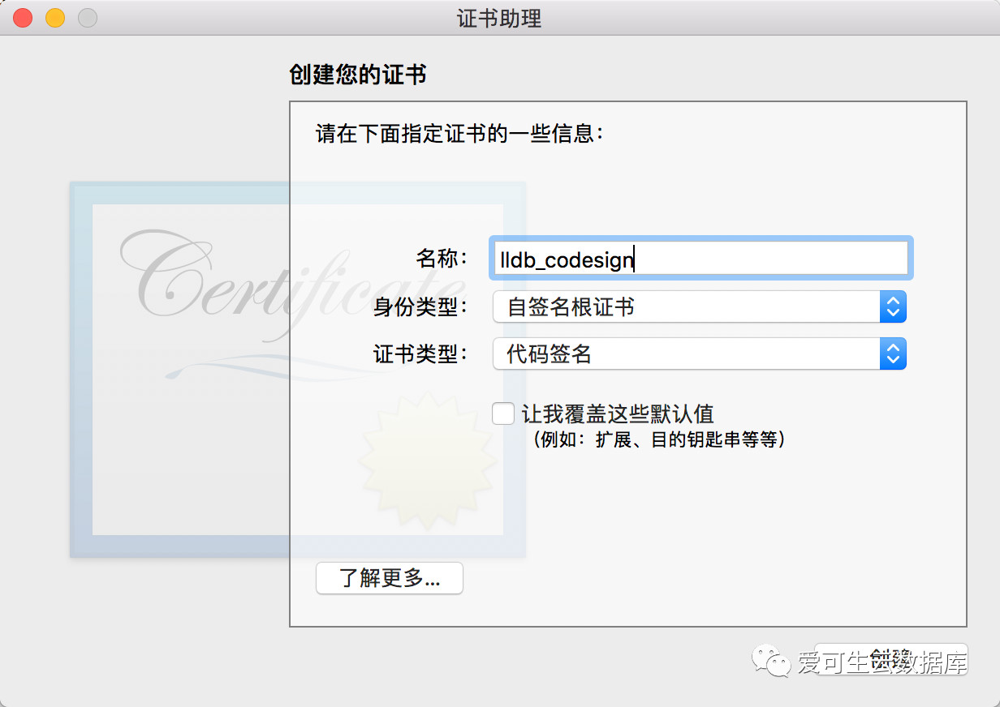
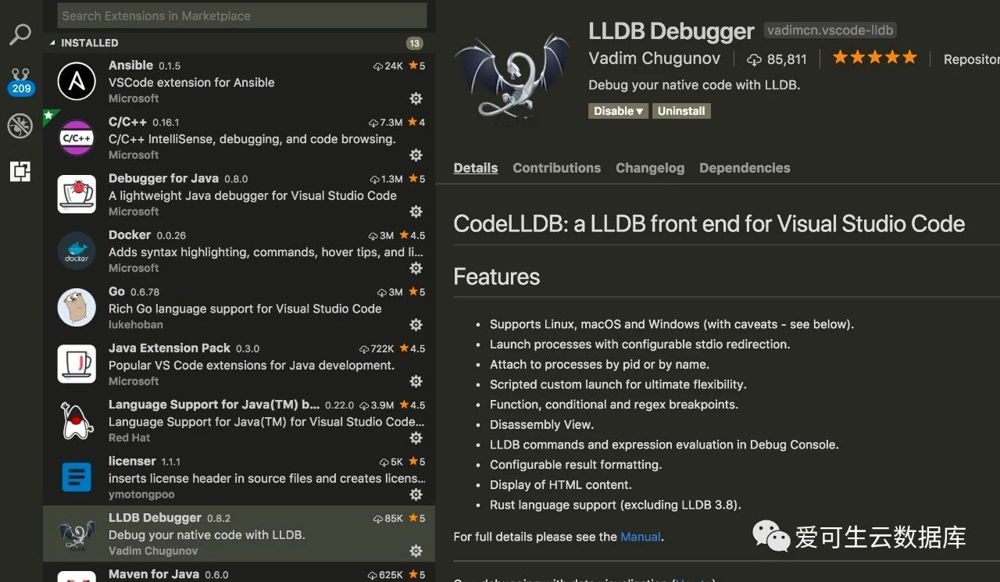
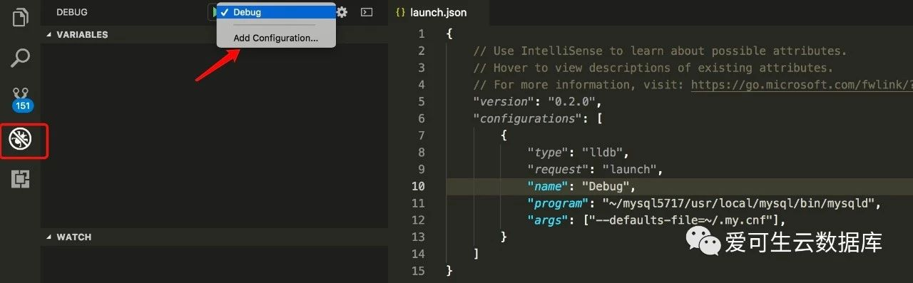
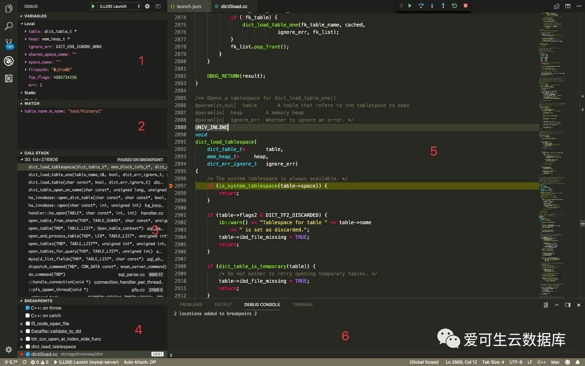
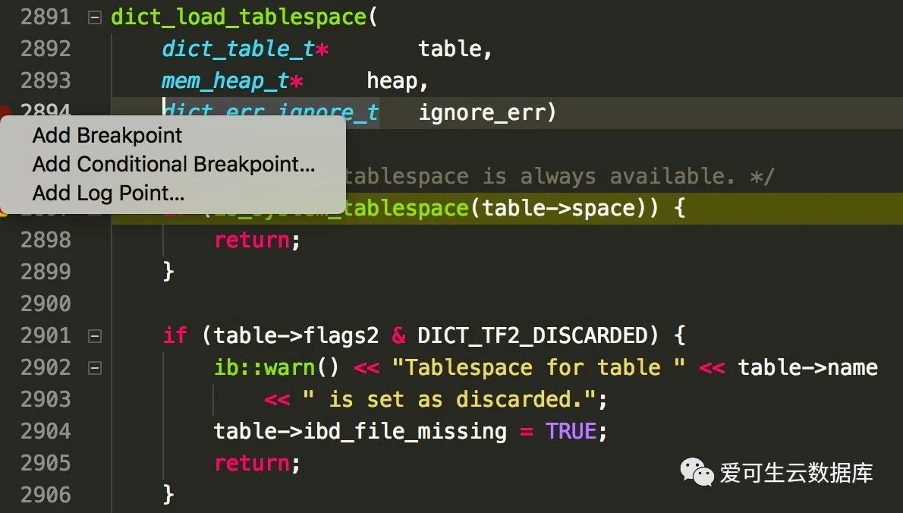
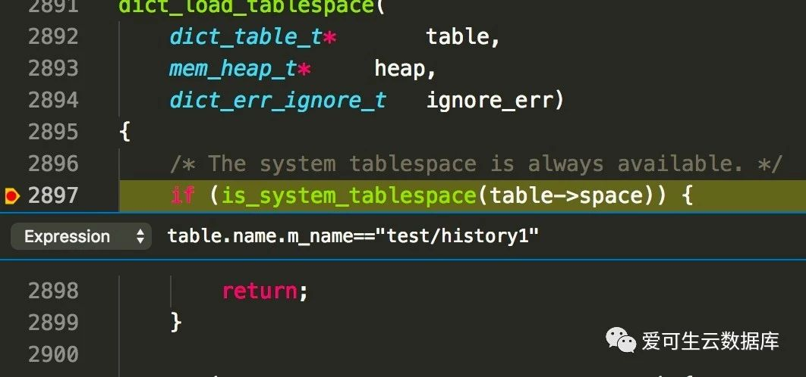

# 使用VS Code调试MySQL

**原文链接**: https://opensource.actionsky.com/20190313-vs-code/
**分类**: 技术干货
**发布时间**: 2019-03-13T23:56:31-08:00

---

## 简介
MySQL调试是探索MySQL源码的基本技能，之前介绍过如何使用LLDB调试MySQL，但命令行操作不便，在编辑器和终端之间来回切换，查看代码不便，本文将介绍在Mac OS中如何使用VS Code进行本地和远程调试，可以大大的提高调试效率。
## Visual Studio Code
Visual Studio Code（简称VS Code）是由微软开发的，同时支持Windows、Linux和macOS操作系统的开源文本编辑器。它支持调试，内置了Git 版本控制功能，同时也具有开发环境功能，例如代码补全（类似于IntelliSense）、代码片段、代码重构等。该编辑器支持用户自定义配置，例如改变主题颜色、键盘快捷方式、编辑器属性和其他参数，还支持扩展程序并在编辑器中内置了扩展程序管理的功能。
## 安装LLDB
LLDB是LLVM编译器的一部分，推荐使用Homebrew安装LLVM工具集，不建议使用系统自带的LLDB，安装前必须先创建证书否则无法安装，步骤如下：
](https://i.loli.net/2019/03/14/5c8a060816c90.jpg)

创建完成后，开始安装LLVM
`brew install llvm --with-python@2 --with-lldb
`
## 安装插件
VS Code自带有debug功能，这里我推荐使用LLDB Debugger插件。

接下来，为项目配置调试参数。
## 配置调试参数
使用VS Code打开MySQL源码目录，在侧边栏选择debug栏目，添加配置，program输入需要调试的程序路径，这里选择你编译好的mysqld路径，args输入程序启动所需的参数，通常会指定mysqld的配置文件。这样就配置好了，是不是很简单。

## 启动调试
点击启动按钮，启动后如果没有设置断点会mysqld会正常启动，如果触发了断点会如下图显示。

整个调试窗口基本分为六部分，所有的调试操作都在这里完成:
> 
1: 显示变量信息
2: 设置重点关注的变量
3: 显示调用栈信息
4: 设置断点信息，在代码行号前也可以设置断点
5: 代码显示区域，上方是调试按钮，包括 continue/stepover/step in/step out/restart/stop
6: 调试终端输入输出区
## 断点设置
在代码行号前点击即可在该行为设置断点，也可以根据条件设置断点。以设置ConditionalBreakpoint为例，当程序启动后会按照你设置的条件表达式判断是否触发断点。

Conditional Breakpoint这种方式用在目标变量达到某条件时触发断点，其余则跳过继续执行。比如：设置变量等于目标表名时触发断点，其余表则跳过，相对函数名断点省去很多手工跳过操作。

## 远程调试
假如你想调试远程Linux服务器上的MySQL上面的方法就不合适了，这时需要远程调试。lldb和gdb都支持远程调试，这里以lldb为例。
需要先在远程主机上安装lldb，使用yum安装，源地址在这里http://mirror.centos.org/centos/7/sclo/x86_64/rh
`remote$ yum install -y llvm-toolset-7
`
安装完成后，启动lldb-server
`remote$ /opt/rh/llvm-toolset-7/root/usr/bin/lldb-serverplatform --listen "*:9191" --server
`
接下来，在VS Code调试界面中新增配置项。
`{
"type": "lldb",
"request": "attach",
"name": "Remote attach",
"program": "~/mysql5626/usr/local/mysql/bin/mysqld",
"pid":"<target_pid>",
"initCommands": [
"platform select remote-linux",
"platform connect connect://<remote_host>:9191"
],
"sourceMap": {
"/export/home/pb2/build/sb_0-15908961-1436910670.17/mysql-5.6.26": "/Users/hongbin/workbench/mysql-server"
}
},
`
- program: 本机也要拷贝一份目标程序，加载
- pid: 填写远程主机的mysqld进程id
- sourceMap: 填写mysqld编译的代码路径与本机代码库路径的映射，这样调试时代码才可以和程序关联在一起看
**注意：**记得调试前将代码切换到与目标程序版本一致的branch
## 参考
http://lldb.llvm.org/remote.html
https://github.com/vadimcn/vscode-lldb