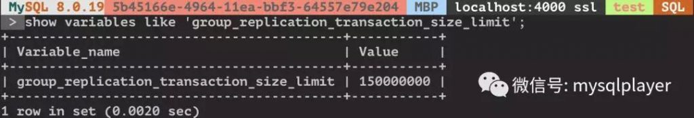
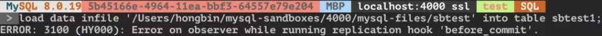
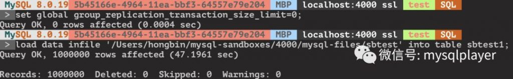
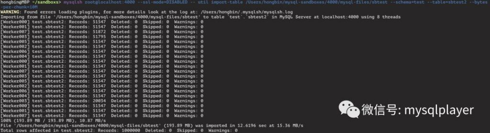

# 技术分享 | InnoDB Cluster 如何高效加载数据

**原文链接**: https://opensource.actionsky.com/20200311-mysql/
**分类**: MySQL 新特性
**发布时间**: 2020-03-11T03:55:26-08:00

---

作者：洪斌
爱可生南区负责人兼技术服务总监，MySQL  ACE，擅长数据库架构规划、故障诊断、性能优化分析，实践经验丰富，帮助各行业客户解决 MySQL 技术问题，为金融、运营商、互联网等行业客户提供 MySQL 整体解决方案。
本文来源：转载自公众号-玩转MySQL
*爱可生开源社区出品，原创内容未经授权不得随意使用，转载请联系小编并注明来源。
一行命令搞定 InnoDB Cluster 数据快速加载。
InnoDB Cluster 8.0 经过一系列的优化已足够稳定，早期版本常因网络延迟、闪断等问题造成集群不稳定，也曾遇到客户因网络缓解问题导致节点频繁被踢，可用性得不到保障，不得不使用外围运维手段保障集群稳定性，也增加了运维工作的复杂性。现在通过参数优化已能得到有效解决，能够容忍一定网络波动。
解决了网络问题，另一个使用 InnoDB Cluster 面临问题就是大事务了，系统难免会遇到大的 DML，load data 操作。
在数据同步机制上 group replication 与 async replication、semi-sync replication 有很大差异。它是参考 paxos 协议实现了独立的组通讯引擎 xcom 集成在 MySQL，xcom 负责节点间消息的发送与接收，并保证消息投递的一致和有序，消息包括两类事务写集相关信息和心跳统计相关信息。
xcom 是单线程实例，在处理大事务必然会影响其他消息的处理，如果是来自其他节点的心跳消息无法回应，5s 无响应节点会被踢出集群。
group_replication_transaction_size_limit 参数限制了事务大小，超出限制事务回滚不会广播。事务消息就是 writeset，其大小是由事务变更行数、行长度、唯一索引数量等因素决定。
为了增强对大事务的处理能力，8.0.16 支持了消息分片机制，通过 group_replication_communication_max_message_size 参数控制消息分片大小，若消息超过该限制会自动分包广播，到达其他节点后自动合并起来，此参数不能大于 slave_max_allowed_packet 值，默认是 10MB，最大上限 1GB。
**那有了消息分片机制是不是就完美支持大事务了？**
我模拟了 load data 导入一个 185MB 的文件。
在 group_replication_transaction_size_limit 默认 147MB 配置下是无法导入的，超过限制事务被回滚。
											
											
											
将 group_replication_transaction_size_limit 设置为 0 相当于取消限制，可以成功导入，且集群节点状态全部正常，没有节点被踢出集群。
											
**还能处理更大的事务吗？**
随后测试中我将数****据文件放大到 1G，group_replication_transaction_size_limit 保持为 0 不做事务限制，会发生节点失联导入失败。
因为超出了 xcom cache 限制，xcom cache 缓存了最近一段时间的消息信息，当节点失联后加回集群，失联期间的消息要通过 xcom cache 来恢复，如果缓存空间不够，缺失的消息被淘汰了，节点就无法自动加回集群，只能手动加回集群通过异步复制通道恢复数据。
8.0.16 之前 xcom cache 是固定配置 50000 个 slot 或 1G 内存，超出限制按 LRU 策略回收内存空间，8.0.16 新增了 group_replication_message_cache_size 参数取消了固定限制，用户可以结合实际情况调整，配合 group_replication_member_expel_timeout 调整能容忍更长网络延迟。
xcom cache 使用情况在 memory_summary_global_by_event_name 观测- `mysql> select * from  memory_summary_global_by_event_name where event_name like 'memory/group_rpl%'\G`
- `*************************** 1. row ***************************`
- `                  EVENT_NAME: memory/group_rpl/GCS_XCom::xcom_cache`
- `                 COUNT_ALLOC: 2362`
- `                  COUNT_FREE: 2317`
- `   SUM_NUMBER_OF_BYTES_ALLOC: 5687428055`
- `    SUM_NUMBER_OF_BYTES_FREE: 3196560772`
- `              LOW_COUNT_USED: 0`
- `          CURRENT_COUNT_USED: 45`
- `             HIGH_COUNT_USED: 1176`
- `    LOW_NUMBER_OF_BYTES_USED: 0`
- `CURRENT_NUMBER_OF_BYTES_USED: 2490867283`
- `   HIGH_NUMBER_OF_BYTES_USED: 3195280758`
- `1 row in set (0.0030 sec)`
- CURRENT_COUNT_USED  xcom cache 当前已使用 slot 数量
- CURRENT_NUMBER_OF_BYTES_USED  xcom cache 当前已使用内存空间
**如果将 xcom cache 设置足够大，能处理更大的事务吗？**
group_replication_message_cache_size 上限是 16EB，cb_xcom_receive_data 函数接收消息的限制是 4G，有兴趣可以试验下加载一个 5G 数据文件会是什么情况。
但大事务对内存和网络的开销，会影响集群整体性能，还是应尽量避免大事务。
**了解了组复制对大事务的处理方式，如何快速的导入数据？**
正确做法是拆分成小文件并行导入，mysql shell AdminAPI 早已集成了并行导入小工具，自动拆分并行处理，效率更高，开箱即用。- `mysqlsh root@localhost:4000 --ssl-mode=DISABLED -- util import-table /Users/hongbin/mysql-sandboxes/4000/mysql-files/sbtest --schema=test --table=sbtest2 --bytes-per-chunk=10M`
											
**总结**
1. 消息分片机制能在一定程度降低大事务造成节点被踢出集群的概率，但集群性能依然会受影响。
2. 大事务需要占用更多 xcom cache 空间，xcom 要申请更多内存空间，也会有被 OOM 的风险。
3. 应尽量避免大事务，调整 group_replication_transaction_size_limit、group_replication_message_cache_size、group_replication_communication_max_message_size、group_replication_member_expel_timeout 参数只能缓解部分问题。生产环境也不建议设置 group_replication_transaction_size_limit 为 0。
4. 大文件数据加载应拆分后导入，推荐使用 mysql shell 的util.importTable。