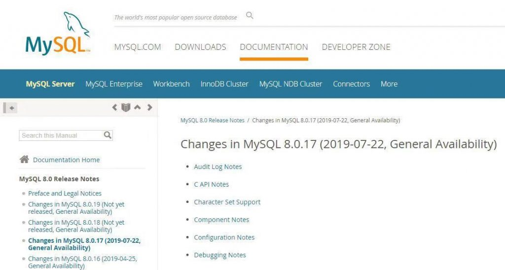

# 技术分享 | MySQL 8.0 .16 GA 发布！

**原文链接**: https://opensource.actionsky.com/20190723-mysql/
**分类**: MySQL 新特性
**发布时间**: 2019-07-23T01:58:07-08:00

---

昨日 MySQL 官网正式发布 8.0.17 / 5.7.27 / 5.6.45 三个（维护）版本，距离上一个 GA 版本（8.0.16）发布时隔仅 88 天！
MySQL 各开发团队的博客网站，同一时间发布了多篇文章报道新版本发布（后续翻译）。三个版本除了修复 Bug 外，两个 5.* 版本则优化了 Windows 的告警功能，8.0.17 添加了一些新功能，标记并不推荐某些功能。
具体请查看 MySQL 官网的 Release Notes 页面，**下文为 MySQL 8.0.17 版本的新特性梗概。**
> 
**MySQL 官网的 Release Notes 页面：**
http://dev.mysql.com/doc/relnotes/mysql/8.0/en/news-8-0-17.html
http://dev.mysql.com/doc/relnotes/mysql/5.7/en/news-5-7-27.html
http://dev.mysql.com/doc/relnotes/mysql/5.6/en/news-5-6-45.html
											
图片来自 MySQL 官网截图
**一、克隆**
在 8.0.16 新增的 MySQL Shell （本次也有更新），可将一台运行中的服务器，克隆出一台新服务器。本过程可自动化实现，但需要预先使用 mysqldump 或 backup 等部署初始状态。例如，需要为 MySQL InnoDB Cluster 添加新成员，只需启动一台新的服务器，并操作 MySQL Shell 告知加入指定集群即可。
主要包括：克隆本地副本 [WL #9209] /克隆远程副本 [WL #9210] /克隆远程配置 [WL #11636] /克隆复制坐标 [WL #9211] /克隆加密 [WL #9682]
**二、JSON 的多值索引**
InnoDB 现在支持 JSON 数组上的多值索引。多值索引是多个索引记录可以指向同一数据记录的索引，这对于索引 JSON 文档非常有用。例如：{user:&#8221;Bob&#8221;,zipcode:[94477,94536]}
如果我们想在上面的 JSON 数据中搜索 zipcodes，可以使用如下语句创建索引：
- `CREATE INDEX zips ON t1((CAST(data->'$.zipcode' AS UNSIGNED ARRAY)));`
这是一种函数索引，使用 CAST() 函数将 JSON 数组转换为 SQL 类型的数组。多值索引通常配合如下函数使用：MEMBER OF()、JSONCONTAINS() 和 JSONOVERLAPS()，例如：
- `SELECT * FROM t1 WHERE 123 MEMBER OF(data->'$.data.zipcode');`
**三、JSON 模式**
继续增加对 JSON 模式的支持JSON_SCHEMA_VALID(<json schema>, <json doc>)函数实现 JSON 文档的验证 [WL #11999]。JSON_SCHEMA_VALIDATION_REPORT(<json schema>, <json doc>)函数实现结构化打印 JSON 对象，提供更详细的错误报告 [WL #13005]。
**四、改进优化器**
子查询优化，将 NOT EXISTS 和 NOT IN 转换为反半连接 [WL＃4245]。转换降低了运行成本，即通过将子查询表引入顶层查询，并通过将半连接和反连接合并在一起。确保 SQL 条件中的所有谓词都是完整的 [WL＃12358]，不完整的谓词会被不等式代替。解析器，优化器和执行器只需处理完成谓词。
将 CAST 添加到 FLOAT / DOUBLE / REALCatalin，以支持根据 SQL 标准对 FLOATING 点数据类型进行强制转换操作。这使得显式CAST支持与具有更多种类投射可能性的隐式CAST对齐。[WL＃529]
支持显式强制 DOUBLE，FLOAT 以及 REAL 使用其中一个功能 CAST() 或 CONVERT()。
**五、Volcano 迭代器**
这项功能是基于 Volcano 模型，目标是简化代码库，启用散列连接等新功能，并启用更好的EXPLAIN和EXPLAIN ANALYZE。
Volcano iterator semijoin [WL＃12470] 在迭代器执行器中实现了所有形式的半连接。
迭代器执行程序分析查询 [WL＃12788] 通过支持窗口函数，汇总和最终重复数据删除，扩展了迭代器执行程序可以处理的分析查询的范围。
**六、字符集新增排序规则**
为 utf8mb4 添加新的二进制排序规则 utf8mb4_0900_bin [WL＃13054] 新的排序规则类似于 utf8mb4_bin 排序规则，区别在于 utf8mb4_0900_bin 使用 utf8mb4 编码字节并且不增加填充空间。
**七、复制增强**
- 通过自动实例克隆增强的组复制分布式恢复。
- 增强了组复制的跨版本互操作性。
- 加密条件和临时，磁盘上的二进制日志捕获缓存。
- mysqlbinlog 的协议压缩支持。
特别注意，此版本实现了对集群或组成员的克隆支持，这是在 MGR 和 InnoDB Cluster 方面的重大改进。
**八、路由**
MySQL 8.0.17 为 MySQL 路由添加了监控基础架构和监控 REST 接口。希望监控路由器的应用程序和用户可以获得对配置数据，性能信息和资源使用情况的结构化访问。此外，MySQL 路由已经与 MySQL Group Replication 进一步集成，因为它现在处理由组复制协议发出的视图更改通知。
**九、MTR 测试组件**
将 MyISAM 的测试用例移动到单独的 .test 文件 [WL＃7407] 并允许 MTR 测试组件在未安装 MyISAM 引擎的服务器上运行。
**十、其它**
服务器能够以最多255个字符的主机名运行。[WL＃12571]
将互斥锁定顺序检查添加到服务器，这将作为一种方法和工具来强制运行时执行没有死锁。[WL＃3262]
若存在工作线程更多分区的情况下，进一步拆分剩余分区来改进并行扫描。[WL＃12978]
在 MySQL 客户端中添加操作系统信息作为连接属性，这使 DBA 可以更轻松地通知用户在服务器上运行耗时的查询。[WL＃12955]
**十一、弃用和删除**
首先要强调的是，MySQL 8.0.17 不会删除任何功能，但会在 8.0 系列中中将某些功能标记为已弃用。在将来的主要版本中删除不推荐使用的功能。
弃用或警告 named_pipe_full_access_group 的值 &#8216;everyone&#8217; 。我们希望将来我们会将 named_pipe_full_access_group 系统变量的默认值从 &#8216;everyone&#8217; 更改为 &#8216;i.e. no-one&#8217;。[WL＃12670]
弃用用于指定 _bin 排序规则的关键字 BINARY。[WL＃13068]
弃用整数显示宽度和 ZEROFILL 选项。[WL＃13127]
弃用 DECIMAL 和 FLOAT 数据类型的无符号属性。[WL＃12391]
弃用 SQL 语句中 && 和 || 作为 AND 和 OR 的同义词。[WL＃13070]
弃用在 DOUBLE 和 FLOAT 上使用 AUTO_INCREMENT。[WL＃12575]
弃用指定浮点类型位数的能力。[WL＃12595]
弃用非标准语法 SQL_CALC_FOUND_ROWS 和 FOUND_ROWS。[WL＃12615]
**最后**
MySQL 8.0 在整体可用性上继续加强，特别是在组复制方面持续改进，并完善了 MySQL Shell 等新特性。社区会针对一些新特性持续发布文章，尽情期待！
> 
参考链接：
https://dev.mysql.com/doc/relnotes/mysql/8.0/en/news-8-0-17.html
[The MySQL 8.0.17 Maintenance Release is Generally Available](https://mysqlserverteam.com/the-mysql-8-0-17-maintenance-release-is-generally-available/)
https://mysqlhighavailability.com/automatic-provisioning-in-group-replication/
**近期社区动态**
