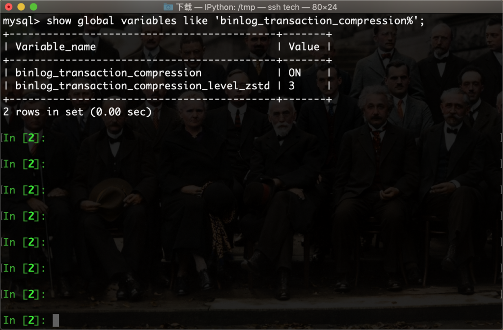
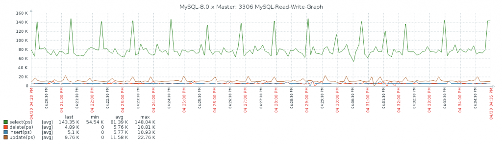
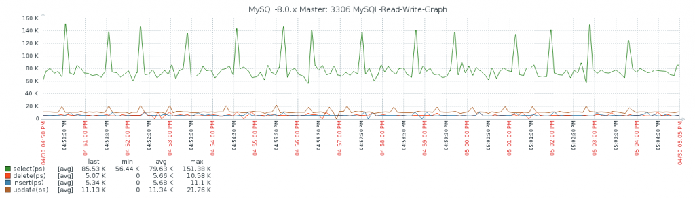
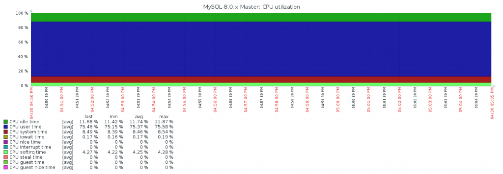
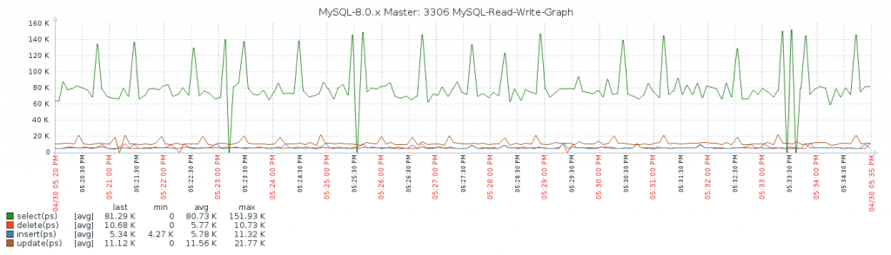
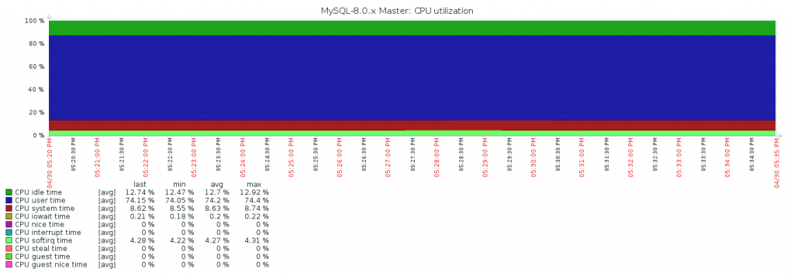

# 技术分享 | MySQL binlog 压缩功能对性能的影响

**原文链接**: https://opensource.actionsky.com/202011119-mysql/
**分类**: MySQL 新特性
**发布时间**: 2020-11-19T00:33:24-08:00

---

作者：蒋乐兴
MySQL DBA，擅长 python 和 SQL，目前维护着 github 的两个开源项目：mysqltools 、dbmc 以及独立博客：https://www.sqlpy.com。
本文来源：原创投稿
*爱可生开源社区出品，原创内容未经授权不得随意使用，转载请联系小编并注明来源。
**概要**
之前有做过一个 binlog 压缩能节约多少空间的测试，效果上看还是比较理想的，可以节约一半以上的空间。但是这个又引出了一个新的问题，那就是这个功能对性能有多大影响呢？于是我又在测试环境试了一下，测试环境的物理配置如下。
											
根据之前的经验这套测试环境在 120 个表 + 240 个并发的情况，可以取得一个性能上的极大值；所以在这里就直接使用这个作为测试压力。
											
## 8.0.19 场景
第一步：安装。- 
- 
```
dbma-cli-single-instance --port=3306 --max-mem=131072 \`--pkg=mysql-8.0.19-linux-glibc2.12-x86_64.tar.xz install
```
第二步：创建测试用户。
- 
- 
- 
create user sysbench@'%' identified by 'sysbench';``create database tempdb;``grant all on tempdb.* to sysbench@'%';`
第三步：填充数据并进行压力测试。
- 
- 
- 
- 
- 
- 
- 
```
sysbench --mysql-host=192.168.100.10  --mysql-port=3306 --mysql-user=sysbench \`--mysql-password=sysbench --tables=120 --table_size=100000 --mysql-db=tempdb \``--time=3600 --threads=240 oltp_point_select prepare``
``sysbench --mysql-host=192.168.100.10  --mysql-port=3306 --mysql-user=sysbench \``--mysql-password=sysbench --tables=120 --table_size=100000 --mysql-db=tempdb \``--time=3600 --threads=240 oltp_point_select run
```
性能表现。
											
资源消耗情况。
											
## 8.0.20 + binlog 压缩
第一步：安装。- 
- 
```
dbma-cli-single-instance --port=3306 --max-mem=131072 \``--pkg=mysql-8.0.20-linux-glibc2.12-x86_64.tar.xz install
```
第二步：创建测试用户。
- 
- 
- 
- 
- 
- 
- 
- 
- 
- 
- 
- 
- 
```
create user sysbench@'%' identified by 'sysbench';``create database tempdb;``grant all on tempdb.* to sysbench@'%';``
``-- dbm-agent 默认会开启 binlog 压缩``show global variables like 'binlog_transaction_compression%';``+-------------------------------------------+-------+``| Variable_name                             | Value |``+-------------------------------------------+-------+``| binlog_transaction_compression            | ON    |``| binlog_transaction_compression_level_zstd | 3     |``+-------------------------------------------+-------+``2 rows in set (0.00 sec)
```
第三步：填充数据并进行压力测试。
- 
- 
- 
- 
- 
- 
- 
```
sysbench --mysql-host=192.168.100.10  --mysql-port=3306 --mysql-user=sysbench \``--mysql-password=sysbench --tables=120 --table_size=100000 --mysql-db=tempdb \``--time=3600 --threads=240 oltp_point_select prepare``
``sysbench --mysql-host=192.168.100.10  --mysql-port=3306 --mysql-user=sysbench \``--mysql-password=sysbench --tables=120 --table_size=100000 --mysql-db=tempdb \``--time=3600 --threads=240 oltp_point_select run
```
性能表现。
											
资源消耗情况。
											
**8.0.20 + binlog 不压缩**
第一步: 关闭 binlog 压缩功能。- 
- 
- 
- 
- 
- 
- 
- 
- 
- 
```
set @@global.binlog_transaction_compression='OFF';``
``show global variables like 'binlog_transaction_compression%';``+-------------------------------------------+-------+``| Variable_name                             | Value |``+-------------------------------------------+-------+``| binlog_transaction_compression            | OFF   |``| binlog_transaction_compression_level_zstd | 3     |``+-------------------------------------------+-------+``2 rows in set (0.01 sec)
```
第二步：进行压力测试。
- 
- 
- 
```
sysbench --mysql-host=192.168.100.10  --mysql-port=3306 --mysql-user=sysbench \``--mysql-password=sysbench --tables=120 --table_size=100000 --mysql-db=tempdb \`--time=3600 --threads=240 oltp_point_select run
```
性能表现。
											
资源消耗情况。
											
## 结论
开启 binlog 压缩会对性能有影响，大概会让性能下降 1%，cpu 多消耗 1%。
											
相关推荐：
[技术分享 | 用好 MySQL 的 MRR 优化器](https://opensource.actionsky.com/20200616-mysql/)[
](https://opensource.actionsky.com/20200609-mysql/)
[技术分享 | 连接数据库这个操作做了什么？](https://opensource.actionsky.com/20200609-mysql/)
[社区投稿 | MySQL 8.0.16 开始支持 check 完整性](https://opensource.actionsky.com/20190506-mysql8-0-check/)