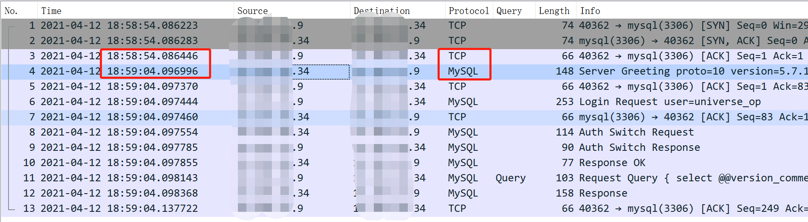
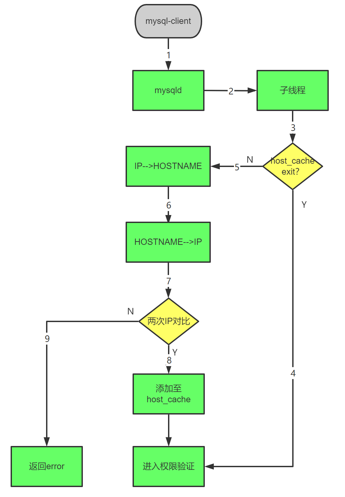
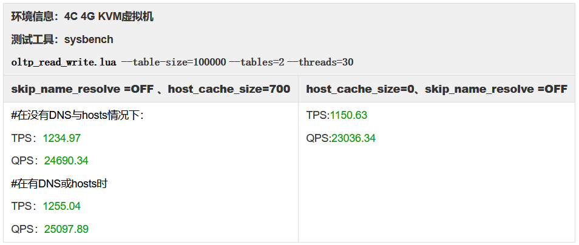

# 技术分享 | MySQL host-cache

**原文链接**: https://opensource.actionsky.com/20220402-mysql/
**分类**: MySQL 新特性
**发布时间**: 2022-04-02T01:25:08-08:00

---

作者：高鹏
DBA，负责项目日常问题排查，擅长 MySQL 。
本文来源：原创投稿
*爱可生开源社区出品，原创内容未经授权不得随意使用，转载请联系小编并注明来源。
#### 前言
本文章与一次日常运维过程中发现的问题有关。问题如下：
客户生产环境中有一个一主一从半同步的集群，运维同事发现连接主库的时候很快，但是连接从库的时候就很慢，故此咨询原因；
拿到这个问题的时候觉得现象确实挺怪异，所以就进行了抓包对比。
连接从库时的抓包结果：

从抓包结果可以看到三步握手后等待了10秒才收到mysql给客户端的响应，那么问题出现在mysql这侧，什么情况下会导致mysql出现该问题？当我们对比了主从配置文件后发现从库比主库少了skip-name-resolve，从库加上重启后问题得以解决。
#### 1. MySQL 反向解析的过程

`1. mysql-client向mysqld发起连接请求；
2. mysqld创建子线程来处理该连接请求；
3. 子线程首先去检查主机名是否存在于performance_schema.host_cache表中；
4. 如果是，则进入权限验证阶段；
5. 如果否，那么会尝试解析将IP地址解析为主机名；
6. 然后再将主机名解析为IP地址；
7. 将解析到的结果和原始IP地址进行比较；
8. 如果相同则添加到 host_cache 中然后进行权限验证;
9. 如果不相同，那么返回报错
`
注：只有非本地主机的TCP连接会使用主机缓存；使用网络回环地址或socket建立的连接不会使用主机缓存
#### 2. 主机缓存的作用
- 
通过缓存IP到主机名查找的结果，可以避免每次客户端进行连接时都去寻找DNS进行解析，所能缓存条目的数量受host_cache_size控制。
- 
缓存中包含客户端连接过程中发生的错误信息。如果同一主机连续多次连接错误，那么将阻止该主机的进一步连接，该行为受max_connect_errors控制。
#### 3.参数 host_cache_size与skip-host-cache和skip_name_resolve 的作用
host_cache_size：控制主机缓存的数量，设置为0时，禁用主机缓存，每次服务器连接时，服务器都会进行DNS查找，相比skip-host-cache来说，host_cache_size更加灵活，可以随时变更或禁用。
skip-host-cache：作用类似于host_cache_size，但mysql在运行时无法对该参数进行变更，并且skip-host-cache在之后的版本中已弃用。
skip_name_resolve：检查客户端连接时是否解析主机名，变量为off，则mysqld 会在检查客户端连接时解析主机名。若变量为on，mysqld 只使用 IP ;在这种情况下，授权表中的所有列值都必须是 IP地址。
#### 4.如何查看host_cache表
`mysql> select * from performance_schema.host_cache\G
*************************** 1. row ***************************
IP: 10.186.61.21       #连接到服务器的IP地址
HOST: NULL               #客户端DNS解析出的主机名，null代表未知
HOST_VALIDATED: YES                #是否执行了DNS解析，如果值为YES则主机列将用作与IP相对应的主机名，以便可以避免对DNS的其他调用；如果值为NO则每次连接尝试都会尝试DNS解析，直到最终以有效结果或永久错误完成解析
SUM_CONNECT_ERRORS: 0                  #被视为“阻塞”的连接错误数，仅统计协议握手错误，并且仅统计HOST_VALIDATED=YES的主机
COUNT_HOST_BLOCKED_ERRORS: 0                  #以下为各种连接方式失败的计数
COUNT_NAMEINFO_TRANSIENT_ERRORS: 0
COUNT_NAMEINFO_PERMANENT_ERRORS: 1
COUNT_FORMAT_ERRORS: 0
COUNT_ADDRINFO_TRANSIENT_ERRORS: 0
COUNT_ADDRINFO_PERMANENT_ERRORS: 0
COUNT_FCRDNS_ERRORS: 0
COUNT_HOST_ACL_ERRORS: 0
COUNT_NO_AUTH_PLUGIN_ERRORS: 0
COUNT_AUTH_PLUGIN_ERRORS: 0
COUNT_HANDSHAKE_ERRORS: 0
COUNT_PROXY_USER_ERRORS: 0
COUNT_PROXY_USER_ACL_ERRORS: 0
COUNT_AUTHENTICATION_ERRORS: 17
COUNT_SSL_ERRORS: 0
COUNT_MAX_USER_CONNECTIONS_ERRORS: 0
COUNT_MAX_USER_CONNECTIONS_PER_HOUR_ERRORS: 0
COUNT_DEFAULT_DATABASE_ERRORS: 0
COUNT_INIT_CONNECT_ERRORS: 0
COUNT_LOCAL_ERRORS: 0
COUNT_UNKNOWN_ERRORS: 0
FIRST_SEEN: 2020-12-18 10:30:03 #客户端第一次尝试连接的时间戳
LAST_SEEN: 2020-12-18 14:50:41 #客户端看到最新的连接尝试的时间戳
FIRST_ERROR_SEEN: 2020-12-18 10:30:03 #第一次连接错误的时间戳
LAST_ERROR_SEEN: 2020-12-18 14:46:37 #最近一次连接错误的时间戳
1 row in set (0.00 sec)
`
提示：执行flush hosts可以刷新host_cache，刷新后会清除内存中的主机缓存
#### 5.host-cache和skip_name_resolve 参数对数据库的影响

#### 结论：
结论和想象中一样，当 skip_name_resolve =OFF 、host_cache_size=700 时，只有在刚建立连接进行 DNS 解析和 host_cache 缓存时会影响 mysql 性能，之后再次进行压测时，可以看到性能有少许的提升。