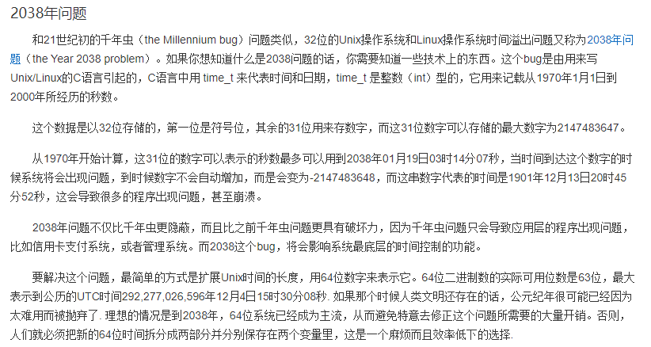
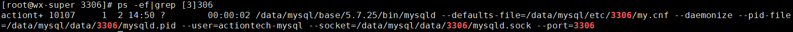
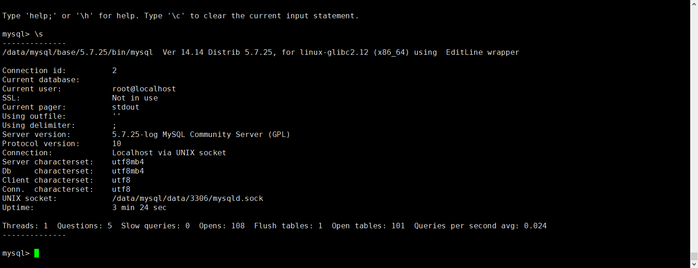
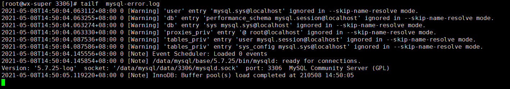
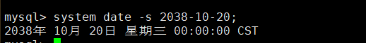
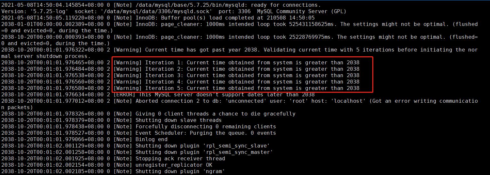
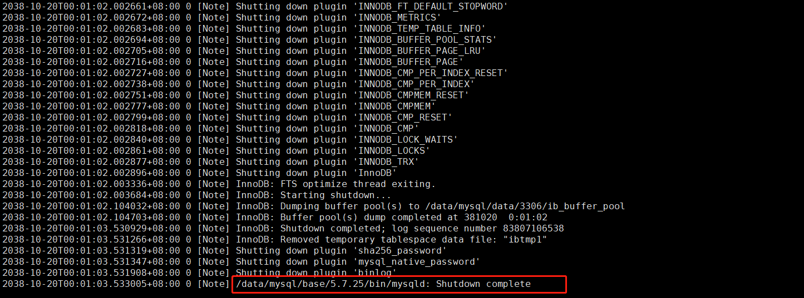

# 技术分享 | MySQL 会受到“Unix千年虫“的影响吗

**原文链接**: https://opensource.actionsky.com/20210622-mysql-bug/
**分类**: MySQL 新特性
**发布时间**: 2021-06-21T22:59:33-08:00

---

作者：王向
爱可生 DBA 团队成员，负责公司 DMP 产品的运维和客户 MySQL 问题的处理。擅长数据库故障处理。对数据库技术和 python 有着浓厚的兴趣。
本文来源：原创投稿
*爱可生开源社区出品，原创内容未经授权不得随意使用，转载请联系小编并注明来源。
> 
本文目录：
前言
什么是“Unix千年虫”
实验2038年时 MySQL 会不会受到千年虫影响？
实验结果
问题原因
影响范围
解决方案
## 前言
笔者在五一假期间，闲来无事刷了刷论坛博客；看到很多人在讨论2038年“Unix千年虫”危机！。来了兴趣于是测试了下 MySQL 会不会受到“Unix千年虫“的影响而去世
## 什么是“Unix千年虫”
古时候，“千年虫”bug曾经引发了很大的恐慌，甚至不少影视剧中都有夸大的描写。不过在紧急磋商和“打补丁”之后，软硬件“无法正确处理2000年问题”的千年虫危机算是平稳度过了。但……事实真的如此吗？对于 Unix 类操作系统来说，它们其实还面临着同样的问题，那就是——2038年危机！（又称“Unix千年虫”）！！
截图来自度娘百科：

## 实验2038年时 MySQL 会不会受到千年虫影响？
启动测试 MySQL 并监控 error 日志

随意把系统时间调整到2038年

看到了什么？MySQL 它自闭了直接 shutdown

## 实验结果
如果时间穿越来到了2038年或将操作系统的 date 调整为2038年，比如2038-10-20，你会发现正在运行的 MySQL 会自动放弃治疗，重启后同样会自动关闭，无法使用，MySQL 不支持2038年之后的日期。
`2038-10-20T00:01:01.976322+08:00 2 [Warning] Current time has got past year 2038.
Validating current time with 5 iterations before initiating the normal server
shutdown process.
2038-10-20T00:01:01.976465+08:00 2 [Warning] Iteration 1: Current time obtained
from system is greater than 2038
2038-10-20T00:01:01.976484+08:00 2 [Warning] Iteration 2: Current time obtained
from system is greater than 2038
2038-10-20T00:01:01.976538+08:00 2 [Warning] Iteration 3: Current time obtained
from system is greater than 2038
2038-10-20T00:01:01.976560+08:00 2 [Warning] Iteration 4: Current time obtained
from system is greater than 2038
2038-10-20T00:01:01.976580+08:00 2 [Warning] Iteration 5: Current time obtained
from system is greater than 2038
2038-10-20T00:01:01.976634+08:00 2 [ERROR] This MySQL server doesn't support
dates later than 2038
`
## 问题原因
MySQL timestamp 支持的最大时间范围是 &#8216;1970-01-01 00:00:01.000000&#8217; 到 &#8216;2038-01-19 03:14:07.999999&#8217;，在源码 sql/sql_parse.cc 的 dispatch_command() 函数里，有一段代码，检测当前时间是否超过2038年，如果超过，则会立即停止 MySQL。
`/*
If the time has gone past 2038 we need to shutdown the server. But
there is possibility of getting invalid time value on some platforms.
For example, gettimeofday() might return incorrect value on solaris
platform. Hence validating the current time with 5 iterations before
initiating the normal server shutdown process because of time getting
past 2038.
*/
/*
If the time has got past 2038 we need to shut this server down.
We do this by making sure every command is a shutdown and we
have enough privileges to shut the server down
TODO: remove this when we have full 64 bit my_time_t support
*/
`
从以上这两段注释来看，应该是 MySQL 内部变量 my_time_t 不支持 64 位，在到达2038年之后，
MySQL 无法执行任何命令，直接关闭。
## 影响范围
目前 5.7 以及 8.0 的最新版本，都包含这一段代码逻辑，也就是现有的版本都会受到影响，在2038年都会自动停止。
- 
5.7.34（当前 5.7 的最新版本）
- 
8.0.25（当前 8.0 的最新版本）
## 解决方案
期待 MySQL 官方后续尽快开发完全支持 my_time_t 64位的版本，在2038年之前升级到该版本即可。
今天是2021.06.22，距离2038还有17年，目前所有在用的 MySQL 版本在2038年到来前，都需要进行升级。