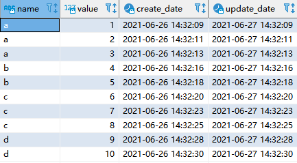
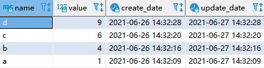
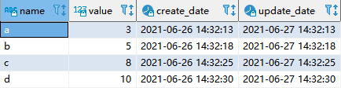
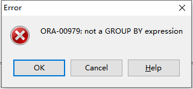
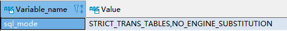

# 技术分享 | MySQL 分组需求探秘

**原文链接**: https://opensource.actionsky.com/20210705-mysql/
**分类**: MySQL 新特性
**发布时间**: 2021-07-06T21:30:35-08:00

---

作者：刘晨
网名 bisal ，具有十年以上的应用运维工作经验，目前主要从事数据库应用研发能力提升方面的工作，Oracle ACE ，拥有 Oracle OCM & OCP 、EXIN DevOps Master 、SCJP 等国际认证，国内首批 Oracle YEP 成员，OCMU 成员，《DevOps 最佳实践》中文译者之一，CSDN & ITPub 专家博主，公众号&#8221;bisal的个人杂货铺&#8221;，长期坚持分享技术文章，多次在线上和线下分享技术主题。
本文来源：原创投稿
*爱可生开源社区出品，原创内容未经授权不得随意使用，转载请联系小编并注明来源。
前两天同事有个 MySQL 数据分组的需求，如下测试数据，需要找出每个 name 分组中 create_date 最近的记录：

需要注意的是，此处用的 MySQL 是5.6，最初是使用这条语句：
`select name, value, create_date, update_date from t1 group by name order by create_date desc;
`
查询结果如下，看着好像是对的，但是仔细看下，就会发现其中的问题，例如 name=a 最近的 create_date 应该是 value=3 的记录，name=d 最近的create_date应该是 value=10 的记录：

用这条 SQL 得到的其实只是每个 name 分组中最先插入的记录，然后按照 create_date 进行了降序排列，和原始需求，完全不同。
此时可采用分而治之的策略，先做排序，再做分组：
`select * from (select name, value, create_date, update_date from t1 order by create_date desc) t group by t.name;
`
即可得到原始需求的数据：

当然，针对此需求，可能有其他方法，有兴趣的朋友，可以尝试写写，共享一下。
可能有细心的朋友会发现个问题，就是上述 SQL 中的 group by ，好像有些奇怪，如果按照常规，select 中的字段需要出现在 group by 中，上述语句竟然没报错？
如果我们在 MySQL 5.7 执行相同的语句：
`select name, value, create_date, update_date from t1 group by name order by create_date desc; 
`
就会提示这个错：

如果是在 Oracle ，则会提示这个：

难道这是 MySQL 5.6 的特性？搜了一下，其实因为这个，在这套5.6的环境中，sql_mode 参数如下：

而在5.7中，sql_mode 参数如下，多了一个 ONLY_FULL_GROUP_BY ，他的意思是“出现在 SELECT 语句、HAVING 条件和 ORDER BY 语句中的列，必须是 GROUP BY 的列或者依赖于 GROUP BY 列的函数列”，这就不难解释，为什么5.6和5.7中现象是不同的，还是因为5.7默认对 SQL 格式校验的要求高了：

因此从5.6升级到5.7，很可能出现这种相同的 SQL 执行结果不同的现象，这对兼容性测试的要求就会很高，究其原因，一方面是特性决定的，另一方面就是各种配置参数不同导致的。
可以在5.7的 sql_mode 中删除这个 ONLY_FULL_GROUP_BY ，即可达到5.6相同效果了，或者改写 SQL ，例如：
`select * from t1 a where create_date = (select max(create_date) from t1 b where a.name = b.name);
`
或者，
`select * from t1 a where not exists (select * from t1 b where a.name = b.name and b.create_date > a.create_date);
`
MySQL 8.0支持 row_number()函数，操作应该和如下 Oracle 相近的。
Oracle 中可以使用 row_number()实现此需求：
`select * from (select name, create_date, row_number() over (partition by name order by create_date desc) as r from t1) where r=1;
`