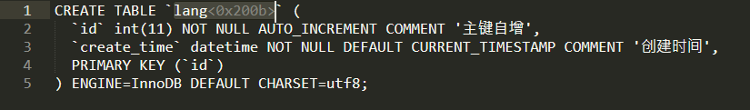

# 技术分享 | MySQL 创建表后神秘消失？揭秘零宽字符陷阱

**原文链接**: https://opensource.actionsky.com/%e6%8a%80%e6%9c%af%e5%88%86%e4%ba%ab-mysql-%e5%88%9b%e5%bb%ba%e8%a1%a8%e5%90%8e%e7%a5%9e%e7%a7%98%e6%b6%88%e5%a4%b1%ef%bc%9f%e6%8f%ad%e7%a7%98%e9%9b%b6%e5%ae%bd%e5%ad%97%e7%ac%a6%e9%99%b7%e9%98%b1/
**分类**: MySQL 新特性
**发布时间**: 2024-04-18T19:27:56-08:00

---

三招教你解决零宽字符陷阱，让你的数据库不再”闹鬼“。
> 作者：秦福朗，爱可生 DBA 团队成员，负责项目日常问题处理及公司平台问题排查。热爱互联网，会摄影、懂厨艺，不会厨艺的 DBA 不是好司机，didi~
爱可生开源社区出品，原创内容未经授权不得随意使用，转载请联系小编并注明来源。
本文约 1000 字，预计阅读需要 3 分钟。
# 引言
在 MySQL 的使用过程中，有时候一个小小的字符也能带来大麻烦，在未发现真相时，以为这问题是见了鬼了，而发现真相时，却没想到是一个字符带来的问题，零宽字符像个幽灵隐藏在 IT 行业的各个方面，今天分享一个关于 MySQL 中“消失的表”的复现案例。
# 问题描述
通过某种方式（如命令行或数据库开发工具等）在数据库 `test` 中创建了一个名为 `lang` 的表。表结构如下：
`CREATE TABLE `lang​` (
`id` int(11) NOT NULL AUTO_INCREMENT COMMENT '主键自增',
`create_time` datetime NOT NULL DEFAULT CURRENT_TIMESTAMP COMMENT '创建时间',
PRIMARY KEY (`id`)
) ENGINE=InnoDB DEFAULT CHARSET=utf8;
`
通过 `SHOW TABLES;` 命令，我们可以确认这个表的存在。
`mysql> show tables;
+----------------+
| Tables_in_test |
+----------------+
| a1             |
| lang​          |
| t1             |
| z1             |
+----------------+
4 rows in set (0.00 sec)
`
但是，当你尝试在 MySQL 客户端执行 `SELECT * FROM lang;` 查询或者业务程序去连接该表时，却收到了错误信息：
`mysql> select * from lang;
ERROR 1146 (42S02): Table 'test.lang' doesn't exist
`
表就这么神奇的消失了。
# 原因分析
像见了鬼一样，即使反复多次手动输入查询语法，也无法查询到这个表。我们将建表语句复制到 Sublime Text 文本工具中：

此时，我们发现了问题：表名后面跟了一个**“<0×200b>”**的字符。这就是零宽空格，是零宽字符的一种。
# 什么是零宽字符？
零宽字符是一种特殊的 Unicode 字符，它不占用任何可见空间，因此在大多数情况下是不可见的。然而，它们可以存在于文本中，并且可能对计算机程序产生影响，包括数据库管理系统。在 Unicode 中，U+200B 代表零宽空格，常用于可能需要换行的地方。除此之外，还有其他零宽字符，这里不再赘述。
**那么，这像幽灵一样的字符为何会存在？** 所谓存在即合理，零宽字符常常被用于数据防爬、信息加密传递、防止敏感词扫描等场景。但在数据库系统里使用，有时候就会出现让人头疼的现象，本文提到的就是其中之一。这些字符虽然不占用任何空间，但可能会破坏 SQL 命令的正确结构，导致后续使用出错。
# 如何解决？
- 在创建表之前，将建表语句复制到多个文本编辑工具，检查是否有异常符号提示（一般文本工具可能无法显示零宽字符）。经过尝试 Sublime Text、Visual Studio Code 等工具或插件有提醒零宽字符的功能；还有一些在线网页工具可以查看 Unicode 字符的功能。如果你知道其他能够展示零宽字符的工具，欢迎在评论区留言分享。
- 在创建表之后，使用 `SHOW CREATE TABLE；` 命令查看表结构，然后将输出结果复制到上述文本编辑工具中，检查是否有异常符号。
- 经过多次测试发现，在 MySQL 客户端上执行了 `SHOW TABLES;` 命令时，含有零宽空格的表名后面的边框线 **“|”** 与其他行是不对齐的。 这可以快速发现问题表，但并不显示具体字符。当然这方式一般不适用于第三方开发工具、业务程序等。
# 总结
零宽字符是一个隐形的陷阱，可能在 MySQL 的使用过程中引发一些看似无解的问题。通过了解其本质，仔细检查 SQL 命令，避免从不可靠的来源复制和粘贴，使用适当的工具，并遵循最佳实践，我们可以确保我们的数据库顺利运行，不会出现类似问题。