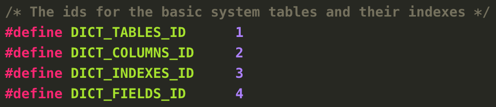

# 技术分享 | MySQL ​删库不跑路（建议收藏）

**原文链接**: https://opensource.actionsky.com/20190828-mysql/
**分类**: MySQL 新特性
**发布时间**: 2019-08-28T00:34:17-08:00

---

每个 DBA 是不是都有过删库的经历？删库了没有备份怎么办？备份恢复后无法启动服务什么情况？表定义损坏数据无法读取怎么办？ 我曾遇到某初创互联网企业，因维护人员不规范的备份恢复操作，导致系统表空间文件被初始化，上万张表无法读取，花了数小时才抢救回来。
当你发现数据无法读取时，也许并非数据丢失了，可能是 DBMS 找不到描述数据的信息。
**背景**
先来了解下几张关键的 InnoDB 数据字典表，它们保存了部分表定义信息，在我们恢复表结构时需要用到。
**SYS_TABLES **描述 InnoDB 表信息- `CREATE TABLE `SYS_TABLES` (`
- ``NAME` varchar(255) NOT NULL DEFAULT '',  表名`
- ``ID` bigint(20) unsigned NOT NULL DEFAULT '0',  表id`
- ``N_COLS` int(10) DEFAULT NULL,`
- ``TYPE` int(10) unsigned DEFAULT NULL,`
- ``MIX_ID` bigint(20) unsigned DEFAULT NULL,`
- ``MIX_LEN` int(10) unsigned DEFAULT NULL,`
- ``CLUSTER_NAME` varchar(255) DEFAULT NULL,`
- ``SPACE` int(10) unsigned DEFAULT NULL,   表空间id`
- `PRIMARY KEY (`NAME`)`
- `) ENGINE=InnoDB DEFAULT CHARSET=latin1;`
**SYS_INDEXES **描述 InnoDB 索引信息- `CREATE TABLE `SYS_INDEXES` (`
- `  `TABLE_ID` bigint(20) unsigned NOT NULL DEFAULT '0', 与sys_tables的id对应`
- `  `ID` bigint(20) unsigned NOT NULL DEFAULT '0',  索引id`
- `  `NAME` varchar(120) DEFAULT NULL,         索引名称`
- `  `N_FIELDS` int(10) unsigned DEFAULT NULL, 索引包含字段的个数`
- `  `TYPE` int(10) unsigned DEFAULT NULL,`
- `  `SPACE` int(10) unsigned DEFAULT NULL,  存储索引的表空间id`
- `  `PAGE_NO` int(10) unsigned DEFAULT NULL,  索引的root page id`
- `  PRIMARY KEY (`TABLE_ID`,`ID`)`
- `) ENGINE=InnoDB DEFAULT CHARSET=latin1;`
**SYS_COLUMNS **描述 InnoDB 表的字段信息- `CREATE TABLE `SYS_COLUMNS` (`
- `  `TABLE_ID` bigint(20) unsigned NOT NULL, 与sys_tables的id对应`
- `  `POS` int(10) unsigned NOT NULL,     字段相对位置`
- `  `NAME` varchar(255) DEFAULT NULL,    字段名称`
- `  `MTYPE` int(10) unsigned DEFAULT NULL,  字段编码`
- `  `PRTYPE` int(10) unsigned DEFAULT NULL, 字段校验类型`
- `  `LEN` int(10) unsigned DEFAULT NULL,  字段字节长度`
- `  `PREC` int(10) unsigned DEFAULT NULL, 字段精度`
- `  PRIMARY KEY (`TABLE_ID`,`POS`)`
- `) ENGINE=InnoDB DEFAULT CHARSET=latin1;`
**SYS_FIELDS **描述全部索引的字段列- `**CREATE TABLE `SYS_FIELDS` (**`
- **`  `INDEX_ID` bigint(20) unsigned NOT NULL,`****``**
- **`  `POS` int(10) unsigned NOT NULL,`****``**
- **`  `COL_NAME` varchar(255) DEFAULT NULL,`****``**
- **`  PRIMARY KEY (`INDEX_ID`,`POS`)`****``**
- **`) ENGINE=InnoDB DEFAULT CHARSET=latin1;`**
./storage/innobase/include/dict0boot.h 文件定义了每个字典表的 index id，对应 id 的 page 中存储着字典表的数据。
											
这里我们需要借助 undrop-for-innodb 工具恢复数据，它能读取表空间信息得到 page，将数据从 page 中提取出来。
- `# wget https://github.com/chhabhaiya/undrop-for-innodb/archive/master.zip`
- `# yum install -y gcc flex bison`
- `# make`
- `# make sys_parser`
# ./sys_parser 读取表结构信息
sys_parser [-h] [-u] [-p] [-d] databases/tablestream_parser 读取 InnoDB page 从 ibdata1 或 ibd 或分区表
- `# ./stream_parser`
- `You must specify file with -f option`
- `Usage: ./stream_parser -f <innodb_datafile> [-T N:M] [-s size] [-t size] [-V|-g]`
- `  Where:`
- `    -h         - Print this help`
- `    -V or -g   - Print debug information`
- `    -s size    - Amount of memory used for disk cache (allowed examples 1G 10M). Default 100M`
- `    -T         - retrieves only pages with index id = NM (N - high word, M - low word of id)`
- `    -t size    - Size of InnoDB tablespace to scan. Use it only if the parser can't determine it by himself.`
c_parser 从 innodb page 中读取记录保存到文件
- `# ./c_parser`
- `Error: Usage: ./c_parser -4|-5|-6 [-dDV] -f <InnoDB page or dir> -t table.sql [-T N:M] [-b <external pages directory>]`
- `  Where`
- `    -f <InnoDB page(s)> -- InnoDB page or directory with pages(all pages should have same index_id)`
- `    -t <table.sql> -- CREATE statement of a table`
- `    -o <file> -- Save dump in this file. Otherwise print to stdout`
- `    -l <file> -- Save SQL statements in this file. Otherwise print to stderr`
- `    -h  -- Print this help`
- `    -d  -- Process only those pages which potentially could have deleted records (default = NO)`
- `    -D  -- Recover deleted rows only (default = NO)`
- `    -U  -- Recover UNdeleted rows only (default = YES)`
- `    -V  -- Verbose mode (lots of debug information)`
- `    -4  -- innodb_datafile is in REDUNDANT format`
- `    -5  -- innodb_datafile is in COMPACT format`
- `    -6  -- innodb_datafile is in MySQL 5.6 format`
- `    -T  -- retrieves only pages with index id = NM (N - high word, M - low word of id)`
- `    -b <dir> -- Directory where external pages can be found. Usually it is pages-XXX/FIL_PAGE_TYPE_BLOB/`
- `    -i <file> -- Read external pages at their offsets from <file>.`
- `    -p prefix -- Use prefix for a directory name in LOAD DATA INFILE command`
接下来，我们演示场景的几种数据恢复场景。
**场景1：drop table**是否启用了 innodb_file_per_table 其恢复方法有所差异，当发生误删表时，应尽快停止MySQL服务，不要启动。若 innodb_file_per_table=ON，最好只读方式重新挂载文件系统，防止其他进程写入数据覆盖之前块设备的数据。
如果评估记录是否被覆盖，可以表中某些记录的作为关键字看是否能从 ibdata1 中筛选出。
# grep WOODYHOFFMAN ibdata1
Binary file ibdata1 matches也可以使用 bvi（适用于较小文件）或 hexdump -C（适用于较大文件）工具
以表 sakila.actor 为例- `CREATE TABLE `actor` (`
- ``actor_id` smallint(5) unsigned NOT NULL AUTO_INCREMENT,`
- ``first_name` varchar(45) NOT NULL,`
- ``last_name` varchar(45) NOT NULL,`
- ``last_update` timestamp NOT NULL DEFAULT CURRENT_TIMESTAMP ON UPDATE CURRENT_TIMESTAMP,`
- `PRIMARY KEY (`actor_id`),`
- `KEY `idx_actor_last_name` (`last_name`)`
- `) ENGINE=InnoDB AUTO_INCREMENT=201 DEFAULT CHARSET=utf8`
首先恢复表结构信息
1. 解析系统表空间获取 page 信息
- `./stream_parser -f /var/lib/mysql/ibdata1`
2. 新建一个 schema，把系统字典表的 DDL 导入
- `cat dictionary/SYS_* | mysql recovered`
3. 创建恢复目录
- `mkdir -p dumps/default`
4. 解析系统表空间包含的字典表信息，
- `./c_parser -4f pages-ibdata1/FIL_PAGE_INDEX/0000000000000001.page -t dictionary/SYS_TABLES.sql > dumps/default/SYS_TABLES 2> dumps/default/SYS_TABLES.sql`
- `./c_parser -4f pages-ibdata1/FIL_PAGE_INDEX/0000000000000002.page -t dictionary/SYS_COLUMNS.sql > dumps/default/SYS_COLUMNS 2> dumps/default/SYS_COLUMNS.sql`
- `./c_parser -4f pages-ibdata1/FIL_PAGE_INDEX/0000000000000003.page -t dictionary/SYS_INDEXES.sql > dumps/default/SYS_INDEXES 2> dumps/default/SYS_INDEXES.sql`
- `./c_parser -4f pages-ibdata1/FIL_PAGE_INDEX/0000000000000004.page -t dictionary/SYS_FIELDS.sql > dumps/default/SYS_FIELDS 2> dumps/default/SYS_FIELDS.sql`
5. 导入恢复的数据字典
- `cat dumps/default/*.sql | mysql recovered`
6. 读取恢复后的表结构信息
- `./sys_parser -pmsandbox -d recovered sakila/actor`
由于 5.x 版本 innodb 引擎并非完整记录表结构信息，会丢失 AUTO_INCREMENT 属性、二级索引和外键约束， DECIMAL 精度等信息。
若是 mysql 5.5 版本 frm 文件被从系统删除，在原目录下 touch 与原表名相同的 frm 文件，还能读取表结构信息和数据。若只有 frm 文件，想要获得表结构信息，可使用 mysqlfrm &#8211;diagnostic /path/to/xxx.frm，连接 mysql 会显示字符集信息。
- **innodb_file_per_table=OFF**
因为是共享表空间模式，数据页都存储在 ibdata1，可以从 ibdata1 文件中提取数据。
1. 获取表的 table id，sys_table 存有表的 table id，sys_table 表 index id 是1，所以从0000000000000001.page 获取表 id- `./c_parser -4Df pages-ibdata1/FIL_PAGE_INDEX/0000000000000001.page -t dictionary/SYS_TABLES.sql | grep sakila/actor`
- `000000000B28  2A000001430D4D  SYS_TABLES  "sakila/actor"  158  4  1 0   0   ""  0`
- `000000000B28  2A000001430D4D  SYS_TABLES  "sakila/actor"  158  4  1 0   0   ""  0`
2. 利用 table id 获取表的主键 id，sys_indexes 存有表索引信息，innodb 索引组织表，找到主键 id 即找到数据，sys_indexes 的 index id 是3，所以从0000000000000003.page 获取主键 id
- `./c_parser -4Df pages-ibdata1/FIL_PAGE_INDEX/0000000000000003.page -t dictionary/SYS_INDEXES.sql | grep 158`
- `000000000B28    2A000001430BCA  SYS_INDEXES     158     376     "PRIMARY"       1       3       0       4294967295`
- `000000000B28    2A000001430C3C  SYS_INDEXES     158     377     "idx\_actor\_last\_name"        1       0       0       4294967295`
- `000000000B28    2A000001430BCA  SYS_INDEXES     158     376     "PRIMARY"       1       3       0       4294967295`
- `000000000B28    2A000001430C3C  SYS_INDEXES     158     377     "idx\_actor\_last\_name"        1       0       0       4294967295`
3. 知道了主键 id，就可以从对应 page 中提取表数据，并生成 sql 文件。
- `./c_parser -4f pages-ibdata1/FIL_PAGE_INDEX/0000000000000376.page -t sakila/actor.sql > dumps/default/actor 2> dumps/default/actor_load.sql`
4. 最后导入恢复的数据
- `cat dumps/default/*.sql | mysql sakila`
- innodb_file_per_table=ON
这种情况恢复步骤与上述基本一致，但由于是独立表空间模式，数据页存储在各自的 ibd 文件，ibd 文件删除了，无法通过 ibdata1 提取数据页，所以 pages-ibdata1 目录找不到数据页，streamparser 要从块设备中读取数据页信息。扫描完成后，在 pages-sda1 目录下提取数据。- `./stream_parser -f /dev/sda1 -t 1000000k`
**场景2：****Corrupted InnoDB table**在 InnoDB 表发生损坏，即使 innodb_force_recovery=6 也无法启动 MySQL 日志中可能会出现类似报错- `InnoDB: Database page corruption on disk or a failed`
- `InnoDB: file read of page 4.`
此时的恢复策略需要将数据页从独立表空间中提取出，再删除表空间，重新创建表导入数据。
1. 先获得故障表的主键 index id
2. 通过 index id page 获取到数据记录
- `select t.name, t.table_id, i.index_id, i.page_no from INNODB_SYS_TABLES t join INNODB_SYS_INDEXES i on t.table_id=i.table_id and t.name='test/sbtest1';`
3. 由于数据页可能有部分记录损坏，需要过滤掉“坏”的数据，保留好的数据
例如：前两行记录实际是“坏”数据，需要过滤掉。
- `root@test:~/recovery/undrop-for-innodb# ./c_parser -6f pages-actor.ibd/FIL_PAGE_INDEX/0000000000000015.page -t sakila/actor.sql > dumps/default/actor 2> dumps/default/actor_load.sql`
- `root@test:~/recovery/undrop-for-innodb# cat dumps/default/actor`
- `-- Page id: 3, Format: COMPACT, Records list: Invalid, Expected records: (0 200)`
- `72656D756D07    08000010002900  actor   30064   "\0\0\0\0"      ""      "1972-09-20 23:07:44"`
- `1050454E454C    4F50454755494E  actor   19713   "ESSC▒" ""      "2100-08-09 07:52:36"`
- `00000000051E    9F0000014D011A  actor   2       "NICK"  "WAHLBERG"      "2006-02-15 04:34:33"`
- `00000000051E    9F0000014D0124  actor   3       "ED"    "CHASE" "2006-02-15 04:34:33"`
- `00000000051E    9F0000014D012E  actor   4       "JENNIFER"      "DAVIS" "2006-02-15 04:34:33"`
- `00000000051E    9F0000014D0138  actor   5       "JOHNNY"        "LOLLOBRIGIDA"  "2006-02-15 04:34:33"`
- `00000000051E    9F000001414141  actor   6       "AAAAA" "AAAAAAAAA"     "2004-09-10 01:53:05"`
- `00000000051E    9F0000014D016A  actor   10      "CHRISTIAN"     "GABLE" "2006-02-15 04:34:33"`
- `...`
可以在 sql 文件中加上筛选条件，比如：通过 actor_id 做范围筛选，再用新的 sql 文件读数据页。- `CREATE TABLE `actor` (`
- `  `actor_id` smallint(5) unsigned NOT NULL AUTO_INCREMENT`
- `    /*!FILTER`
- `     int_min_val: 1`
- `     int_max_val: 300 */,`
- `  `first_name` varchar(45) NOT NULL,`
- `  `last_name` varchar(45) NOT NULL,`
- `  `last_update` timestamp NOT NULL DEFAULT CURRENT_TIMESTAMP ON UPDATE CURRENT_TIMESTAMP,`
- `  PRIMARY KEY (`actor_id`),`
- `  KEY `idx_actor_last_name` (`last_name`)`
- `) ENGINE=InnoDB AUTO_INCREMENT=201 DEFAULT CHARSET=utf8;`
4. 删除故障表文件，innodb_force_recovery=6 启动 MySQL，启动后删除元数据
5. 创建新表导入恢复好的数据疑问：如何知道丢失了多少记录？读取数据页时开头会显示期望的记录数，最后会显示实际恢复的记录数，差值便是丢失记录数- `-- Page id: 3, Format: COMPACT, Records list: Invalid, Expected records: (0 200)`
- `-- Page id: 3, Found records: 197, Lost records: YES, Leaf page: YES`
**场景3：****磁盘或文件系统损坏如何恢复数据**这种情况下尽快保护损坏的块设备不要再写入，并用 dd 工具读取镜像数据用作恢复
本地方式- `dd if=/dev/sdb of=/path/to/faulty_disk.img  conv=noerror`
远程方式
- `remote server> nc -l 1234 > faulty_disk.img`
- `local server> dd if=/dev/sdb of=/dev/stdout  conv=noerror | nc a.b.c.d 1234`
保存好磁盘镜像后，后续恢复操作参考场景2。
**总结**
1. 千万不要在服务运行时把 copy 数据文件作为备份方式，看似备份了数据，但实际数据是不一致的。
2. 正确的使用物理备份工具 xtrabackup/meb 或逻辑备份方式。
3. 对备份数据要定期进行恢复验证测试。
希望你永远不会用到这些方法，做好备份，勤验证！
> 参考链接：
https://twindb.com/how-to-recover-innodb-dictionary/
https://twindb.com/recover-corrupt-mysql-database/
https://twindb.com/take-image-from-corrupted-hard-drive/
https://twindb.com/data-loss-after-mysql-restart/
https://twindb.com/repair-corrupted-innodb-table-with-corruption-in-secondary-index/
https://twindb.com/resolving-page-corruption-in-compressed-innodb-tables/
https://dev.mysql.com/doc/refman/5.7/en/innodb-troubleshooting-datadict.html
**作者往期回顾**** **
**[技术分享 | delete大表slave回放巨慢的问题分析](http://mp.weixin.qq.com/s?__biz=MzU2NzgwMTg0MA==&mid=2247484885&idx=1&sn=f4ed03270c6831e78846cf0932af8514&chksm=fc96e74acbe16e5c8c87763bab0c39eac1b89aefe9e18852a368f987c63449384baa08cbce9e&scene=21#wechat_redirect)**
**[技术分享 | event_ scheduler导致复制中断的故障分析](http://mp.weixin.qq.com/s?__biz=MzU2NzgwMTg0MA==&mid=2247484985&idx=1&sn=ee6aa27598342448536fb065a9e8f725&chksm=fc96e4a6cbe16db03fdacca93a521085fcc181b8a5f563ba0f38ca5a720febc8ee597f3f20a2&scene=21#wechat_redirect)
**
[**深度分析 | GDB定位MySQL5.7特定版本hang死的故障分析#92108**](http://mp.weixin.qq.com/s?__biz=MzU2NzgwMTg0MA==&mid=2247484150&idx=1&sn=538f034b76c792383e08be8f2a80c272&chksm=fc96e069cbe1697fb7695e57de65abf3be59a10735258c983e532b3ea15df5f93bf79410eeaa&scene=21#wechat_redirect)
[**技术分享 | MySQL开源数据传输中间件架构设计实践**](http://mp.weixin.qq.com/s?__biz=MzU2NzgwMTg0MA==&mid=2247483709&idx=3&sn=21918b6dd3aed17c4d0abcce19a7803d&chksm=fc96e3a2cbe16ab4c0e7f284f5a61b81a82fea40e9c4d3272355abf4b431cacaf38ab29c5d46&scene=21#wechat_redirect)
**社区近期动态**
**No.1**
**Mycat 问题免费诊断**
诊断范围支持：
Mycat 的故障诊断、源码分析、性能优化
服务支持渠道：
- 技术交流群，进群后可提问
QQ群（669663113）
- 社区通道，邮件&电话
osc@actionsky.com
- 现场拜访，线下实地，1天免费拜访
关注“爱可生开源社区”公众号，回复关键字“Mycat”，获取活动详情。
**No.2**
**社区技术内容征稿**
征稿内容：
- 格式：.md/.doc/.txt
- 主题：MySQL、分布式中间件DBLE、数据传输组件DTLE相关技术内容
- 要求：原创且未发布过
- 奖励：作者署名；200元京东E卡+社区周边
投稿方式：
- 邮箱：osc@actionsky.com
- 格式：[投稿]姓名+文章标题
- 以附件形式发送，正文需注明姓名、手机号、微信号，以便小编及时联系