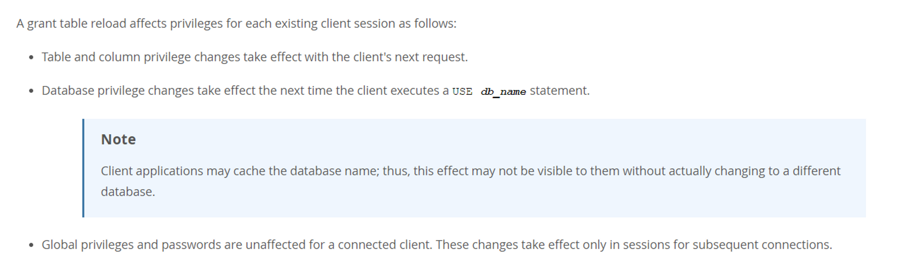

# 技术分享 | MySQL 权限变更，何时生效？

**原文链接**: https://opensource.actionsky.com/%e6%8a%80%e6%9c%af%e5%88%86%e4%ba%ab-mysql-%e6%9d%83%e9%99%90%e5%8f%98%e6%9b%b4%ef%bc%8c%e4%bd%95%e6%97%b6%e7%94%9f%e6%95%88%ef%bc%9f/
**分类**: MySQL 新特性
**发布时间**: 2023-09-26T00:49:06-08:00

---

本文讲述了对三种级别权限的变更后，使其生效的方法。
> 作者：欧阳涵，爱可生团队 DBA 成员，看到下雨知道要打伞的 2.5 次元爱好者~
爱可生开源社区出品，原创内容未经授权不得随意使用，转载请联系小编并注明来源。
本文约 1200 字，预计阅读需要 4 分钟。
# 前言
Uproxy 是爱可生研发的 [云树® DMP](https://www.actionsky.com/cloudTreeDMP) 产品的一个高效的读写中间件，维护了自身到后端 MySQL 数据库之间的连接池，用以保持到数据库后端的 **长连接**。
# 背景
近期客户反馈，通过 Uproxy 连接数据库，使用 `REVOKE` 回收全局库表 `*.*` 的某个权限后，却还能看到没有对应权限的库，并能进行操作，`FLUSH PRIVILEGES` 也无效，难道这是 MySQL 的 bug？
## MySQL 更改权限
其实不然，在笔者进行阐述前，先来说明一下 MySQL 更改权限的两种方式：
### 1 直接修改授权表
使用 `INSERT`、`UPDATE` 或 `DELETE` 等语句直接修改授权表**（不推荐）**。
`update mysql.user set Select_priv='N' where user='ouyanghan' and host='%';
`
### 2 使用 GRANT/REVOKE 语句
使用 `GRANT/REOVKE` 来授予及回收权限**（推荐）**。
`GRANT
priv_type [(column_list)]
[, priv_type [(column_list)]] ...
ON [object_type] priv_level
TO user [auth_option] [, user [auth_option]] ...
[REQUIRE {NONE | tls_option [[AND] tls_option] ...}]
[WITH {GRANT OPTION | resource_option} ...]
`
其中，第一种需要通过 `FLUSH PRIVILEGES` 来重新加载权限表。而第二种通过 MySQL 内部命令去更新权限，它会自动去重载权限表。但值得一提的是，刷新了权限表并不意味了你就拥有了对应的权限，具体的生效需分为如下三种情况，[官方文档](https://dev.mysql.com/doc/refman/5.7/en/privilege-changes.html) 早有说明。

- 对表级别 `db_name.table_name` 和列级别，权限更改将在客户端下一次请求时生效，也就是立即生效。
- 对库级别权限 `db_name.*` 更改在客户端执行 `USE db_name` 语句后生效。
- 对全局级别权限 `*.*` 更改对于已连接的会话中不受影响，仅在新连接的会话中生效。
对表、列和全局级别权限生效的方式，我本地测试起来没有问题，大家看上方的文字也十分容易理解，这里就不占用大家的时间，但对库级权限的更改，官网说是要 `USE db_name` 才能生效，但实际上却是立即生效的。
# 验证
创建 `ouyanghan` 用户，此时该用户只有 `usage` 权限，且只能看到 `information_schema` 库。
`# root 用户登录，创建新用户
mysql> CREATE USER ouyanghan IDENTIFIED by 'oyh123';
# ouyanghan 用户登录，查看权限
mysql> SHOW GRANTS;
+---------------------------------------+
| Grants for ouyanghan@%                |
+---------------------------------------+
| GRANT USAGE ON *.* TO 'ouyanghan'@'%' |
+---------------------------------------+
1 row in set (0.00 sec)
mysql> SHOW DATABASES;
+--------------------+
| Database           |
+--------------------+
| information_schema |
+--------------------+
1 row in set (0.00 sec)
`
给 `ouyanghan` 用户授予库级的 `SELECT` 权限，发现对库级别的更改可以实时生效。
`# root 用户授权
mysql> GRANT SELECT ON demp.* TO ouyanghan;
Query OK, 0 rows affected (0.00 sec)
# ouyanghan 用户登录查看权限（同一会话）
mysql> SHOW GRANTS;
+---------------------------------------------+
| Grants for ouyanghan@%                      |
+---------------------------------------------+
| GRANT USAGE ON *.* TO 'ouyanghan'@'%'       |
| GRANT SELECT ON `demp`.* TO 'ouyanghan'@'%' |
+---------------------------------------------+
2 rows in set (0.00 sec)
# 并且能查看到 demp 库
mysql> SHOW DATABASES;
+--------------------+
| Database           |
+--------------------+
| information_schema |
| demp               |
+--------------------+
2 rows in set (0.00 sec)
`
这是怎么回事，我也有找到官网错误的高光时刻了？其实不然，仔细一看，原来官网的说明里面还有一条注意事项：
*Client applications may cache the database name; thus, this effect may not be visible to them without actually changing to a different database.*
*客户端应用程序可以缓存数据库名称；因此，如果不实际更改到另一个数据库，则可能无法看到此效果。*
## 开启缓存
那么我们把 MySQL 缓存开启一下，并赋予一定的缓存大小。
`# 查看此时 ouyanghan 用户的权限
mysql> SHOW GRANTS FOR demo;
+----------------------------------------+
| Grants for demo@%                      |
+----------------------------------------+
| GRANT USAGE ON *.* TO 'demo'@'%'       |
| GRANT SELECT ON `demp`.* TO 'demo'@'%' |
| GRANT SELECT ON `db1`.* TO 'demo'@'%'  |
+----------------------------------------+
3 rows in set (0.00 sec)
# 开启缓存，并赋予大小
mysql> SET GLOBAL query_cache_type = 1;
Query OK, 0 rows affected, 1 warning (0.00 sec)
mysql> SET GLOBAL query_cache_size = 1000000;
Query OK, 0 rows affected, 2 warnings (0.00 sec)
`
`ouyanghan` 用户登录 MySQL，此时能查看到 `db1` 库下表的具体信息。
`mysql> USE db1;
Database changed
mysql> SELECT * FROM t1;
+----+------+
| id | c    |
+----+------+
|  1 | a    |
+----+------+
1 row in set (0.00 sec)
`
`root` 用户回收权限。
`mysql> REVOKE SELECT ON db1.* FROM ouyanghan;
Query OK, 0 rows affected (0.00 sec)
`
`ouyanghan` 用户查看权限。
`# 发现权限已经被回收
mysql> SHOW GRANTS FOR ouyanghan;
+---------------------------------------------+
| Grants for ouyanghan@%                      |
+---------------------------------------------+
| GRANT USAGE ON *.* TO 'ouyanghan'@'%'       |
| GRANT SELECT ON `demp`.* TO 'ouyanghan'@'%' |
+---------------------------------------------+
2 rows in set (0.00 sec)
# use db1 失败，报没有权限，但仍能查看到里面的内容
mysql> USE db1;
ERROR 1044 (42000): Access denied for user 'ouyanghan'@'%' to database 'db1'
mysql> SELECT * FROM db1.t1;
+----+------+
| id | c    |
+----+------+
|  1 | a    |
+----+------+
# 切换不同的库后，此时才发现权限被真正回收了，不能查看到对应的内容了
mysql> USE demp;
Reading table information for completion of table and column names
You can turn off this feature to get a quicker startup with -A
Database changed
mysql> SELECT * FROM db1.t1;
ERROR 1142 (42000): SELECT command denied to user 'ouyanghan'@'localhost' for table 't1'
`
可能有严谨的看官有疑问了：“你对表、列级别的权限做更改的时候，也没见你开启 MySQL 查询缓存啊，说不定表级和列级的权限做更改的生效时间，也需要去 `USE db_name` 一下呢？”
嘿你还别说，还真是，于是笔者火急火燎又去测试了一下，发现对表级和列级的权限做更改，它就是立马生效的，不信你就去试试吧！
# 总结
不管是使用语句直接修改授权表，还是用 MySQL 内部命令去更改权限，都要遵守下面的生效规则：
- 对表级别 `db_name.table_name` 和列级别，权限更改将在客户端下一次请求时生效，也就是立即生效。
- 对库级别权限 `db_name.*` 的更改在客户端执行 `USE db_name` 语句后生效（需要开启 `query_cache_type` 参数，当然，通常为了 MySQL 性能，这个参数是不建议开启的，且在 MySQL 8.0 版本中已经被移除了）。
- 对全局级别权限 `*.*` 的更改对于已连接的会话中不受影响，仅在新连接的会话中生效。
最后，相信在座各位，已经知道如何解决笔者开始遇到的权限不生效的问题了吧？那就是刷新 Uproxy 连接池。