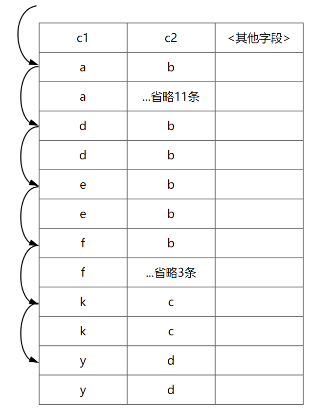
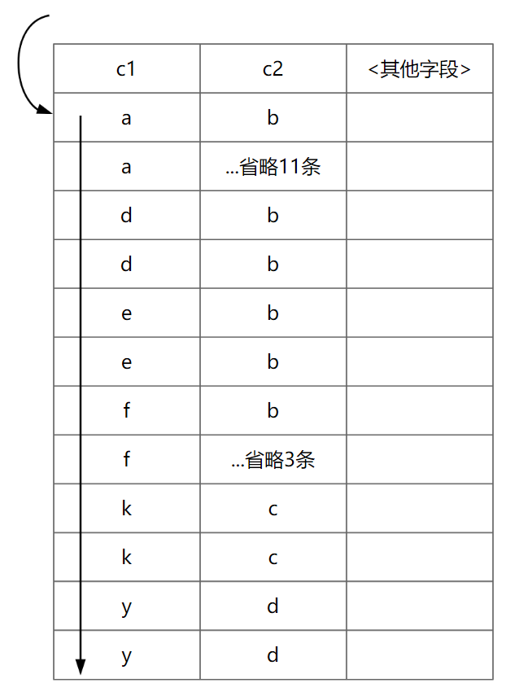
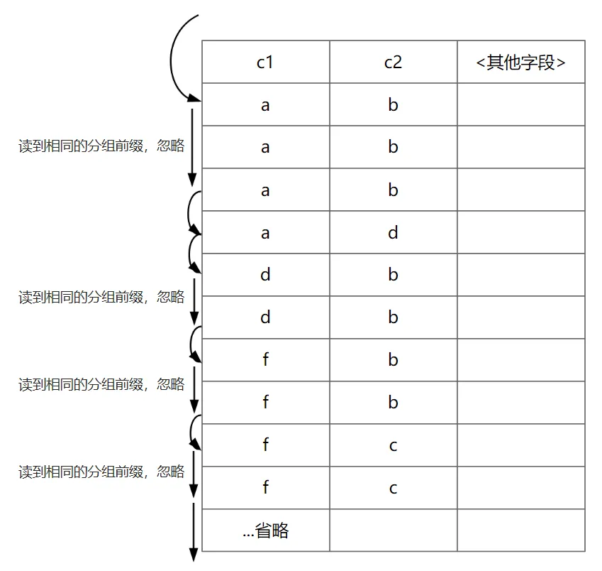
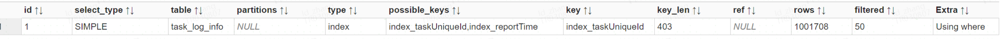
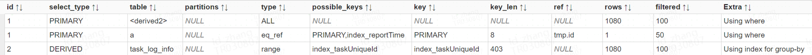

# 技术分享 | MySQL 生产环境 GROUP BY 优化实践

**原文链接**: https://opensource.actionsky.com/mysql-group-by-optimization/
**分类**: MySQL 新特性
**发布时间**: 2024-07-08T00:29:47-08:00

---

MySQL 生产环境 GROUP BY 优化实践，执行时间：3s->30ms！
## 案例介绍
首先，我们看一个生产环境上 **GROUP BY 语句** 的优化案例。
##### SQL 优化前：执行时间 3s
`SELECT taskUniqueId,
max(reportTime) AS reportTime
FROM task_log_info
WHERE reportTime > '2024-04-07'
GROUP BY  taskUniqueId
`
##### SQL 优化后：执行时间 30ms！
```
SELECT a.taskUniqueId,
reportTime
FROM task_log_info a
JOIN
(SELECT taskUniqueId,
max(id) AS id
FROM task_log_info
GROUP BY  taskUniqueId ) tmp
ON a.id=tmp.id
AND reportTime>='2024-04-07'
```
*注意：`id` 和 `reporttime` 字段值具有相关性的情况才可以这样修改。*
两条 SQL 的 **GROUP BY** 使用了同一个索引，但是效率却相差很多，这到底是为什么呢？
## 环境准备
对于 **GROUP BY** 在使用索引上的优化，分为两种情况讨论：
- **表上无索引。**执行时，会生成临时表进行分组。可以通过索引来优化，来避免使用临时表。
- **表上有索引。** GROUP BY 语句有几种扫描算法：
松散索引扫描（Loose Index Scan）
- 紧凑索引扫描（Tight Index Scan）
- 两种算法结合
#### 准备测试数据
`CREATE TABLE t2 (
id INT AUTO_INCREMENT,
c1 CHAR(64) NOT NULL,
c2 CHAR(64) NOT NULL,
c3 CHAR(64) NOT NULL,
c4 CHAR(64) NOT NULL,
PRIMARY KEY(id),
KEY c1_c2_c3_idx (c1, c2,c3)
) ENGINE=INNODB;
INSERT INTO t2 VALUES (null,'a','b','a','a'), (null,'a','b','a','a'),
(null,'a','c','a','a'), (null,'a','c','a','a'),
(null,'a','d','b','b'), (null,'a','b','b','b'),
(null,'d','b','c','c'), (null,'e','b','c','c'),
(null,'f','c','d','d'), (null,'k','c','d','d'),
(null,'y','d','y','y'), (null,'f','b','f','y'),
(null,'a','b','a','a'), (null,'a','b','a','a'),
(null,'a','c','a','a'), (null,'a','c','a','a'),
(null,'a','d','b','b'), (null,'a','b','b','b'),
(null,'d','b','c','c'), (null,'e','b','c','c'),
(null,'f','c','d','d'), (null,'k','c','d','d'),
(null,'y','d','y','y'), (null,'f','b','f','y');  
-- 收集统计信息，否则可能影响测试
ANALYZE TABLE t2;
`
## 无索引的情况
##### 不使用索引的 GROUP BY
```
mysql> explain select c4,count(*) from t2 group by c4 order by null;
+----+-------------+-------+------------+------+---------------+------+---------+------+------+----------+-----------------+
| id | select_type | table | partitions | type | possible_keys | key  | key_len | ref  | rows | filtered | Extra           |
+----+-------------+-------+------------+------+---------------+------+---------+------+------+----------+-----------------+
|  1 | SIMPLE      | t2    | NULL       | ALL  | NULL          | NULL | NULL    | NULL |   24 |   100.00 | Using temporary |
+----+-------------+-------+------------+------+---------------+------+---------+------+------+----------+-----------------+
1 row in set, 1 warning (0.00 sec)
mysql> explain select c4,count(*) from t2 group by c4;
+----+-------------+-------+------------+------+---------------+------+---------+------+------+----------+---------------------------------+
| id | select_type | table | partitions | type | possible_keys | key  | key_len | ref  | rows | filtered | Extra                           |
+----+-------------+-------+------------+------+---------------+------+---------+------+------+----------+---------------------------------+
|  1 | SIMPLE      | t2    | NULL       | ALL  | NULL          | NULL | NULL    | NULL |   24 |   100.00 | Using temporary; Using filesort |
+----+-------------+-------+------------+------+---------------+------+---------+------+------+----------+---------------------------------+
1 row in set, 1 warning (0.00 sec)
```
**Extra: Using temporary**
可以看到这里使用到了临时表。
##### 使用索引的 GROUP BY
`
mysql> explain select c1,count(*) from t2 group by c1;
+----+-------------+-------+------------+-------+---------------+--------------+---------+------+------+----------+-------------+
| id | select_type | table | partitions | type  | possible_keys | key          | key_len | ref  | rows | filtered | Extra       |
+----+-------------+-------+------------+-------+---------------+--------------+---------+------+------+----------+-------------+
|  1 | SIMPLE      | t2    | NULL       | index | c1_c2_c3_idx  | c1_c2_c3_idx | 768     | NULL |   24 |   100.00 | Using index |
+----+-------------+-------+------------+-------+---------------+--------------+---------+------+------+----------+-------------+
1 row in set, 1 warning (0.01 sec)
`
**Extra: Using index & type: index**
表示全索引扫描。这种情况下，如果表数据量很大，还是会比较耗时的。
## 有索引的情况
有索引并正常使用的情况，索引的访问有两种算法：
- **松散索引扫描（Loose Index Scan）**
不需要扫描所有的索引，根据分组前缀（GROUY BY 的字段）跳跃扫描部分
- Extra: Using index for group-by
- **紧凑索引扫描（Tight Index Scan）**
需要扫描范围或全部的索引
- Extra: Using index
*另外还有一种将两种算法结合使用的方式我们后文说明。*
下面是两条 SQL 分别使用 **Loose Index Scan** 和 **Tight Index Scan**：
`mysql> explain SELECT c1,MIN(c2) FROM t2 GROUP BY c1;
+----+-------------+-------+------------+-------+---------------+--------------+---------+------+------+----------+--------------------------+
| id | select_type | table | partitions | type  | possible_keys | key          | key_len | ref  | rows | filtered | Extra                    |
+----+-------------+-------+------------+-------+---------------+--------------+---------+------+------+----------+--------------------------+
|  1 | SIMPLE      | t2    | NULL       | range | c1_c2_c3_idx  | c1_c2_c3_idx | 256     | NULL |    7 |   100.00 | Using index for group-by |
+----+-------------+-------+------------+-------+---------------+--------------+---------+------+------+----------+--------------------------+
1 row in set, 1 warning (0.00 sec)
mysql> explain SELECT c1,COUNT(*) FROM t2 GROUP BY c1;
+----+-------------+-------+------------+-------+---------------+--------------+---------+------+------+----------+-------------+
| id | select_type | table | partitions | type  | possible_keys | key          | key_len | ref  | rows | filtered | Extra       |
+----+-------------+-------+------------+-------+---------------+--------------+---------+------+------+----------+-------------+
|  1 | SIMPLE      | t2    | NULL       | index | c1_c2_c3_idx  | c1_c2_c3_idx | 768     | NULL |   24 |   100.00 | Using index |
+----+-------------+-------+------------+-------+---------------+--------------+---------+------+------+----------+-------------+
1 row in set, 1 warning (0.00 sec)
mysql> SELECT c1,MIN(c2),COUNT(*) FROM t2 GROUP BY c1;
+----+---------+----------+
| c1 | MIN(c2) | COUNT(*) |
+----+---------+----------+
| a  | b       |       12 |
| d  | b       |        2 |
| e  | b       |        2 |
| f  | b       |        4 |
| k  | c       |        2 |
| y  | d       |        2 |
+----+---------+----------+
6 rows in set (0.00 sec)
`
##### 第一条 SQL 扫描示意图

##### 第二条 SQL 扫描示意图

下面，我们详细说明一下两种扫描方式。
### Loose Index Scan
跳跃扫描部分索引，而不需要扫描全部。
举例：
`mysql> explain SELECT c1,MIN(c2) FROM t2 GROUP BY c1;
+----+-------------+-------+------------+-------+---------------+--------------+---------+------+------+----------+--------------------------+
| id | select_type | table | partitions | type  | possible_keys | key          | key_len | ref  | rows | filtered | Extra                    |
+----+-------------+-------+------------+-------+---------------+--------------+---------+------+------+----------+--------------------------+
|  1 | SIMPLE      | t2    | NULL       | range | c1_c2_c3_idx  | c1_c2_c3_idx | 256     | NULL |    7 |   100.00 | Using index for group-by |
+----+-------------+-------+------------+-------+---------------+--------------+---------+------+------+----------+--------------------------+
1 row in set, 1 warning (0.00 sec)
ysql> SELECT c1,MIN(c2),COUNT(*) FROM t2 GROUP BY c1;
+----+---------+----------+
| c1 | MIN(c2) | COUNT(*) |
+----+---------+----------+
| a  | b       |       12 |
| d  | b       |        2 |
| e  | b       |        2 |
| f  | b       |        4 |
| k  | c       |        2 |
| y  | d       |        2 |
+----+---------+----------+
6 rows in set (0.00 sec)
`
**Extra: Using index for group-by**
表示使用松散索引扫描。
#### 使用场景
- 当需要获取每个分组的某条记录，而非对全部记录做聚合运算时可能会用到，比如：
最小值或最大值：`MIN()`、`MAX()`
- 统计类：`COUNT(distinct)`、`SUM(distinct)`、`AVG(distinct)`
注意：如果 SQL 语句中既有 1-2 个 `min\max`，也有 1-3 个 `count(distinct)\sum(distinct)\avg(distinct)` 时，无法用到 Loose index；两组分别出现的时候才可能会用到。
- `distinct` 可以转换为 GROUP BY 进行处理。
使用到 Loose Index Scan 其他必要条件：
- 查询基于一个表。
- GROUP BY 的字段满足索引的最左匹配原则。
- 聚合函数使用的列，必须包含在索引上；且使用多个聚合函数时，必须使用相同的字段，且 GROUP BY 字段+聚合函数字段也必须满足最左匹配原则。
- 索引中字段必须是全字段索引，而不能是前缀索引，例如 `INDEX(c1(10))`
以上条件结合索引的结构就很好理解了。
*另外，在选择是否使用 Loose Index Scan 时，也会受到 SQL、统计信息、成本等因素的影响。*
举例：
`-- 场景 1
-- MIN()、MAX()
SELECT c1,MIN(c2),MAX(c2) FROM t2 GROUP BY c1;
SELECT c1,c2,MAX(c3),MIN(c3)  FROM t2 WHERE c2 > 'k' GROUP BY c1, c2;
SELECT c1,c2,MAX(c3),MIN(c3)  FROM t2 WHERE c3 > 'k' GROUP BY c1, c2;
SELECT c1,c2,c3,MAX(id) FROM t2  GROUP BY c1,c2,c3;  
SELECT c1, c2 FROM t2 WHERE c3 = 'd' GROUP BY c1, c2;
-- 以下几种情况在当前数据量和数据分布下没有用到，和成本计算有关，结合后文成本对比的章节改变数据量和数据分布测试出来
SELECT c1,c2,MAX(c3),MIN(c3)  FROM t2 WHERE c1>='k' and c2 > 'f' GROUP BY c1, c2;  
SELECT DISTINCT c1, c2 FROM t2 where c1>'k';  
SELECT c1,c2,count(distinct c3) FROM t2 where c1>='k' and c2>'k' GROUP BY c1,c2;  
-- count(distinct)、sum(distinct)、avg(distinct)
SELECT c1,count(distinct c2,c3) FROM t2 GROUP BY c1;
SELECT c1,c2,sum(distinct c3) FROM t2 GROUP BY c1,c2;
SELECT c1,c2,sum(distinct c3) FROM t2 where c2>'k' GROUP BY c1,c2;
-- 场景 2
SELECT DISTINCT c1, c2 FROM t2;
-- 无法使用到 Loose Index Scan
SELECT c1,count(distinct c2,c3),sum(distinct c2) FROM t2 GROUP BY c1;
`
### Tight Index Scan
对于无法使用到 Loose Index Scan 的一些 GROUP BY，在满足索引最左匹配原则情况下可能会用到 Tight Index Scan。
该种方式实际上是范围索引扫描或全部索引扫描，数据量大的情况下性能仍然可能会比较差，但是相比无索引还是可以避免使用临时表和全表扫描，在某些情况下有一定的优化作用。
### 两种算法结合
对于统计类 AGG(DISTINCT) 即 SUM|COUNT|AVG(distinct)，可能会出现使用松散索引扫描（Loose Index Scan）成本大于紧凑索引扫描（Tight Index Scan）的情况。
两种方式在引擎层主要包含的成本：
- Loose Index Scan
读取分组的第一条记录，得到分组前缀
- 根据分组前缀读取分组的第一条或最后一条记录返回给 SERVER 层
- Tight Index Scan
从 ENGINE 层读取数据，返回给 SERVER 层
- SERVER 层判断是否符合 `WHERE` 条件的记录，并根据聚合函数进行处理
可以看到，对于 ENGINE 层的访问，Loose Index Scan 的成本有可能会高于 Tight Index Scan，且在 MySQL 中，引擎层读取数据页的成本常数是 1，SERVER 层判断一条记录的成本常数是 0.2。
*至于 MIN/MAX 为什么不会出现 Loose Index Scan 成本 > Tight Index Scan 成本，我理解只有到组内值都是唯一的情况下才会出现吧？那这样也没有必要去分组求最值了。欢迎在留言处讨论。*
在某些情况下，Loose Index Scan 的成本会高于 Tight Index Scan，比如：
- 当分组较多，但组内的记录数并不多或唯一值较高的情况，对于每一个分组，都需要扫描两次，能跳过的记录数很少的情况。即 Loose Index Scan 在分组字段的选择性相对不太高，组内的数据量相对较多的情况更适用。
举例：
该 SQL 在当前的测试数据中，松散扫描的成本还是要低于紧凑扫描。
`select count(distinct c1,c2) from t2;
mysql> explain select count(distinct c1,c2) from t2;
+----+-------------+-------+------------+-------+---------------+--------------+---------+------+------+----------+--------------------------+
| id | select_type | table | partitions | type  | possible_keys | key          | key_len | ref  | rows | filtered | Extra                    |
+----+-------------+-------+------------+-------+---------------+--------------+---------+------+------+----------+--------------------------+
|  1 | SIMPLE      | t2    | NULL       | range | c1_c2_c3_idx  | c1_c2_c3_idx | 512     | NULL |   10 |   100.00 | Using index for group-by |
+----+-------------+-------+------------+-------+---------------+--------------+---------+------+------+----------+--------------------------+
1 row in set, 1 warning (0.01 sec)
`
新建一个相同表结构的表，插入下面的测试数据。
`INSERT INTO t2 VALUES (null,'a','b','a','a'), (null,'a','b','a','a'),
(null,'k','c','a','a'), (null,'k','g','a','a'),
(null,'a','d','b','b'), (null,'a','b','b','b'),
(null,'d','b','c','c'), (null,'e','b','c','c'),
(null,'f','c','d','d'), (null,'k','c','d','d'),
(null,'y','d','y','y'), (null,'f','b','f','y'),
(null,'j','b','a','a'), (null,'m','b','a','a'),
(null,'z','c','a','a'), (null,'t','c','a','a'),
(null,'x','d','b','b'), (null,'x','b','b','b'),
(null,'d','b','c','c'), (null,'e','b','c','c'),
(null,'f','c','d','d'), (null,'k','c','d','d'),
(null,'y','d','y','y'), (null,'f','b','f','y'); 
-- 其数据分布
mysql> select c1,c2,count(*) from t2 group by c1,c2;
+----+----+----------+
| c1 | c2 | count(*) |
+----+----+----------+
| a  | b  |        3 |
| a  | d  |        1 |
| d  | b  |        2 |
| e  | b  |        2 |
| f  | b  |        2 |
| f  | c  |        2 |
| j  | b  |        1 |
| k  | c  |        3 |
| k  | g  |        1 |
| m  | b  |        1 |
| t  | c  |        1 |
| x  | b  |        1 |
| x  | d  |        1 |
| y  | d  |        2 |
| z  | c  |        1 |
+----+----+----------+
15 rows in set (0.00 sec)
mysql> explain select count(distinct c1,c2) from t2;
+----+-------------+-------+------------+-------+---------------+--------------+---------+------+------+----------+-------------------------------------+
| id | select_type | table | partitions | type  | possible_keys | key          | key_len | ref  | rows | filtered | Extra                               |
+----+-------------+-------+------------+-------+---------------+--------------+---------+------+------+----------+-------------------------------------+
|  1 | SIMPLE      | t2    | NULL       | range | c1_c2_c3_idx  | c1_c2_c3_idx | 512     | NULL |   16 |   100.00 | Using index for group-by (scanning) |
+----+-------------+-------+------------+-------+---------------+--------------+---------+------+------+----------+-------------------------------------+
1 row in set, 1 warning (0.00 sec)
`
**Extra: Using index for group-by (scanning)**
该方式可以理解为 Loose Index Scan 的扩展或两种方式的结合（索引顺序扫描的同时进行去重）。
##### 示意图

最后，再回到文章开头的案例，其执行计划如下：
##### 优化前

##### 优化后

**其核心就是将紧凑索引扫描转化为了松散索引扫描。**
## 总结
对于 **GROUP BY** 可以使用索引进行优化，Loose Index Scan 相对于 Tight Index Scan 在一些情况下可以大大减少扫描的行数，使用 Loose Index Scan 时，Extra: Using index for group-by。
在 Loose Index Scan 的成本大于 Tight Index Scan 的一些情况下，可以尝试用到两者的结合的方式，Extra: Using index for group-by (scanning)
Loose Index Scan 更适用于分组内重复值相对较多，分组个数相对较少的情况。
## 参考链接
- [https://dev.mysql.com/doc/refman/5.7/en/group-by-optimization.html](https://dev.mysql.com/doc/refman/5.7/en/group-by-optimization.html)
- [https://dev.mysql.com/blog-archive/what-is-the-scanning-variant-of-a-loose-index-scan/](https://dev.mysql.com/blog-archive/what-is-the-scanning-variant-of-a-loose-index-scan/)
- MySQL 怎么用索引实现 group by？-鸿蒙开发者社区-51CTO.COM
- [https://www.oreilly.com/library/view/high-performance-mysql/9780596101718/ch04.html](https://www.oreilly.com/library/view/high-performance-mysql/9780596101718/ch04.html)