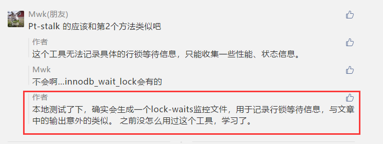
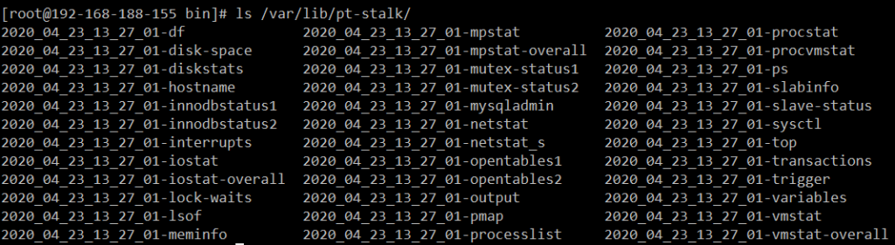
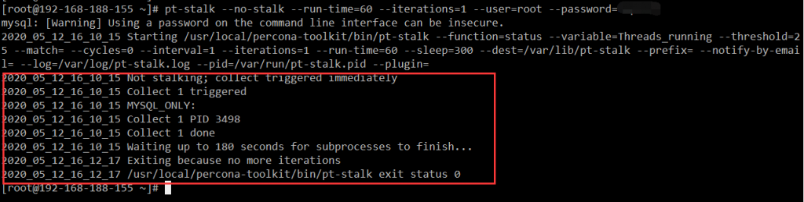
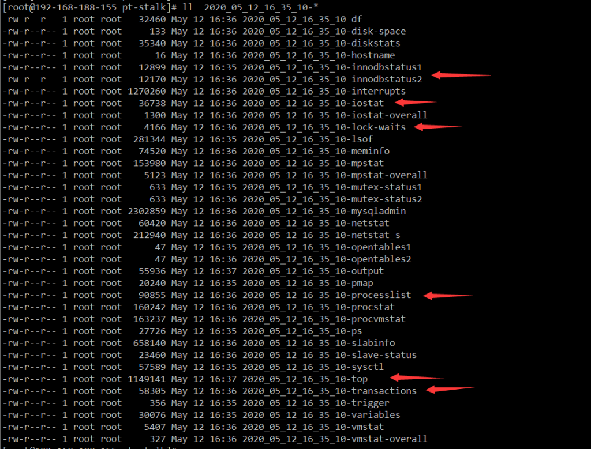
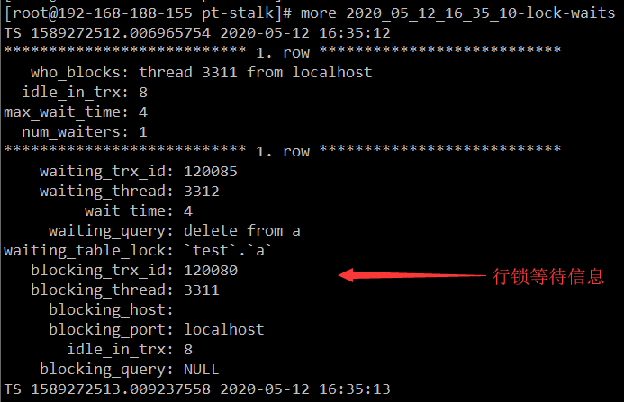
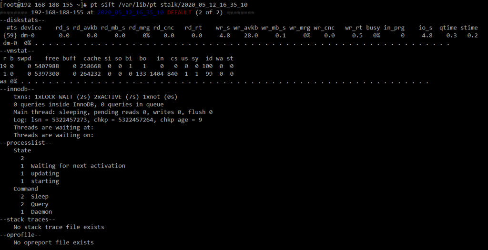

# 技术分享 | MySQL 监控利器之 Pt-Stalk

**原文链接**: https://opensource.actionsky.com/20200522-mysql/
**分类**: MySQL 新特性
**发布时间**: 2020-05-22T00:35:44-08:00

---

作者：xuty
本文来源：原创投稿
*爱可生开源社区出品，原创内容未经授权不得随意使用，转载请联系小编并注明来源。
**一、概述**
之前在社区发了一篇[【有效解决 MySQL 行锁等待超时问题】](https://opensource.actionsky.com/20200421-mysql/)文档，主要介绍了下行锁超时的监控方法，下方评论中有人提到了 `pt-stalk` 工具也可以监控行锁超时，因为个人没怎么用过这个工具，所以下意识的就去 google 了一下。因为没找到有介绍具体监控输出的文档，就以为这个工具没法监控行锁等待，最后果断被打脸了~~~
											
以上是个小插曲，个人在本地测试了下 `pt-stalk` 的监控输出后，发现其监控项远远比我预测的多，用起来也比较方便，所以在这里分享下这个工具。
**二、介绍**
首先介绍下 `pt-stalk`，它是 `Percona-Toolkit` 工具包中的一个工具，说起 PT 工具包大家都不陌生，平时常用的 `pt-query-digest`、 `pt-online-schema-change` 等工具都是出自于这个工具包，这里就不多介绍了。
pt-stalk 的主要功能是在出现问题时收集 OS 及 MySQL 的诊断信息，这其中包括：
1. OS 层面的 CPU、IO、内存、磁盘、网络等信息；
2. MySQL 层面的行锁等待、会话连接、主从复制，状态参数等信息。
而且 pt-stalk 是一个 `Shell脚本`，对于我这种看不懂 `perl` 的人来说比较友好，脚本里面的`监控逻辑`与`监控命令`也可以拿来参考，用于构建自己的监控体系。
											
## 三、使用
接着我们来看下如何使用这个工具。
pt-stalk 通常以 `后台服务` 形式监控 MySQL 并等待触发条件，当触发条件时收集相关诊断数据。
触发条件相关的参数有以下几个：
- function：
∘ 默认为 `status`，代表监控 `SHOW GLOBAL STATUS` 的输出；
∘ 也可以设置为 `processlist`，代表监控 `show processlist` 的输出；
- variable：
∘ 默认为 Threads_running，代表 `监控参数`，根据上述监控输出指定具体的监控项；
- threshold：
∘ 默认为 25，代表 `监控阈值`，监控参数超过阈值，则满足触发条件；
∘ 监控参数的值非数字时，需要配合 match 参数一起使用，如 processlist 的 state 列；
- cycles：
∘ 默认为 5，表示连续观察到五次满足触发条件时，才触发收集；
连接参数：host、password、port、socket。
其他一些重要参数：- iterations：该参数指定 pt-stalk 在触发收集几次后退出，默认会一直运行。
- run-time：触发收集后，该参数指定收集多长时间的数据，默认 30 秒。
- sleep：该参数指定在触发收集后，sleep 多久后继续监控，默认 300 秒。
- interval：指定状态参数的检查频率，判断是否需要触发收集，默认 1 秒。
- dest：监控数据存放路径，默认为 `/var/lib/pt-stalk`。
- retention-time ：监控数据保留时长，默认 30 天。
- daemonize：以后台服务运行，默认不开启。
- log：后台运行日志，默认为 `/var/log/pt-stalk.log`。
- collect：触发发生时收集诊断数据，默认开启。
∘ collect-gdb：收集 GDB 堆栈跟踪，需要 gdb 工具。
∘ collect-strace：收集跟踪数据，需要 strace 工具。
∘ collect-tcpdump：收集 tcpdump 数据，需要 tcpdump 工具。
下面是一段 Percona 官方贴的伪代码，逻辑也比较清晰，大家可以看下：- `while true; do`
- `   if --variable from --function > --threshold; then`
- `      cycles_true++`
- `      if cycles_true >= --cycles; then`
- `         --notify-by-email`
- `         if --collect; then`
- `            if --disk-bytes-free and --disk-pct-free ok; then`
- `               (--collect for --run-time seconds) &`
- `            fi`
- `            rm files in --dest older than --retention-time`
- `         fi`
- `         iter++`
- `         cycles_true=0`
- `      fi`
- `      if iter < --iterations; then`
- `         sleep --sleep seconds`
- `      else`
- `         break`
- `      fi`
- `   else`
- `      if iter < --iterations; then`
- `         sleep --interval seconds`
- `      else`
- `         break`
- `      fi`
- `   fi`
- `done`
- `rm old --dest files older than --retention-time`
- `if --collect process are still running; then`
- `   wait up to --run-time * 3 seconds`
- `   kill any remaining --collect processes`
- `fi`
**四、使用场景**
下面是几个我个人可以想到的关于 pt-stalk 的使用场景：
4.1 场景一后台运行 pt-stalk 监视 `SHOW GLOBAL STATUS` 中的 `Threads_connected` 状态值，即如果 `客户端连接数` 连续 5 次超过 `1000`，则触发收集主机和 MySQL 的性能与状态信息。
- `pt-stalk  --function status --variable Threads_connected --threshold 2500 --daemonize --user=root --password=######`
4.2 场景二后台运行 pt-stalk 监视 `SHOW GLOBAL STATUS` 中的 `Threads_running` 状态值，即如果 `活跃线程数` 连续 5 次超过 `500`，则触发收集主机和 MySQL 的性能与状态信息。- `pt-stalk  --function status --variable Threads_running --threshold 500 --daemonize --user=root --password=######`
4.3 场景三非后台模式下 `立即收集` 主机和 MySQL 的性能与状态信息 `60s`，等待 180s 自动退出，无需任何触发条件，主要用于临时保留问题场景信息，便于事后分析。- `pt-stalk --no-stalk --run-time=60 --iterations=1 --user=root --password=Gepoint`
											
**五、监控输出**
接着来看下 pt-stalk 可以监控些什么信息，如下图所示：
											
从上图可见输出文件有很多，基本从文件名字就可以知道内容是什么，且大多数文件都是以命令来命名的，这里就不一一介绍了。
有些比较重要的监控项我用红标指示了，对于排查问题帮助比较多。
对于本文最开始所说的 pt-stalk 也可以监控行锁等待信息，其实就是依赖于 `lock-waits` 与 `transactions` 2 个监控文件。
我们来看下其内容：
首先是 `lock-waits` 日志，其实与我之前的后台监控脚本输出有点类似，不过这里信息更加丰富。
											
然后是 `transactions` ，记录了所有活动事务的详细信息，更加利于分析行锁等待情况。
											
虽然 `lock-waits` 与 `transactions` 2 个监控文件详细的记录了阻塞情况，但还是存在那个问题，如果原因是 `事务挂起`，还是需用借用 general_log 分析整个事务。
**六、pt-sift**
在学习 pt-stalk 的时候，发现 PT 工具包里专门有个工具用于分析 pt-stalk 采集的数据，那就是 `pt-sift`。
`pt-sift` 可以根据之前 pt-stalk 监控采集的数据进行汇总性的展示，使用比较简单，下面是其输出示例：
											
**七、小结**
pt-stalk 工具个人感觉还不错，尤其是其丰富的监控项，与其特有的触发式监控机制。
对于没有部署监控系统，但为了临时排查解决 MySQL 问题的环境非常有效。
最后对于 pt-stalk 再总结两点：
1. pt-stalk 适合在 MySQL 本地环境运行，远程运行则无法收集到对应的主机信息。
2. 触发条件貌似是单一的，无法选择多个，也算是一个明显的弊端。
> 
**附录：**
https://www.percona.com/doc/percona-toolkit/LATEST/pt-stalk.html https://www.percona.com/doc/percona-toolkit/LATEST/pt-sift.html https://www.orczhou.com/index.php/2012/06/mysql-troubleshooting-with-pt-stakl/