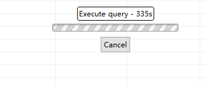

# 技术分享 | MySQL 索引长度限制的案例

**原文链接**: https://opensource.actionsky.com/20211214-mysql/
**分类**: MySQL 新特性
**发布时间**: 2021-12-13T18:28:24-08:00

---

作者：刘晨
网名 bisal ，具有十年以上的应用运维工作经验，目前主要从事数据库应用研发能力提升方面的工作，Oracle ACE ，拥有 Oracle OCM & OCP 、EXIN DevOps Master 、SCJP 等国际认证，国内首批 Oracle YEP 成员，OCMU 成员，《DevOps 最佳实践》中文译者之一，CSDN & ITPub 专家博主，公众号&#8221;bisal的个人杂货铺&#8221;，长期坚持分享技术文章，多次在线上和线下分享技术主题。
本文来源：原创投稿
*爱可生开源社区出品，原创内容未经授权不得随意使用，转载请联系小编并注明来源。
前两天同事提了一个问题，MySQL 5.7 中给某张表字段增加一个单键值索引，提示了如下错误，

一些背景信息：
- 
表设置的字符集，utf8mb4 。
- 
表的存储引擎，MyISAM 。
- 
表的数据量，1个亿 。
- 
执行的 SQL，select c1, c2 from test where c1 = :1，c1数据类型是varchar(255) ，区分度较高，需要创建一个单键值索引。
我们知道，MySQL 和 Oracle 在索引上最大的一个区别，就是索引存在长度的限制。如果是超长键值，可以支持创建前缀的索引，顾名思义，取这个字段的前多少个字符/字节作为索引的键值。
之所以可以定义一个字段前缀作为键值，存储效率是考虑的一个因素，如果列名的前10个字符通常都是不同的，检索这10个字符创建的索引应该会比检索整个列作为索引的效率更高，使用列前缀作为索引会让索引树更小，不仅节省空间，还可能提高插入操作的速度。
对于非二进制的字符串类型(CHAR、VARCHAR、TEXT)，前缀会按照字符个数计算，对二进制的字符串类型(BINARY、VARBINARY、BLOB)，前缀会按照字节个数计算，因此，当对非二进制的字符串列明确前缀长度的时候，需要考虑多字节字符集的因素。
MySQL 官方手册索引的章节提到了，前缀索引长度限制是和引擎相关的，如果用的是 InnoDB ，前缀上限是 767 字节，当启用 innodb_large_prefix 时，上限可以达到 3072 字节。如果用的是 MyISAM，前缀上限是 1000 字节，这正是上述创建索引错误提示的内容，
> 
Prefix support and lengths of prefixes (where supported) are storage engine dependent. For example, a prefix can be up to 767 bytes long for InnoDB tables or 3072 bytes if the innodb_large_prefix option is enabled. For MyISAM tables, the prefix length limit is 1000 bytes.
https://dev.mysql.com/doc/refman/5.7/en/create-index.html
utf8mb4 是 MySQL 5.5.3 之后增加的编码，mb4 就是 most bytes 4 的意思，专门用来兼容四字节的 unicode ，utf8mb4 是 utf8 的超集。之所以需要 utf8mb4 ，是因为之前的 utf8 编码最大字符长度为 3 字节，如果遇到 4 字节的宽字符就会插入异常了。三个字节的 UTF-8 最大能编码的 Unicode 字符是 0xffff ，也就是 Unicode 中的基本多文种平面(BMP)。因此，任何不在基本多文本平面的 Unicode 字符，都无法使用 MySQL 的 utf8 字符集存储，这就包括 Emoji 表情( Emoji 是一种特殊的 Unicode 编码，常见于手机上)，和很多不常用的汉字，以及任何新增的 Unicode 字符等(这些都是 utf8 的缺点)。
InnoDB，如果需要建索引，就不能超过 767bytes ，utf8 编码，255*3=765 bytes ，是能建索引情况下的最大值，utf8mb4 编码，默认字符长度则应该是767除以4向下取整，就是191。如果设置了innodb_large_prefix，最大长度是3072字节，utf8编码，1024*3=3072 bytes，utf8mb4编码，768*4=3072。
MyISAM，如果需要建索引，就不能超过 1000bytes ，utf8 编码，333*3=999 bytes，是能建索引情况下的最大值，utf8mb4编码，默认字符长度则应该是1000除以4，就是250。
我们可以测下 MyISAM ，utf8mb4 编码表 test1 ，250长度的字段 c1 ，251长度的字段c2 ，
`CREATE TABLE test1 (  c1 varchar(250),  c2 varchar(251)) ENGINE=MyISAM DEFAULT CHARSET=utf8mb4 COLLATE=utf8mb4_bin;
`
c1能创建索引，c2创建出错，utf8mb4编码，varchar最大限制250个字符，
`/* 可执行 */
create index idx_test1_01 on test1(c1);
/*SQL 错误 [1071] [42000]: Specified key was too long; max key length is 1000 bytes*/
create index idx_test1_02 on test1(c2);
`
utf8编码表test2，333长度的字段c1，334长度的字段c2，
`CREATE TABLE test2 (  c1 varchar(333),  c2 varchar(334)) ENGINE=MyISAM DEFAULT CHARSET=utf8 COLLATE=utf8_bin;
`
c1能创建索引，c2创建出错，utf8编码，varchar最大限制333个字符，
`/* 可执行 */
create index idx_test2_01 on test2(c1);
/*SQL 错误 [1071] [42000]: Specified key was too long; max key length is 1000 bytes*/
create index idx_test2_02 on test2(c2);
`
其他场景的测试相近，不再展示。
因此，针对这个问题，可以为c1字段创建一个前缀索引，
`create index idx_test_01 on test(c1(250(含)以下的值))
`
但是1亿数据量，创建非常慢，

通过沟通，了解到这个需求是检索今年的数据，表中存在时间戳的字段，且今年的数据，是1000多万，如果能改应用SQL，或者只是通过手工执行SQL的前提下，可以有几种解决方案：
- 
如果从原表检索，可以创建一个c1和时间戳字段的复合索引，利用索引扫描，定位所需数据。
- 
如果不需要从原表检索，可以使用时间戳作为条件，通过CTAS，创建一张今年数据的表，通过c1单键值索引，即可定位数据​。​
-