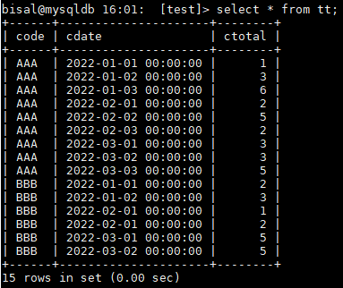
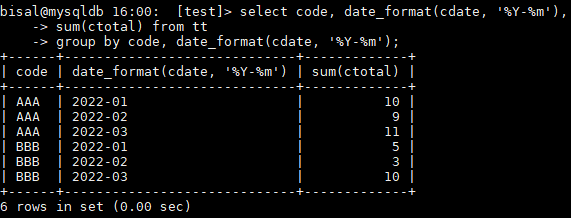
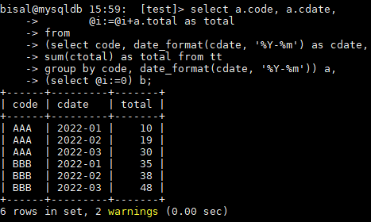
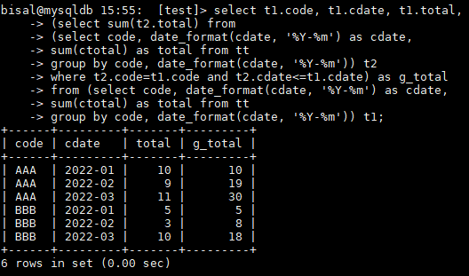
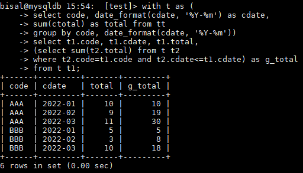

# 技术分享 | MySQL中一个聚类增量统计 SQL 的需求

**原文链接**: https://opensource.actionsky.com/20220621-sql/
**分类**: 技术干货
**发布时间**: 2022-06-20T17:58:29-08:00

---

作者：刘晨
网名 bisal ，具有十年以上的应用运维工作经验，目前主要从事数据库应用研发能力提升和技术管理相关的工作，Oracle ACE ，腾讯云TVP，拥有 Oracle OCM & OCP 、EXIN DevOps Master 、SCJP 等国际认证，国内首批 Oracle YEP 成员，OCMU 成员，《DevOps 最佳实践》中文译者之一，CSDN & ITPub 专家博主，公众号&#8221;bisal的个人杂货铺&#8221;，长期坚持分享技术文章，多次在线上和线下分享技术主题。
本文来源：原创投稿
*爱可生开源社区出品，原创内容未经授权不得随意使用，转载请联系小编并注明来源。
同事提了一个 MySQL 数据库中 SQL 统计数据的问题，我用测试数据模拟一下，如下所示，表 tt 有三个字段，code 是标识名称，cdate 是对应的日期，ctotal是个统计值

原始的统计语句如下所示，按照 code 和 cdate 进行聚类，统计出每个 code 每个月累加的记录数，

但是他的需求是能按照 code+cdate 的统计值进行累加显示，例如上图中第一行的 total 是10 ，第二行的 total 就显示10+9=19 ，第三行的 total 就显示10+9+11=30 ，以此类推。
他需要的是 total 逐行累加，MySQL 中可以通过定义变量累加来实现，如下所示，利用@i逐行累加，

确实看着实现了，但是有个问题，不同的 code ，并未做归零处理，例如上图中，code=BBB 的第一行记录，total 应该是5 ，当前的35则明显是通过30+5得到的。
此处应该再加个逻辑，即按照 code 聚类的同时做 sum 求和计算，如下所示，此时就可以看到，g_total 按照 code 和 cdate 进行累加，不同的 code ，就会归零，重新计算，符合实际需求，

其实这块还可以继续优化，MySQL 8.0 支持 with ，如上 SQL 中对 tt 表读了两次，借助于 with ，就可以降低为只读一次 tt 表，

另外，结合实际的检索场景需求，考虑为相关字段增加索引，进一步提升数据检索的效率。
当然，以上的 SQL 可能有其他的替代方案或者更好的方案，本文只是给出了其中一种解决的路径。
因此，通过 SQL 实现业务需求，一方面需要充分理解需求的含义，能准确地映射到具体的 SQL 逻辑上，另一方面则要了解所用数据库支持的函数、功能、特性等，是否有能契合到这个需求的实现，除此之外，非功能的因素，也是不可忽视的，合适的索引、避免重复读数据、避免不必要的排序等都是我们可以利用的手段。