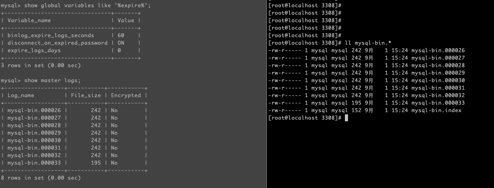
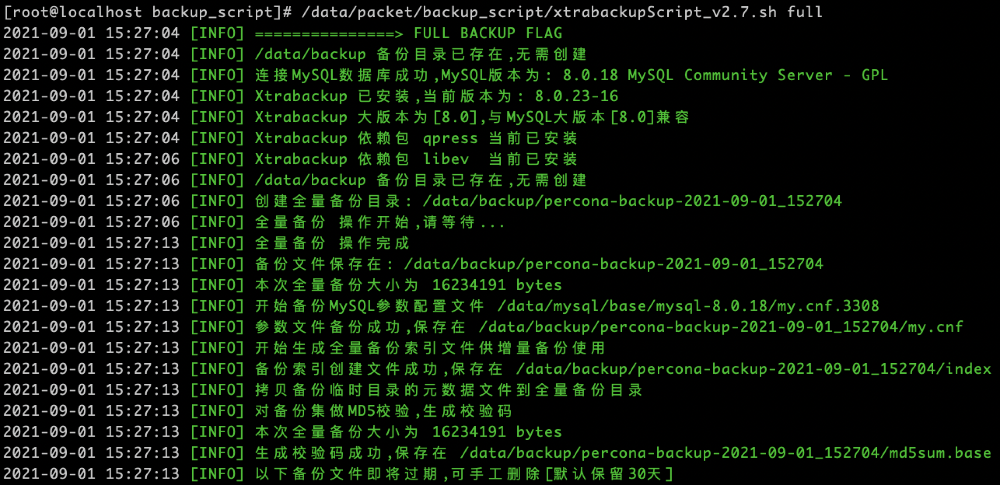
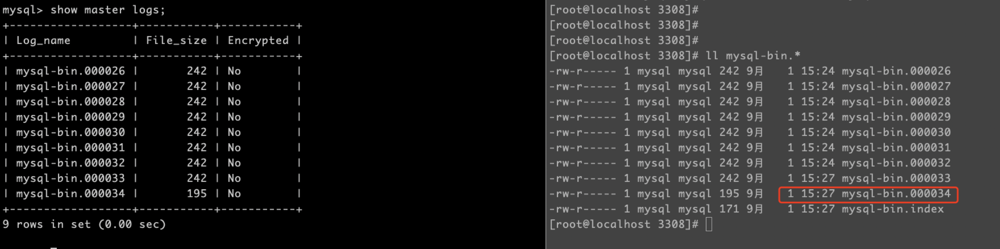
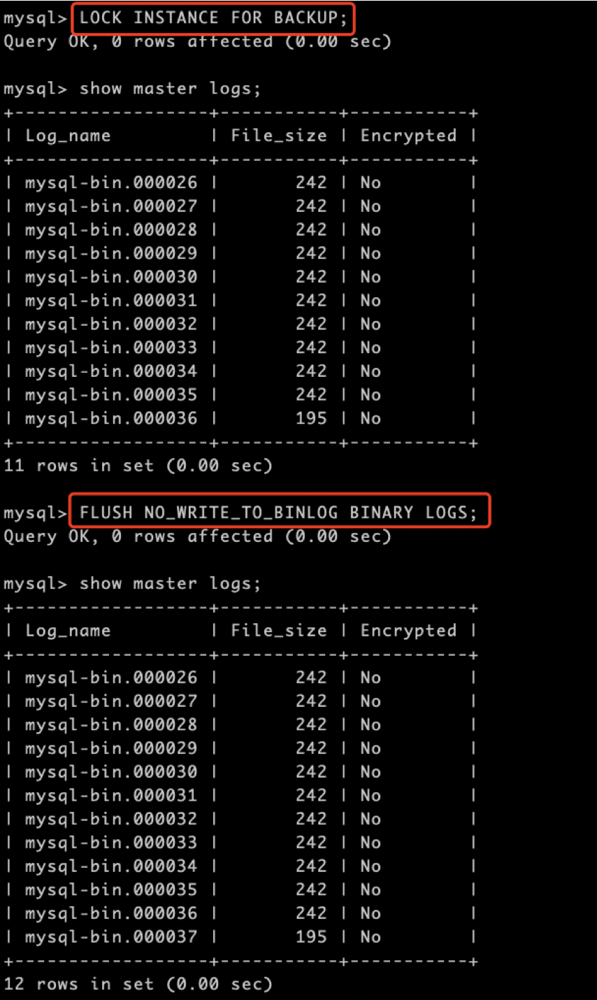
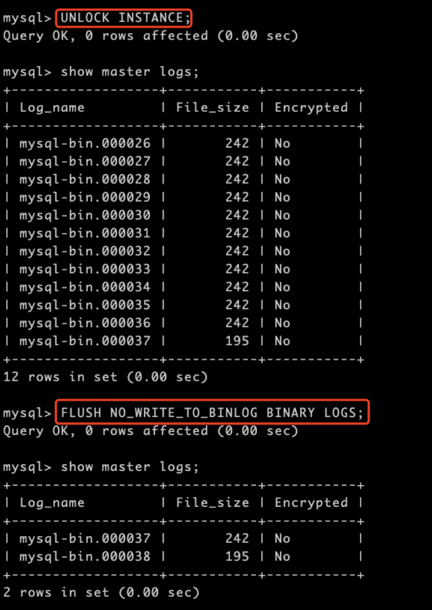

# 技术分享 | MySQL：你的 binlog_expire_logs_seconds 可能正在失效

**原文链接**: https://opensource.actionsky.com/2021111-mysql/
**分类**: MySQL 新特性
**发布时间**: 2021-11-10T23:22:30-08:00

---

作者：胡呈清
爱可生 DBA 团队成员，擅长故障分析、性能优化，个人博客：https://www.jianshu.com/u/a95ec11f67a8，欢迎讨论。
本文来源：原创投稿
*爱可生开源社区出品，原创内容未经授权不得随意使用，转载请联系小编并注明来源。
如果你正在使用 MySQL8.0 ，并且在使用物理热备工具，那么 binlog_expire_logs_seconds 可能不会如你预想的那样生效。
## binlog_expire_logs_seconds
为了防止 binlog 文件过大导致无可用的磁盘空间，MySQL 提供了一个系统变量用来配置过期时间，MySQL5.7 时变量名为`expire_logs_days`，精确度为天；MySQL8.0 使用`binlog_expire_logs_seconds`来控制，其效果和名字的变化一样，精确度由天变成了秒。超过这个时间的 binlog 会被自动清理，自动清理的触发时机为（注意：并不是以每秒这样的固定频率检查是否有过期日志）：
- 
MySQL 启动时；
- 
binlog 刷新时。
MySQL 启动不用多说，binlog 刷新又分两种情况：
- 
当前的 binlog 大小达到`max_binlog_size`，写完当前事务的日志后，就会生成一个新的 binlog；
- 
手工执行了`flush [binary] logs`; 命令后，也会生成一个新的 binlog。
下面我们来看一个 binlog_expire_logs_seconds 失效的场景。
## 失效场景&#038;复现步骤
- 
设置 `set global binlog_expire_logs_seconds=60`，然后执行几次 `flush binary logs` 生成多个 binlog（这样我们 60s 之后就可以看到过期的 binlog 是否被自动删除了）：

- 
等 60s 后，运行 xtrabackup 进行备份（我这里直接调的脚本，手工命令完全无影响）：

- 
备份完之后，可以看到刷新了 binlog（xtrabackup 运行过程中有一个步骤会执行`FLUSH NO_WRITE_TO_BINLOG BINARY LOGS`刷新 binlog），但是没有删除 60s 之前的 binlog：

这是因为 MySQL8.0 为了解决备份时的全局锁问题，新引入了`LOCK INSTANCE FOR BACKUP`备份锁，而这把锁恰好导致了`binlog_expire_logs_seconds`的失效，下面两张图说明这个问题：

释放锁再测试，可以正常触发过期 binlog 的自动删除：

## 总结
如果 MySQL 每天的数据修改很少，产生的 binlog 很小，而`max_binlog_size`设置很大。每次在达到单个 binlog 的最大大小前，执行定时任务调用 xtrabackup 备份，备份时加的备份锁`LOCK INSTANCE FOR BACKUP`和`FLUSH NO_WRITE_TO_BINLOG BINARY LOGS`会导致：binlog 刷新了，但是无法自动删除过期的 binlog 。新的 binlog 写一天没有达到最大大小，又进行备份，每天循环这个逻辑，导致过期的 binlog 越来越多，一直无法被自动删除。
当然，如果你使用的是 MySQL5.7，那并不会有这个问题，虽然 MySQL5.7 时备份时会加全局锁，但是并不影响过期 binlog 的自动删除。从这个角度看，这是个 bug，所以报给官方后很快被确认了：https://bugs.mysql.com/bug.php?id=104785
等待修复的过程是漫长的，如果你恰好遇见了这个冷门的 bug，可以把 `max_binlog_size`调小，保证在备份前 binlog 就能够达到最大大小，自然的刷新可以正常触发自动删除。