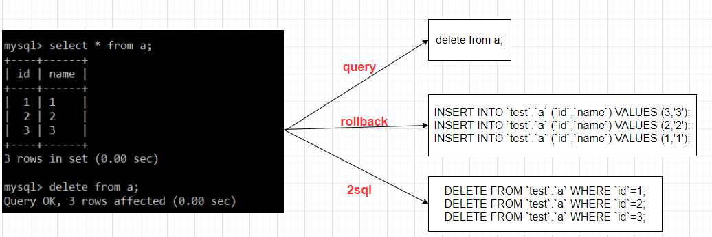
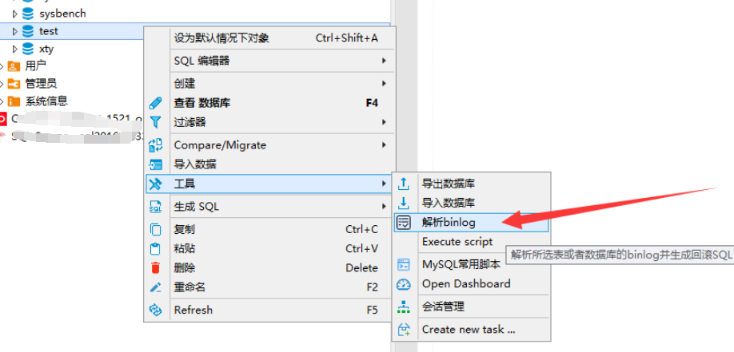
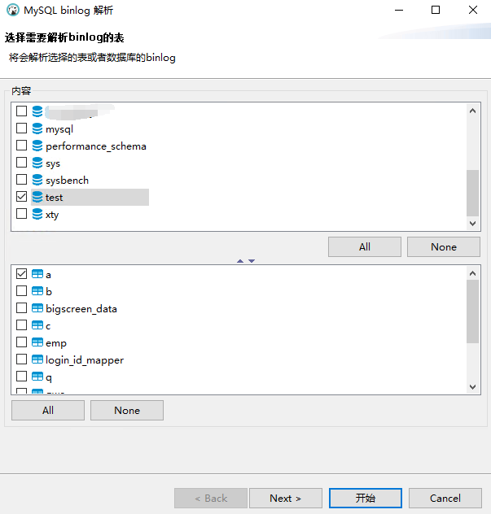
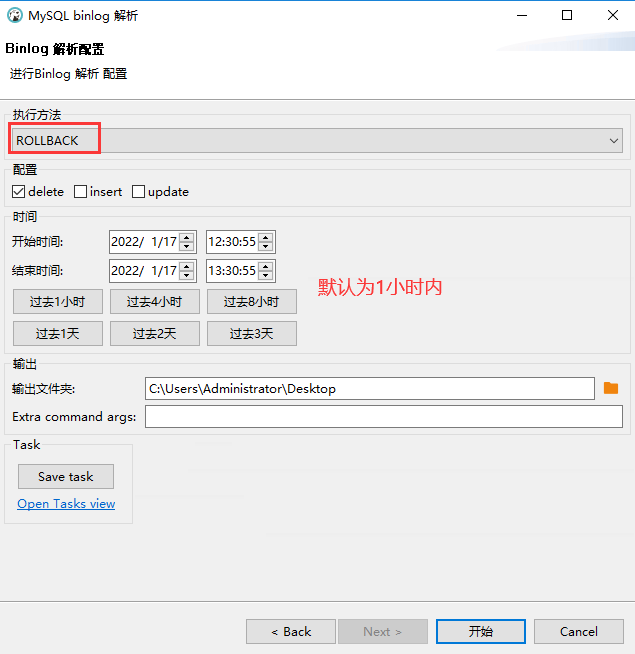
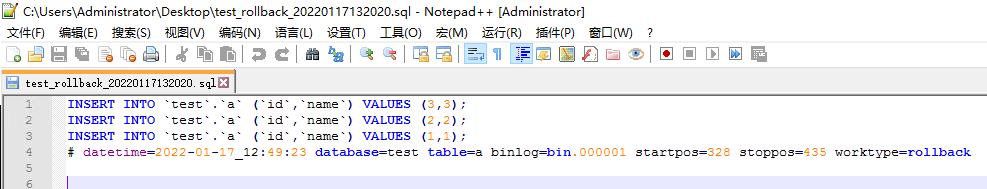
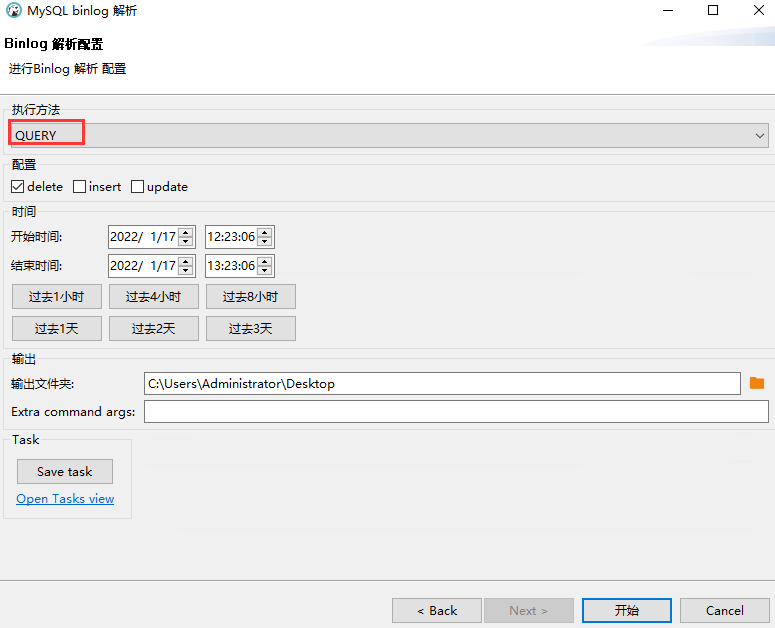
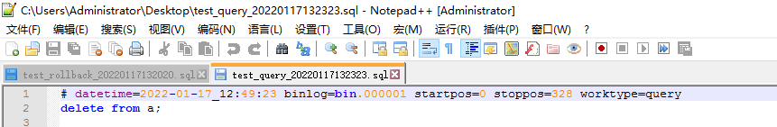

# 技术分享 | my2sql 接入 DBeaver 案例分享

**原文链接**: https://opensource.actionsky.com/20220119-my2sql/
**分类**: 技术干货
**发布时间**: 2022-01-18T19:17:33-08:00

---

作者：xuty
本文来源：原创投稿
*爱可生开源社区出品，原创内容未经授权不得随意使用，转载请联系小编并注明来源。
## 一. 大纲
本文分享下对于 my2sql 的一些改进，并且接入到 DBeaver 中供开发便捷使用的一个实际案例。
相信很多 DBA 日常都会遇到开发`误删除数据（DML闪回）`或者需要`追溯数据变化原因（解析原始SQL）`的需求，当这种需求愈发多的时候（别问为什么，说多了都是泪），就会很厌倦此类工作，因此就想着实现一套工具供开发或者实施自己使用，而不需要 DBA 接入处理。
my2sql 是个人用过的很多 binlog 解析工具中比较出色的一个，因为它解析性能比较优异，且使用也相对简单。
- 
误删除数据闪回：依赖于 my2sql 的功能，可以快速生成指定表指定操作的 DML 操作回滚语句，确认后执行回滚 SQL 即可回复数据。
- 
追溯数据变化原因：my2sql 无法完成该功能，需要依赖 DBA 手动解析 binlog ，分析 rows_query_log ，得到原始执行 SQL 进一步分析。
我们以如下图为例：闪回功能即需要实现`rollback`，生成对应DML的回滚SQL，这是my2sql自带的功能；而想要知道数据变化的真正原因，则需要实现`query`，得到原始执行SQL才比较好分析（当然需要保证MySQL中开启了`binlog_rows_query_log_events`才会在binlog中记录原始SQL）。

#### 二. my2sql改进
为了更加方便非 DBA 使用，对于 my2sql 进行了一些改进，主要包括2点：
- 
实现 query 能力，其实就是在原有的基础上，增加解析`Rows_query`对应的 event 功能，让 my2sql 也可以根据库表、操作类型解析得到对应的原始 SQL ，而非只能实现行数据的回滚SQL or 前滚SQL 。
- 
原生的 my2sql 使用上通常需要`指定star-file，即起始binlog`，这对于不熟悉 MySQL 的人来说比较麻烦，如果不指定起始 binlog ，光指定时间范围，那么 my2sql 会从第一个 binlog 开始解析，比较费时，性能不好。这里我的做法是，只需要输入时间范围，因为这个对于开发来说比较简单，而 binlog 的范围则会通过输入的时间范围，自动适配，原理是对于 MySQL 中存在的每个 binlog 都会只解析其第一个 event ，得到每个 binlog 时间范围，然后根据输入时间范围，就可以自动匹配对应的 binlog 范围，这样就不需要解析无用的 binlog ，节省时间。
`吐槽：MySQL 中为了得到每个 binlog 的时间区间真的好难，官方就不能在 show binary logs 中增加时间输出吗？`
`BEGIN
/*!*/;
# at 291
#220117 12:49:23 server id 1000000  end_log_pos 328 CRC32 0xc0df907c    Rows_query
# delete from a
# at 328
#220117 12:49:23 server id 1000000  end_log_pos 373 CRC32 0x7bc9707d    Table_map: `test`.`a` mapped to number 5705
# at 373
#220117 12:49:23 server id 1000000  end_log_pos 435 CRC32 0x15ae3096    Delete_rows: table id 5705 flags: STMT_END_F
### DELETE FROM `test`.`a`
### WHERE
###   @1=1 /* INT meta=0 nullable=0 is_null=0 */
###   @2=1 /* INT meta=0 nullable=1 is_null=0 */
### DELETE FROM `test`.`a`
### WHERE
###   @1=2 /* INT meta=0 nullable=0 is_null=0 */
###   @2=2 /* INT meta=0 nullable=1 is_null=0 */
### DELETE FROM `test`.`a`
### WHERE
###   @1=3 /* INT meta=0 nullable=0 is_null=0 */
###   @2=3 /* INT meta=0 nullable=1 is_null=0 */
# at 435
#220117 12:49:23 server id 1000000  end_log_pos 466 CRC32 0x22eae195    Xid = 548
COMMIT/*!*/;
`
#### 三. 接入 DBeaver
经过上述 my2sql 改良后，其实对于非 DBA 已经非常友好了（都不需要输入起始 binlog ），因为只需要输入一些参数即可调用 my2sql 使用。
`./my2sql -user root -password xxx -host 127.0.0.1 -port 3306 \
-databases test -tables a -sql delete \
-start-datetime "2021-04-02 11:05:00" -stop-datetime "2021-04-02 11:06:00" \
-work-type rollback \
-add-extraInfo -output-dir /opt/tmp
`
但是开发还会说没有图形化，命令行我不太会弄奥，行把，给你加个图形化。
公司有专门的开发基于开源 DBeaver 进行了改造，增加了一些个性化功能，并把 DBeaver 作为全公司的统一数据库客户端工具使用，所以想到把 my2sql 集成到 DBeaver 中使用应该会很方便，大概步骤就是通过  DBeaver 来选择库、表、操作类型等一系列入参，然后外部调用my2sql的程序生成脚本（DBeaver 中本身就存放了连接信息）。
大致的使用如下图：

`rollback类型:`

`query类型:`

#### 四. 总结
对于 my2sql 的改进使用，虽然不如传统 DBA 根据误操作指定对应 binlog&#038;position 后解析的那么精确，但是对于开发来说，我感觉已经够用了，即使该时间段内含有其他非误操作的回滚 SQL ，也可以自行筛选出来。
最后提一下，my2sql 仅支持 DML 语句，所以并没有加入 DDL 的解析功能，因为 DDL 误操作只能通过备份 +binlog 回放恢复，无法直接闪回。