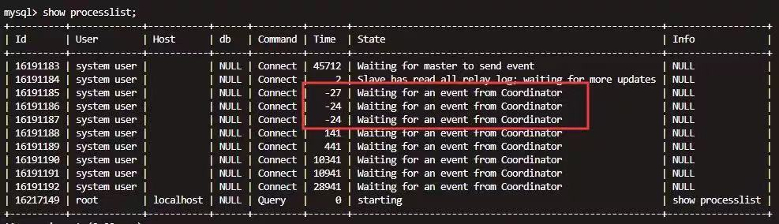
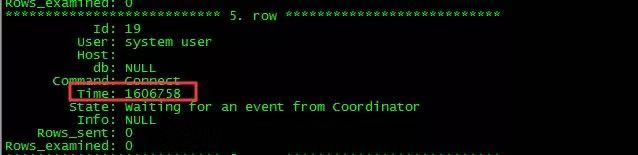
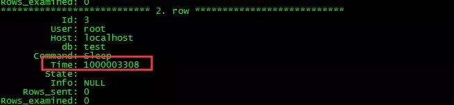
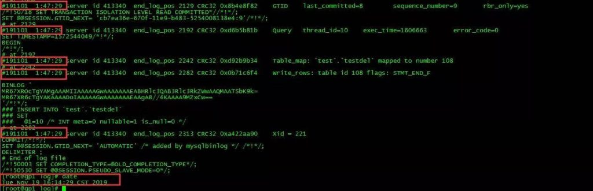
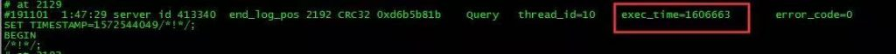

# 技术分享 | mysql show processlist Time 为负数的思考

**原文链接**: https://opensource.actionsky.com/20191203-mysql/
**分类**: MySQL 新特性
**发布时间**: 2019-12-03T00:29:21-08:00

---

> **作者：****高鹏**文章末尾有他著作的《深入理解 MySQL 主从原理 32 讲》，深入透彻理解 MySQL 主从，GTID 相关技术知识。
**一、问题来源**这是一个朋友问我的一个问题，问题如下，在 MTS 中 Worker 线程看到 Time 为负数是怎么回事，如下：
											
**二、关于 show processlist 中的 Time**实际上 show processlist 中的信息基本都来自函数 `mysqld_list_processes`，也就是说每次执行 show processlist 都需要执行这个函数来进行填充。对于 Time 值来讲它来自如下信息：- `Percona：`
- `time_t now= my_time(0);`
- `protocol->store_long ((thd_info->start_time > now) ? 0 : (longlong) (now - thd_info->start_time));`
- `官方版：`
- `time_t now= my_time(0);`
- `protocol->store_long ((longlong) (now - thd_info->start_time));`
我们可以注意到在 Percona 的版本中对这个输出值做了优化，也就是如果出现负数的时候直接显示为 0，但是官方版中没有这样做，可能出现负数。
**三、计算方式解读和测试**现在我们来看看这个简单的计算公式，实际上 now 很好理解就是服务器的当前时间，重点就在于 `thd_info->start_time` 的取值来自何处。实际这个时间来自于函数 `THD::set_time`，但是需要注意的是这个函数会进行重载，有下面三种方式：
**重载 1**- `inlinevoid set_time()`
- `{`
- `    start_utime= utime_after_lock= my_micro_time();`
- `if(user_time.tv_sec || user_time.tv_usec)`
- `{`
- `      start_time= user_time;`
- `}`
- `else`
- `      my_micro_time_to_timeval(start_utime, &start_time);`
- `...`
- `}`
**重载 2**`    inlinevoid set_time(conststruct timeval *t)` {
- `    start_time= user_time= *t;`
- `    start_utime= utime_after_lock= my_micro_time();`
- `...`
- `}`
**重载 3**
- `void set_time(QUERY_START_TIME_INFO *time_info)`
- `{`
- `    start_time= time_info->start_time;`
- `    start_utime= time_info->start_utime;`
- `}`
其实简单的说就是其中有一个 start_utime，如果设置了 start_utime 那么 start_time 将会指定为 start_utime，并且在重载 1 中将会不会修改 start_time，这一点比较重要。好了说了 3 种方式，我们来看看 Time 的计算有如下可能。
**1、执行命令**如果主库执行常见的命令都会在命令发起的时候调用重载 1，设置 start_time 为命令开始执行的时间如下：- `堆栈：`
- `#0  THD::set_time (this=0x7ffe7c000c90) at /mysqldata/percona-server-locks-detail-5.7.22/sql/sql_class.h:3505`
- `#1  0x00000000015c5fe8 in dispatch_command (thd=0x7ffe7c000c90, com_data=0x7fffec03fd70, command=COM_QUERY)`
- `    at /mysqldata/percona-server-locks-detail-5.7.22/sql/sql_parse.cc:1247`
可以看到这个函数没有实参，因此 start_time 会设置为当前时间，那 Time 的计算公式 now &#8211; thdinfo->start_time 就等于 （服务器当前时间 &#8211; 命令开始执行的时间）。
**2、从库单 Sql 线程和 Worker 线程**
其实不管单 Sql 线程还是 Worker 线程都是执行 Event 的，这里的 start_time 将会被设置为 Event header 中 timestamp 的时间（query event/dml event），这个时间实际就是主库命令发起的时间。如下：- `堆栈：`
- `query event：`
- 
- `#0  THD::set_time (this=0x7ffe78000950, t=0x7ffe701ec430) at /root/mysqlall/percona-server-locks-detail-5.7.22/sql/sql_class.h:3526`
- `#1  0x00000000018459ab in Query_log_event::do_apply_event (this=0x7ffe701ec310, rli=0x7ffe7003c050, query_arg=0x7ffe701d88a9 "BEGIN", q_len_arg=5)`
- `    at /root/mysqlall/percona-server-locks-detail-5.7.22/sql/log_event.cc:4714`
- 
- `堆栈：`
- `dml event：`
- `#0  THD::set_time (this=0x7ffe78000950, t=0x7ffe701ed5b8) at /root/mysqlall/percona-server-locks-detail-5.7.22/sql/sql_class.h:3526`
- `#1  0x000000000185aa6e in Rows_log_event::do_apply_event (this=0x7ffe701ed330, rli=0x7ffe7003c050)`
- `    at /root/mysqlall/percona-server-locks-detail-5.7.22/sql/log_event.cc:11417`
我们看到这里有一个实参的传入我们看一下代码如下：- `thd->set_time(&(common_header->when))`
实际上就是这一行，这是我们前面说的重载 3，这样设置后 start_utime 和 start_time 都将会设置，即便调用重载 1 也不会更改， 那 Time 的计算方式 `now-thd_info->start_time` 就等于（从库服务器当前时间 &#8211; Event header 中的时间），但是要知道 Event header 中的时间实际也是来自于主库命令发起的时间。既然如此如果从库服务器的时间小于主库服务器的时间，那么 Time 的结果可能是负数是可能出现的，当然 Percona 版本做了优化负数将会显示为 0，如果从库服务器的时间大于主库的时间那么可能看到 Time 比较大。因为我的测试环境都是 Percona，为了效果明显，我们来测试一下 Worker 线程 Time 很大的情况，如下设置：- `主库：`
- `[root@mysqltest2 test]# date`
- `FriNov101:40:54 CST 2019`
- 
- `从库：`
- `[root@gp1 log]# date`
- `TueNov1915:58:37 CST 2019`
主库随便做一个命令，然后观察如下：
											
**3、设置 timestamp**
如果手动指定 timestamp 也会影响到 Time 的计算结果，因为 start_utime 和 start_time 都将会设置，如下：
- `mysql> set timestamp=1572540000`
- 
- `堆栈：`
- `#0  THD::set_time (this=0x7ffe7c000c90, t=0x7fffec03db30) at /mysqldata/percona-server-locks-detail-5.7.22/sql/sql_class.h:3526`
- `#1  0x000000000169e509 in update_timestamp (thd=0x7ffe7c000c90, var=0x7ffe7c006860) at /mysqldata/percona-server-locks-detail-5.7.22/sql/sys_vars.cc:4966`
- `#2  0x00000000016b9a3d in Sys_var_session_special_double::session_update (this=0x2e68e20, thd=0x7ffe7c000c90, var=0x7ffe7c006860)`
- `    at /mysqldata/percona-server-locks-detail-5.7.22/sql/sys_vars.h:1889`
我们看到带入了实参，我们看看代码这一行如下：- ` thd->set_time(&tmp);`
这就是重载 2 了，这样设置后 start_utime 和 start_time 都将会设置，即便调用重载 1 也不会更改，言外之意就是设置了 timestamp 后即便执行了其他的命令 Time 也不会更新。Time 的计算方式 now &#8211; thdinfo->starttime 就等于 （服务器当前时间 &#8211; 设置的 timestamp 时间），这样的话就可能出现 Time 出现异常，比如很大或者为负数（Percona 为 0）如下：
											
**4、空闲情况下**
如果我们的会话空闲状态下那么 `now-thd_info->start_time` 公式中，now 会不断变大，但是 `thd_info->start_time` 却不会改变，因此 Time 会不断增大，等待到下一次命令到来后才会更改。
**四、延伸**这里我想在说明一下如果从库开启了 `log_slave_updates` 的情况下，从库记录会记录来自主库的 Event，但是这些 Event 的 timestamp 和 Query Event 的 exetime 如何取值呢？
**Event 的 timestamp 的取值**其实上面我已经说了，因为 start_time 将会被设置为 Event header 中 timestamp 的时间（query event/dml event），当记录 Evnet 的时候这个时间和主库基本一致，如下：
											
很明显我们会发现这些 Event 的 timestamp 不是本地的时间，而是主库的时间。
**Query Event 的 exetime**我们先来看看这个时间的计算方式：- `ulonglong micro_end_time= my_micro_time();//这里获取时间 query event`
- `  my_micro_time_to_timeval(micro_end_time, &end_time);`
- 
- `  exec_time= end_time.tv_sec - thd_arg->start_time.tv_sec;//这里计算时间`
相信对于 `thd_arg->start_time` 而言已经不再陌生，它就是主库命令发起的时间。我在我的《深入理解主从原理》系列中说过了，对于 Query Event 的 exetime 在 row 格式 binlog 下，DML 语句将会是第一行语句修改时间的时间，那么我们做如下定义（row 格式 DML 语句）：- 主：主库第一行数据修改完成的服务器时间 &#8211; 主库本命令发起的时间
- 从：从库第一行数据修改完成的服务器时间 &#8211; 主库本命令发起的时间
他们的差值就是：（从库第一行数据修改完成的服务器时间 &#8211; 主库第一行数据修改完成的服务器时间 ）同样如果我们从库的时间远远大于主库的时间，那么 exetime 也会出现异常如下：
											
**最后：**
Time 是我们平时关注的一个指标，我们经常用它来表示我的语句执行了多久，但是如果出现异常的情况我们也应该能够明白为什么，这里我将它的计算方式做了一个不完全的解释，希望对大家有帮助。当然对于主从部分或者 Event 部分可以参考我的《深入理解主从原理》系列。
最后推荐高鹏的专栏《深入理解 MySQL 主从原理 32 讲》，想要透彻了解学习 MySQL 主从原理的朋友不容错过。
作者微信：gp_22389860
											
**社区近期动态**
**No.1**
**Mycat 问题免费诊断**
诊断范围支持：
Mycat 的故障诊断、源码分析、性能优化
服务支持渠道：
技术交流群，进群后可提问
QQ群（669663113）
社区通道，邮件&电话
osc@actionsky.com
现场拜访，线下实地，1天免费拜访
关注“爱可生开源社区”公众号，回复关键字“Mycat”，获取活动详情。
**No.2**
**社区技术内容征稿**
征稿内容：
格式：.md/.doc/.txt
主题：MySQL、分布式中间件DBLE、数据传输组件DTLE相关技术内容
要求：原创且未发布过
奖励：作者署名；200元京东E卡+社区周边
投稿方式：
邮箱：osc@actionsky.com
格式：[投稿]姓名+文章标题
以附件形式发送，正文需注明姓名、手机号、微信号，以便小编及时联系